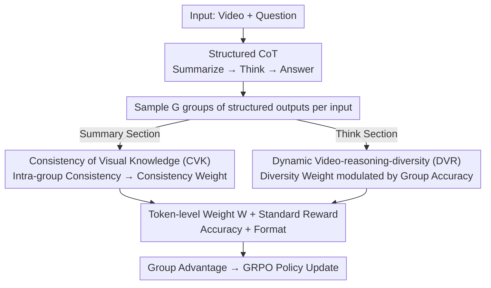

# Reinforcing Structured Chain-of-Thought for Video Understanding

**Conference**: CVPR 2026  
**arXiv**: [2603.25942](https://arxiv.org/abs/2603.25942)  
**Code**: None  
**Area**: Video Understanding / Video Reasoning  
**Keywords**: VideoQA, Reinforcement Learning, Structured CoT, GRPO, Temporal Reasoning

## TL;DR

Proposes SDRL (Summary-Driven Reinforcement Learning), a single-stage RL framework without SFT. By utilizing structured CoT (Summarize→Think→Answer) and two self-supervised mechanisms (CVK and DVR), it enhances video temporal reasoning and achieves SOTA results on 7 VideoQA benchmarks.

## Background & Motivation

Multimodal Large Language Models (MLLMs) have shown potential in video understanding but face two core challenges:

**Thinking Drift**: Existing RL methods (e.g., GRPO) rely solely on the reward signal of the final answer for optimization, leaving intermediate reasoning steps unconstrained. This causes models to generate redundant or irrelevant reasoning content, severely impacting stability.

**Weak Temporal Understanding**: MLLMs typically represent videos as stacked or averaged frame embeddings, ignoring fine-grained temporal dependencies, which leads to poor performance on temporal-sensitive VideoQA tasks.

**Limitations of Prior Work**:
- **Pure RL methods**: Unconstrained reasoning and instability.
- **SFT+RL methods**: Require expensive CoT annotations and complex multi-stage training; token-level imitation in SFT restricts generalization and may cause overfitting.

**Key Insight**: The core innovation of SDRL is the **direct integration of structured CoT into the RL objective**. It constrains the reasoning process through self-supervision without requiring additional SFT stages or CoT annotation data.

## Method

### Overall Architecture

SDRL employs Qwen2.5-VL-7B as the backbone. Given a (video, question) input, the model is required to generate structured output:
- **Summary Section** (`
`): Extracts key actions and their temporal order.
- **Think Section** (`<think>`): Performs logical reasoning based on the summary.
- **Answer Section**: Provides the final answer.

G groups of outputs are sampled for each input. Policy optimization is performed by calculating group advantages using token-level weights (CVK+DVR) and standard rewards (accuracy + format). The key to the pipeline is: building a framework with structured CoT, where the CVK branch constrains the Summary section to be faithful to the video, and the DVR branch allows the Think section to explore when necessary. These weights are then merged with standard rewards into group advantages.

### Key Designs

**1. Structured CoT (Summarize → Think → Answer)**

Empirical findings show that CoT leading to correct predictions shares higher similarity (BLEU and sBERT) with ground-truth CoT. Effective CoT typically captures: (1) key actions/events, and (2) temporal order. Therefore, the model is forced to generate a `
` first as a factual anchor for the subsequent `<think>`. This anchor acts as the foundation for "top-down reasoning," suppressing thinking drift at the root.

**2. Consistency of Visual Knowledge (CVK): Constraining Summary to the Video**

**Key Insight**: Video content comprises fixed facts; thus, multiple summaries sampled for the same input **should be highly consistent semantically**. CVK avoids direct text supervision and ensures faithfulness via intra-group consistency:
- **GT Supervision Mode**: When ground-truth summaries are available, alignment is measured using a combination of sBERT and BLEU.
- **Self-supervised Mode**: Without GT, a consistency anchor $S^C$ (position-level center) is dynamically derived from correct predictions. KL divergence measures how much each summary token deviates from the anchor, which is converted into a Summary Token Weight $\omega_t^S$. Larger KL leads to lower weight, concentrating gradients on "stable and consistent" summary parts.

**3. Dynamic Video-reasoning-diversity (DVR): Strategic Exploration in the Think Section**

Diversity in the reasoning path is encouraged in the `<think>` section, measured by the entropy of the token distribution. High-entropy tokens receive a higher diversity weight $\omega_{g,t}^d$. Crucially, this is **dynamically modulated by group accuracy $\mathcal{A}$**: low-accuracy groups $(1-\mathcal{A})$ receive higher weights to reinforce exploration, while high-accuracy groups maintain stability.

**4. EventFlowQA Dataset**

A VideoQA dataset focused on complex action sequences and temporal causality, containing 53K high-quality QA pairs (50K training + 3K validation) covering 15 temporal dimensions.

### Mechanism Walkthrough (Example: "What did the person do first, then next?", G=8)
1. **Sampling**: 8 groups of structured outputs are sampled, each containing `
`, `<think>`, and `answer`.
2. **Summary Section + CVK**: If 6 groups describe "open fridge, then pour milk" and 2 groups drift to "pour milk first," the self-supervised anchor $S^C$ aligns with the majority. The drifting groups are down-weighted by $\omega_t^S$ due to high KL divergence.
3. **Think Section + DVR**: If the current group accuracy $\mathcal{A}$ is low, the diversity weight is raised for high-entropy tokens in the think section, encouraging the model to try different reasoning paths.
4. **Reward & Advantage**: Standard rewards (accuracy + format) combined with token-level weights $W_{g,t}$ are used to calculate group advantages for policy updates.
5. **Convergence**: The model learns to generate faithful summaries to lock in facts and reason flexibly when uncertain.

### Loss & Training

Structured policy objective: $$\mathcal{J}_{total}(\theta) = \mathcal{J}_{grpo}^{SCoT}(\theta) - \mathcal{J}_{reg}(\theta)$$

Token-level weights:
$$W_{g,t} = \begin{cases} \omega_t^S & \text{(Summary Section, Consistency Weight)} \\ \omega_{g,t}^{d'} & \text{(Think Section, Dynamic Diversity Weight)} \end{cases}$$

**Training Configuration**:
- Single-stage RL (no SFT), 32x A100 GPUs.
- GRPO group size G=8, 1000 RL iterations.
- 16-frame uniform sampling, 128x28x28 resolution.
- Hyperparameters: $\alpha=0.7$, $\beta=0.3$, $\gamma_1=1$, $\gamma_2=1$, $\lambda=0.5$, $\lambda'=0.7$.

## Key Experimental Results

### Main Results

Performance on 7 public VideoQA benchmarks (Accuracy %):

| Dataset | SDRL (Ours) | Video-R1 (SFT+RL) | VideoRFT (SFT+RL) | TW-GRPO (RL) | Gain (vs best RL) |
|--------|-------------|--------------------|--------------------|--------------|-------------------|
| NExT-GQA | 79.3 | 74.3 | 75.1 | 76.1 | +3.2 |
| MMVU | 68.6 | 64.2 | 67.3 | 65.8 | +1.3 |
| VideoMMMU | 51.3 | 52.4 | 50.6 | - | +0.7 |
| VSIBench | 32.9/36.1† | 34.6 | 35.7 | - | +0.4† |
| MVBench | 64.2 | 62.7 | 61.4 | 63.3 | +0.9 |
| TempCompass | 74.4† | 72.6 | 73.1 | 73.3 | +1.1† |
| VideoMME | 54.7 | 57.4 | 58.1 | 55.1 | - |

Note: † indicates variants trained on EventFlowQA (using only 20% of Video-R1's data volume).

### Ablation Study

Ablation of CVK and DVR modules on EventFlowQA:

| Configuration | Accuracy | Description |
|------|----------|------|
| Original GRPO | 42.37 | Baseline |
| +sBERT (GT) | 43.85 | Semantic consistency helps |
| +BLEU (GT) | 46.32 | Lexical consistency helps more |
| +sBERT+BLEU (GT) | 48.56 | Combined is optimal |
| +GT CVK + Static Entropy DVR | 50.09 | Diversity further improves results |
| +GT CVK + Dynamic DVR (Full) | 52.22 | Dynamic adjustment is optimal |
| Self-supervised CVK | 54.28 | **Self-supervised > GT Supervision** |
| Self-supervised CVK + Dynamic DVR | **56.10** | Best configuration |

Impact of model scale on supervision:

| Config | 3B Model | 7B Model |
|------|---------|---------|
| GT Supervision Gain | +3.01 | +6.19 |
| Self-supervision Gain | +2.40 | **+11.91** |

### Key Findings

1. **Self-supervision outperforms GT supervision (7B)**: Larger models benefit more from self-supervised consistency (+11.91 vs +6.19), potentially because strict GT alignment suppresses pre-trained semantic priors, leading to catastrophic forgetting.
2. **Smaller models rely more on GT guidance**: The 3B model performs slightly better under GT supervision (+3.01 vs +2.40).
3. **Entropy outperforms KL divergence for diversity**: Entropy acts as a global uncertainty controller, better preserving semantic diversity.
4. **Dynamic diversity modulation is significantly better than static**: It prevents excessive exploration noise in high-accuracy groups.
5. **High data efficiency**: Training on just 20% of data enabled SDRL to surpass all baselines on TempCompass.

## Highlights & Insights

- **Single-stage RL replaces SFT+RL pipeline**: By using structured CoT and self-supervised constraints, the need for expensive CoT annotations and multi-stage training is eliminated.
- **Summary as a Factual Anchor**: Positioning the summary at the start of the reasoning chain ensures fact extraction precedes logical reasoning, addressing thinking drift.
- **Balance of Alignment and Exploration**: CVK handles consistency/alignment while DVR handles diversity/exploration.
- **Surprising Self-supervision Results**: The fact that self-supervision outperforms GT in larger models suggests that overly strong supervision signals might constrain expressive power.

## Limitations & Future Work

1. Limited to 16-frame settings; scalability to longer videos (e.g., 64 frames or minutes) is unknown.
2. Generation of the Summary section may introduce additional latency overhead.
3. Dataset construction details for EventFlowQA are sparse.
4. Performance on VideoMME still lags behind some SFT+RL methods (54.7 vs 58.1), suggesting room for generalization improvements.
5. Self-supervised anchors depend on the presence of correct predictions; performance may degrade in extremely low-accuracy scenarios.

## Related Work & Insights

- **GRPO/DAPO**: Provide the foundation for RL optimization; SDRL introduces structured constraints.
- **Video-R1**: First introduced GRPO to video understanding but relies on a two-stage SFT+RL pipeline.
- **Process Reward Models**: The idea of process-level supervision is similar to the token-level weight design of CVK/DVR.

## Rating

- Novelty: ⭐⭐⭐⭐⭐ 
- Experimental Thoroughness: ⭐⭐⭐⭐⭐ 
- Writing Quality: ⭐⭐⭐⭐ 
- Value: ⭐⭐⭐⭐⭐ 

<!-- RELATED:START -->

## Related Papers

- [\[CVPR 2026\] Chain-of-Frames: Advancing Video Understanding in Multimodal LLMs via Frame-Aware Reasoning](chain-of-frames_advancing_video_understanding_in_multimodal_llms_via_frame-aware.md)
- [\[CVPR 2026\] Grounded Chain-of-Thought for Multimodal Large Language Models](grounded_chain-of-thought_for_multimodal_large_language_models.md)
- [\[CVPR 2026\] Reinforcing Video Object Segmentation to Think before it Segments](reinforcing_video_object_segmentation_to_think_before_it_segments.md)
- [\[CVPR 2026\] ReaGEN: Adaptive Generation of Structured Chains-of-Thought for Efficient Multimodal Reasoning](reagen_adaptive_generation_of_structured_chains-of-thought_for_efficient_multimo.md)
- [\[CVPR 2026\] UniT: Unified Multimodal Chain-of-Thought Test-time Scaling](unit_unified_multimodal_chain-of-thought_test-time_scaling.md)

<!-- RELATED:END -->
