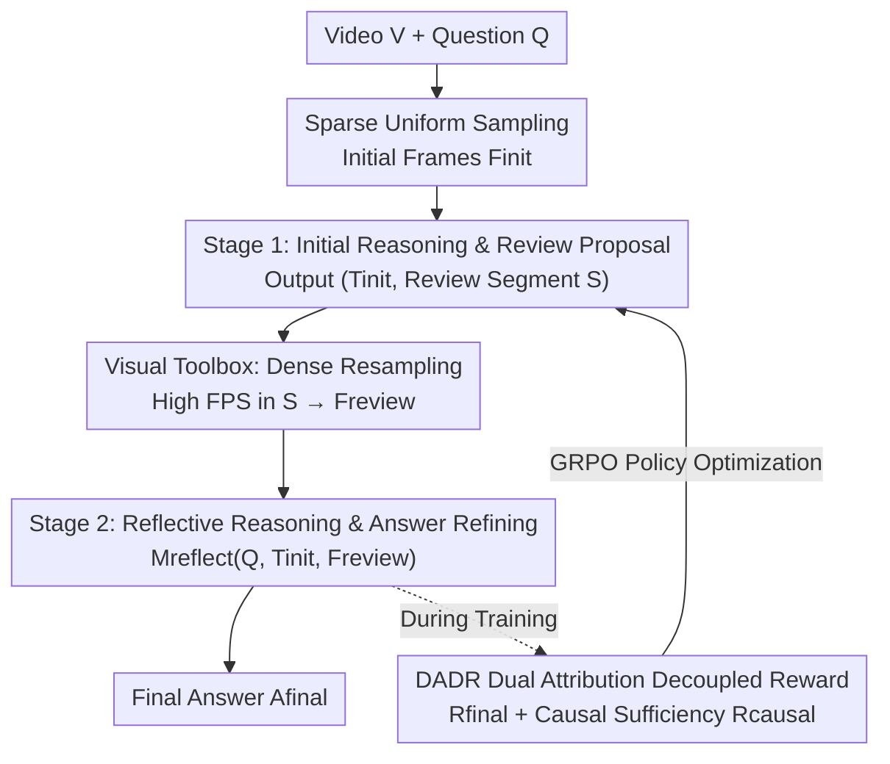

# REVISOR: Beyond Textual Reflection, Towards Multimodal Introspective Reasoning in Long-Form Video Understanding

**Conference**: CVPR 2026  
**Paper**: [CVF Open Access](https://openaccess.thecvf.com/content/CVPR2026/html/Li_REVISOR_Beyond_Textual_Reflection_Towards_Multimodal_Introspective_Reasoning_in_Long-Form_CVPR_2026_paper.html)  
**Code**: None  
**Area**: Multimodal VLM / Video Understanding  
**Keywords**: Long Video Understanding, Multimodal Reflection, Tool-augmented Reasoning, Reinforcement Learning, Video Temporal Grounding

## TL;DR
REVISOR upgrades "textual reflection" to "visual reflection"—enabling multimodal large models to propose a specific video segment for re-watching after an initial reasoning pass, call tools to densely resample that segment, and conduct a second-stage reasoning with the new visual evidence; combined with DADR (Dual Attribution Decoupled Reward) to ensure correct segment selection, it achieves an average improvement of ~2% for Qwen2.5-VL-7B across VideoMME, LongVideoBench, MLVU, and LVBench.

## Background & Motivation
**Background**: Self-reflection has become a mainstream approach for enhancing complex reasoning in large models—allowing models to explicitly "review, evaluate, and correct" their reasoning trajectories to prune incorrect paths. This mechanism has shown significant gains in image understanding tasks (e.g., MathVista, MMMU) when migrated from text-only LLMs to multimodal settings, with VL-Rethinker being a representative method.

**Limitations of Prior Work**: The authors made a critical observation in Sec. 2.1: directly applying these reflection mechanisms to long video understanding often leads to performance degradation. VL-Rethinker actually regresses relative to the base model in long video scenarios; even a "text-only reflection model trained on video data" failed to show improvement. This suggests that the issue is not the lack of video training, but rather the form of the reflection mechanism itself.

**Key Challenge**: Current reflection methods are entirely "text-only reconsideration." However, long videos differ fundamentally from static images as they contain far richer and more dynamic visual information. Re-organizing text is insufficient to correct reasoning errors. Furthermore, text-only reflection inherently lacks cross-modal interaction, preventing the re-incorporation of visual cues. Since the model initially views a sparse sampling of frames, key moments missed in the first pass can never be recovered through text-only thought.

**Goal**: To enable the reflection process to "re-watch the video" rather than just "re-think the text," and to teach the model to precisely locate which segment needs to be reviewed.

**Key Insight**: The authors conducted an oracle validation experiment (Sec. 2.2)—on datasets annotated with "critical segments for answers" (NExT-GQA / ReXTime / CG-Bench), they first let the model perform initial reasoning on original frames, then provided the annotated critical segments for a second response. This yielded an average gain of ~7.3%, while text-only reflection provided near-zero benefit. This proves that "visual reflection" is far more critical than "textual reflection" in video tasks.

**Core Idea**: Transform traditional textual reflection into "tool-augmented multimodal reflection"—the model suggests "which segment should be reviewed" during its initial reasoning, a visual toolbox performs dense resampling of that segment, and a second-stage reasoning is conducted with the refined visual data.

## Method

### Overall Architecture
REVISOR (REflective VIsual Segment Oriented Reasoning) is a two-stage reasoning framework. Given a long video $V$ and a question $Q$, it outputs a refined final answer $A_{final}$. The core pivot of the workflow is that the model no longer "answers in one go" but "skims first, identifies suspicious segments, views them clearly, and then revises the answer."

Specifically, the video is first sparsely sampled to obtain an initial frame set $F_{init}$ (to control token costs). In **Stage 1**, the model performs Chain-of-Thought reasoning based on $(Q, F_{init})$, producing an initial reasoning trajectory $T_{init}$ and proposing a critical/uncertain time interval $S=[t_{start}, t_{end}]$. The visual toolbox receives $S$ and performs high-FPS dense resampling within that interval to obtain $F_{review}$. In **Stage 2**, the model re-reasons using $(Q, T_{init}, F_{review})$, verifying or correcting initial conclusions under clearer visuals to yield $T_{refine}$ and $A_{final}$. During training, DADR + GRPO are used to teach the model to "select the correct segment."

### Key Designs

**1. Stage 1: Initial Reasoning and Review Segment Proposal**

Addressing the pain point where models miss key moments due to sparse sampling, REVISOR assigns an additional responsibility during initial reasoning: the model must actively identify "which part of the video is worth re-watching." In its initial pass, the model $M$ receives $(Q, F_{init})$ and scales its output as a structured pair $(T_{init}, S) = M_{infer}(Q, F_{init})$, where $S=[t_{start}, t_{end}]$ is the time window it deems most critical or ambiguous. Crucially, $S$ is not predicted by an external module but "naturally emerges" from the model's own reasoning process $T_{init}$—the model explicitly expresses uncertainty or importance during thought, and the framework extracts these timestamps. This delegates the decision of "where to review" to the model itself, which has the best understanding of the context.

**2. Visual Toolbox: Dense Resampling of Review Segments**

Proposing a segment is only half the battle; the visual evidence must be clarified. The visual toolbox $T$ receives $S$ and performs dense resampling ONLY within the $[t_{start}, t_{end}]$ window: $F_{review} = \text{SampleDense}(V, [t_{start}, t_{end}])$, using a significantly higher FPS than the initial sampling. This design cleverly outsources the computational burden of "fine-grained visual localization" to a tool: the model avoids processing the entire video at high resolution but gains a focused view of critical moments—bypassing MLLM context length limits while ensuring the density of the suspicious region supports a second judgment.

**3. Stage 2: Reflective Reasoning and Answer Refining**

Armed with new visuals, the model is invoked again with the triplet $(Q, T_{init}, F_{review})$: the original question, its own initial reasoning, and the newly collected dense visual evidence. $(T_{refine}, A_{final}) = M_{reflect}(Q, T_{init}, F_{review})$. Feeding the initial $T_{init}$ back explicitly enables "in-context reflection"—the model can compare its previous conclusions against stronger visual evidence, validating hypotheses, resolving Stage 1 ambiguities, or correcting prior misinterpretations. This simulates a human expert's workflow: "browse globally, focus on evidence, conclude," transforming reasoning from a one-shot Markov generation into an iterative process.

**4. DADR Dual Attribution Decoupled Reward: Forcing Correct Selection via Causal Sufficiency**

This is the key to successfully training the framework. Using only "final answer correctness" as a reward for GRPO is problematic: a trajectory $\tau=(T_{init}, S, T_{refine}, A_{final})$ is composed of three parts. Even if the model outputs a correct review segment $S$, it only receives sparse, indirect feedback from the final answer; similarly, wrong segments are not sufficiently penalized. Experimental results (Tab. 3) show that models trained with pure final-answer rewards can actually regress relative to the base model on long videos.

DADR decouples the "localization reward" from the total reward: $R(\tau) = \lambda_1 R_{final} + \lambda_2 R_{causal}$. Here, $R_{final}$ is the standard accuracy reward; $R_{causal}$ is the proposed **Causal Segment Sufficiency Reward (CSSR)**, which performs a sufficiency test—the same model is asked to answer using *only* the question $Q$ and dense evidence $F_{review}$, without any other context: $\hat{A} = M_{suff}(Q, F_{review})$, then:

$$R_{causal} = \mathbb{I}(\hat{A} = A^*)$$

A positive reward is given only if the model can deduce the correct answer solely from the resampled segment. This asks: "Is the segment you selected truly sufficient and causally relevant enough to support the answer independently?" It implicitly encourages the selection of informative, compact segments and penalizes irrelevant or overly long windows. The paper sets $\lambda_1=0.6 > \lambda_2=0.3$: if $\lambda_2$ is too large, the model becomes obsessed with localization while neglecting how to use the segment for the final answer.

### Loss & Training
The base model is Qwen2.5-VL-7B. Single-stage reinforcement learning is used, following DAPO and implemented via the verl framework. Training data includes 25K samples from STAR, PerceptionTest, NExT-QA, CLEVRER, LLaVA-Video-178K, TimeRFT, CG-Bench, and ReXTime. Optimized with AdamW, learning rate $1\times10^{-6}$, batch size 32, rollout size 8. Both training and evaluation set a video token limit of 8192. Notably, REVISOR requires no additional SFT or external models.

## Key Experimental Results

### Main Results
Across four long-form video benchmarks, REVISOR (8K video tokens) shows an average gain of ~2% over the Qwen2.5-VL-7B base. Gains are more pronounced as video length increases (VideoMME Long subset +2.8%, MLVU with 120min videos +2.5%):

| Model | VideoMME (Overall) | VideoMME (Long) | LongVideoBench | MLVU | LVBench |
| :--- | :---: | :---: | :---: | :---: | :---: |
| VL-Rethinker-7B (Text Reflection) | 62.1 | 51.9 | 56.4 | 63.2 | 37.2 |
| Video-R1-7B (Text Reasoning) | 61.4 | - | - | - | - |
| Qwen2.5-VL-7B⋆ (Reproduced Base) | 64.3 | 53.4 | 56.5 | 67.3 | 40.2 |
| **REVISOR (Ours)** | **65.7** | **56.2** | **57.5** | **69.8** | **42.0** |

Relative to Video-R1 (textual CoT), REVISOR is +4.3% on VideoMME. Compared to textual reflection (VL-Rethinker and an internal video-trained baseline), it is +3.6% / +2.3% higher, quantifying the necessity of "visual reflection."

On temporal video grounding (Tab. 2), REVISOR reaches 51.4% mIoU on Charades-STA, outperforming the SFT-based SOTA iMOVE by 4.1% and RL-based TVG-R1 by 4.7%. NExT-GQA mIoU is 3.9% higher than TVG-R1—suggesting that "selecting the right review segment" allows the model to learn precise localization as a byproduct.

### Ablation Study
Ablation on DADR reward weights (Tab. 3, grey row is base):

| $\lambda_1$ | $\lambda_2$ | VideoMME | LongVideoBench | LVBench | MLVU | NExT-GQA |
| :--- | :--- | :---: | :---: | :---: | :---: | :---: |
| - | - | 64.3 | 56.5 | 40.2 | 67.3 | 20.9 |
| 0.3 | 0.6 | 64.0 | 56.0 | 41.1 | 68.7 | 33.9 |
| 0.6 | 0.0 | 62.2 | 54.0 | 40.8 | 68.3 | 32.1 |
| **0.6** | **0.3** | **65.7** | **57.5** | **42.0** | **69.8** | 33.2 |

### Key Findings
- **CSSR is indispensable**: At $\lambda_2=0$ (final answer reward only), VideoMME drops to 62.2%, lower than the 64.3% base. Without causal sufficiency signals, the model fails to learn localization from sparse rewards, making the framework a burden.
- **Prioritize Reasoning over Localization**: When $\lambda_2 > \lambda_1$ (0.3/0.6), grounding capability improves, but long-form understanding declines (MLVU 69.8% → 68.7%), as the model focuses too much on "finding the segment" rather than "reasoning with it." Thus, $\lambda_1 > \lambda_2$ is optimal.
- **NExT-GQA shows most dramatic grounding gains**: mIoU rises from 20.9 (base) to 33.2, confirming that DADR effectively recalls the temporal evidence needed for the answer.
- **Visual Reflection > Textual Reflection**: Oracle experiments with ground-truth segments showed a ~7.3% gain, whereas textual reflection yielded almost none, serving as the empirical foundation for this method.

## Highlights & Insights
- **Emergent "Where to Review" Decision**: The review segment $S$ is not reliant on external retrievers or fixed rules but extracted naturally from the initial reasoning trajectory—the model itself knows its context best, making this design lighter and more self-consistent than training an extra grounding module.
- **CSSR as an Elegant Proxy for Causal Sufficiency**: Defining segment quality by "whether it can independently support the correct answer" elegantly converts the abstract goal of "segment relevance" into a verifiable binary reward, while naturally suppressing long/irrelevant windows. This can be migrated to any RL task requiring evidence subset selection.
- **Tool Augmentation = Computation for Context**: Outsourcing dense sampling to a toolbox allows the model to both overview the video and scrutinize suspicious details within an 8K token budget, providing a practical paradigm for long-video context bottlenecks.
- **No SFT/External Models Required**: Gains are achieved through pure single-stage RL, lowering deployment complexity.

## Limitations & Future Work
- **Modest Improvement Magnitude**: An average gain of ~2% across four benchmarks (and only +1.4% on VideoMME Overall) is not particularly aggressive considering the training complexity (multi-stage reasoning + decoupled rewards + tool calls).
- **Single-Segment Assumption**: Proposing only one interval $S$ in Stage 1 might be insufficient for questions requiring joint reasoning across distant segments (e.g., comparing events at the start and end of a video). The framework does not discuss multi-segment or multi-turn review.
- **Overhead of CSSR Sufficiency Check**: Each trajectory requires an additional $M_{suff}(Q, F_{review})$ pass to calculate $R_{causal}$, increasing rollout costs during training.
- **Dependency on Initial Localization Quality**: If the initial sparse sampling misses the general vicinity of the key moment, the model might fail to propose a correct $S$, leaving the toolbox unable to recover the information.

## Related Work & Insights
- **vs VL-Rethinker / Textual Reflection**: These methods only reorganize text without re-watching visuals. This paper shows this is detrimental for long videos, where "re-sampling visual evidence" yields a +3.6% gain. The core difference is the medium of reflection shifting from text to vision.
- **vs Video-R1 / Pure CoT**: While Video-R1 relies on longer reasoning chains, REVISOR demonstrates that "viewing clearer visuals" is more effective than "thinking more text," leading to a +4.3% gain on VideoMME.
- **vs Grounding Models (TVG-R1 / iMOVE)**: While those are trained specifically for localization, REVISOR treats localization as a byproduct of reasoning (supervised implicitly via CSSR) and yet outperforms them on Charades-STA/NExT-GQA, suggesting that "selecting evidence for an answer" is a stronger training signal than "localization for localization's sake."

## Rating
- Novelty: ⭐⭐⭐⭐ The diagnosis of "visual vs textual reflection" is clear, and the CSSR design is clever.
- Experimental Thoroughness: ⭐⭐⭐⭐ 4 benchmarks + temporal grounding + oracle experiments + component ablations provide a complete evidence chain.
- Writing Quality: ⭐⭐⭐⭐ Logical flow from motivation to diagnosis to method is smooth with clear illustrations.
- Value: ⭐⭐⭐⭐ Provides a reusable tool-augmented reflection paradigm for long-video MLLM reasoning without requiring SFT.

<!-- RELATED:START -->

## Related Papers

- [\[CVPR 2026\] VideoARM: Agentic Reasoning over Hierarchical Memory for Long-Form Video Understanding](videoarm_agentic_reasoning_over_hierarchical_memory_for_long-form_video_understa.md)
- [\[CVPR 2026\] Thinking with Drafts: Speculative Temporal Reasoning for Efficient Long Video Understanding](thinking_with_drafts_speculative_temporal_reasoning_for_efficient_long_video_und.md)
- [\[ICLR 2026\] TimeSearch-R: Adaptive Temporal Search for Long-Form Video Understanding via Self-Verification Reinforcement Learning](../../ICLR2026/vlm_reasoning/timesearch-r_adaptive_temporal_search_for_long-form_video_understanding_via_self.md)
- [\[CVPR 2026\] Reinforcing Structured Chain-of-Thought for Video Understanding](reinforcing_structured_chain-of-thought_for_video_understanding.md)
- [\[CVPR 2026\] Agentic Video Summarization via Self-Reflecting Multimodal Understanding](agentic_video_summarization_via_self-reflecting_multimodal_understanding.md)

<!-- RELATED:END -->
