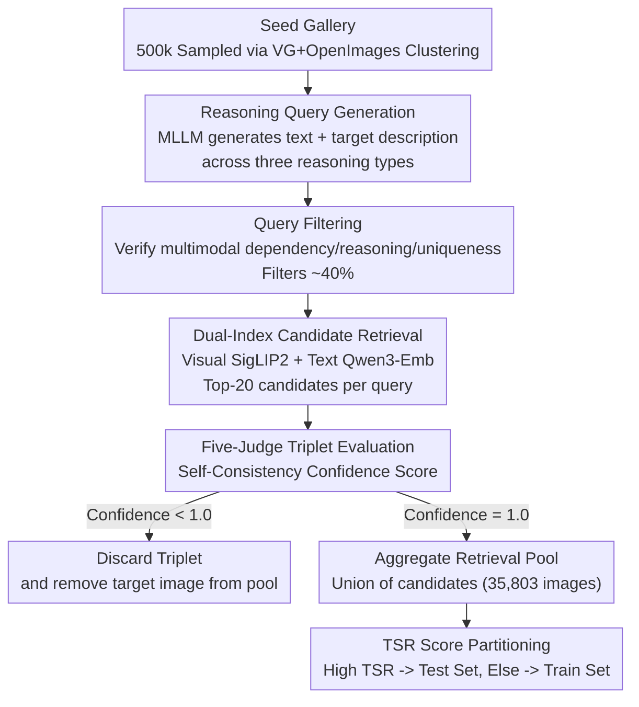

# RMIR: A Benchmark Dataset for Reasoning-Intensive Multimodal Image Retrieval

**Conference**: CVPR 2026  
**Paper**: [CVF Open Access](https://openaccess.thecvf.com/content/CVPR2026/html/Li_RMIR_A_Benchmark_Dataset_for_Reasoning-Intensive_Multimodal_Image_Retrieval_CVPR_2026_paper.html)  
**Code**: https://github.com/amazon-science/rmir  
**Area**: Multimodal VLM  
**Keywords**: Multimodal Retrieval, Reasoning Retrieval, Benchmark, Automated Data Generation, Generative Embedding

## TL;DR
RMIR introduces a multimodal image retrieval benchmark requiring 1-2 steps of logical reasoning to find the target image (1,634 test queries across functional, temporal, and causal reasoning), accompanied by a fully automated and scalable data generation pipeline. Evaluations indicate that even the strongest models achieve only 46.53% R@20, with generative embeddings utilizing explicit reasoning significantly outperforming discriminative encoders.

## Background & Motivation

**Background**: Image retrieval has evolved from early single-modal tasks (image-to-image, text-to-image) to Composed Image Retrieval (CIR)—where a reference image and a supplementary text instruction guide the search for a modified target image (e.g., CIRR, FashionIQ). These tasks essentially focus on "surface-level semantic matching and simple composition."

**Limitations of Prior Work**: Existing benchmarks rarely cover scenarios where the retrieval target cannot be determined by surface features alone and requires complex multi-step reasoning (e.g., "Why did this bird choose to stand in this turbulent water?" $\rightarrow$ the target image is a Great Blue Heron fishing in shallow water). Current reasoning-intensive retrieval benchmarks are either restricted to text documents (BRIGHT) or focused on expert-level/technical diagrams/visual puzzles (MRMR, MR2-Bench), both of which rely on expensive manual expert annotation and lack scalability.

**Key Challenge**: Constructing such datasets involves four conflicting requirements: **Complexity** (queries must require true multimodal reasoning), **Correctness** (target images must validly answer the query), **Retrieval Completeness** (all true positives in the candidate pool must be identified to avoid penalizing correct models), and **Cost Scalability** (generation must be inexpensive and scalable). Increasing complexity often raises verification costs and the risk of mislabeling; expanding the candidate pool helps create harder tasks but increases the likelihood of false negatives.

**Goal**: ① To fill the benchmark gap in "everyday reasoning (non-expert) multimodal image retrieval"; ② To provide an automated data generation pipeline that balances the aforementioned four requirements and allows for arbitrary scaling.

**Core Idea**: Utilize an automated pipeline—"MLLM query generation $\rightarrow$ multi-judge cross-validation $\rightarrow$ explicit false negative handling"—to transform any existing image library into reasoning-intensive retrieval triplets, ensuring both quality and scalability without expert intervention.

## Method

### Overall Architecture

The "Method" in RMIR primarily concerns the **construction process of the dataset**: defining an $I+T \rightarrow I$ reasoning retrieval task and using a 7-stage automated pipeline to convert image libraries into retrieval data with guarantees of correctness and completeness. The task setting involves providing an input image and a 1-2 step logical reasoning query; the model must retrieve the target image that "answers" the query from a shared pool. Queries are categorized into functional (affordance), temporal (sequential change), and causal reasoning.

The pipeline initializes with a seed image library (500,000 images sampled from approximately 2.018 million images in Visual Genome + Open Images v7 across 50,000 clusters), then executes seven stages: Query Generation $\rightarrow$ Query Filtering $\rightarrow$ Candidate Retrieval $\rightarrow$ Multi-judge Triplet Evaluation $\rightarrow$ Confidence Filtering $\rightarrow$ Pool Aggregation $\rightarrow$ TSR-based Test Set Selection.

### Key Designs

**1. Three Types of "Everyday Reasoning" Tasks: Advancing Retrieval from Surface Matching to Logical Inference**

The primary innovation of RMIR is the task itself. It requires the target to depend on both the input image and the query text (true multimodality) and necessitates 1-2 steps of logical inference beyond simple object detection. The difficulty is maintained within the "non-expert" range (median Flesch-Kincaid readability of 8), meaning the "difficulty" lies in the logic rather than the vocabulary. The categories are: Functional (determining tools needed for a task), Temporal (predicting sequences/changes), and Causal (determining causality). Unlike CIR, which involves "modifying an image based on text," RMIR focuses on finding an entirely different image that logically answers a question about the input image.

**2. Automated Query Generation + Multi-judge Validation: Guaranteeing Correctness Without Experts**

To balance quality and scalability, MLLMs replace humans. In the generation stage, Claude Sonnet 4.5 (temp=0.25) generates "query text + target description" for each seed image under constraints: multimodal dependency, 1-2 step reasoning, and uniqueness. A subsequent filtering stage uses Claude Sonnet 4.5 (temp=0) to verify these constraints, **filtering out approximately 40%** of candidates early to save downstream costs. After forming triplets ($input\_image + query + candidate\_target$), **five MLLM judges** (one Sonnet 4.5 + four Haiku 4.5, temp=0.85) evaluate the logic. Using Self-Consistency, the "proportion of majority votes" serves as a confidence proxy (e.g., 4 True/1 False = 0.8 confidence).

**3. Explicit Handling of Retrieval Completeness: Image Deletion + Reverse Pool Aggregation**

A hidden pitfall in reasoning retrieval is the **false negative**—where an image could answer the query but isn't labeled as a positive, leading to unfair penalties for models that find it. RMIR addresses this in two ways. First, during confidence filtering, any triplet with confidence < 1.0 is discarded; crucially, the **target image is also deleted from the entire seed library** to ensure it doesn't reappear elsewhere as an unlabeled positive. Second, the shared retrieval pool is formed by the **union** of all validated high-confidence candidates (final count 35,803). While this slightly reduces the retrieval search space, it significantly reduces the likelihood of false negatives, prioritizing completeness over brute difficulty.

**4. TSR (Test Set Reliability) Score: Selecting Reliable Test Subsets via "Tail Negative Concentration"**

To capture false negatives that might fall outside the top-K candidates seen by judges, the authors introduced the TSR score. The intuition is that if the tail of the retrieval list contains more negatives and the positives are concentrated at the start, the probability of missing a positive after position K is lower. Formally, let $L_i$ have a "negativeness" based on the proportion of judges who rejected it. $\text{mean\_negativeness}(L[i{:}j])$ is the average negativeness from $i$ to $j$:

$$\text{TSR}(L)=\frac{1}{K}\sum_{i=1}^{K}\text{mean\_negativeness}(L[i{:}K]).$$

It characterizes "tail negativeness": the more negatives seen at the end of the candidate list, the higher the confidence that no other positives were missed. Queries with TSR scores above a threshold are assigned to the test set. ⚠️ The reliability of TSR is still being investigated; preliminary manual validation is provided in the appendix.

### Loss & Training
This is a benchmark paper and does not train its own model. The MLLMs in the pipeline (generation/filtering/judging) are off-the-shelf models. The final output includes 1,634 test queries, 6,687 training queries, and a shared retrieval pool of 35,803 images.

## Key Experimental Results

### Main Results: Positioning Against Existing Benchmarks

RMIR is unique in combining "required reasoning" with "scalability."

| Dataset | Task/Modality | Scale | Reasoning Reqd. | Expert Annotated | Scalable |
|--------|-----------|------|--------|----------|--------|
| CIRR | Composed I+T→I | 36K | × | × | × |
| M-BEIR | General Retrieval | 190K | × | × | ✓ |
| BRIGHT | doc retrieval T→T | 1.4K | ✓ | ✓ | × |
| MRMR | Expert Reason I+T→I+T | 1.4K | ✓ | ✓ | × |
| MR2-Bench | Expert Reason I+T→Mixed | 1.3K | ✓ | ✓ | × |
| **RMIR (Ours)** | Reason Retr. I+T→I | 1.6K | ✓ | × | ✓ |

### Evaluation: 11 SOTA Models on RMIR

Evaluations were conducted on 1,634 test queries using 11 models (Open-source MLLMs, discriminative VLM2Vec series, and generative UME-R1 series) using R@20 / R@50. The strongest model, UME-R1-7B, achieved only 46.53% R@20, indicating the task remains highly challenging.

| Model | Funct. R@20 | Temp. R@20 | Causal R@20 | Avg. R@20 | Avg. R@50 |
|----------|----------|----------|----------|----------|----------|
| Qwen2.5-VL-3B | 34.40 | 28.35 | 31.69 | 31.71 | 43.84 |
| Qwen2.5-VL-7B | 36.42 | 36.76 | 37.38 | 36.89 | 48.88 |
| Phi-4-Multimodal-5.6B | 25.46 | 25.80 | 27.41 | 26.33 | 36.86 |
| VLM2Vec-Qwen2-VL-7B | 42.34 | 32.59 | 39.64 | 38.68 | 52.03 |
| VLM2Vec-V2 (2B) | 31.53 | 28.33 | 32.35 | 31.01 | 41.67 |
| UME-R1-2B | 39.08 | 35.53 | 38.95 | 38.09 | 52.68 |
| **UME-R1-7B** | **51.34** | **40.58** | **46.46** | **46.53** | **60.48** |

### Key Findings
- **Generative Embedding + Reasoning > Discriminative Encoding + Scale**: UME-R1, which generates an internal reasoning trace before producing an embedding, significantly outperforms the directly encoded VLM2Vec (by 7.85 percentage points at 7B). Even UME-R1-2B (38.09% R@20) outperforms the larger discriminative Qwen2.5-VL-7B, suggesting training for reasoning is more effective than parameter scaling.
- **Temporal Reasoning is Hardest**: All models performed worst on temporal queries; UME-R1-7B reached only 40.58% R@20, lower than its functional reasoning score by 10.76 points. Predicting temporal dynamics from static images is a major bottleneck.
- **Scale Helps but Isn't Everything**: Scaling within a family consistently improves performance, but the ceiling remains below 50% R@20, leaving significant room for improvement.

## Highlights & Insights
- **Completeness as a First-Class Design Principle**: Unlike most benchmarks that only focus on precision, RMIR explicitly addresses false negatives via "target deletion + union pooling"—a methodology transferable to any automated retrieval dataset construction.
- **TSR as a Reusable Tool**: Using "tail negative concentration" to score automated annotation reliability and split the test set is an innovative way to derive high-trust subsets without manual labor.
- **The "Generation-Filtering-Multi-Judge" Recipe**: Using affordable models (Haiku) as a committee with Self-Consistency is a practical strategy for approximating correctness in the absence of human labels.
- **Instructional Evaluation**: The results provide a clear signal to the community to pursue "generative, reasoning-aware embeddings" rather than simply scaling discriminative contrastive learning.

## Limitations & Future Work
- **Untested Training Utility**: While 6,687 training queries were released, the paper does not demonstrate their effectiveness in improving model performance (the "training value" remains empirical).
- **Quantification of Multimodal Dependency**: The "multimodal dependency" constraint relies on prompt instructions; there is no quantitative baseline to ensure the queries cannot be solved by a single modality alone (shortcut rate).
- **Model Bias in the Pipeline**: Candidate retrieval relies on specific models (SigLIP 2/Qwen3), potentially missing candidates they struggle with. The judges are also from a single model family (Claude).
- **TSR Validation**: The evidence for TSR's effectiveness is relatively light (small-scale manual verification in the appendix).
- **Image Diversity**: The seed library focuses on everyday scenes; however, the pipeline itself is image-agnostic and can be applied to broader domains.

## Related Work & Insights
- **vs. CIR (CIRR/FashionIQ)**: RMIR shifts from surface-level "compositional matching" to logical "inference-based retrieval." The target image is a logical answer, not just a visual variant.
- **vs. BRIGHT**: RMIR is multimodal ($I+T \rightarrow I$) and scalable, whereas BRIGHT is text-to-text and restricted by expert annotation.
- **vs. MRMR / MR2-Bench**: These parallel works focus on expert-level reasoning with heavy human auditing. RMIR complements them by focusing on everyday reasoning and providing a scalable automated pipeline.

## Rating
- Novelty: ⭐⭐⭐⭐ Establishes "everyday reasoning multimodal retrieval" as a scalable benchmark with explicit false negative handling.
- Experimental Thoroughness: ⭐⭐⭐⭐ Systematic evaluation of 11 SOTA models; however, lacks proof of training set utility and robust TSR evidence.
- Writing Quality: ⭐⭐⭐⭐ Clear narrative on the complexity-correctness-completeness-scalability tradeoff.
- Value: ⭐⭐⭐⭐ Provides both data and a reusable generation pipeline/quality tools for the community.

<!-- RELATED:START -->

## Related Papers

- [\[ICLR 2026\] MathNet: A Global Multimodal Benchmark for Mathematical Reasoning and Retrieval](../../ICLR2026/vlm_reasoning/mathnet_a_global_multimodal_benchmark_for_mathematical_reasoning_and_retrieval.md)
- [\[CVPR 2026\] Compositional Transformation Reasoning for Composed Video Retrieval](compositional_transformation_reasoning_for_composed_video_retrieval.md)
- [\[CVPR 2026\] MMTIT-Bench: A Multilingual and Multi-Scenario Benchmark with Cognition-Perception-Reasoning Guided Text-Image Machine Translation](mmtit-bench_a_multilingual_and_multi-scenario_benchmark_with_cognition-perceptio.md)
- [\[ICLR 2026\] IV-Bench: A Benchmark for Image-Grounded Video Perception and Reasoning in Multimodal LLMs](../../ICLR2026/vlm_reasoning/iv-bench_a_benchmark_for_image-grounded_video_perception_and_reasoning_in_multim.md)
- [\[CVPR 2026\] GGBench: A Geometric Generative Reasoning Benchmark for Unified Multimodal Models](ggbench_a_geometric_generative_reasoning_benchmark_for_unified_multimodal_models.md)

<!-- RELATED:END -->
