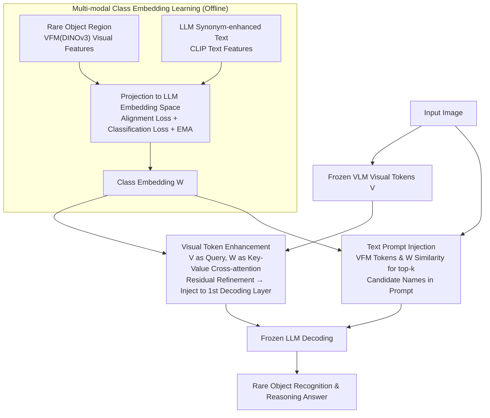

# Seeing Clearly, Reasoning Confidently: Plug-and-Play Remedies for Vision Language Model Blindness

**Conference**: CVPR 2026  
**arXiv**: [2602.19615](https://arxiv.org/abs/2602.19615)  
**Code**: None  
**Area**: Multimodal VLM  
**Keywords**: Rare object recognition, visual token enhancement, multi-modal class embedding, plug-and-play, VLM robustness

## TL;DR
Proposes an efficient plug-and-play module to enhance the recognition and reasoning capabilities of VLMs for rare objects by learning multi-modal class embeddings: a cross-attention adapter refines visual tokens on the vision side, and object detection prompts are injected on the text side, achieving a significant improvement from 72.8 to 75.4 on CODA-LM without fine-tuning the VLM.

## Background & Motivation
**Background**: VLMs demonstrate excellent performance in general visual understanding but show a significant performance drop in reasoning tasks involving rare or infrequent objects.

**Limitations of Prior Work**:
   - Attention weights for rare object regions in the intermediate decoding layers of VLMs are significantly lower than those for common objects.
   - Methods introducing stronger vision encoders or full-model fine-tuning incur high computational costs and are not optimized at the object level.
   - Retrieval-Augmented Learning (RAL) requires large-scale external data and VLM fine-tuning, which may lead to catastrophic forgetting of original capabilities.

**Key Challenge**: Rare objects appear with extremely low frequency in pre-training data, leading to insufficient vision-language alignment. However, existing improvement methods are not designed at the object level and require expensive full-model fine-tuning.

**Goal**: To efficiently improve the perception and reasoning capabilities of VLMs for rare objects without fine-tuning the VLM itself.

**Key Insight**: Attention visualization reveals that VLMs pay insufficient attention to rare objects in the intermediate decoding layers. Therefore, remedies are needed from two perspectives—enhancing visual tokens (making rare objects more "salient") and enriching text prompts (guiding attention to the target regions).

**Core Idea**: Learn multi-modal class embeddings that fuse features from vision foundation models and synonym-enhanced text descriptions. These embeddings serve as both anchors for visual token refinement and as object detectors to generate text prompts.

## Method

### Overall Architecture
This paper aims to solve the "rare object blindness" of VLMs: models see too few rare objects like bollards or traffic cones, resulting in negligible attention to their visual regions during decoding. The proposed approach keeps the VLM backbone frozen and adds patches to both sides—one for vision and one for text—linked by a set of shared "multi-modal class embeddings." The pipeline consists of three steps: first, learning these class embeddings offline (aligning them with both visual features and text descriptions of rare objects); second, using them as anchors to refine VLM visual tokens on the vision side; and finally, using them as a detector on the text side to inject candidate object names into the prompt. By combining visual token enhancement and text prompt injection, the VLM's own parameters remain frozen throughout.

### Key Designs

**1. Multi-modal Class Embedding Learning: Compressing Rare Object Knowledge into Unified Anchors**

Both subsequent steps rely on class embeddings, so the first step is to train them effectively. A learnable embedding vector is assigned to each rare category. During training, the vector is forced closer to two signals: the visual features $z_v$ of the object extracted by a VFM (DINOv3), and the text features $z_t$ extracted by CLIP. Both are mapped to the LLM embedding space via projection layers. To mitigate the data scarcity and imbalance of rare categories, an LLM is used to generate synonyms and descriptive texts for each category, with more variants sampled for categories with less data. Alignment is achieved using a contrastive loss $\mathcal{L}_{align}$ to aggregate similar visual-text features and separate dissimilar ones. A classification loss $\mathcal{L}_{class}$ and EMA updates are applied to ensure the embeddings converge into unified anchors for both vision and text. Instead of random initialization, embeddings start from average visual features of the category for stability.

**2. Visual Token Enhancement: Using Class Embeddings for Cross-attention to Inject Discriminative Knowledge**

The "blindness" of VLMs toward rare objects is directly manifested as low attention weights in intermediate decoding layers. The remedy is a lightweight cross-attention adapter on the vision side: using the frozen VLM visual tokens $V$ as queries and the trained class embeddings $W$ as keys/values. Each visual token retrieves relevant rare object knowledge from the embeddings, which is then added back as a residual:

$$\hat{V} = V + \mathcal{C}_{att}(V, W)$$

The refined $\hat{V}$ replaces the original tokens only at the first decoding layer of the VLM. Early injection allows subsequent layers to follow this cue and focus attention on rare objects. The adapter's training objective combines a reconstruction loss $\mathcal{L}_{rec}$ to keep $\hat{V}$ close to the original distribution (avoiding corruption of the VLM's existing understanding) and an autoregressive loss $\mathcal{L}_{autoreg}$ to ensure the enhanced tokens improve downstream generation.

**3. Text Prompt Injection for Reasoning: Reusing Embeddings as Object Detectors to Explicitly Prompt the Model**

Modifying visual tokens is supplemented by an explicit textual hint. The class embeddings are repurposed as a detector. During inference, the cosine similarity between VFM visual tokens and each class embedding is calculated. High similarity indicates the likely presence of a rare object. The top-k categories are selected as candidates and appended to the text prompt, e.g., "In this image, there might be objects such as: [bollard, debris, …]". This explicitly directs the LLM's attention to target objects using natural language, complementing the implicit visual enhancement. A key advantage is that this step requires no additional detection head, as it reuses the same embeddings from the first step.

### Loss & Training
- Phase 1: $\mathcal{L}_{align} + \mathcal{L}_{class}$ (Training class embeddings and projection layers, 20 epochs)
- Phase 2: $\mathcal{L}_{adapter} = \mathcal{L}_{rec} + \mathcal{L}_{autoreg}$ (Training the adapter, 10 epochs)
- The VLM remains frozen. All training can be completed on a single RTX 4090.

## Key Experimental Results

### Main Results (CODA-LM GPT Score)

| Model | Barrier↑ | Cone↑ | Vehicle↑ | All↑ |
|------|:-------:|:-----:|:--------:|:----:|
| LLaVA-1.5-7B | 39.3 | 54.5 | 48.9 | 46.5 |
| **LLaVA-1.5-7B + Ours** | **68.3** | **84.9** | **73.0** | **72.8** |
| Qwen2.5-VL-7B | 70.9 | 84.9 | 66.5 | 67.9 |
| **Qwen2.5-VL-7B + Ours** | **79.8** | **91.7** | **71.0** | **75.4** |
| InternVL3-8B | 59.7 | 73.3 | 66.9 | 65.4 |
| **InternVL3-8B + Ours** | **76.4** | **85.8** | **73.8** | **74.2** |

### Ablation Study

| Configuration | All↑ | Description |
|------|:----:|------|
| LLaVA-1.5-7B baseline | 46.5 | No enhancement |
| + Text prompt only | 56.2 | Prompts are effective but insufficient |
| + Visual enhancement only | 65.8 | Visual enhancement contributes more |
| + Visual + Text | **72.8** | Dual approach yields best results |

### Key Findings
- LLaVA-1.5-7B achieves a significant gain of 26.3 points (46.5→72.8).
- Generalization across models: Effective for LLaVA, Qwen2.5-VL, and InternVL3.
- Visual enhancement gain > Text prompt gain, but the two are complementary.
- Requires only a single 4090 and minimal training data (10k QA pairs from CODA-LM).
- The "Barrier" category shows the most significant improvement (39.3→68.3), representing typical rare objects.

## Highlights & Insights
- **Dual Utility of Multi-modal Class Embeddings**: The same embeddings serve as visual refinement anchors (keys/values for cross-attention) and as object detectors (similarity matching), killing two birds with one stone.
- **Efficient Frozen VLM Solution**: Dramatically improves performance without changing VLM parameters, requiring only a lightweight adapter. This is highly valuable for deploying existing large models.
- **Attention Visualization Analysis**: Provides clear motivation by demonstrating the lack of focus on rare objects in intermediate VLM layers.

## Limitations & Future Work
- Requires a predefined set of rare categories and cannot handle novel categories never seen during training.
- The number of class embeddings is limited by the number of rare categories $C$; ultra-large-scale scenarios require adjustments.
- Top-k detection might introduce false positives, potentially misleading reasoning with incorrect prompts.
- Performance on GeoBench-VLM (satellite imagery) is weaker than on CODA-LM, indicating challenges in extremely scarce data domains.

## Related Work & Insights
- **vs. Supervision of Internal VLM Features (e.g., LLaVA-Grounding)**: These align all visual tokens using a VFM but are not specific to rare objects; Ours achieves object-level refinement using class embeddings, which is more precise.
- **vs. Retrieval-Augmented Learning (RAL)**: RAL retrieves from large external datasets and fine-tunes the VLM, which is computationally expensive and risks forgetting; Ours does not require mass data or VLM fine-tuning.

## Rating
- Novelty: ⭐⭐⭐⭐ Clever dual-purpose design of multi-modal class embeddings.
- Experimental Thoroughness: ⭐⭐⭐⭐ Validated across multiple models with attention visualization.
- Writing Quality: ⭐⭐⭐⭐ Clear motivation and intuitive diagrams.
- Value: ⭐⭐⭐⭐ A practical solution for rare object understanding.

<!-- RELATED:START -->

## Related Papers

- [\[CVPR 2026\] G$^2$VLM: Geometry Grounded Vision Language Model with Unified 3D Reconstruction and Spatial Reasoning](g2vlm_geometry_grounded_vision_language_model_with_unified_3d_reconstruction_and.md)
- [\[ICLR 2026\] Play to Generalize: Learning to Reason Through Game Play](../../ICLR2026/vlm_reasoning/play_to_generalize_learning_to_reason_through_game_play.md)
- [\[ICML 2026\] Bad Seeing or Bad Thinking? Rewarding Perception for Vision-Language Reasoning](../../ICML2026/vlm_reasoning/bad_seeing_or_bad_thinking_rewarding_perception_for_vision-language_reasoning.md)
- [\[CVPR 2026\] PointThinker: Point-Incentivized Parallel Thinking for Multimodal Large Language Model](pointthinker_point-incentivized_parallel_thinking_for_multimodal_large_language_.md)
- [\[ICLR 2026\] Seeing Across Views: Benchmarking Spatial Reasoning of Vision-Language Models in Robotic Scenes](../../ICLR2026/vlm_reasoning/seeing_across_views_benchmarking_spatial_reasoning_of_vision-language_models_in_.md)

<!-- RELATED:END -->
