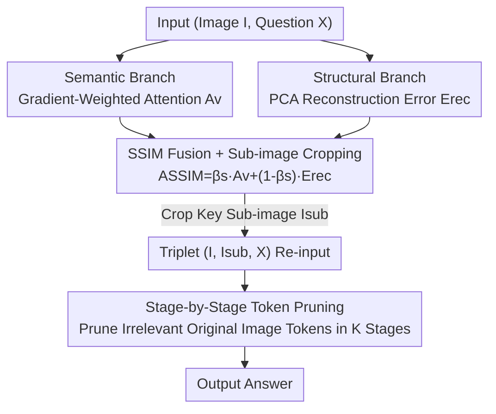

# Seeing What Matters: A Training-Free Self-Guided Framework for Multimodal Detail Perception and Reasoning

**Conference**: CVPR 2026  
**Paper**: [CVF Open Access](https://openaccess.thecvf.com/content/CVPR2026/html/Ma_Seeing_What_Matters_A_Training-Free_Self-Guided_Framework_for_Multimodal_Detail_CVPR_2026_paper.html)  
**Code**: None  
**Area**: Multimodal VLM  
**Keywords**: Training-free inference, fine-grained perception, visual token selection, attention sink, token pruning  

## TL;DR
Imitating the human visual process of "scan-locate-focus", SLoFo requires **no training and no additional modules**. It integrates the MLLM's internal gradient-weighted attention (semantic branch) and PCA reconstruction error (structural branch) into a semantic-structural importance map, crops key sub-images to feed back into the model, and utilizes stage-by-stage token pruning to suppress irrelevant visual noise. It improves TextVQA by 4.79% and DocVQA by 12.01% on LLaVA-v1.5-7B.

## Background & Motivation

**Background**: Multimodal Large Language Models (MLLMs) have demonstrated strong capabilities in tasks like visual question answering, spatial understanding, and document analysis. However, mainstream open-source models (such as LLaVA-v1.5) operate with **fixed resolutions**, where images are uniformly scaled to $336^2$ pixels and partitioned into visual tokens before being fed into the language model.

**Limitations of Prior Work**: Fixed resolution leads to two major drawbacks. The first is **distracted attention**: although the model can assign some attention to relevant areas, many semantically irrelevant regions also attract high attention, which interferes with detail-oriented judgment. The second is **blurry vision**: even if the model locates the target region, it cannot "zoom in" to see clearly due to the constraint of fixed input resolution, causing small objects or text in high-resolution images to become blurry. The paper uses an example from the V\* benchmark ("What is the posture of the woman wearing a yellow backpack?") to illustrate that LLaVA-v1.5 fails to answer correctly because of these two limitations.

**Key Challenge**: To perceive details clearly, high resolution is necessary, but training high-resolution models incurs prohibitive computational costs. In contrast, existing fixed-resolution MLLMs have already emerged capable attention patterns, which are simply not explicitly exploited. The fundamental bottleneck is that **the model possesses the potential to locate key regions, but during inference, it neither actively zooms into key areas nor actively filters out irrelevant noise**.

**Goal**: To automatically select key visual regions before inference (scan-and-locate) and zoom into them during inference while progressively suppressing irrelevant visual noise (focus), thereby balancing fine-grained perception and computational efficiency without training or adding external networks.

**Key Insight**: The authors leverage an observation in LLMs where the large model pre-plans global information before generating responses. By treating the **first token to be generated by the MLLM as a planning anchor**, which encodes the global attributes of the entire expected answer, they inversely query "which visual tokens are most critical to the answer".

**Core Idea**: Using the model's own "planning anchor," key regions are located and subset images are cropped via two complementary streams of evidence: **gradient-weighted attention + structural uniqueness**. Subsequently, **stage-by-stage token pruning** progressively removes background noise—resulting in a fully training-free framework with zero added modules.

## Method

### Overall Architecture

SLoFo (Scan-Locate-Focus) is a two-stage **inference-time** framework wrapped around existing MLLMs, taking an image $I$ and a question $X$ as inputs to generate the answer.

The first stage is **Scan-Locate**: First, a forward pass is run on $(I, X)$ to extract two parallel streams of evidence. The **semantic branch** uses the attention of the planning anchor on visual tokens multiplied by gradient sensitivity, yielding the semantic map $A_v$ indicating "which tokens truly affect the answer planning". The **structural branch** performs PCA reconstruction on early-layer visual hidden states, using the reconstruction error to measure the "visual uniqueness" $E_{rec}$ of each token. This is specifically designed to combat the pollution of the semantic map by attention sinks. The two streams are fused into a **Semantic-Structural Importance Map (SSIM)**, and a sliding window searches for a window of "maximum internal-external contrast" to crop the key sub-image $I_{sub}$.

The second stage is **Focus**: The triplet $(I, I_{sub}, X)$ is re-fed into the MLLM for final inference. Although the sub-image provides clearer details, it also increases the number of visual tokens. To address this, the transformer layers of the language model are divided into $K$ stages. At the end of each stage, the most irrelevant tokens in the **original image** are pruned based on the attention of the planning anchor (tokens of the sub-image are fully preserved). This progressively enhances the foreground-background attention contrast while amortizing the additional computational overhead.

### Key Designs

**1. Semantic Branch: Locating regions that "truly influence the answer" via gradient-weighted attention on the planning anchor**

Directly using raw attention for region selection encounters a major pitfall—attention sinks: certain uninformative tokens continually absorb high attention like registers, leading to unstable attention-based selection (as verified by the "S1 pure att" ablation in the paper). SLoFo's approach is to evaluate not just "how high the attention is", but "whether this attention makes a causal contribution to the answer planning". Specifically, the last input token of the model (i.e., the first token to be generated) is chosen as the planning anchor. Its attention on the visual tokens at the $l$-th layer, denoted as $A^l_{a2v}\in\mathbb{R}^{N_v}$, is extracted. This anchor is then passed through the language model head to sample a pseudo-token $\hat y_0$ (which is not included in the final answer but serves solely as a semantic supervision signal). The gradient of $\hat y_0$ with respect to $A^l_{a2v}$ is computed to obtain a sensitivity map $G_v=\sigma(\nabla_{A^l_{a2v}}\hat y_0)$ (where $\sigma$ truncates negative values to 0). The final semantic influence is calculated as:

$$A_v = A^l_{a2v}\odot G_v$$

where $\odot$ denotes element-wise multiplication. The intuition is that $G_v$ measures "the contribution of attention variations of each token to the planning anchor". Thus, $A_v$ captures tokens that **truly exert a causal impact on the decision**, rather than simply capturing high-attention regions trapped by attention sinks. The paper utilizes the $l=14$-th layer (where mid-layer attention is more stable and detailed), and ablation studies demonstrate that this outperforms pure attention on V\* by nearly 9 percentage points.

**2. Structural Branch: Supplementing robust, "semantically-independent" uniqueness evidence via PCA reconstruction error**

Relying solely on the semantic branch is insufficient because attention distributions can fluctuate wildly based on prompt content, format, and length; moreover, attention sinks and high-frequency noise boundaries can still assign high values of $A_v$ to irrelevant regions. SLoFo introduces a structural branch that **does not rely on attention at all and observes visual features only** for reinforcement. The core intuition is that tokens that can be reconstructed with very few principal components are usually redundant backgrounds (e.g., solid colors, flat regions), whereas tokens with high reconstruction errors contain unique visual information. The approach extracts visual hidden states $H_v\in\mathbb{R}^{N_v\times D_t}$ from an early layer $l'$, projects them into a low-dimensional subspace $f_{PCA}:\mathbb{R}^{D_t}\to\mathbb{R}^{D_{PCA}}$ via PCA ($D_{PCA}\ll D_t$, where $D_{PCA}=20$ in the paper), and then reconstructs them back to $\hat H_v$. The reconstructed error per token is calculated as:

$$E_{rec}=\frac{1}{\sqrt{D_t}}\sum_{d=1}^{D_t}(H_v-\hat H_v)^2\in\mathbb{R}^{N_v}$$

Higher error indicates structural uniqueness, pointing to a more informative foreground. PCA is chosen here because of its lightweight, model-agnostic, zero-training, and unsupervised nature. Note that it **cannot be used in isolation**—the structural branch only recognizes "uniqueness" and lacks knowledge regarding relevance to the question. Consequently, the paper does not conduct a "pure structural" ablation; its role is positioning-oriented, functioning as a safeguard for the semantic branch to resist attention instability.

**3. SSIM Fusion + Sliding Window Cropping: Fusing two-stream evidence into an importance map to crop key sub-images with maximum contrast**

The two streams of evidence are linearly fused using a coefficient $\beta_s$ into the Semantic-Structural Importance Map:

$$A_{SSIM}=\beta_s A_v+(1-\beta_s)E_{rec}$$

The paper sets $\beta_s=0.7$ (dominantly semantic, secondarily structural). Given the SSIM, to crop the sub-image: SLoFo searches for the sub-region with the highest cumulative evidence across multiple window sizes via a sliding window. Rather than simply selecting the window with the maximum sum of evidence, it chooses the window with the **maximum internal-external contrast** (where the difference between the average internal evidence and the surroundings is maximized). This detail prevents the window from greedily expanding or collapsing toward image boundaries (a common degradation in bounding boxes). The cropped sub-image $I_{sub}$, the original image, and the question form a new triplet $(I, I_{sub}, X)$ fed back into the model—acting as a "magnifying glass" where the original image preserves context and the sub-image preserves details.

**4. Stage-by-Stage Token Pruning: Progressively eliminating original image background noise in the focus stage while amortizing sub-image overhead**

Adding sub-images produces clearer details, but LLaVA-style models incur 576 additional tokens per sub-image, driving up computational overhead. SLoFo designs stage-by-stage pruning based on two empirical observations: (1) visual information is primarily consumed in the early layers of LLMs, with diminishing impact in deeper layers; (2) the model can natively differentiate useful and redundant tokens using semantic and structural signals. Thus, the transformer layers of $\theta_t$ are equally divided into $K$ stages ($K=4$ in the paper). At the end layer $l_j$ of each stage $j$, the planning anchor's attention over the **remaining original image tokens**, $A^{l_j}_{a2v}$, is extracted. The tokens with the lowest attention (ranking in the lowest percentile) are pruned and excluded from computation in subsequent stages, while **sub-image tokens are fully preserved** across all stages to guarantee detail focusing. In the paper, the focused token ratio increases progressively across stages from 52.69% to 84.31% and 93.67%. This progressively enlarges the foreground-to-background attention contrast, effectively achieving simultaneous "focusing" and "slimming", which enhances the signal-to-noise ratio while offsetting the extra overhead of the sub-image.

### An Example: Reading Text on a Jersey

For the question "What is written on the jersey of the person in white pants and yellow shirt?", the baseline LLaVA-v1.5 views the entire image but gives an incorrect answer as its attention is distracted by irrelevant regions. SLoFo first computes the SSIM in the Scan-Locate stage—the semantic branch steers attention toward that specific player according to the question, while the structural branch highlights highly unique areas like the jersey texture. After fusion, the SSIM lights up around the jersey region, and a sliding window crops the sub-image centered on the jersey with the maximum internal-external contrast. Once the sub-image is fed back into the model, details become clear. Through 4 stages of token pruning, tokens representing the background stands, grass, etc., are progressively pruned, lifting the focused ratio to 93.67%. The model ultimately reads "HALL 17" on the jersey.

## Key Experimental Results

The baseline is uniformly evaluated on the widely used fixed-resolution open-source model **LLaVA-v1.5-7B**. SLoFo's default configuration is set as $l=14, l'=7, D_{PCA}=20, \beta_s=0.7, K=4$, pruning 50% of the remaining original image tokens at each stage. "SLoFo high-res" is a scalable variant that splits high-resolution images into patches, runs the pipeline on each patch to collect a global SSIM, and then crops the sub-image.

### Main Results

Detail-sensitive tasks (Accuracy %, excerpt):

| Task | Baseline LLaVA-v1.5 | ViCrop | DyFo | SLoFo | SLoFo high-res |
|------|------|------|------|------|------|
| TextVQA | 58.23 | 61.56 | - | **63.02** | 64.67 |
| POPE | 85.31 | 87.12 | 87.71 | **88.19** | 88.55 |
| DocVQA | 15.68 | 19.84 | - | **27.69** | 29.16 |
| V\* | 42.41 | 56.02 | 59.16 | 57.59 | **61.78** |
| HR-Bench-4K | 35.125 | 42.25 | - | **44.25** | 46.125 |
| HR-Bench-8K | 31.25 | 33.875 | - | **36.875** | 38.625 |

By default, SLoFo exceeds the baseline by +4.79% and ViCrop by +1.46% on TextVQA; it shows a massive surge of +12.01% on DocVQA; and gains +9.125% (4K) / +5.625% (8K) on high-resolution HR-Bench. On V\*, the default version is slightly lower than DyFo (57.59 vs 59.16), but DyFo requires multi-turn visual search and extra modules, whereas SLoFo is a one-shot pipeline; the high-res version surpasses DyFo at 61.78%, outperforming all training-free baselines.

SLoFo also yields universal gains on general visual reasoning tasks: GQA +1.46% (high-res +2.58%), VQAv2 +4%+, and SEED +0.72%, suggesting that although designed for details, the retained visual cues also benefit generalized understanding. On images lacking high-frequency structures or of low quality, such as in VizWiz and SQA, high-res yields no further gains.

### Ablation Study

Three major components: S1 (semantic selection branch), S2 (structural reinforcement branch), TP (stage-by-stage token pruning), evaluated under the default resolution of LLaVA-v1.5-7B:

| Configuration | TextVQA | POPE | DocVQA | V\* | VQAv2 |
|------|------|------|------|------|------|
| Baseline | 58.23 | 85.31 | 15.68 | 42.41 | 75.24 |
| S1 | 61.71 | 86.64 | 25.29 | 56.07 | 76.11 |
| S1+S2 | 62.67 | 87.23 | 26.45 | 57.23 | 78.23 |
| S1+TP | 62.73 | 88.01 | 26.71 | 57.16 | 77.90 |
| S1+S2+TP (Full) | **63.02** | **88.19** | **27.69** | **57.59** | **79.44** |
| S1 pure att | 60.98 | 86.28 | 16.29 | 51.31 | 76.09 |

### Key Findings

- **Semantic branch (S1) is the main engine**: S1 alone boosts V\* by +14.66% and TextVQA by +3.48%, verifying the efficacy of region selection based on the model's own planning anchor.
- **Gradient weighting vs. pure attention**: "S1 pure att" (directly using raw attention of the same layer as the evidence map) barely improves on DocVQA (+0.61% vs. +9.61% of S1), verifying that attention sinks pollute raw attention, whereas gradient weighting provides a "causally reliable" evidence map—this is the core justification of the semantic branch.
- **Structural branch supplements robustness**: S2 complements the semantic branch most significantly in texture-rich or high-resolution images; it cannot locate task-relevant areas in isolation, making a "pure structural" ablation meaningless.
- **The trio of components exhibits synergy**: VQAv2 increases steadily from 75.24 to 79.44 (+4.20%), where overlaying all three modules yields the best performance.
- **POPE robustness**: Under the adversarial high-res setting, the F1 gains are the most significant (MSCOCO +4.75, GQA +2.62), indicating that sub-image focusing and pruning bring better robustness against hallucinations and perturbations.
- **Hyperparameters**: The semantic layer $l=14$ is optimal (60.21%), as early-layer attention is too coarse and mid-layers are more stable; the structural layer $l'=7$ with $\beta_s=0.7$ is determined via a 2D grid search.
- **Overhead**: On an RTX 4090, the total latency per sample for SLoFo is 0.57s (Scan-Locate 0.34s + Focus 0.23s), which is lower than ViCrop's 0.79s; on CPU, it is 47.92s vs. ViCrop's 77.58s. Token pruning successfully amortizes or even reverses the extra overhead introduced by the sub-image.

## Highlights & Insights
- **Treating the "first token to be generated" as a planning anchor is the masterstroke**: Running a single forward pass encodes the global attributes of the expected answer. Backpropagating the gradient sensitivity map through it essentially allows the model to declare "where to look to answer this question". This is achieved with zero training and zero added parameters, making this trick transferrable to any MLLM inference acceleration scenario requiring question-aware region localization.
- **Gradient weighting specifically cures attention sinks**: Directly using attention to select regions is typically error-prone. This paper filters out sink regions with "high attention but no causal contribution" using pseudo-token supervision + gradient truncation. The "S1 pure att" ablation solidly anchors this motivation.
- **PCA reconstruction error as structural uniqueness evidence**: Employs "reconstructibility with few principal components" to distinguish redundant background from unique foreground. It is lightweight, model-agnostic, and entirely orthogonal to attention, serving as a low-cost complementary signal for various token importance metrics.
- **Sliding window selects 'maximum internal-external contrast' instead of 'maximum sum of evidence'**: A minor but critical engineering detail that directly prevents bounding boxes from greedily expanding or sticking to boundaries, offering valuable insight for any heatmap-based ROI cropping methods.
- **Token pruning evolves from 'saving computation' to 'improving SNR + amortizing sub-image overhead'**: This elegantly unifies efficiency measures and performance goals in designing a progressive enhancement of the focused ratio.

## Limitations & Future Work
- **Dependence on existing attention/feature quality of the model**: The entire framework is "self-guided." If the backbone MLLM itself has poor attention patterns (e.g., in early layers or weak models as discussed in the paper), the localization of the semantic branch will be unstable, discounting the benefits of the method.
- **Ineffective or zero gains on low-quality/structure-deficient images**: The lack of improvement in high-res performance on VizWiz and SQA indicates that sub-image magnification and structural branches assume there are "zoomable detailed structures inside the image," failing on blurry or low-quality images.
- **Validated only on a single LLaVA-v1.5-7B backbone**: Despite claiming to be model-agnostic, experiments are tied to fixed-resolution LLaVA. Whether there are incremental gains for native high-resolution or dynamic-resolution MLLMs (such as the Qwen2-VL family) remains unverified.
- **Upper bound of one-shot single sub-image cropping**: The default version's shortfall compared to multi-turn search in DyFo on V\* implies that "cropping only one sub-image" might be insufficient for hard cases requiring multi-region collaborative reasoning. Lightweight multi-turn or multi-sub-image extensions could be explored.
- **Empirical hyperparameters**: Parameters like $l, l', \beta_s, K$, and the pruning ratio are determined via grid search, which might require tuning when swapping tasks or models.

## Related Work & Insights
- **vs. ViCrop / SEAL / DyFo (Visual Search/Cropping methods)**: These typically require external search modules or multi-turn searches (e.g., DyFo). SLoFo is a one-shot pipeline with zero extra modules, lower overhead (0.57s vs. ViCrop's 0.79s), and outperforms them on most detailed tasks. The trade-off is slightly inferior performance of the default version on datasets like V\* that necessitate multi-region searches.
- **vs. Training High-Resolution MLLMs**: Training high-resolution models directly yields strong performance at immense computational costs. SLoFo adopts the path of "inference-time enhancement of existing fixed-resolution models", attaining comparable detail perception gains without training.
- **vs. Pure Attention Token Selection/Pruning Methods**: This paper points out that raw attention is contaminated by attention sinks, employing gradient-weighting + PCA structural evidence in a complementary manner to improve robustness. The "S1 pure att" ablation serves as a direct counter-example to such raw attention methods.

## Rating
- Novelty: ⭐⭐⭐⭐ porting the planning-anchor concept from LLMs to MLLM visual region selection, combined with PCA structural evidence and stage-by-stage pruning; the combination is novel and training-free
- Experimental Thoroughness: ⭐⭐⭐⭐ 12 benchmarks, component ablations, hyperparameter grids, overhead analysis, and POPE breakdowns are all included, but it is only validated on LLaVA-v1.5-7B as a single backbone
- Writing Quality: ⭐⭐⭐⭐ The Scan-Locate-Focus storyline is clear, and Figure 2 explains the two stages very intuitively
- Value: ⭐⭐⭐⭐ Plug-and-play, training-free, and cost-reducing; it holds direct practical value for deploying fixed-resolution MLLMs for fine-grained perception

<!-- RELATED:START -->

## Related Papers

- [\[CVPR 2026\] DeepScan: A Training-Free Framework for Visually Grounded Reasoning in Large Vision-Language Models](deepscan_a_training-free_framework_for_visually_grounded_reasoning_in_large_visi.md)
- [\[CVPR 2026\] Breaking the Regional Perception Bottleneck of Multimodal Large Language Models via External Reasoning Framework](breaking_the_regional_perception_bottleneck_of_multimodal_large_language_models_.md)
- [\[CVPR 2026\] Generate, Analyze, and Refine: Training-Free Sound Source Localization via MLLM Meta-Reasoning](generate_analyze_and_refine_training-free_sound_source_localization_via_mllm_met.md)
- [\[NeurIPS 2025\] Struct2D: A Perception-Guided Framework for Spatial Reasoning in MLLMs](../../NeurIPS2025/vlm_reasoning/struct2d_a_perception-guided_framework_for_spatial_reasoning_in_mllms.md)
- [\[CVPR 2026\] Graph-to-Frame RAG: Visual-Space Knowledge Fusion for Training-Free and Auditable Video Reasoning](graph-to-frame_rag_visual-space_knowledge_fusion_for_training-free_and_auditable.md)

<!-- RELATED:END -->
