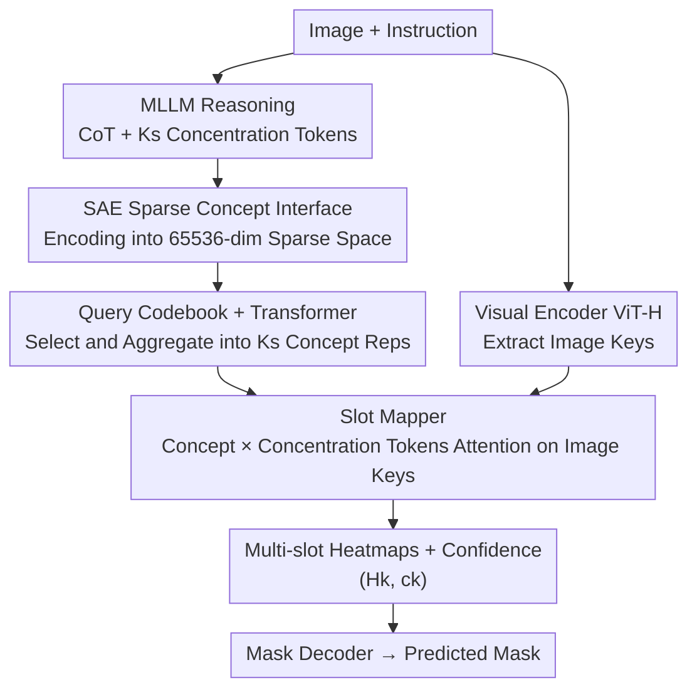

# SegCompass: Exploring Interpretable Alignment with Sparse Autoencoders for Enhanced Reasoning Segmentation

**Conference**: CVPR 2026  
**arXiv**: [2605.22658](https://arxiv.org/abs/2605.22658)  
**Code**: https://github.com/ZhenyuLU-Heliodore/SegCompass (Available)  
**Area**: Reasoning Segmentation / Multimodal VLM / Interpretability  
**Keywords**: Reasoning segmentation, Sparse Autoencoder, CoT, Interpretable Alignment, GRPO

## TL;DR
SegCompass uses Sparse Autoencoders (SAEs) to project MLLM Chain-of-Thought (CoT) and visual tokens into a shared high-dimensional sparse concept space. Through codebook aggregation and slot mapping, it generates observable multi-slot heatmaps to guide segmentation. This transforms the "reasoning $\rightarrow$ segmentation" path from a black box or post-hoc assembly into a verifiable "white-box" alignment, achieving or exceeding SOTA on 5 benchmarks.

## Background & Motivation

**Background**: Reasoning segmentation requires models to locate and segment objects based on complex, multi-step natural language instructions (e.g., "segment the cup whose color matches the plate and is closest to the sink"). Current approaches connecting Large Language Models' reasoning to a segmentation module follow two main technical routes.

**Limitations of Prior Work**: The first route is **latent query alignment**, represented by the LISA series, which maps LLM hidden states into latent queries to interact with visual features for mask prediction. While end-to-end, the internal decision-making is encapsulated in opaque vectors, making it a **black box**: one cannot see what the model "thinks" or why it localized a specific region. The second route is **textual localization readout**, represented by Seg-Zero / VisionReasoner / Text4Seg, which uses CoT to generate discrete localization tokens (coordinates, patch indices) as a post-processing step for SAM. The reasoning is **readable but not interpretable**: the CoT is unconstrained, the derivation of spatial cues is opaque, and text tokens lack sufficient semantic detail, essentially acting as a post-hoc assembly.

**Key Challenge**: Neither route establishes a **verifiable and interpretable** connection between the "reasoning process" and the "final mask"—it is either end-to-end but opaque, or readable but disconnected. There is a gap between interpretability and end-to-end differentiability.

**Goal**: Create a mechanism to make the "reasoning $\rightarrow$ perception" path a white box: allowing inspection of which semantic concepts are used at each step and which image regions these concepts ground to, while remaining fully differentiable for end-to-end training.

**Key Insight**: The authors observe that features learned by Sparse Autoencoders (SAEs) are **discrete, high-dimensional, and semantically interpretable**. SAEs are designed to disentangle overlapping features within LLMs into individual nameable concepts. Since SAEs excel at "decomposing activations into interpretable concepts," they can serve as an interpretable bridge between reasoning and segmentation.

**Core Idea**: Use SAEs as an interface to encode both CoT and visual tokens into the same sparse concept space. Then, explicitly ground the activated sparse concepts into multi-slot heatmaps to guide segmentation, replacing opaque latent queries and disconnected text tokens with "nameable intermediate representations."

## Method

### Overall Architecture
SegCompass addresses "how to ground MLLM reasoning transparently onto segmentation." It follows an end-to-end sparse concept pipeline: given an image and instruction, the MLLM policy $\pi_{\bm{\theta}}$ generates a CoT and $K_s$ "concentration tokens." Subsequently, an SAE encodes image tokens, text tokens, and CoT hidden states into an ultra-high-dimensional sparse space ($d_{\text{sae}}=65536$, vs. LLM hidden dimension $d_\pi=4096$) at a specific layer. A learnable query codebook selects salient concepts from the activated sparse features, which are then aggregated into $K_s$ concept representations via Transformer encoder blocks. The concentration token embeddings and concept representations fuse into $K_s$ slot queries to perform attention with image keys from a visual encoder (ViT-H from SAM). A slot mapper produces observable multi-slot heatmaps $(\mathcal{H}_k, c_k)$, and finally, a mask decoder converts these into predicted masks. During training, the reasoning path (via GRPO reinforcement learning) and the segmentation path (via supervision) are optimized jointly.

### Key Designs

**1. SAE Sparse Concept Interface: Projecting Reasoning and Vision into a Shared Nameable Space**

The core of the paper addresses the "opacity" of latent queries and "disconnection" of text tokens. The SAE performs linear mapping and sparse activation on token hidden states $\bm{z}\in\mathbb{R}^{T\times d_\pi}$ via an encoder $\mathcal{E}_{\text{sae}}$, yielding overcomplete high-dimensional sparse activations $h(\bm{z})\in\mathbb{R}^{T\times d_{\text{sae}}}$ ($d_{\text{sae}}=65536$). In this space, **each dimension acts as a dictionary atom that activates only for its corresponding concept**. The support set $\mathcal{S}(\bm{z})=\{j: h_j(\bm{z})\neq 0\}$ is much smaller than $d_{\text{sae}}$, resulting in sparse, disentangled concepts. Crucially, this encoding **applies uniformly to both text and visual tokens**. Concepts mentioned in CoT (e.g., "white ceramic bowl") and region tokens in the image will fall onto the same sparse basis, naturally aligning "what was reasoned" with "where it is in the image." Activated dictionary atoms and their strengths $(j, h_j(\bm{z}))$ allow for concept-level attribution. The SAE is pre-trained on 200K samples from OBELICS for reconstruction and sparsity:

$$\mathcal{L}_{\text{sae}}(\bm{z})=\|\bm{z}-\hat{\bm{z}}\|_2^2 + \alpha\|h(\bm{z})\|_1$$

where $\hat{\bm{z}}=\mathcal{D}_{\text{sae}}(h(\bm{z}))$ is the linear reconstruction, the $\ell_1$ term enforces sparsity, and $\alpha$ controls the strength.

**2. Query Codebook + Concept Aggregation: Organizing Sparse Activations into Ks Slot Concepts**

To handle "how to organize scattered sparse concepts into compact representations for targets," the model filters non-zero activations $\{(j, h_j(\bm{z}))\}_{j\in\mathcal{S}(\bm{z})}$ and uses a codebook $\bm{C}\in\mathbb{R}^{d_{\text{sae}}\times d_c}$ to decode them back into a dense space. It initializes $K_s$ concept representations which, along with $\{\bm{C}(h_j(\bm{z}))\}$, pass through Transformer encoder blocks with self-attention to aggregate into $K_s$ representations $(\bm{r}_k)_{k=1}^{K_s}$. This **preserves provenance**: it is traceable which indices from $\mathcal{S}(\bm{z})$ contributed to which concept representation. $K_s$ (default max slots 6) covers multiple targets in one instruction.

**3. Slot Mapper: Grounding Concepts into Observable Multi-slot Heatmaps**

Concentration token embeddings $\bm{e}_k$ and concept representations $\bm{r}_k$ are concatenated via an MLP into slot queries $\bm{Q}\in\mathbb{R}^{K_s\times d_q}$. The visual backbone encodes the image into keys $\bm{K}\in\mathbb{R}^{h\times w\times d_k}$. The slot mapper uses multi-head attention to compute scores $\bm{S}=[(\bm{Q}\bm{W}_i^Q)(\bm{K}\bm{W}_i^K)^\top/\sqrt{d_h}]_{i=1}^{N_h}$, then branches into two heads for spatial heatmaps and confidence:

$$(\mathcal{H}_k)_{k=1}^{K_s}=\mathcal{F}_{\text{map}}(\bm{S}),\quad (c_k)_{k=1}^{K_s}=\mathcal{F}_{\text{conf}}(\bm{S})$$

Heatmap $\mathcal{H}_k$ is the spatial footprint of the $k$-th slot, and $c_k$ is its reliability. This makes "where concept $k$ is located" **directly visualizable and inspectable**, achieving the "white-box" goal. Finally, the mask decoder uses 2D convolutions and a SAM-style Two-Way Transformer to output the predicted mask $\hat{\bm{M}}=\mathcal{F}_{\text{dec}}(\bm{K},(\mathcal{H}_k,c_k))$.

### Loss & Training
The overall objective couples RL for reasoning with supervision for perception:

$$\mathcal{L}=\mathcal{L}_{\text{grpo}}+\lambda_{\textsc{s}}\mathcal{L}_{\text{seg}}+\lambda_{\textsc{c}}\mathcal{L}_{\text{conf}}$$

- **GRPO (Reasoning Path)**: The policy samples $G$ responses per input and computes GRPO loss using advantages. Rewards include a **segmentation reward** (bipartite matching between predicted masks and GT, scoring based on confidence and mask IoU) and a **format reward** (regex checks for CoT structure), normalized to $[0,1]$ with weights 0.7 for seg and 0.3 for format.
- **Segmentation Supervision (Visual Path)**: $\mathcal{L}_{\text{seg}}=\mathcal{L}_{\text{bce}}((\mathcal{H}_k),\bm{M}_{\text{gt}})+\lambda_{\textsc{d}}\mathcal{L}_{\text{dice}}(\hat{\bm{M}},\bm{M}_{\text{gt}})$. BCE encourages spatial evidence concentration in heatmaps, while Dice supervises final mask quality.
- **Confidence Loss**: $\mathcal{L}_{\text{conf}}=\frac{1}{K_s}\sum_k\mathcal{L}_{\text{bce}}(c_k,y_k)$, where $y_k$ indicates if a slot matches a GT instance.

## Key Experimental Results

Backbones: Qwen2.5-VL-7B, LLaVA-1.5-7B, LLaVA-1.5-13B. Trained on RefCOCO(+/g) and gRefCOCO; zero-shot evaluation on ReasonSeg.

### Main Results

RefCOCO series (cIoU) highlights:

| Dataset/split | SegCompass (Ours) | Strong Baseline | Notes |
|--------|------|------|------|
| RefCOCO val (13B) | 86.3 | HiMTok-8B 85.9 / X-SAM 85.1 | SOTA on almost all splits |
| RefCOCO+ val (13B) | 80.5 | HiMTok-8B 80.5 | Tied for best |
| RefCOCOg val (13B) | 84.0 | X-SAM-3.8B 83.8 | Slightly exceeds SOTA |
| RefCOCO+ testB (13B) | 76.9 | HiMTok-8B 76.4 | Exceeds SOTA |

gRefCOCO (Multi-target, val, 13B): gIoU 76.8 / cIoU 72.2, outperforming RAS-13B (74.6/70.5).

ReasonSeg (**Zero-shot**, test, 13B): gIoU 64.2 / cIoU 66.5, exceeding VisionReasoner-7B (63.6). RL-trained methods (Seg-Zero, SAM-R1, Ours) generally show better zero-shot generalization.

### Ablation Study (SegCompass-13B)

| Configuration | RefCOCOg | gRefCOCO | ReasonSeg | Notes |
|------|---------|---------|-----------|------|
| RL Only | 65.9 | 63.0 | 40.1 | Strong reasoning, poor segmentation |
| Seg Supervision Only | 77.9 | 74.0 | 59.3 | Good masks, weaker reasoning |
| RL + Seg Supervision (Full) | 81.3 | 77.3 | 66.5 | Complementary, optimal |

### Key Findings
- **RL and Seg supervision are highly complementary**: On ReasonSeg, neither RL only (40.1) nor supervision only (59.3) matches the combined performance (66.5).
- **Sparse concept quality correlates with mask accuracy**: Instance and CoT tokens activate significantly more sparse features than background tokens, showing semantic selectivity. Qwen2.5-VL-7B shows better concept separation, corresponding to higher accuracy.
- **Instance coverage**: Top-K% SAE tokens (purely pre-trained, no seg training) cover instance pixels significantly better than random baselines, proving SAE activations are inherently sensitive to referred entities.
- **GRPO Group Size**: Larger groups improve performance by highlighting differences between positive/negative samples within a group.

## Highlights & Insights
- **SAE as a Differentiable Interface**: While SAEs were previously used for post-hoc analysis, Ours is the first to integrate them as a differentiable interface for downstream tasks, allowing sparse concepts to both explain reasoning and guide segmentation.
- **Unified Heterogeneous Optimization**: Couples RL for language and supervised learning for vision. This provides a clean paradigm for "RL reasoning + Supervised perception" hybrid training.
- **Interpretability-Performance Link**: The study quantitatively proves that better sparse concept quality leads to more accurate masks, moving interpretability from a qualitative claim to a measurable correlation.
- **Multi-slot Heatmaps for Multi-targets**: The $K_s$ slot structure + bipartite matching naturally handles "one instruction, multiple targets" scenarios like gRefCOCO.

## Limitations & Future Work
- **Dependency on Pre-trained SAEs**: Each backbone requires a separate 65536-dim SAE pre-trained on 200K samples, which is computationally expensive.
- **Interpretability Depth**: While selective activation is proven, large-scale automated naming or consistency evaluation of individual dictionary atoms is still lacking.
- **GRPO Training Overheads**: High rollout costs (sampling $G$ responses) on 8×A100 GPUs limit reproducibility for smaller labs.
- **Fixed Slot Limit**: The impact of the fixed $K_s=6$ limit on instructions involving more than 6 targets was not fully explored.

## Related Work & Insights
- **vs. Latent Query Alignment (LISA, GLaMM, etc.)**: These decode LLM hidden states directly; SegCompass projects them into nameable sparse concepts, providing **comparable or superior performance with transparency**.
- **vs. Textual Localization Readout (Seg-Zero, VisionReasoner, etc.)**: These extract text tokens as post-hoc steps; SegCompass's sparse concept $\rightarrow$ heatmap path is differentiable and coherent, leading to better performance under the same RL training framework.

## Rating
- Novelty: ⭐⭐⭐⭐⭐ First to use SAE as a differentiable interface for reasoning segmentation.
- Experimental Thoroughness: ⭐⭐⭐⭐ 5 benchmarks + 27 comparisons, though human evaluation of concept naming is limited.
- Writing Quality: ⭐⭐⭐⭐ Clear comparison of three routes; complete pipeline formulations.
- Value: ⭐⭐⭐⭐ Provides a measurable paradigm for "Interpretable + High performance," useful for trustworthy vision systems.

<!-- RELATED:START -->

## Related Papers

- [\[CVPR 2026\] Decompose and Transfer: CoT-Prompting Enhanced Alignment for Open-Vocabulary Temporal Action Detection](decompose_and_transfer_cot-prompting_enhanced_alignment_for_open-vocabulary_temp.md)
- [\[CVPR 2026\] Towards Sparse Video Understanding and Reasoning](towards_sparse_video_understanding_and_reasoning.md)
- [\[CVPR 2026\] DPAD: Discriminative Perception via Anchored Description for Reasoning Segmentation](discriminative_perception_via_anchored_description_for_reasoning_segmentation.md)
- [\[CVPR 2026\] Fast Reasoning Segmentation for Images and Videos](fast_reasoning_segmentation_for_images_and_videos.md)
- [\[CVPR 2026\] Reinforcing Video Object Segmentation to Think before it Segments](reinforcing_video_object_segmentation_to_think_before_it_segments.md)

<!-- RELATED:END -->
