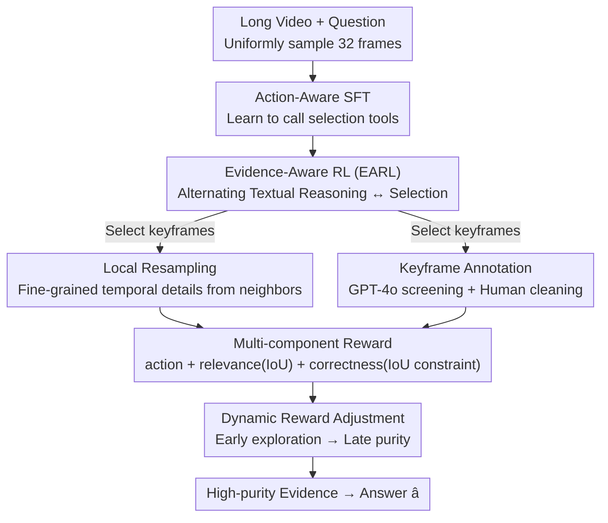

# Select Less, Reason More: Prioritizing Evidence Purity for Video Reasoning

**Conference**: CVPR 2026  
**Paper**: [CVF Open Access](https://openaccess.thecvf.com/content/CVPR2026/html/Li_Select_Less_Reason_More_Prioritizing_Evidence_Purity_for_Video_Reasoning_CVPR_2026_paper.html)  
**Code**: None  
**Area**: Multimodal VLM / Video Reasoning / Video Understanding  
**Keywords**: Long Video Reasoning, Video LLM, Pixel-space Reasoning, Evidence Purity, RL-based Frame Selection

## TL;DR
Addressing the issues where uniform sampling dilutes key evidence and existing frame selection lacks purity rewards, this paper proposes EARL (Evidence-Aware Reinforcement Learning). It enables Video LLMs to actively select keyframes during reasoning, performs local resampling around these frames to recover fine-grained temporal details, and utilizes an IoU-based multi-component reward to enforce "selecting less but better." The 7B model achieves 59.8%, 69.0%, and 64.9% on LongVideoBench, MVBench, and VideoMME respectively, setting a new SOTA for open-source Video LLMs.

## Background & Motivation
**Background**: Video LLMs (Video Large Language Models) have significantly advanced video understanding by combining visual feature extraction with LLM reasoning. However, processing long videos (minutes to hours) faces a practical engineering constraint: limited visual context windows. Consequently, almost all methods first perform **uniform sampling**, compressing the video into a fixed set of 32 or several hundred frames before feeding them into the model.

**Limitations of Prior Work**: Uniform sampling has two major flaws. First is **Information Dilution**: key evidence required for answering questions might exist in only a few frames; uniform sampling fills the context window with redundant frames, drowning out critical clues. Second is **Insufficient Temporal Granularity**: once sampling is complete, the model can only search within pre-sampled frames and cannot access fine-grained details in sampling gaps (e.g., transition frames between keyframes necessary for "at which second did an action occur" questions).

To mitigate these, the community has explored two paths. One is **Text-space Reasoning**: treating visual input as a fixed starting point and relying on Chain-of-Thought (CoT) quality. However, if the initial sampling is poor, the model is helpless. The other is **Pixel-space Reasoning** ("Thinking with Images"): allowing the model to actively interact with the video and iteratively request visual information. The latter is further divided into multi-agent (e.g., Video-RAG using external retrieval) and end-to-end agents (e.g., Pixel Reasoner, VITAL, FrameMind using RL to train active selection).

**Key Challenge**: Existing end-to-end agent methods share a fatal weakness: they only reward the **coarse action** of "selecting frames" without **verifying if the selected frames are correct or pure**. A model might receive rewards even if it selects irrelevant frames, leaving evidence purity unmonitored. Furthermore, methods like Pixel Reasoner are restricted to pre-sampled frames, unable to reach finer temporal resolutions. In short: **Lack of evidence purity rewards + inaccessible fine-grained temporal data** are the two gaps this paper aims to fill.

**Core Idea**: The authors' philosophy is **"Select Less, Reason More"**—trading cleaner, high-density relevant evidence for stronger reasoning. Specifically, the "which frames to select" process is treated as a core reasoning step in pixel space. The model dynamically identifies critical sparse frames and then performs **local resampling** around them to recover details. Training utilizes a multi-component reward system (EARL) centered on IoU to push the model toward the "minimal and purest" evidence set.

## Method
The method involves two-stage training: first, **Action-Aware Supervised Fine-Tuning (SFT)** to teach the model basic "tool calling and multi-step reasoning" behaviors; second, **Evidence-Aware Reinforcement Learning (EARL)** to refine these capabilities into a high-precision, high-purity adaptive strategy. During inference, the model alternates between "textual reasoning ↔ frame selection." Each selection triggers local resampling, merging refreshed high-granularity frames into the current step to form a multimodal CoT.

### Overall Architecture
Input consists of video $V=\{v_1,\dots,v_M\}$ and question $Q$. The model first uniformly samples $V$ to obtain the current visual context $V_{current}$ (up to 32 frames). It generates a trajectory $y=[y_1,\dots,y_n,\hat a]$, where each $y_t$ is either textual reasoning or a **frame selection action**, and $\hat a$ is the final answer. Upon selecting a subset $F_{select}\subset V_{current}$, the system automatically performs local resampling: for each selected frame, a temporal interval $\tau_i$ is defined between it and its nearest neighbors. Up to $N_{max}=16$ frames are sampled from these intervals to form $F_{refine}$, and $V_{current}\leftarrow F_{refine}$. Visual features of new frames are concatenated into the current step $y_t\leftarrow \text{concat}(y_t, f_{frame}(F_{refine}))$. To ensure efficiency, a maximum of 2 dynamic selections is allowed per prompt.

### Key Designs

**1. Local Resampling: Accessing Fine-Grained Temporal Details in Gaps**

A major limitation of current agents (e.g., Pixel Reasoner) is being restricted to pre-sampled frames. If the initial 32 frames miss a critical moment, the model cannot recover. This paper breaks this by making selection actions trigger an **automatic local resampling**. For every selected keyframe, the system defines temporal intervals $\tau_i$ with its neighbors and resamples up to 16 frames from these short segments. This transforms selection from a one-time discrete choice into a two-stage "coarse localization then neighborhood zoom-in"—obtaining denser evidence where needed without increasing the total frame budget. This is the physical source of *Reason More*.

**2. Keyframe Annotation: Providing the Gold Standard for "Pure Evidence"**

Rewarding evidence purity requires knowing which frames are truly critical. A hybrid annotation pipeline creates the gold standard $F_{gold}$: Video frames, questions, and answers are fed to GPT-4o with a prompt to produce initial keyframe indices $F_{key}$, constrained to $|F_{key}|\in\{1,2,\dots,8\}$. Human reviewers then remove irrelevant frames $F_{irrelevant}$ to get $F_{gold}=F_{key}\setminus F_{irrelevant}$. This "model screening + human cleaning" ensures both scale and purity, supporting the IoU rewards for two rounds of selection.

**3. Multi-component Reward: Driving "Select Less, Purer, and Correct"**

The core of EARL is the combination of three reward components. **Action Reward** $r_{action}$ addresses the degradation where models avoid selection due to uncertainty—providing a small fixed reward if any selection occurs (1 if selected, 0 otherwise). **Relevance Reward** $r_{relevance}$ directly rewards purity, measured by the IoU between selected frames $F_{selected}$ and $F_{gold}$:

$$\text{IoU}=\frac{|F_{selected}\cap F_{gold}|}{|F_{selected}\cup F_{gold}|},\quad r_{relevance}=\text{IoU}\in[0,1]$$

IoU simultaneously penalizes "missing keyframes" (smaller intersection) and "selecting irrelevant frames" (larger union), naturally pushing the model toward the "minimal and purest" set—achieving *Select Less*. **Correctness Reward** $r_{correct}$ binds selection quality to the task goal, considering both accuracy and evidence purity:

$$r_{correct}=\begin{cases}1 & \hat a=a^* \text{ and } \text{IoU}\ge 0.5\\ 0.5 & \hat a=a^* \text{ but } \text{IoU}<0.5\\ -1 & \hat a\ne a^*\end{cases}$$

This IoU constraint prevents "getting the right answer for the wrong reasons" by ensuring the correct answer stems from high-purity evidence.

**4. Dynamic Reward Sensitivity: Transitioning from Exploration to Purity**

Strict purity requirements at the start might stifle exploration. The paper uses a dynamic adjustment based on training progress $\text{Progress}=t/T$: Early stages ($\text{Progress}\le P$) use a larger action coefficient $\alpha_{early}$ and smaller relevance coefficient $\beta_{early}$ to encourage boldness. Later stages ($\text{Progress}>P$) decrease $\alpha$ and increase $\beta$ to focus on the purity and precision required by IoU. The total reward is:

$$r_{total}=r_{correct}+\alpha(t)\cdot r_{action}+\beta(t)\cdot r_{relevance}$$

This curriculum-style scheduling ensures stable convergence without killing valuable early-stage exploration.

### Loss & Training
The SFT stage minimizes standard cross-entropy on $D_{SFT}$ (containing QA pairs and reasoning trajectories with selection actions):

$$L_{SFT}=-\sum_{(x_i,y_i)\in D_{SFT}}\log P_\theta(y_i\mid x_i)$$

Since SFT is limited by expert data quality and cannot distinguish optimal actions, RL is required. The RL stage maximizes expected total reward $\max_\theta \mathbb{E}_{x\sim D,\,y\sim\pi_\theta}[R(x,y)]$. The backbone is Qwen2.5-VL-7B-Instruct. SFT uses Open-R1 (3.8k samples, batch 128, lr $1\times10^{-6}$), and RL uses OpenRLHF (8.3k samples, cosine decay, 256 prompts/batch with 8 rollouts each).

## Key Experimental Results

### Main Results
Evaluation across five long video benchmarks. The 7B model sets the SOTA for open-source Video LLMs.

| Benchmark | Ours (7B/32 frames) | Qwen2.5-VL Baseline | Representative Competitors | Gain |
|------|------|------|------|------|
| MVBench | **69.0** | 62.6 | Pixel Reasoner 67.8 / FrameMind 64.2 | +6.4 vs baseline |
| VideoMME (Overall) | **64.9** | 53.6 | FrameMind 60.9 | +11.3 vs baseline |
| VideoMME (Long) | **57.8** | 44.7 | LongVA 47.6 (128f) / LongVILA 53.0 (256f) | Beats models with 100+ frames |
| LongVideoBench | **59.8** | 43.2 | LongVITA 58.8 (14B) | 7B beats 14B model |
| LVBench | **46.2** | 31.6 | Hour-LLaVA 45.6 | +14.6 vs baseline |

### Ablation Study
Removing EARL components to verify their necessity (Results on LongVideoBench / MVBench).

| Configuration | LongVideoBench | MVBench | Note |
|------|------|------|------|
| Ours (Full) | 59.8 | 69.0 | Full EARL |
| Ours w/o RL (SFT only) | 51.9 | 63.8 | Dropping entire RL results in -7.9 / -5.2 |
| Ours w/o RR (w/o Relevance Reward) | 56.8 | 67.1 | Noise introduced by redundant frames |
| Ours w/o IoU (Correctness as binary) | 57.8 | 69.0 | Selection quality drops |
| Ours w/o DA (Fixed reward ratio) | 58.4 | 68.3 | Fails to smooth transition to refinement |

### Key Findings
- **RL (EARL) contributes most**: SFT alone mimics suboptimal expert trajectories (51.9% on LongVideoBench). EARL elevates this to 59.8% (+7.9), proving multi-component rewards are essential for high-quality selection.
- **Relevance Reward as a Purity Filter**: Without it, LongVideoBench drops from 59.8% to 56.8% because redundant frames occupy the context window and introduce temporal interference.
- **IoU Constraint Prevents "Guessing"**: Without the IoU constraint in the correctness reward, the model selects non-critical frames while still receiving rewards, leading to a collapse in evidence purity.
- **Less is More**: The 32-frame model outperforms LongVA and LongVILA (128/256 frames) on VideoMME (Long), validating that "intelligent evidence-aware selection > simply stacking frames."

## Highlights & Insights
- **Selection as a Core Reasoning Step**: Previously a pre-processing step, selection is elevated to a pixel-space reasoning task. Evidence acquisition and answering strategies are jointly optimized end-to-end.
- **IoU Strategy**: Using IoU for relevance rewards addresses both "omission" and "redundancy," turning abstract "purity" into a continuous [0,1] signal—the most elegant part of the reward design.
- **Local Resampling for Granularity**: Instead of increasing global frame budgets, it uses "keyframe neighborhood zoom-in" to obtain fine-grained timestamps, saving context while maintaining precision.
- **Curriculum Reward Scheduling**: The dynamic shift from exploration to purity is a practical RL insight to prevent premature convergence to suboptimal policies.

## Limitations & Future Work
- **Heavy Dependency on Gold Standards**: Rewards rely on $F_{gold}$ derived from GPT-4o and human cleaning. Annotation costs and subjectivity (ambiguity of "key frames") limit scalability to new domains.
- **Hard Limit on Selection Rounds**: Maximum of 2 selections and 16 resampled frames might be insufficient for hyper-complex problems requiring scattered evidence.
- **Single Backbone Validation**: Tested only on 7B/Qwen2.5-VL. Generalization to larger or heterogeneous Video LLMs and the overhead of resampling in ultra-long videos (hours) remain unexplored.

## Related Work & Insights
- **vs Pixel Reasoner**: Both use end-to-end RL agents, but Pixel Reasoner is limited to pre-sampled frames and coarse action rewards. Ours adds local resampling and IoU-enforced purity.
- **vs FrameMind / VITAL**: While these can select frames in intervals, they lack a purity reward to verify if selected frames actually aid in answering.
- **vs Video-RAG (Multi-agent)**: Video-RAG uses external retrieval and decoupled components. Ours provides a unified, end-to-end optimization of the entire "reasoning + selection" strategy.
- **vs Text-space Reasoning (e.g., Video-R1)**: Those methods rely on fixed visual inputs and CoT quality. This paper turns the Video LLM into an "active interrogator of evidence."

## Rating
- Novelty: ⭐⭐⭐⭐ Explicitly defining "evidence purity" as an IoU reward and using local resampling for granularity are substantial extensions to pixel-space video reasoning.
- Experimental Thoroughness: ⭐⭐⭐⭐ Five benchmarks and four component ablations provide strong evidence, though validation is limited to a single 7B backbone.
- Writing Quality: ⭐⭐⭐⭐ Clear motivation-to-figure correspondence, complete formulas, and well-explained reward designs.
- Value: ⭐⭐⭐⭐ Proving that a 32-frame model can beat 100+ frame models through purity has high practical value for resource-constrained long video reasoning.

<!-- RELATED:START -->

## Related Papers

- [\[CVPR 2026\] Conan: Progressive Learning to Reason Like a Detective over Multi-Scale Visual Evidence](conan_progressive_learning_to_reason_like_a_detective_over_multi-scale_visual_ev.md)
- [\[ICLR 2026\] More Thought, Less Accuracy? On the Dual Nature of Reasoning in Vision-Language Models](../../ICLR2026/vlm_reasoning/more_thought_less_accuracy_on_the_dual_nature_of_reasoning_in_vision-language_mo.md)
- [\[CVPR 2026\] Reinforce to Learn, Elect to Reason: A Dual Paradigm for Video Reasoning](reinforce_to_learn_elect_to_reason_a_dual_paradigm_for_video_reasoning.md)
- [\[CVPR 2026\] Perceptual-Evidence Anchored Reinforced Learning for Multimodal Reasoning](perceptual-evidence_anchored_reinforced_learning_for_multimodal_reasoning.md)
- [\[CVPR 2026\] See Less, See Right: Bi-directional Perceptual Shaping For Multimodal Reasoning](see_less_see_right_bi-directional_perceptual_shaping_for_multimodal_reasoning.md)

<!-- RELATED:END -->
