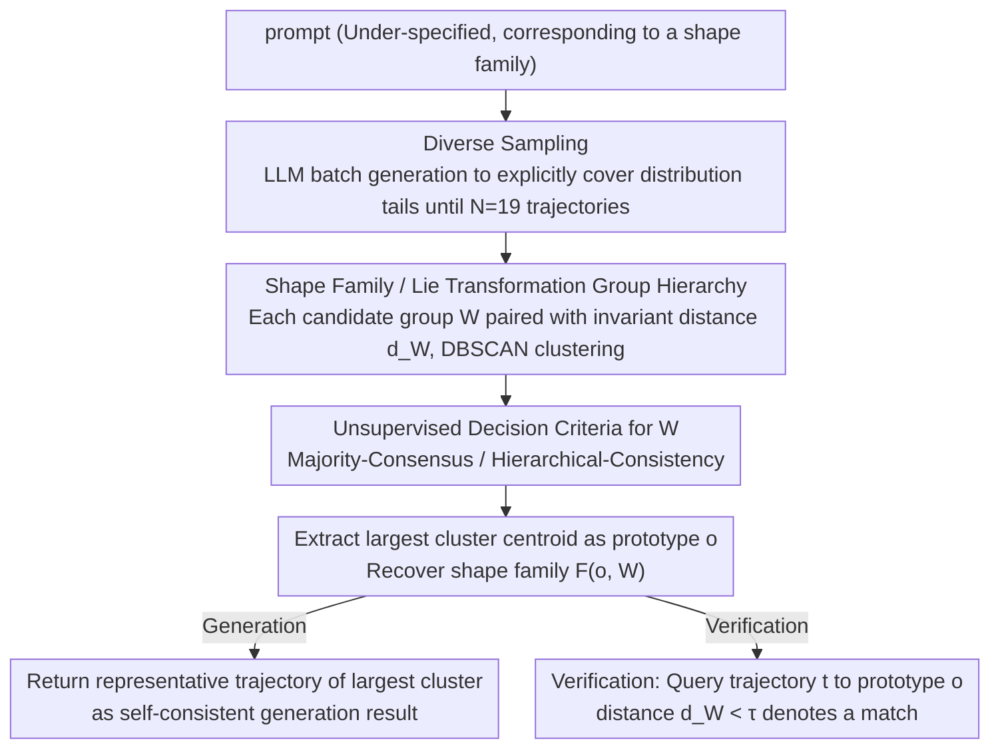

# Self-Consistency for LLM-Based Motion Trajectory Generation and Verification

**Conference**: CVPR2026  
**arXiv**: [2603.29301](https://arxiv.org/abs/2603.29301)  
**Code**: [majiaju.io/trajectory-self-consistency](https://majiaju.io/trajectory-self-consistency)  
**Area**: Multimodal VLM  
**Keywords**: Self-consistency, motion trajectory, geometric transformation groups, shape families, unsupervised verification

## TL;DR
Extends the self-consistency paradigm of LLMs from natural language reasoning to the visual domain—defining shape families of motion trajectories via a hierarchy of Lie transformation groups. By clustering multiple trajectories sampled from LLMs under transformation-invariant distance metrics, it achieves unsupervised improvements in trajectory generation (+4-6%) and verification (+11.8% precision) without training.

## Background & Motivation
**Self-consistency** is an effective technique in the LLM reasoning field: multiple samplings → find the most consistent answer. In text domains like mathematical reasoning, consistency checking is straightforward (direct comparison of numerical values). However, LLMs are also widely used to generate visual outputs (SVG, 3D scenes, animations, etc.). How can self-consistency be extended to the visual domain?

**Key Challenge**: It is nearly impossible for two outputs in the visual domain to match at the pixel level. A deeper reason is the **under-specification** of prompts—a description like "move the circle in a logarithmic spiral path" does not describe a single trajectory, but a **shape family** (containing all logarithmic spirals with different positions, sizes, and orientations). Therefore, it is necessary to define when two trajectories should be considered "consistent."

**Core Idea**: Model the shape family as a prototype trajectory plus a geometric transformation group (rigid, similarity, affine, etc.). Two trajectories are considered consistent if they can be transformed into each other under a transformation allowed by the group. The shape family is automatically recovered using a hierarchy of transformation groups.

## Method

### Overall Architecture
The objective is to "transfer the self-consistency of LLMs from the text domain to the visual domain." While judging consistency in text is simple (numerical equality), visual outputs rarely match at the pixel level, and prompts like "move along a logarithmic spiral" are inherently under-specified—describing a whole **shape family** rather than a single trajectory. The overall mechanism is as follows: given a prompt, $N$ diverse trajectories are first sampled using an LLM; then, these are clustered using transformation-invariant distance metrics within a Lie transformation group hierarchy; a decision criterion is applied to select the most suitable transformation group; finally, the centroid of the largest cluster is taken as the self-consistent generation result, or a query trajectory is checked against this shape family for verification.

### Key Designs

**1. Diverse Sampling Strategy: Forcing the LLM to cover the tails of the distribution**

The first step of the pipeline is collecting a pool of candidate trajectories. For clustering to be effective, candidates must be sufficiently dispersed. If independent repeated sampling is used, LLMs tend to repeatedly yield high-probability "safe" trajectories, failing to cover the boundaries of the shape family. This method instead requests $k$ trajectories at once from the LLM with an explicit instruction to cover the "tails" of the distribution, sampling in batches until $N=19$ trajectories are reached, ensuring diverse candidates support the identification of a true majority cluster.

**2. Shape Families and Lie Transformation Group Hierarchy: Redefining consistency via "equivalence classes"**

Consistency in the visual domain can no longer rely on identity matching; this is the core mechanism for extending self-consistency to the geometric domain. The paper defines a shape family as a prototype trajectory plus a transformation group $\mathcal{F}(o, W) = \{w(o) | w \in W\}$, arranging these groups in a hierarchical chain: rigid $SE(2)$ $\subset$ rigid+reflection $E(2)$ $\subset$ similarity $Sim^+(2)$ $\subset$ similarity+reflection $Sim(2)$ $\subset$ affine $Aff(2)$, among others. Each group is associated with a transformation-invariant distance metric $d_W(t_1, t_2) = \min_{w \in W} \frac{1}{n}\sum_i \|w(t_{1,i}) - t_{2,i}\|^2$, solved via generalized ICP. If two trajectories can be mapped to each other under the group's allowed transformations, their distance is zero, indicating consistency. Distances between all $N$ sampled trajectories are calculated for DBSCAN clustering.

**3. Two Unsupervised Decision Criteria: Balancing between strict and loose groups**

Selecting the appropriate group from the hierarchy directly impacts the balance between recall and precision without available labels. Two complementary criteria are proposed: Majority-Consensus starts from the strictest group and selects the first one where the largest cluster exceeds 50% of the samples; it is conservative and yields high precision. Hierarchical-Consistency starts from the loosest group and selects the strictest group that does not lose members from the largest cluster, providing a better balance between precision and recall. Experiments show that when they fail, the former chooses a group that is too strict (95.6% of cases), while the latter chooses one that is too loose (80.6% of cases).

**4. Verification: Turning "prompt matching" into a well-defined geometric judgment**

Once the shape family $\mathcal{F}(o, W)$ is recovered, verifying whether a query trajectory $t$ matches the prompt becomes a task of calculating its distance to prototype $o$ under metric $d_W$ and checking if it is below a threshold $\tau$. Because member checking is a clean geometric problem once the shape family is fixed, the advantages of self-consistency are even more pronounced in verification tasks than in generation.

### Loss & Training
- **Completely unsupervised and training-free**, requiring only LLM API access.
- Hyperparameters: $N=19$ samples, $n=100$ point resampling, $\tau$ as the clustering threshold (robust, F1 varies only 7.2% across a $32 \times$ range).
- Average distance calculation time: 67ms (CPU).

## Key Experimental Results

### Main Results

**Trajectory Generation Accuracy**

| Method | Decision Criterion | GPT-4.1 | GPT-5 |
|------|---------|---------|-------|
| LLM-Direct | - | 62.1% | 79.1% |
| Ours | Majority-Consensus | **68.0%** | **83.3%** |
| Ours | Hierarchical-Consistency | 66.7% | 82.6% |
| Ours | Oracle (Known Ground-truth $W$) | 68.5% | 83.5% |

**Trajectory Verification**

| Method | Precision | Recall | F1 |
|------|-----------|--------|-----|
| GPT-4.1 (VLM) | 62.0 | 96.9 | 75.6 |
| GPT-5 (VLM) | 74.0 | 84.7 | 79.0 |
| Ours (Majority-Consensus) | **85.8** | 66.1 | 74.6 |
| Ours (Hierarchical-Consistency) | 80.5 | 89.0 | **84.6** |
| Ours (Oracle) | 87.9 | 83.3 | 85.6 |

### Ablation Study

| Configuration | Key Metric | Description |
|------|---------|------|
| $N=10$ Samplings | F1 near saturation | 10 samples provide sufficient signal |
| $\tau$ scan 0.25-8.0 | F1 varies 7.2% | Insensitive to threshold |
| Multi-prototype improvement | F1: 71.0 $\rightarrow$ 88.9 | Allows returning multiple clusters for ambiguous prompts |

### Key Findings
- Unsupervised Majority-Consensus approaches the Oracle upper bound (68.0 vs 68.5 for GPT-4.1).
- GPT-4.1 as a VLM verifier is heavily biased toward "True" (90% positive prediction rate vs. 50% ground truth), leading to only 62% precision.
- Self-consistency verification precision is 11.8% higher than the VLM baseline (85.8 vs 74.0).
- Majority-Consensus failures are 95.6% due to over-strict groups; Hierarchical-Consistency failures are 80.6% due to over-loose groups—the two are complementary.
- Performance remains stable for $N \geq 10$, eliminating the need for excessive sampling.

## Highlights & Insights
- **Generalizing self-consistency from discrete to continuous geometric domains**: Using transformation groups to define "consistency" instead of simple identity matching is a major conceptual advancement.
- **Clever utilization of Lie group hierarchies**: Different shape families require different transformation groups; the hierarchy provides a framework for unsupervised automatic selection.
- **Unique finding that Verification > Generation**: The advantage of self-consistency is greater in verification because member checking is a well-defined geometric problem once the shape family is recovered.
- Provides a VLM-independent path for automatic evaluation and verification of LLM visual outputs.

## Limitations & Future Work
- Only handles shape families that can be described by a single prototype and transformation group; inapplicable to highly ambiguous descriptions (e.g., "curved path").
- Multi-prototype scenarios (e.g., heptagrams $\{7/2\}$ and $\{7/3\}$) require specialized handling.
- ICP-based distance calculation is somewhat sensitive to noise and discretization errors.
- Only verifies the geometry of the trajectory, excluding other animation attributes like velocity and timing.

## Related Work & Insights
- **vs. Original Self-Consistency**: The original method supports only discrete identity matching (exact equality); this work generalizes consistency to transformation-invariant distances in a continuous domain.
- **vs. MoVer**: MoVer uses first-order logic DSL to verify low-level animation properties but cannot represent geometric shape families.
- **Insight**: The approach of extending self-consistency via domain-specific "equivalence classes" can be generalized to other visual/creative domains such as 3D generation and music.

## Rating
- Novelty: ⭐⭐⭐⭐⭐ Extremely high conceptual innovation; elegant design of Lie group hierarchies and decision criteria.
- Experimental Thoroughness: ⭐⭐⭐⭐ Synthetic benchmark with 224 prompts and 2240 verification trajectories; complete comparison across LLMs and criteria, though limited to synthetic data.
- Writing Quality: ⭐⭐⭐⭐⭐ Precise mathematical definitions, clear intuition, and excellent illustrations.
- Value: ⭐⭐⭐⭐ Establishes a new paradigm for automatic verification of LLM visual generation, though current application to motion trajectories is specific.

<!-- RELATED:START -->

## Related Papers

- [\[CVPR 2026\] Unified Generation and Self-Verification for Vision-Language Models via Advantage Decoupled Preference Optimization](unified_generation_and_self-verification_for_vision-language_models_via_advantag.md)
- [\[ACL 2026\] iReasoner: Trajectory-Aware Intrinsic Reasoning Supervision for Self-Evolving Large Multimodal Models](../../ACL2026/vlm_reasoning/ireasoner_trajectory-aware_intrinsic_reasoning_supervision_for_self-evolving_lar.md)
- [\[ICLR 2026\] Let's Think in Two Steps: Mitigating Agreement Bias in MLLMs with Self-Grounded Verification](../../ICLR2026/vlm_reasoning/lets_think_in_two_steps_mitigating_agreement_bias_in_mllms_with_self-grounded_ve.md)
- [\[ICLR 2026\] TimeSearch-R: Adaptive Temporal Search for Long-Form Video Understanding via Self-Verification Reinforcement Learning](../../ICLR2026/vlm_reasoning/timesearch-r_adaptive_temporal_search_for_long-form_video_understanding_via_self.md)
- [\[ICLR 2026\] Vid-LLM: A Compact Video-based 3D Multimodal LLM with Reconstruction–Reasoning Synergy](../../ICLR2026/vlm_reasoning/vid-llm_a_compact_video-based_3d_multimodal_llm_with_reconstructionreasoning_syn.md)

<!-- RELATED:END -->
