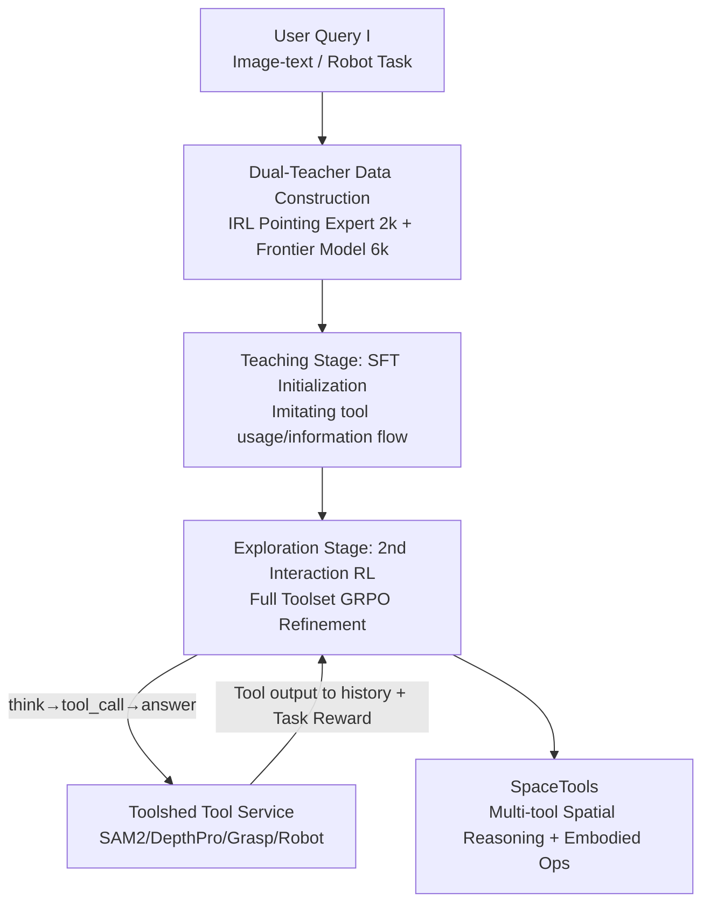

# SpaceTools: Tool-Augmented Spatial Reasoning via Double Interactive RL

**Conference**: CVPR 2026  
**arXiv**: [2512.04069](https://arxiv.org/abs/2512.04069)  
**Code**: Yes (Project Page / Code, paper notes Toolshed as open-source)  
**Area**: Multimodal VLM / Agent / Spatial Reasoning / Tool Augmentation / Reinforcement Learning  
**Keywords**: Tool-Augmented Reasoning, Spatial Reasoning, Double Interactive RL, GRPO, Embodied Manipulation

## TL;DR
This paper proposes **DIRL (Double Interactive Reinforcement Learning)**. The approach utilizes a mixture of data from a "single-tool expert IRL teacher + frontier model full-tool teacher" for initial SFT, followed by a second round of interactive RL refinement using the full toolset. This process trains a 3B Qwen2.5-VL into SpaceTools, a spatial reasoning agent capable of autonomously scheduling over ten vision/robotics tools. It achieves SOTA across benchmarks like RoboSpatial, BLINK, and BOP-ASK, and successfully controls a real 7-DOF robotic arm as a tool for pick-and-place tasks (86% success rate).

## Background & Motivation
**Background**: VLMs are highly proficient in open-ended visual QA but require "metric-level precision" for embodied applications such as robotics—judging relative positions, distances, occlusions, orientations, poses, and graspability. Prevailing methods involve fine-tuning on task-specific datasets (SpatialVLM, RoboRefer, etc.), where adding a new low-level perception capability (depth, pointing, 3D perception) requires large-scale annotation and architectural changes.

**Limitations of Prior Work**: The fine-tuning route relies on scaling data and model modifications, leading to poor scalability. An elegant alternative is allowing VLMs to **call off-the-shelf vision/robotics tools** (depth estimation, segmentation, pose estimation, grasp generation) to assist reasoning with precise outputs. However, existing tool-augmented methods either rely on manual prompting or hard-coded tool pipelines (SpatialPIN, APC), both of which are training-free and limit the model's ability to discover optimal tool usage autonomously.

**Key Challenge**: While RL could theoretically allow models to learn tool use autonomously, works like ViGoRL only perform interactive RL on **single** lightweight tools (e.g., cropping). When RL is scaled to 10+ heterogeneous tools, the action space suffers from a combinatorial explosion, and naive exploration fails to find effective policies—a fundamental obstacle for multi-tool RL. Additionally, there are system-level challenges: how to provide high-throughput online access to computationally heavy tools like SAM2 or Depth Pro during training.

**Goal**: (1) Design a training paradigm that converges stably in multi-tool scenarios; (2) Build infrastructure capable of serving heavy vision tools in real-time within the training loop.

**Key Insight**: The authors observe that **RL with a single pointing tool is solvable and teaches grounding, while multi-tool RL refines diverse reasoning but requires good initialization**. Thus, the problem is decomposed into two sequential, solvable stages: teaching basic tool usage first, and then opening up exploration.

**Core Idea**: Use interactive RL **twice** (DIRL). The first round (hidden within the teacher) trains a single-tool expert for distillation, and the second round performs interactive RL refinement directly on the full toolset. SFT is used in between to transfer trajectories from both teachers to the base model for initialization, thereby bypassing exploration collapse in multi-tool RL.

## Method

### Overall Architecture
SpaceTools models spatial reasoning as **sequential decision-making**: a VLM policy $\pi_\theta$ receives a user query $\mathcal{I}$ (image-text pair or robot task) and engages in multi-round interaction using a structured format of `<think>` (reasoning) / `<tool_call>` (calling tools) / `<answer>` (final answer). Each round appends tool outputs back to the history $h_t$ until an answer is produced or the maximum number of rounds $T_{\max}$ is reached (Algorithm 1).

The DIRL training paradigm consists of two serial stages. **Teaching Stage**: Construct a teaching dataset of 8k trajectories from two complementary teachers—a single-tool pointing expert (trained via IRL) contributing 2k grounded reasoning demonstrations, and a frontier model (Claude Sonnet 4.5) with full tool access contributing 6k correct trajectories. SFT is then performed on the base Qwen2.5-VL-3B to establish initial tool-use behavior. **Exploration Stage**: Starting from the SFT-initialized policy, all tools are enabled for continued interactive RL (IRL), using GRPO and KL regularization to refine toolchain scheduling based on feedback from real tool interactions. System interaction relies on **Toolshed**, a distributed tool-serving infrastructure that isolates heavy tools into on-demand services, decoupling them from the RL/inference loop for asynchronous scaling and high throughput.

### Key Designs

**1. DIRL Two-Stage Interactive RL: Decomposing Multi-Tool Exploration Collapse**

Directly applying RL to 10+ tools leads to an action space explosion and weak optimization signals. Pure SFT, however, fails to learn flexible coordination beyond training trajectories. DIRL's solution is using interactive RL twice. The first IRL **does not train the target model directly**; instead, it trains a single-tool expert using only a pointing tool (RoboRefer). Because the search space is restricted, IRL converges reliably and produces competitive grounded reasoning. These expert trajectories, combined with frontier model full-tool trajectories, are SFT-ed to the base model. The second IRL (Exploration Stage) then proceeds with the full toolset. Good initialization prevents exploration collapse, while interactive feedback further polishes the toolchain.

**2. Complementary Dual-Teacher Data: Grounding Precision + Multi-Tool Composition**

The two sources for the teaching dataset address different weaknesses. The **IRL Pointing Expert** (2k samples) focuses on fine-grained spatial grounding, teaching the critical first step of "point before querying other tools." Removing it causes a massive drop in tasks requiring fine-grained localization (RefSpatial 53.07 → 29.60). The **General Teacher** (Claude Sonnet 4.5, 6k samples) uses the full Toolshed set to demonstrate combinations like "segmentation + depth + 3D bbox," keeping only trajectories leading to correct answers. Removing it causes pose tasks to collapse from 34.37 to 8.92. Mixing them at a 1:3 ratio ensures both grounding precision and multi-tool synergy.

**3. Toolshed Infrastructure: Real-time Heavy Vision Tools in the RL Loop**

DIRL requires real-time, on-demand tool calls during training, a bottleneck in previous work. Toolshed solves this via: (1) Resource and environment isolation for each tool instance; (2) Decoupling tool execution from the policy inference loop; (3) Asynchronous parallel workers for each tool. Feeding **real and stochastic** tool outputs into the learning loop forces the model to reason about tool reliability and learn better querying and error recovery.

**4. Task-Specific Normalized Rewards: Unifying Heterogeneous Signals**

RL covers multiple task types, requiring normalization to $[0, 1]$. Multiple-choice questions use binary rewards $R_B \in \{0, 1\}$. 2D bounding boxes use Mean IoU $R_{\text{MIoU}} = \frac{1}{N} \sum_i \max_j \mathrm{IoU}(\hat{B}_i, B_j)$. Pointing uses Normalized Negative Centroid Distance $R_{\text{NNDC}} = \frac{\exp(-5d) - \exp(-5\sqrt{2})}{1 - \exp(-5\sqrt{2})}$. Pose tasks project 3D boxes into 8 2D corner points and calculate the IoU of the convex hulls. Grasping uses Normalized Negative Coordinate Error $R_{\text{NNCE}} = 1 - \frac{1}{\delta_{\max}} \min(\delta_{\max}, \frac{1}{N} \sum_i \frac{\|\hat{p}_i - p_i\|_2}{d})$.

### Loss & Training
The base model is Qwen2.5-VL-3B-Instruct. **Stage 1 (SFT)** uses cross-entropy next-token prediction loss on all assistant turns in multi-round dialogues (via LLaMA-Factory). **Stage 2 (IRL)** uses **GRPO**: for an input $\mathcal{I}$, $N$ parallel rollouts are generated. Rewards $r_1, \dots, r_N$ are used to optimize $\mathcal{L}_{\text{GRPO}}$ via group relative advantage, with KL regularization against a reference policy $\pi_{\text{ref}}$ (integrated into the VERL framework).

## Key Experimental Results

### Main Results
SpaceTools-3B achieves SOTA across multiple benchmarks, outperforming larger proprietary and specialized spatial VLMs:

| Model | RoboSpatial Overall | BLINK Depth | RefSpatial 2D Rel. | CVBench 3D Depth | BOP-ASK Pose | Grasp-SR |
| :--- | :--- | :--- | :--- | :--- | :--- | :--- |
| Claude Sonnet 4.5 | 57.43 | 78.23 | 07.49 | 78.50 | 01.67 | 48.33 |
| GPT-5 | 58.39 | 66.13 | 23.10 | 91.33 | 09.03 | 41.67 |
| Gemini-ER 1.5 | 62.50 | 69.23 | 41.72 | 90.50 | 00.00 | 23.33 |
| RoboRefer-8B-SFT | 59.43 | 88.71 | 48.37 | 96.50 | 00.00 | 00.00 |
| Qwen2.5-VL-3B Tool-free SFT | 58.00 | 80.65 | 20.22 | 83.33 | 02.44 | 35.00 |
| **SpaceTools-3B (Ours)** | **70.00** | **90.32** | **53.07** | 96.00 | **34.37** | **50.00** |

- SpaceTools-3B outperforms Gemini-ER 1.5 by +7.5% on RoboSpatial and GPT-5 by +8.3% on grasping.
- Tool-augmented training significantly outperforms tool-free fine-tuning, gaining **+12% to +16%** on RoboSpatial.

Real Robot Manipulation (Closed-loop perception-action):

| Model | Pick | Rel. Pick | Pick & Place | TTFM |
| :--- | :--- | :--- | :--- | :--- |
| $\pi 0.5$ (VLA) | 0 (0/7) | 0 (0/6) | 0 (0/14) | 1s |
| GPT-5 + Toolshed | 71 (5/7) | 33 (2/6) | 65 (9/14) | 36s |
| **SpaceTools (Ours)** | **86 (6/7)** | **83 (5/6)** | **86 (12/14)** | **10s** |

### Ablation Study

| Config | IRL-T | Univ-T | S2-IRL | RoboSpatial | RefSpatial | Pose | Mean |
| :--- | :---: | :---: | :---: | :--- | :--- | :--- | :--- |
| SpaceTools (Full) | ✓ | ✓ | ✓ | 70.00 | 53.07 | 34.37 | **52.48** |
| w/o IRL Teacher | ✗ | ✓ | ✓ | 61.14 | 29.60 | 34.29 | 41.68 |
| w/o Univ Teacher | ✓ | ✗ | ✓ | 65.14 | 54.51 | 8.92 | 42.86 |
| w/o Stage 2 IRL | ✓ | ✓ | ✗ | 67.71 | 51.98 | 33.28 | 50.99 |

## Highlights & Insights
- **The "Double RL" Decomposition**: The strategy of using a solvable sub-problem (single-tool RL) to initialize a difficult one (multi-tool RL) is a novel paradigm for agentic RL with large action spaces.
- **Learning from Stochasticity**: By exposing the model to real tool failures and noise during training, it learns error-correction behaviors (e.g., switching to a backup tool), which cannot be learned from fixed offline trajectories.
- **Small Models as Schedulers**: The core capability lies in tool orchestration rather than parameter count. This shifts the bottleneck of spatial reasoning from "model capacity" to "coordination strategy," facilitating the deployment of small embodied models.
- **Robotic Arm as a Tool**: Integrating perception and action tools into the same reasoning loop allows the language model to lead the closed loop, rather than treating robotic actions as an external black box.

## Limitations & Future Work
- **Reliance on Tool Quality**: The ceiling of the system is dictated by the performance of external tools like SAM2 or Depth Pro.
- **System Complexity**: The infrastructure required—distributed tool services, two-stage training, and dual-teacher data—presents a high engineering barrier.
- **Data Dependency**: The 6k teaching trajectories rely on Claude Sonnet 4.5, making the model's upper bound dependent on the frontier teacher.
- **Evaluation Scale**: Real robot experiments include a limited number of trials, necessitating further large-scale verification.

## Related Work & Insights
- **vs ViGoRL**: ViGoRL proved RL can teach a VLM to use a **single** vision tool (cropping). This work scales that to 10+ heterogeneous tools using the DIRL paradigm.
- **vs SpatialPIN / APC**: These use fixed, hard-coded tool pipelines. SpaceTools uses RL to autonomously **learn** tool selection, sequencing, and error recovery.
- **vs Tool NIRL**: Traditional NIRL requires ground-truth tool trajectories. SpaceTools' interactive IRL learns from task rewards alone through interaction, outperforming NIRL by 14.4 (Mean).

## Rating
- Novelty: ⭐⭐⭐⭐⭐ The DIRL strategy for solving tool exploration collapse is both novel and generalizable.
- Experimental Thoroughness: ⭐⭐⭐⭐⭐ Extensive coverage across 5 spatial benchmarks, real robot tasks, and detailed ablations.
- Writing Quality: ⭐⭐⭐⭐ Clear motivation; some system details are deferred to appendices.
- Value: ⭐⭐⭐⭐⭐ Demonstrates that a 3B model can outperform giant models via tool orchestration, providing a roadmap for small embodied agents.

<!-- RELATED:START -->

## Related Papers

- [\[CVPR 2026\] Thinking With Videos: Multimodal Tool-Augmented Reinforcement Learning for Long Video Reasoning](thinking_with_videos_multimodal_tool-augmented_reinforcement_learning_for_long_v.md)
- [\[CVPR 2026\] IPR-1: Interactive Physical Reasoner](ipr-1_interactive_physical_reasoner.md)
- [\[CVPR 2026\] Stable and Efficient Single-Rollout RL for Multimodal Reasoning](stable_and_efficient_single-rollout_rl_for_multimodal_reasoning.md)
- [\[CVPR 2026\] Think with 3D: Geometric Imagination Grounded Spatial Reasoning from Limited Views](think_with_3d_geometric_imagination_grounded_spatial_reasoning_from_limited_view.md)
- [\[CVPR 2026\] CodeV: Code with Images for Faithful Visual Reasoning via Tool-Aware Policy Optimization](codev_code_with_images_for_faithful_visual_reasoning_via_tool-aware_policy_optim.md)

<!-- RELATED:END -->
