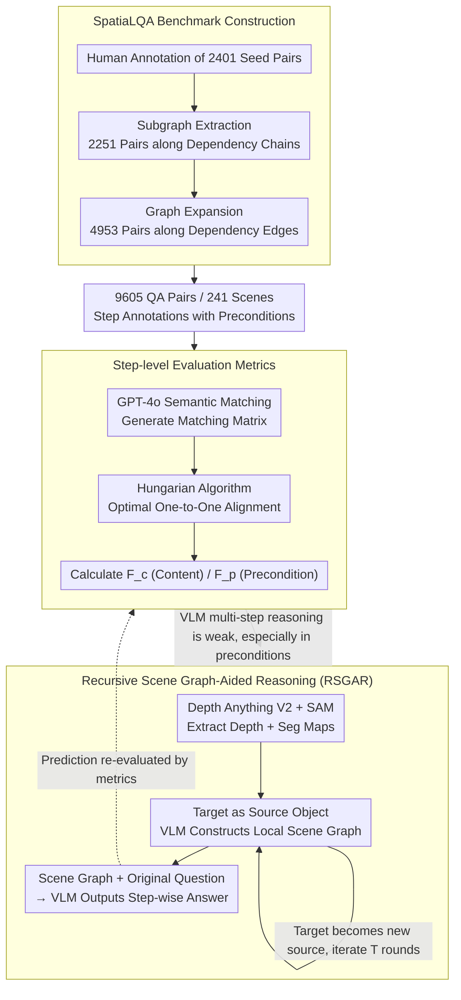

# SpatiaLQA: A Benchmark for Evaluating Spatial Logical Reasoning in Vision-Language Models

**Conference**: CVPR 2026  
**arXiv**: [2602.20901](https://arxiv.org/abs/2602.20901)  
**Code**: [https://github.com/xieyc99/SpatiaLQA](https://github.com/xieyc99/SpatiaLQA)  
**Area**: Multimodal VLM  
**Keywords**: Spatial Logical Reasoning, VLM Benchmark, Scene Graph, Indoor Scene Understanding, Multi-step Reasoning

## TL;DR
The SpatiaLQA benchmark is proposed (9,605 QA pairs, 241 real indoor scenes) to systematically evaluate 41 VLMs on spatial logical reasoning. A Recursive Scene Graph-Aided Reasoning (RSGAR) method is designed to enhance the spatial logical reasoning capabilities of VLMs.

## Background & Motivation
**Background**: VLMs have achieved impressive results in general VQA and logical reasoning tasks. However, they still struggle with complex real-world scenarios that require a combination of spatial understanding and multi-step logical reasoning.

**Limitations of Prior Work**: Existing benchmarks either focus on spatial understanding (e.g., SpatialRGPT-Bench) or logical reasoning (e.g., MathVista), lacking an evaluation system that integrates both. Meanwhile, EQA tasks focus on action execution rather than pure vision-semantic reasoning.

**Key Challenge**: Spatial logical reasoning requires models to simultaneously possess precise spatial perception and rigorous multi-step causal reasoning. The fusion of these two capabilities has not been systematically studied in existing VLMs.

**Goal**: (a) Construct a comprehensive spatial logical reasoning benchmark; (b) Systematically evaluate the performance of existing VLMs on this task; (c) Propose improvement methods.

**Key Insight**: Decompose complex scenes into task-related scene graphs, allowing the VLM to focus on the spatial environment surrounding the target objects.

**Core Idea**: Use a recursive scene graph construction method to progressively decompose complex indoor scenes into task-related spatial relationship graphs, enhancing the multi-step spatial reasoning capabilities of VLMs.

## Method

### Overall Architecture
This paper addresses the question: when a VLM needs to both "accurately perceive" spatial layouts and "clearly reason" through multi-step causality, where does it fall short, and how can it be improved? To this end, it establishes a benchmark named SpatiaLQA to quantify this "spatial logical reasoning" capability and proposes an inference-time enhancement method to address the weaknesses exposed by the evaluation.

The pipeline operates as follows: given an indoor scene image and a question requiring multi-step spatial reasoning, the system first extracts depth maps and segmentation maps as geometric cues using vision foundation models. It then recursively builds a scene graph using target objects in the question as anchors. Finally, this graph, along with the original question, is fed into the VLM to produce a sequence of logically coherent operation steps as the answer. The benchmark handles "question generation and scoring," while the method focuses on "helping the VLM solve the questions correctly."

### Key Designs

**1. SpatiaLQA Benchmark: Scaling Human Annotations via Logical Dependency Relations**

The cost of manual annotation for spatial logical reasoning QA is extremely high. Since the core of such problems is the logical dependency between steps, the authors use "dependencies" as a lever for augmentation. Data collection progresses in three stages: first, 2,401 seed pairs are manually annotated; then, subgraph extraction is used to cut self-consistent sub-reasoning chains from existing annotations to obtain 2,251 pairs; finally, graph expansion adds new nodes along dependency edges to generate 4,953 pairs, totaling 9,605 QA pairs across 241 real indoor scenes. Both subgraph extraction and graph expansion follow logical dependency structures, ensuring the augmented questions remain self-consistent in their step-wise relationships.

**2. Step-level Evaluation Metrics: Semantic Matching and Optimal Alignment for Open-ended Answers**

The answer to a spatial logical reasoning task is a sequence of open-ended operation steps where wording and order may vary, making traditional overall accuracy ineffective. The authors split scoring into two steps: first, GPT-4o generates a semantic matching matrix between predicted and annotated steps to determine which steps describe the same action; then, the Hungarian algorithm finds the optimal one-to-one matching on this matrix to avoid multiple hits on a single ground-truth step. After alignment, precision and recall are calculated for "step content" and "step preconditions," resulting in Content F1 ($F_c$) and Precondition F1 ($F_p$). Evaluating preconditions separately specifically tests whether the model understands dependencies between steps rather than just matching actions.

**3. Recursive Scene Graph-Aided Reasoning (RSGAR): Decomposing Complex Scenes into Focused Local Subgraphs**

Feeding an entire complex scene to a VLM often leads to missing key spatial relationships. RSGAR allows the model to expand outward step-by-step along the spatial structure, similar to a Chain-of-Thought approach. It utilizes Depth Anything V2 and SAM for depth and segmentation information, starting with the object specified in the question as the initial source object. The VLM identifies target objects in direct contact with the current source and their spatial relationships, recording them as nodes and edges in a scene graph. The newly added objects then become source objects for the next round of expansion, continuing until a maximum number of iterations is reached. In each round, the model only focuses on a small sub-problem: the "local spatial neighborhood of the current object." For example, if a question is anchored on a "cup on the table," the first round might expand to "cup-on-table" and "table-against-wall," and the second round extends from the table to adjacent chairs and the floor. Experiments show that as the number of iterations $T$ increases, the scene graph covers more spatial information and $F_c$/$F_p$ scores improve (default $T=5$). The gains from RSGAR are most prominent in complex samples with many steps, validating that "step-wise decomposition" is more effective than processing the whole scene at once.

### Loss & Training
RSGAR is a pure inference-time method that requires no additional training. It leverages pre-trained VLMs and vision foundation models (Depth Anything V2, SAM) to enhance reasoning.

## Key Experimental Results

### Main Results

| Model | $F_c$ (Content F1) | $F_p$ (Precondition F1) |
|------|---------------|-------------------|
| Human | 97.6 | 92.5 |
| GPT-4o | 52.5 | 19.2 |
| Claude 3.5 Sonnet | 46.3 | 15.8 |
| Gemini 2.0 Flash | 44.1 | 14.7 |
| GPT-4o + RSGAR | **56.8** | **22.4** |
| InternVL2-26B | 38.2 | 12.1 |

### Ablation Study

| Configuration | $F_c$ | $F_p$ | Description |
|------|-------|-------|------|
| GPT-4o (baseline) | 52.5 | 19.2 | No scene graph aid |
| + Depth Map | 53.8 | 20.1 | Depth info only |
| + Seg Map | 54.2 | 20.5 | Segmentation info only |
| + RSGAR (1 round) | 55.1 | 21.3 | Single-round scene graph |
| + RSGAR (3 rounds) | 56.8 | 22.4 | 3-round recursion, best performance |

### Key Findings
- Even the strongest model, GPT-4o, achieves an $F_c$ of only ~52.5% on spatial logical reasoning, showing a huge gap compared to the human performance of 97.6%.
- All VLMs perform significantly worse on precondition reasoning $F_p$, indicating that understanding dependencies between steps is a core challenge.
- As the number of steps in the answer increases, model performance drops sharply, identifying multi-step reasoning as a bottleneck.
- The RSGAR method provides consistent improvements across multiple VLMs, validating the effectiveness of scene graph decomposition.

## Highlights & Insights
- **Ingenious Evaluation System**: Using GPT-4o for semantic matching combined with the Hungarian algorithm for optimal alignment solves the evaluation problem for open-ended multi-step answers. This two-stage paradigm is transferable to other multi-step reasoning tasks.
- **Recursive Scene Graph Decomposition**: Converts end-to-end complex spatial reasoning into step-by-step focused sub-problem solving, functioning as a spatial version of Chain-of-Thought while utilizing complementary capabilities of vision foundation models.
- **Data Augmentation Strategy**: Subgraph extraction and graph expansion efficiently generate large-scale training data from limited annotations while maintaining logical consistency.

## Limitations & Future Work
- The benchmark only covers indoor scenes; complex outdoor scenarios (e.g., traffic, construction sites) are not included.
- RSGAR relies on external vision models (SAM, Depth Anything), introducing additional computational overhead and potential error propagation.
- The maximum number of iterations for the scene graph is fixed, lacking an adaptive termination mechanism.
- The study does not explore how to inject spatial logical reasoning capabilities into VLM training, focusing only on inference-time enhancement.

## Related Work & Insights
- **vs SpatialRGPT-Bench**: SpatialRGPT focuses solely on spatial understanding without multi-step logical reasoning; SpatiaLQA adds step-wise dependencies.
- **vs EmbodiedBench**: EmbodiedBench focuses on embodied execution with a pre-defined action primitive output space; SpatiaLQA focuses on the reasoning process with an open vocabulary.

## Rating
- Novelty: ⭐⭐⭐⭐ Proposes a new task definition and a large-scale benchmark, filling a gap in spatial logical reasoning evaluation.
- Experimental Thoroughness: ⭐⭐⭐⭐⭐ Evaluates 41 VLMs across mainstream models with comprehensive analysis.
- Writing Quality: ⭐⭐⭐⭐ Clear structure, though some descriptions are slightly verbose.
- Value: ⭐⭐⭐⭐ The benchmark resources are of high value to the community; the method leaves significant room for further improvement.

<!-- RELATED:START -->

## Related Papers

- [\[CVPR 2026\] QUANTIPHY: A Quantitative Benchmark Evaluating Physical Reasoning Abilities of Vision-Language Models](quantiphy_a_quantitative_benchmark_evaluating_physical_reasoning_abilities_of_vi.md)
- [\[ICLR 2026\] Spatial-DISE: A Unified Benchmark for Evaluating Spatial Reasoning in Vision-Language Models](../../ICLR2026/vlm_reasoning/spatial-dise_a_unified_benchmark_for_evaluating_spatial_reasoning_in_vision-lang.md)
- [\[ICLR 2026\] OmniSpatial: Towards Comprehensive Spatial Reasoning Benchmark for Vision Language Models](../../ICLR2026/vlm_reasoning/omnispatial_towards_comprehensive_spatial_reasoning_benchmark_for_vision_languag.md)
- [\[CVPR 2026\] Learning to Reason in 4D: Dynamic Spatial Understanding for Vision Language Models](learning_to_reason_in_4d_dynamic_spatial_understanding_for_vision_language_model.md)
- [\[CVPR 2026\] Keep it SymPL: Symbolic Projective Layout for Allocentric Spatial Reasoning in Vision-Language Models](keep_it_sympl_symbolic_projective_layout_for_allocentric_spatial_reasoning_in_vi.md)

<!-- RELATED:END -->
