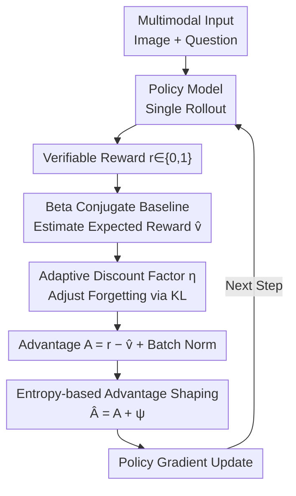

# Stable and Efficient Single-Rollout RL for Multimodal Reasoning

**Conference**: CVPR 2026  
**Paper**: [CVF Open Access](https://openaccess.thecvf.com/content/CVPR2026/html/Liu_Stable_and_Efficient_Single-Rollout_RL_for_Multimodal_Reasoning_CVPR_2026_paper.html)  
**Code**: https://mssr-proj.github.io (Project Page)  
**Area**: Multimodal VLM / Alignment RLHF  
**Keywords**: Multimodal reasoning, RLVR, single-rollout, entropy-shaped advantage, GRPO

## TL;DR
Addressing the dilemma in multimodal RLVR where GRPO with multiple rollouts is computationally expensive while single-rollout methods suffer from entropy collapse, this paper proposes MSSR. By replacing group normalization with a Beta conjugate baseline and introducing an "entropy-based advantage shaping" mechanism, the framework maintains stable training with only one rollout per sample. MSSR matches GRPO performance in half the training steps and exceeds it by over 2 points on average across five benchmarks.

## Background & Motivation

**Background**: Reinforcement Learning with Verifiable Rewards (RLVR) has become the mainstream paradigm for enhancing the reasoning capabilities of Multimodal Large Language Models (MLLMs). In this setup, rewards are automatically verified (1 for correct, 0 for incorrect) without relying on human preference annotations. The most common algorithms currently are group-based methods like GRPO, which sample a group (typically 8) of rollouts for the same prompt to estimate the advantage of each trajectory through intra-group comparison.

**Limitations of Prior Work**: Group-based sampling has two major flaws. First, it is **expensive**—each input requires multiple forward passes, and for multimodal models, the repeated execution of both visual and language encoders incurs significant overhead. Second, it is **wasteful**—when all rollouts in a group yield the same result (all correct or all incorrect), the intra-group relative advantage collapses to zero, resulting in a wasted sampling step with no learning signal.

**Key Challenge**: While single-rollout reinforcement learning has been successful in the text domain, the authors find that direct migration to multimodal settings leads to **failure**. High-dimensional and dense visual inputs significantly amplify input variance, making cross-modal credit assignment more difficult. Without the variance reduction of group normalization, the high stochasticity of binary rewards causes policy entropy to collapse rapidly, leading to training divergence. This creates a trade-off: **single-rollout is efficient but unstable, while multiple rollouts are stable but expensive**.

**Goal**: To develop a multimodal RLVR framework that utilizes only a single rollout (achieving compute efficiency) while ensuring stable convergence (preventing entropy collapse).

**Key Insight**: The authors first generalize the text-domain single-rollout formula to the multimodal setting, resulting in a naive version named MVSR, which still collapses. After systematically testing common stabilization techniques (KL regularization, cross-modal anchoring, entropy loss) and finding them only partially effective, they identify the critical solution: **Entropy-based Advantage Shaping**.

**Core Idea**: Incorporating the policy's output entropy directly into the advantage calculation. For responses with low rewards but high model uncertainty (high entropy), a higher effective advantage is assigned to preserve exploration and prevent mode collapse. While this mechanism is supplementary in group-based settings, the authors demonstrate it is a **vital necessity** for multimodal single-rollout scenarios.

## Method

### Overall Architecture

MSSR is a **group-free** RLVR training framework. For each multimodal input (image + question), the policy model generates only **one** rollout. After obtaining the binary verifiable reward, a per-sample Beta distribution is maintained to estimate the baseline, calculate the advantage, and perform batch normalization. Finally, an entropy shaping term is added before updating the policy. The primary differences from GRPO are the replacement of "intra-group comparison" with a "Beta conjugate baseline" and replacing "group-normalized stability" with "entropy-shaped stability." The naive version (without entropy shaping) is called MVSR, while the full version is MSSR.

### Key Designs

**1. Beta Conjugate Baseline: Reliable Baselines from a Single Trajectory**

The biggest challenge for single-rollout methods is the lack of intra-group comparisons to estimate the baseline $v̂$ (expected reward) for the advantage $A=r-v̂$. Observing that binary rewards $r(x,o)\in\{0,1\}$ follow a Bernoulli distribution, the authors utilize its conjugate prior, the Beta distribution. For each input $x$, they maintain shape parameters $\alpha(x),\beta(x)$, with the baseline defined as the mean: $v̂(x)=\frac{\alpha(x)}{\alpha(x)+\beta(x)}$. After observing a reward, the parameters are updated via conjugate update: $\alpha\leftarrow\eta\cdot\alpha+r$ and $\beta\leftarrow\eta\cdot\beta+(1-r)$. To avoid bias, the advantage uses the baseline from the **previous** step $v̂_{-1}(x)$ and is normalized within the batch to reduce variance.

**2. Adaptive Discount Factor η: Synchronizing Forgetting with Policy Evolution**

The discount factor $\eta\in[\eta_{\min},\eta_{\max}]\subset(0,1]$ in the conjugate update determines how quickly old reward statistics decay. A fixed $\eta$ may cause the baseline to lag during rapid policy changes or lose history when the policy is stable. The authors track the mean KL divergence $\overline{KL}_s$ between successive policy updates using a sliding window of length $N$. If $\overline{KL}_s > KL_\text{target}$ (rapid change), $\eta$ is decreased using $\eta_s=\eta_{\max}-\tau_s(\eta_{\max}-\eta_{\min})$ to **accelerate forgetting**. If the updates are stable, $\eta$ is increased to **slow down forgetting** and retain more historical information. Here, $\tau_s=\min(\overline{KL}_s/KL_\text{target},1.0)$.

**3. Entropy-based Advantage Shaping: The Key to Stable Training**

Even with the Beta baseline, MVSR still fails because rewards are highly stochastic for single rollouts, leading to entropy collapse. The authors solve this by shaping the advantage with policy entropy. The entropy bonus is defined as:

$$\psi_t=\min\left(\frac{|A_t|}{\gamma},\;\lambda\cdot\text{stopgrad}(H_t)\right)$$

where $H_t(\pi_\theta)=-\mathbb{E}_{o\sim\pi_\theta}[\log\pi_\theta(o_{<t}\mid x)]$ is the token-level entropy, and $\text{stopgrad}$ ensures the entropy value does not propagate gradients. The shaped advantage is $\hat A_t=A_t+\psi_t$. Intuitively, this assigns extra weight to **responses with low rewards but high uncertainty**, likely near correct reasoning paths that were under-sampled. This softens the penalty for low-reward outputs, maintaining sufficient entropy and preventing mode collapse.

### Loss & Training
The base models are Qwen2.5-VL-3B/7B, trained on the Vision-R1-RL dataset (~10K samples). Output format requires reasoning within `<think></think>` and the answer in `\boxed{}`. Rewards are binary based on exact matching. Training involves 120 steps, AdamW, lr=1e-6; entropy shaping $\gamma=0.4, \lambda=2.0$; Beta discount $\eta_{\min}=0.875, \eta_{\max}=0.96$; KL window $N=20$, $KL_\text{target}=0.01$, and KL regularization coefficient 0.01. Implementation is based on the EasyR1 framework. For fairness, the total rollout count per step is aligned to 2048 for all methods.

## Key Experimental Results

### Main Results
Generalization performance across five multimodal reasoning benchmarks (Accuracy %, 3B / 7B scales):

| Model | MathVerse | MathVista | MMK12 | R1-OneVision | HallusionBench | Average |
|------|-----------|-----------|-------|--------------|----------------|------|
| Qwen2.5-VL-3B (base) | 33.3 | 59.5 | 42.5 | 27.6 | 59.9 | 44.6 |
| + GRPO | 36.8 | 61.7 | 46.1 | 30.2 | 62.3 | 47.4 |
| + RLOO | 35.7 | 59.7 | 45.5 | 28.8 | 61.6 | 46.3 |
| + REINFORCE++ | 35.3 | 47.7 | 46.0 | 21.7 | 63.2 | 42.8 |
| **+ MSSR (Ours)** | **39.6** | **63.0** | **49.2** | 29.0 | **66.6** | **49.5** |
| Qwen2.5-VL-7B (base) | 45.8 | 67.2 | 48.1 | 34.6 | 68.4 | 52.8 |
| + GRPO | 48.5 | 70.0 | 55.8 | 37.7 | 69.7 | 56.3 |
| + RLOO | 47.8 | 69.2 | 56.0 | 38.5 | 68.5 | 56.0 |
| + REINFORCE++ | 42.7 | 68.5 | 51.3 | 34.0 | 69.2 | 53.1 |
| **+ MSSR (Ours)** | **49.8** | **71.1** | **62.5** | **39.2** | **70.6** | **58.6** |

MSSR outperforms all group-free and group-based baselines at both scales. At 7B, it achieves the highest average (58.6). Notably, the naive single-rollout REINFORCE++ underperforms the base model, confirming that simple single-rollout migration is unstable.

### Ablation Study
The authors demonstrate that entropy shaping is irreplaceable:

| Configuration | Training Stability | Validation Accuracy | Description |
|------|-----------|-----------|------|
| MVSR (Naive, KL Reg only) | Entropy collapse, divergence | Fluctuating/Down | KL regularization alone cannot stabilize training |
| + Cross-modal Reg | Partially stable | Training up, Val down | Using text-only branches as anchors only provides partial relief |
| + Entropy Loss (0.01) | Partial entropy preservation | Val still decreases | Entropy still collapses despite the auxiliary loss |
| **+ Entropy Shaping (MSSR)** | **Stable, no collapse** | **Steady increase** | Accuracy is ~5% higher than the best single-rollout variant |

### Key Findings
- **Entropy shaping is the unique stabilizer**: While KL regularization and entropy loss offer minor help, only shaping the advantage with entropy ensures stable convergence.
- **Compute Efficiency**: Total overhead per step increases only slightly (6.9 vs 6.1 min/step due to Beta estimation), but MSSR matches GRPO's accuracy in **half the training steps**.
- **Finer-grained Reasoning**: On MMK12, MSSR generates an average of 3.3 key reasoning steps (based on markdown bolding counts) compared to 1.9 for GRPO, indicating that MSSR maintains more structured step-by-step reasoning.

## Highlights & Insights
- **Conjugate Distributions for Binary Rewards**: Using the Beta conjugate prior for Bernoulli rewards is a clean and self-consistent solution for baseline estimation without group sampling.
- **Intuition of Weighting High-Entropy Responses**: The insight that one should not prematurely punish uncertain yet potentially correct explorations is a valuable lesson for any sparse-reward RL task prone to mode collapse.
- **Methodological Honesty**: The authors use an "elimination" narrative—showing that obvious methods fail before introducing entropy shaping—making the final conclusion more convincing.
- **Context-Dependent Mechanisms**: Entropy shaping is a "nice-to-have" in group-based RLVR but a "must-have" in multimodal single-rollout settings where variance reduction from group normalization is missing.

## Limitations & Future Work
- **Narrow Task Domain**: The study focuses on multimodal **math and reasoning** with exact-match binary rewards. Performance on open-ended generation or tasks requiring partial/process rewards is unverified.
- **Scale Constraints**: Experiments were limited to 7B parameters; it remains to be seen if the trade-off between group normalization and entropy shaping holds for much larger models.
- **Hyperparameter Sensitivity**: The coefficients $\gamma=0.4$ and $\lambda=2.0$ were adopted from existing literature without a comprehensive parameter sweep in this specific context.
- **Coarse Metric for Reasoning**: Using "markdown bolding counts" is a proxy for reasoning granularity and may be influenced by output formatting rather than underlying logic.

## Related Work & Insights
- **vs GRPO / RLOO (group-based)**: These rely on intra-group relative advantages, which are stable but expensive. MSSR replaces this with a Beta baseline, achieving better performance with higher compute efficiency.
- **vs REINFORCE++ (group-free single-rollout)**: Both are single-rollout, but REINFORCE++ lacks mechanisms to handle multimodal variance, leading to performance degradation. MSSR's entropy shaping is the differentiator.
- **vs Text-domain Single-Rollout**: Previous text-domain methods found batch normalization effective, but this paper finds it insufficient for high-dimensional visual inputs, necessitating additional entropy-based stabilization.

## Rating
- Novelty: ⭐⭐⭐⭐ First to stabilize single-rollout RLVR for multimodal tasks.
- Experimental Thoroughness: ⭐⭐⭐⭐ Diverse benchmarks and systematic ablation, though limited in model scale and task types.
- Writing Quality: ⭐⭐⭐⭐ Clear narrative flow from motivation to the necessity of the proposed solution.
- Value: ⭐⭐⭐⭐ High utility for compute-constrained multimodal RL training.

<!-- RELATED:START -->

## Related Papers

- [\[CVPR 2026\] SpaceTools: Tool-Augmented Spatial Reasoning via Double Interactive RL](spacetools_tool-augmented_spatial_reasoning_via_double_interactive_rl.md)
- [\[CVPR 2026\] ReaGEN: Adaptive Generation of Structured Chains-of-Thought for Efficient Multimodal Reasoning](reagen_adaptive_generation_of_structured_chains-of-thought_for_efficient_multimo.md)
- [\[ICLR 2026\] Game-RL: Synthesizing Multimodal Verifiable Game Data to Boost VLMs' General Reasoning](../../ICLR2026/vlm_reasoning/game-rl_synthesizing_multimodal_verifiable_game_data_to_boost_vlms_general_reaso.md)
- [\[CVPR 2026\] VisionLeaf: Entropy-Guided Leaf-First Reasoning for Efficient and Accurate Think-with-Image](visionleaf_entropy-guided_leaf-first_reasoning_for_efficient_and_accurate_think-.md)
- [\[CVPR 2026\] Incentivizing Versatile Video Reasoning in MLLMs via Data-Efficient Reinforcement Learning](incentivizing_versatile_video_reasoning_in_mllms_via_data-efficient_reinforcemen.md)

<!-- RELATED:END -->
