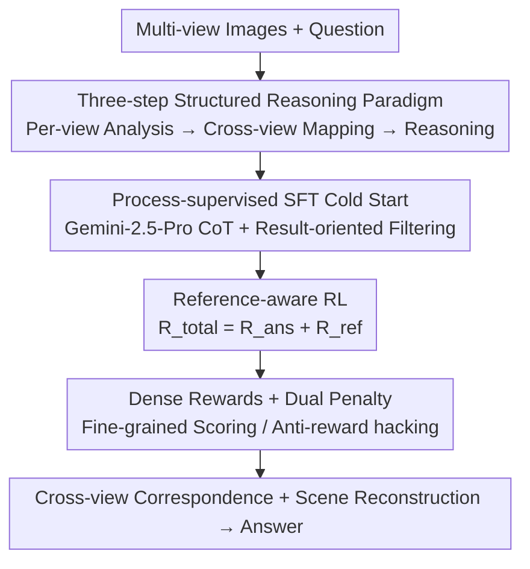

# STAR-R1: Multi-View Spatial TrAnsformation Reasoning by Reinforcing Multimodal LLMs

**Conference**: CVPR 2026  
**Paper**: [CVF Open Access](https://openaccess.thecvf.com/content/CVPR2026/html/Li_STAR-R1_Multi-View_Spatial_TrAnsformation_Reasoning_by_Reinforcing_Multimodal_LLMs_CVPR_2026_paper.html)  
**Area**: Multimodal VLM  
**Keywords**: Multi-view spatial reasoning, Reinforcement Learning, Cross-view correspondence, GRPO, Process supervision

## TL;DR
STAR-R1 utilizes a two-stage training approach—"Process-supervised SFT cold start + Reference-aware RL"—on Qwen2.5-VL-7B. This allows the model to mimic human behavior by first anchoring key references and then performing cross-view alignment for scene reconstruction, significantly outperforming open-source and several closed-source models on multi-view spatial understanding benchmarks such as TVR, MMSI-Bench, MindCube-Tiny, and SPAR-Bench.

## Background & Motivation

**Background**: Reinforcement Learning (RL) has been proven to significantly enhance the reasoning capabilities of LLMs and MLLMs (evidenced by the surge of multimodal-R1 works following DeepSeek-R1). However, most efforts focus on mathematics, general VQA, or temporal video tasks. **Multi-view spatial reasoning**—where a model must establish object correspondences across multiple images from different perspectives and then infer consistent scene semantics—remains largely unexplored.

**Limitations of Prior Work**: The authors diagnosed a representative dual-view task, TVR (Transformation-Driven Visual Reasoning), and found existing approaches lacking. Supervised Fine-Tuning (SFT) tends to memorize transformation patterns in labels but fails at explicit spatial reasoning, leading to errors when perspectives shift (e.g., reporting non-existent changes like "2.color.cyan"). While vanilla RL (GRPO) encourages explicit cross-view correspondence, it **frequently misses key objects or provides incorrect mappings during cold starts**, and its output format is often inconsistent.

**Key Challenge**: The authors summarize this as "**SFT memorizes, RL generalizes**." Table 1 provides quantitative evidence: on ID sets without perspective changes, SFT achieves 84.2 TAcc, far exceeding RL's 76.3. However, on OOD sets with perspective changes, SFT's performance drops to 30.9, while RL achieves 53.9 (a 23% lead). Behavioral analysis reveals that RL models explicitly establish cross-view object correspondences in 81% of OOD samples (compared to 67% in ID scenarios), indicating more thorough cross-view verification under complex conditions—the root of its robustness.

**Goal / Key Insight**: Since SFT provides structure and RL provides generalization, the goal is to combine their strengths. The **Core Idea** is to first inject a structured reasoning trajectory ("per-view analysis → cross-view mapping → spatial reasoning") via process-supervised SFT, then use reference-aware RL—providing fine-grained rewards for both reference selection and final answers—to allow the model to explore and solidify cross-view correspondences.

## Method

### Overall Architecture
STAR-R1 is a two-stage training framework based on Qwen2.5-VL-7B. It first conducts exploratory experiments on the TVR task to confirm that RL can induce human-like "anchoring → verification" behavior. This logic is then extended to real-world multi-view tasks via a three-step reasoning paradigm and two-stage training.

During inference, the model follows a fixed three-step process: ① **Per-view reference analysis**: Identifying key references in each image and encoding directional relationships as triplets `[object 1, object 2, relation]`; ② **Cross-view spatial mapping**: Comparing visual features and configurations to merge local relationships into a unified scene-level spatial map; ③ **Spatial reasoning and answer inference**: Reasoning on the reconstructed map to output a standardized `<answer>...</answer>`.

During training, **Stage 1** uses Gemini-2.5-Pro to generate high-quality CoT data following the three-step format, keeping only correct samples for an SFT cold start (4.1k samples). **Stage 2** applies RL (19.2k samples) where rewards target both "reference selection" and "answer accuracy." The precision of the reward design (especially dense rewards + dual penalties) is a key contribution derived from the TVR exploration.

### Key Designs

**1. SFT vs RL Diagnosis and Two-stage Integration: Process-supervised cold start for structure, RL for generalization**
Pure SFT overfits to annotation patterns and fails under perspective changes, while pure RL misses objects and lacks formatting. The authors chose a hybrid approach. Stage 1 utilizes **process-supervised cold start**, forcing each CoT to follow the three-step trajectory and using **result-oriented filtering** to exclude incorrect reasoning paths. SFT establishes the "reasoning skeleton" and format, leaving "optimal trajectory exploration" to Stage 2 RL.

**2. Fine-grained Dense Accuracy Reward: Converting sparse signals into dense signals**
TVR requires a triplet `(index, attribute, value)` to be entirely correct to receive a point. Using binary rewards (1 for all correct, 0 otherwise) limits exploration efficiency. The authors refined the reward to the level of **each transformation $t_i$**, applying tiered positive rewards based on the match:

$$R^{\text{pos}}(t_i)=\begin{cases}5.0,& t_i\text{ exact match};\\ 1.5,& (\text{index}_i,\text{attribute}_i)\text{ match};\\ 0.5,& \text{only index}_i\text{ match};\\ 0.0,& \text{otherwise}.\end{cases}$$

The total positive reward is $R^{\text{pos}}=\sum_{i=1}^{n}R^{\text{pos}}(t_i)$. Formatting rewards ensure reasoning is within `<think>` and answers within `<answer>` ($R^{\text{format}}=1$). This progressive scoring provides clear climbing signals.

**3. Dual Penalty Mechanism: Blocking reward hacking**
To prevent models from enumerating all possible triplets to farm points, the authors introduced dual penalties: a deduction of $-1.0$ for each incorrect prediction ($n_{\text{miss}}$), and an additional penalty if the number of predicted transformations $n_{\text{pred}}$ is less than the ground truth $n_{\text{gt}}$:

$$R^{\text{pun}}=\begin{cases}-n_{\text{miss}}-(n_{gt}-n_{pred}),& n_{pred}<n_{gt};\\ -n_{\text{miss}},& \text{otherwise}.\end{cases}$$

The final accuracy reward is $R^{\text{acc}}=R^{\text{pos}}+R^{\text{pun}}$.

**4. Reference-aware RL Reward: Optimizing "answering" and "anchoring" simultaneously**
In real-world tasks, binary answer signals are insufficient. The authors introduced complementary rewards: reference reward $R^{\text{ref}}$ for accurately identifying key references across views, and result reward $R^{\text{ans}}$ for the final answer:

$$R^{\text{total}}=R^{\text{ans}}+R^{\text{ref}}.$$

This forces the model to solidify cross-view grounding while pursuing the correct answer.

### Loss & Training
Base model: Qwen2.5-VL-7B, 8×H20 GPUs. TVR exploration used single-stage RL for efficiency. Real-world tasks followed the full two-stage pipeline (4.1k SFT + 19.2k RL samples from MindCube and SPAR-7M). RL was based on GRPO with extended dense rewards. Response length curves show an initial drop followed by a gradual rise and stabilization, as the model learns to systematically compare objects concisely.

## Key Experimental Results

### Main Results

| Benchmark / Task | Metric | STAR-R1 (7B) | Best Comparison | Gain |
|--------------|------|------|----------|------|
| TVR | TAcc↑ | 61.4 | o3 36.0 / GPT-4o 23.5 | +25.4% / +37.9% |
| TVR | NDiff↓ | 0.3 | Qwen2.5-VL-7B 1.5 | Large Drop |
| MMSI-Bench | Acc↑ | 31.4 | GPT-4o 30.3 | +1.1 |
| MindCube-Tiny Rotation | Acc↑ | 98.5 | Prev. SOTA 53.0 | +45.5% |
| MindCube-Tiny Around | Acc↑ | 82.8 | Prev. SOTA 70.4 | +12.4% |
| SPAR-Bench ObjRel-OC-MV | Acc↑ | 86.0 | SOTA 64.0 | +22.0% |
| SPAR-Bench ObjRel-OO-MV | Acc↑ | 76.7 | SOTA 59.0 (Human 80) | +17.7% |

STAR-R1 achieved state-of-the-art results across all TVR metrics. On SPAR-Bench, it outperformed methods trained on 10× more data and approached human levels in the ObjRel-OC-MV task.

### Ablation Study (TVR Reward Design)

| Configuration | TAcc | NDiff↓ | Note |
|------|------|--------|------|
| STAR-R1 (Full) | 61.4 | 0.31 | Complete reward |
| w/o obj reward | 58.0 | 0.37 | Scrapped object reward, lower efficiency |
| w/o attr reward | 56.8 | 0.40 | Attribute reward removal caused largest drop |
| w/o under-pred penalty | 58.2 | 0.41 | Loss of full exploration constraint |
| w/o incorrect penalty | 54.3 | 0.44 | Triggered enumerative reward hacking |
| w/ naive GRPO | 54.5 | 0.43 | Naive GRPO unsuited for TVR structure |

### Key Findings
- **Incorrect prediction penalty is the "anti-cheat" core**: Without it, the model defaults to enumerating all triplets.
- **Attribute rewards are more critical than object rewards**: Removing attribute-level scoring (56.8) caused a larger drop than removing object-level scoring (58.0).
- **Scale of complexity**: Performance decreases as the number of objects increases, indicating that cross-view correspondence difficulty scales sharply with scene complexity.
- **Rotation task relies heavily on RL**: STAR-R1 outperformed STAR-SFT by 44.5% on this task; removing $R^{\text{ref}}$ led to a 17.5% drop.

## Highlights & Insights
- **"SFT Memorizes, RL Generalizes" is a robust insight**: Quantitatively verified through ID/OOD behavioral statistics, providing a clear methodology for balancing structure and generalization.
- **Serious approach to anti-reward hacking**: Modeling enumeration as a double penalty is far more reliable than purely positive reinforcement, a tactic transferable to other RLVR tasks.
- **The structured reasoning paradigm serves as both interface and supervision**: It unifies the CoT template with verifiable reward anchors.
- **Sample efficiency**: Achieving SOTA with only 4k SFT and 19k RL samples against baselines using 10× more data validates the effectiveness of structured cold starts.

## Limitations & Future Work
- **Task domain constraints**: TVR uses synthetic CLEVR-style scenes; generalization to open-world multi-view tasks like long-range navigation requires further verification.
- **Dependency on closed-source teachers**: Stage 1 CoTs are generated by Gemini-2.5-Pro; the supervisor's ceiling and filtering noise may discard valid reasoning paths that happen to lead to incorrect final answers.
- **Manual reward design**: The multi-tiered scoring is currently tailored specifically for TVR structures, increasing the cost of migration to non-structured answer formats.
- **Ground truth for reference labels**: The mechanism for $R^{\text{ref}}$ supervision in real-world tasks depends on supplementals and may introduce uncertainty during replication.

## Related Work & Insights
- **vs LMM-R1 / Video-R1**: While these explore multimodal RL for math or video, they are general-purpose. STAR-R1 is the first to optimize RL specifically for multi-view spatial understanding with reference-aware rewards.
- **vs Naive GRPO**: STAR-R1 extends GRPO with dense rewards and penalties; the performance gap in TVR (61.4 vs 54.5) proves that naive GRPO is insufficient for structured multi-step outputs.
- **Transferable Insight**: Using explicit structured reasoning trajectories as both SFT templates and RL reward anchors can be extended to any multimodal task requiring verifiable intermediate steps (e.g., flowchart or diagram reasoning).

## Rating
- Novelty: ⭐⭐⭐⭐ Systematic application of RL to multi-view spatial reasoning.
- Experimental Thoroughness: ⭐⭐⭐⭐ Four benchmarks plus extensive reward ablation and behavioral analysis.
- Writing Quality: ⭐⭐⭐⭐ Clear "SFT vs RL" storyline.
- Value: ⭐⭐⭐⭐ Demonstrates that an open-source 7B can achieve near-human performance in spatial intelligence using efficient RL strategies.

<!-- RELATED:START -->

## Related Papers

- [\[CVPR 2026\] Reinforcing Structured Chain-of-Thought for Video Understanding](reinforcing_structured_chain-of-thought_for_video_understanding.md)
- [\[NeurIPS 2025\] SpatialThinker: Reinforcing 3D Reasoning in Multimodal LLMs via Spatial Rewards](../../NeurIPS2025/vlm_reasoning/spatialthinker_reinforcing_3d_reasoning_in_multimodal_llms_via_spatial_rewards.md)
- [\[NeurIPS 2025\] Video-R1: Reinforcing Video Reasoning in MLLMs](../../NeurIPS2025/vlm_reasoning/video-r1_reinforcing_video_reasoning_in_mllms.md)
- [\[CVPR 2026\] Thinking with Programming Vision: Towards a Unified View for Thinking with Images](thinking_with_programming_vision_towards_a_unified_view_for_thinking_with_images.md)
- [\[CVPR 2026\] Hear you are: Teaching LLMs Spatial Reasoning with Vision and Spatial Sound](hear_you_are_teaching_llms_spatial_reasoning_with_vision_and_spatial_sound.md)

<!-- RELATED:END -->
