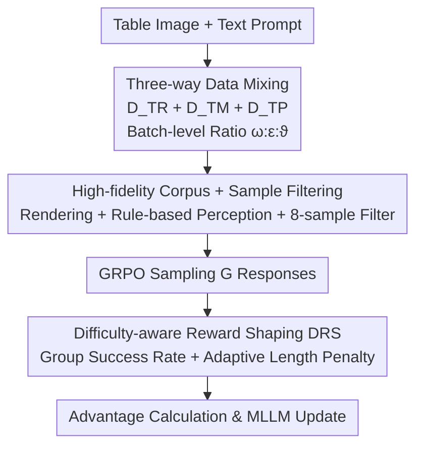

# TableMix: Enhancing Multimodal Table Reasoning in MLLMs from a Data-Centric Perspective

**Conference**: CVPR 2026  
**Paper**: [CVF Open Access](https://openaccess.thecvf.com/content/CVPR2026/html/Liu_TableMix_Enhancing_Multimodal_Table_Reasoning_in_MLLMs_from_a_Data-Centric_CVPR_2026_paper.html)  
**Code**: None  
**Area**: Multimodal VLM  
**Keywords**: Multimodal Table Reasoning, MLLM, Data Mixing, GRPO, Reward Shaping

## TL;DR
Addressing the paradoxical phenomenon where Multimodal Large Language Models (MLLMs) underperform text-only models in table reasoning, TableMix adopts a data-centric approach: it simultaneously mixes three types of data—multimodal table reasoning, text-only mathematical reasoning, and simple table perception—within each training batch. This restores the reasoning capability weakened by alignment pre-training while preserving visual perception. Combined with a Difficulty-aware Reward Shaping (DRS) mechanism, TableMix outperforms multimodal baselines and matches or exceeds the strongest text-only method, Table-R1, across seven table benchmarks.

## Background & Motivation
**Background**: Table reasoning currently follows two pathways—one serializing tables into HTML/Markdown for LLMs, and another feeding table **images** directly to MLLMs. The latter is theoretically superior as it preserves visual cues like colors, highlighting, icons, and fonts lost during serialization.

**Limitations of Prior Work**: However, a counter-intuitive phenomenon persists where multimodal methods **consistently lose** to text-only methods on major reasoning benchmarks. As shown in Figure 1, the multimodal model Turbo and the text-only model Table-R1 use nearly identical RL (GRPO) strategies, yet Turbo lags significantly. This suggests advanced RL techniques alone cannot bridge the gap.

**Key Challenge**: The authors attribute the root cause to **vision-language alignment pre-training**. Modern MLLMs comprise a pre-trained LLM, a vision encoder, and alignment pre-training. While this alignment establishes visual grounding, it **unintentionally weakens the inherent reasoning capability of the underlying LLM**. Since table reasoning relies heavily on logic, arithmetic, and structured calculation, this degradation is fatal; without a solid reasoning foundation, RL yields limited returns.

**Goal**: To "restore" the weakened reasoning core of the MLLM without compromising visual perception.

**Key Insight**: A simple intuition—since the reasoning core is degraded, interleave multimodal table data with text-only mathematical reasoning data (e.g., MetaMath) to "repair" it. Experiments confirm this improves performance but introduces a new problem (see reasoning-perception tension below).

**Core Idea**: Solve from a data perspective rather than a model perspective—utilizing **principled three-way data mixing** to restore reasoning and preserve perception, supplemented by **Difficulty-aware Reward Shaping** to encourage concise answers for simple tasks and deep thinking for complex ones.

## Method

### Overall Architecture
TableMix is a data-centric RL fine-tuning framework based on Qwen2.5-VL-7B. It retains the model architecture but modifies **what data is fed** and **how rewards are assigned**. The input consists of table images and text prompts, while the output includes a `<think>...</think>` reasoning process and a `\boxed{}` answer.

The workflow involves mixing three types of data (Multimodal Table Reasoning $D_{TR}$, Textual Mathematical Reasoning $D_{TM}$, and Multimodal Table Perception $D_{TP}$) at the **batch level** in specific proportions. This batch is fed into GRPO for RL, where each query samples $G$ responses. The **Difficulty-aware Reward Shaping (DRS)** dynamically adjusts rewards for "correct and concise" responses based on group success rates. Finally, advantages are calculated, and the MLLM is updated via backpropagation. Data mixing addresses the "reasoning-perception tension," while DRS prevents verbose reasoning for trivial problems.

### Key Designs

**1. Three-way Data Mixing: Restoring Reasoning while Preservng Perception**

This is the core of the work, directly targeting the causal chain of "alignment pre-training weakens reasoning + restoring reasoning hurts perception." The final recipe is built in three steps. Step 1, "Restoring the Reasoning Core": Incorporating textual mathematical reasoning data $D_{TM}$ (MetaMath, DeepScaleR, GSM8K, etc.), as complex table reasoning (numerical aggregation, filtering, sequence inference) is highly isomorphic to mathematical reasoning patterns. Step 2, revealing **reasoning-perception tension**: improving abstract reasoning can paradoxically degrade low-level visual perception (e.g., reading numeric values incorrectly, as shown in Figure 3). Step 3, "Final Recipe": Integrating a third category, **simple multimodal table perception data $D_{TP}$**, forcing the model to "review" basic visual perception while learning complex reasoning.

Data is mixed at the batch level according to sampling proportions $\omega, \epsilon, \vartheta$ ($\omega+\epsilon+\vartheta=1$):

$$B \leftarrow \omega \cdot D_{TR} + \epsilon \cdot D_{TM} + \vartheta \cdot D_{TP}$$

Intuitively, $D_{TR}$ dominates, $D_{TM}$ restores reasoning, and $D_{TP}$ prevents perceptual degradation. Experiments find the optimal ratio to be $\omega=0.7,\ \epsilon=0.2,\ \vartheta=0.1$. Batch-level mixing is crucial; ablation shows two-stage training (math then tables, or vice versa) leads to lower performance, likely because separate training weakens vision-language alignment.

**2. Difficulty-aware Reward Shaping (DRS): Concise for Simple, Deep for Complex**

The mixed dataset spans "at-a-glance" perception tasks to multi-step reasoning requiring long CoT. Standard GRPO treats all samples equally, encouraging verbose reasoning even for trivial questions, which wastes compute and introduces hallucinations. The key insight of DRS is: **if a question has a high success rate within a sample group, it is likely simple and should not be rewarded for verbosity.**

Specifically, for a group of responses $\{y_i\}_{i=1}^{G}$ for input $x$, the group success rate is calculated as $p(x)=\frac{1}{G}\sum_{i=1}^{G}\mathbb{1}(r_{acc}(y_i)=1)$. If $p(x)>\delta$ (signifying the task is "mastered"), an adaptive length penalty is applied to correct responses:

$$\hat{r}_{acc}(y_i)=\begin{cases}1-\tanh\!\left(k(t)\cdot \dfrac{L_i-L_{\min}^{correct}}{L_{\min}^{correct}}\right) & y_i \text{ is correct}\\[4pt] 0 & y_i \text{ is incorrect}\end{cases}$$

Here, $L_i$ is the token length of $y_i$, and $L_{\min}^{correct}$ is the shortest length among correct responses in the group. $k(t)=\min(k_{max},\ \frac{k_{max}}{T}\cdot t)$ is an annealing coefficient (where $k_{max}=1.0$ and $T$ is total steps). For low success rates (difficult tasks), **no length penalty** is applied, allowing full step-by-step reasoning.

**3. High-fidelity Corpus & Sample Filtering: Clean Data for Verifiable Rewards**

Data quality is paramount for RL. The authors collect table reasoning data from over ten public datasets (TabMWP, WTQ, etc.), rendering them into a standard visual format. Perception data is generated using rule-based QA (e.g., "Read a value from the table"). **Sample Filtering** is critical: the base model performs 8 samplings for each candidate; if it succeeds $>6$ times, the sample is discarded as too simple. Samples solvable without the image are also removed to ensure the model focuses on multimodal reasoning.

## Key Experimental Results

### Main Results
Using Qwen2.5-VL-7B, 2 epochs, batch size 256, $lr=1\times10^{-6}$, and $G=16$. Results across 7 benchmarks (Accuracy, %):

| Method | Modality | TabMWP | WTQ | HiTab | TAT-QA | TabFact | InfoTabs |
|------|------|--------|-----|-------|--------|---------|----------|
| Table-R1 | Text-only SOTA | 96.40 | 81.20 | 81.40 | 73.86 | 87.60 | 87.90 |
| Qwen2.5-VL-7B | Multimodal base | 92.48 | 65.85 | 67.09 | 70.54 | 83.01 | 77.91 |
| HIPPO-8B | Multimodal | 87.34 | 55.71 | 63.13 | 61.40 | 82.29 | 75.70 |
| Turbo-8B | Multimodal (GRPO) | 96.75 | 67.80 | 72.15 | 73.21 | 85.81 | 81.89 |
| **Ours** | Multimodal | **99.20** | **81.32** | **82.25** | **78.52** | **88.96** | **88.72** |

Ours not only achieves SOTA among multimodal models but also **surpasses** the strongest text-only method, Table-R1. This validates that "restoring reasoning + preserving perception" unlocks the potential of image-based table models.

### Ablation Study

| Configuration | Effect | Description |
|------|------|------|
| Single source (Tables only / Math only) | Notable improvement | Weaker than three-way mix, confirming math restores general reasoning logic. |
| Batch-level mixing (Default) | Optimal | Superior to two-stage training. |
| Two-stage (Math then Table / vice-versa) | Performance drop | Separate training weakens visual-language alignment. |
| Math source: MetaMath (Default) | Best | Reasoning style most compatible with table tasks. |
| Math source: DeepScaleR (Too hard) / GSM8K (Too easy) | Diminished gain | Mismatched difficulty. |
| GRPO + DRS vs. Standard GRPO | Stable Acc + ~20% token reduction | Prevents over-reasoning on simple tasks. |

### Key Findings
- **Three-way mixing > any single source**: Math data is the primary driver for reasoning gains, while $D_{TP}$ is essential to prevent perceptual regression.
- **DRS provides "free" efficiency**: It reduces reasoning tokens by approximately 20% without sacrificing accuracy.
- **Style matching outweighs difficulty**: MetaMath succeeds because its reasoning patterns align with table tasks better than geometry (Geo3K) or overly complex sources.

## Highlights & Insights
- **Diagnosing the "multimodal vs. text-only" gap** as a side-effect of alignment pre-training and solving it via textual math "repair" is a highly explanatory and reusable insight.
- **Reasoning-perception tension as an empirically grounded problem**: The authors arrived at the need for perception data after observing degradation, making the design robust.
- **DRS uses group success as a proxy for difficulty**: It eliminates the need for external difficulty labels or reward models by leveraging the inherent variability in GRPO sampling.

## Limitations & Future Work
- **Dependency on verifiable rewards**: The method relies on accuracy-based rewards (correct/incorrect), which may be harder to apply to open-ended table tasks.
- **Hyperparameter sensitivity**: The $\omega:\epsilon:\vartheta$ ratio and $\delta$ threshold were optimized for this setup; their stability across other backbones or scales is not fully explored.
- **Scale verification**: Effectiveness was primarily validated on 7B-scale models.

## Related Work & Insights
- **Comparison with Turbo**: Both use GRPO, but Turbo hits a ceiling because it ignores the reasoning backbone degradation. Ours "repairs" the foundation first via data mixing.
- **Comparison with Table-R1**: TableMix bridges the modality gap, demonstrating that image-based models can compete with serialization-based models when their logic is restored.
- **Comparison with Specialized MLLMs (HIPPO, etc.)**: While others focus on synthetic data or preference optimization, TableMix addresses the root cause: the trade-off inherent in alignment pre-training.

## Rating
- Novelty: ⭐⭐⭐⭐ Precise diagnosis of reasoning loss during alignment and the use of text-only math to "repair" it is insightful.
- Experimental Thoroughness: ⭐⭐⭐⭐⭐ Extensive benchmarks plus zero-shot generalization and deep ablation on data sources/ratios.
- Writing Quality: ⭐⭐⭐⭐ Clear narrative driven by experimental observations.
- Value: ⭐⭐⭐⭐⭐ Successfully closes the gap between multimodal and text-only table reasoning SOTAs.

<!-- RELATED:START -->

## Related Papers

- [\[CVPR 2026\] Incentivizing Versatile Video Reasoning in MLLMs via Data-Efficient Reinforcement Learning](incentivizing_versatile_video_reasoning_in_mllms_via_data-efficient_reinforcemen.md)
- [\[CVPR 2026\] Think360: Evaluating the Width-centric Reasoning Capability of MLLMs Beyond Depth](think_360_evaluating_the_width-centric_reasoning_capability_of_mllms_beyond_dept.md)
- [\[ACL 2026\] TableVista: Benchmarking Multimodal Table Reasoning under Visual and Structural Complexity](../../ACL2026/vlm_reasoning/tablevista_benchmarking_multimodal_table_reasoning_under_visual_and_structural_c.md)
- [\[CVPR 2026\] Improving Vision-language Models with Perception-centric Process Reward Models](improving_vision-language_models_with_perception-centric_process_reward_models.md)
- [\[CVPR 2026\] VAST: Video Ability-Stratified Taxonomy for Data-Efficient Video Reasoning](vast_video_ability-stratified_taxonomy_for_data-efficient_video_reasoning.md)

<!-- RELATED:END -->
