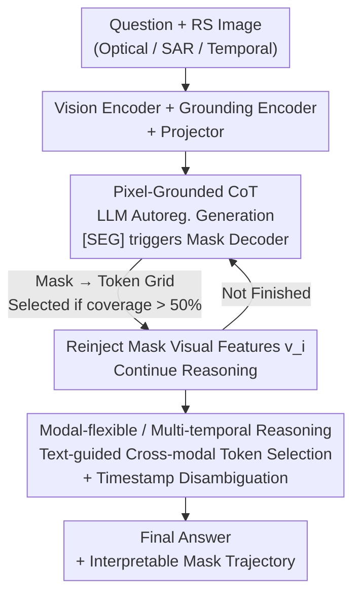

# TerraScope: Pixel-Grounded Visual Reasoning for Earth Observation

**Conference**: CVPR 2026  
**Paper**: [CVF Open Access](https://openaccess.thecvf.com/content/CVPR2026/html/Shu_TerraScope_Pixel-Grounded_Visual_Reasoning_for_Earth_Observation_CVPR_2026_paper.html)  
**Code**: https://shuyansy.github.io/terrascope/  
**Area**: Multimodal VLM  
**Keywords**: Remote Sensing VLM, Pixel-level Reasoning, Interleaved CoT, Multimodal Fusion, Segmentation Grounding

## TL;DR
TerraScope enables remote sensing VLMs to generate segmentation masks at each reasoning step and reinject visual features of masked regions into the reasoning chain ("thinking with pixels"). It features a 1-million-sample pixel-masked CoT dataset named Terra-CoT and the first benchmark evaluating both "answer + mask quality," TerraScope-Bench. It significantly outperforms existing VLMs on fine-grained geospatial tasks such as land cover estimation, area ranking, and change detection.

## Background & Motivation

**Background**: The Earth Observation (EO) field is shifting from "task-specific models" to unified Vision-Language Models (VLMs). Recently, RSGPT, GeoChat, and EarthDial have shown strong performance in standard tasks like image captioning, VQA, and visual grounding through large-scale instruction tuning.

**Limitations of Prior Work**: However, these models collectively fail in **fine-grained spatial reasoning requiring pixel-level precision**. Fig. 1 in the paper provides an intuitive example: when asked "What percentage of the image does the water body occupy?", GPT-4o, Qwen3-VL (with reasoning), and EarthDial (RS-specific) provide guesses ranging from 30% to 50%, while the ground truth is 13%. They either output incorrect numbers directly or perform textual CoT in language space based on vague visual impressions like "it looks like it occupies the right third," failing to ground specifically in pixels.

**Key Challenge**: Two fundamental differences between remote sensing and natural images prevent the direct application of the "box then reason" paradigm. First, remote sensing images represent **continuous spatial distributions** (gradual transitions of land cover types), unlike discrete objects in natural images; grounding with coarse boxes/crops introduces significant noise. Second, remote sensing naturally involves **multi-sensor and multi-temporal** data (optical for surface reflectance, SAR for all-weather observation, multi-temporal for change detection), which existing VLMs cannot flexibly integrate within a single framework.

**Goal**: Build a unified framework where every reasoning step is grounded in **precise segmentation masks** rather than coarse boxes, supporting multi-temporal change reasoning and adaptive optical/SAR fusion.

**Key Insight**: The authors advance the "thinking with images" paradigm to "thinking with pixels"—no longer relying on external segmentation tools (which increase complexity and reduce controllability) but using a **hybrid decoder** to let the language model decide when to trigger mask generation and inject the corresponding visual tokens into the reasoning sequence.

**Core Idea**: Treat segmentation masks as "visual evidence" within the reasoning chain, generated interleaved with text tokens (interleaved CoT), using pixel-level evidence to constrain each spatial reasoning step.

## Method

### Overall Architecture

TerraScope is built upon InternVL3, adding a pixel-level segmentation module to the vision-language architecture to create a closed loop between "visual grounding" and "linguistic reasoning." Formally, while traditional VLMs perform pure linguistic reasoning $[r_1, r_2, \dots, r_k, a] = f(v, q)$ (where $r_i$ is step $i$), TerraScope modifies this to interleave masked visual features:

$$[r_1, (m_1, v_1), r_2, (m_2, v_2), \dots, r_k, (m_k, v_k), a] = f(v, q)$$

Specifically, after each reasoning step $r_i$, a segmentation mask $m_i$ is generated, and visual features $v_i$ from the masked region are reinjected, allowing the next step to proceed while "looking at pixel evidence." The pipeline is: Question + Image → Encoding via vision/grounding encoders → Autoregressive generation by the LLM. Encountering `[SEG]` triggers the mask decoder, token selection, and reinjection until the answer is reached. Multi-modal (Optical + SAR) and multi-temporal capabilities are layered on top. Training occurs in two stages: grounding pre-training with 2M REC pairs, followed by pixel-level reasoning activation with 1M Terra-CoT samples.

### Key Designs

**1. Pixel-Grounded CoT: Interleaved Mask and Text Generation**

This directly addresses the issue of models "guessing numbers via vague impressions in language space." The core is **dual-decoder synergy**: TerraScope monitors the LLM's autoregressive output. Once a `[SEG]` token is detected (usually after mentioning a key object), it triggers the mask decoder to predict a mask, then selects and injects visual tokens from that region into the sequence. For example, to answer "Which is larger, water or road?", the model generates "First, I identify the water `[SEG]`... then the road `[SEG]`," deriving the answer by comparing visual features of the two masks.

Technically, to align pixel masks with visual tokens (grid-level): the mask $m_i$ is resized to the token grid resolution $(n\cdot s)\times(m\cdot s)$ (where images are $n\times m$ patches with $s\times s$ tokens, $s=16$ for InternVL). For partial overlaps, **a token is selected only if the mask covers over 50% of its spatial area**, yielding a token-level mask $m_i^{tok}$. Features $v_i = \{v_j \mid m_i^{tok}[j]=1, j\in[1,N]\}$ are projected and flattened into a 1D sequence, then fed back to the LLM to continue generation using KV caches. This ensures reasoning is constrained by real pixel evidence rather than textual hallucination.

**2. Modal-flexible and Multi-temporal Reasoning: Text-guided Token Selection + Timestamp Disambiguation**

This allows the framework to adaptively handle Optical-SAR pairs or temporal sequences. For **Optical-SAR pairs**, the goal is to use spectral info in clear areas and SAR in cloudy ones. This is achieved via text-guided token-wise modal selection: $v_{opt}$ and $v_{SAR}$ are encoded, and cross-attention is calculated with the question embedding of length $L$ to compute relevance scores:

$$\beta^{\mu}_j = \frac{1}{L}\sum_{\ell=1}^{L}\mathrm{Softmax}\!\left(\frac{v^{\mu}q^{\top}}{\sqrt{D}}\right)_{j\ell},\quad \mu\in\{opt, SAR\}$$

During token selection, the modality with higher relevance is chosen for each position: $v_j = v^{opt}_j$ if $\beta^{opt}_j > \beta^{SAR}_j$, else $v^{SAR}_j$ (only for positions where $m_i^{tok}[j]=1$). This provides **spatially adaptive** fusion. For **multi-temporal sequences**, the difficulty is disambiguation: each `[SEG]` must specify which image to segment and extract tokens from. The authors explicitly insert time indicators `Image: ti` before `[SEG]`. When the LLM generates this signal, the mask decoder segments from image $t_i$ and the feature module samples from $v(t_i)$.

**3. Terra-CoT: 1M Samples via an Automated Pipeline**

The scarcity of pixel-level visual CoT data is a bottleneck. The authors use a two-stage pipeline. **Stage 1 (Grounded Captioning with CoT)**: Using datasets with semantic labels, land cover classes are highlighted with colored masks, and LLMs are prompted to generate detailed descriptions referencing these mask regions (Cap-CoT). This produces 250k samples used to train TerraScope and an intermediate tagger, TerraScope-Cap, which provides pixel-grounded descriptions for unlabeled images. **Stage 2 (Hierarchical Synthesis)**: TerraScope-Cap labels multi-source global images. Two levels of synthesis follow: L1 consists of templated basic spatial tasks (existence, counting, localization, area quantification, boundary detection) using segmentation labels; L2 has the LLM combine multiple L1 tasks into complex multi-step reasoning (L2-Spatial for relationships like "is water adjacent to crops", and L2-Semantic for domain knowledge like "is this area suitable for farming"). This results in 1 million multi-capability Terra-CoT samples.

**4. TerraScope-Bench: Benchmark with Answer + Mask Dual Metrics**

Existing benchmarks focus on coarse tasks like scene classification or description. TerraScope-Bench targets difficulties in 10m+ resolution imagery (where objects are few pixels wide and boundaries are fuzzy). It contains 3,837 expert-verified samples across six sub-tasks: Coverage Analysis (855), Absolute Area Quantification (855), Distance Measurement (129), Area Comparison/Ranking (855), Boundary Relationship Detection (855), and Building Change Estimation (288). It supports Optical/SAR/Joint inputs and single/multi-temporal scenes. Ground truths are derived computationally from masks, rewritten by LLMs into natural language with distractors, and manually filtered. The key innovation is the **dual evaluation metric**: it measures not only answer accuracy but also mask quality via IoU to verify if the model truly focused on the correct region during reasoning.

### Loss & Training

Two-stage supervised fine-tuning. **Stage 1 (Grounding Pre-training)**: Vision encoder, projector, and LLM are frozen; only the mask decoder is trained (lr=2e-5, batch=8). **Stage 2**: Projector and mask decoder are updated; LLM is fine-tuned via LoRA (lr=1e-5, batch=2). The vision encoder remains frozen. During training, features are extracted from GT masks and interleaved after `[SEG]`. Total loss is language modeling loss (cross-entropy on text and `[SEG]` tokens, **excluding** injected visual features) plus segmentation loss (Dice + BCE):

$$L = L_{LM} + \lambda L_{seg},\quad \lambda = 0.5$$

## Key Experimental Results

### Main Results

Comparison of 11 VLMs on TerraScope-Bench (Optical), LandSat30-AU, and DisasterM3 (Avg scores for TerraScope-Bench):

| Model | Scale | TerraScope-Bench Avg | LandSat30-AU Avg | DisasterM3 Avg |
|------|------|------|------|------|
| GPT-4o (Proprietary) | - | 38.7 | - | 22.8 |
| Qwen3-VL-Think (Reasoning) | 8B | 43.3 | 65.0 | 32.5 |
| EarthMind (RS-specific) | 4B | 42.1 | - | - |
| InternVL3 (Terra-CoT tuned) | 8B | 54.9 | 67.6 | 36.1 |
| GLM-4.1V-Think (Terra-CoT tuned) | 9B | 59.6 | 68.0 | 38.8 |
| **TerraScope** | 8B | **68.9** | **73.9** | **46.5** |

Key takeaway: Vanilla general/RS VLMs perform near chance (30%-40%) on fine-grained tasks. Terra-CoT tuning alone significantly boosts performance, but spatial grounding architecture remains necessary for complex tasks like Distance Measurement (DM) and Change Estimation (BCE).

### Ablation Study

Comparison of CoT strategies (Tab. 2, "Original" is the pre-trained base):

| Configuration | TerraScope-Bench | LandSat | Disaster | Note |
|------|------|------|------|------|
| Original | 33.8 | 45.7 | 23.6 | Base only |
| Textual CoT w/o Seg. | 58.7 | 56.5 | 32.9 | Pure text CoT |
| Textual CoT with Seg. | 60.6 | 58.9 | 35.8 | Mask as aux supervision |
| Random-Mask CoT | 43.2 | 53.8 | 32.6 | Random token injection |
| Box CoT | 62.8 | 70.5 | 43.9 | Token selection via BBox |
| **TerraScope** | **68.9** | **73.9** | **46.5** | Full pixel grounding |

### Key Findings
- **"Selecting the right region" matters more than "having a mask"**: Random-Mask CoT (43.2) is worse than pure text CoT (58.7), suggesting irrelevant visual info interferes with reasoning. Precise masks (68.9) outperform boxes (62.8).
- **Auxiliary segmentation supervision helps even without token injection**: Textual CoT with Seg. (60.6) outperforms w/o Seg. (58.7), showing joint segmentation training improves reasoning implicitly.
- **Correct predictions correlate with higher IoU**: Correct answers show significantly higher mask IoUs, proving accuracy is built upon spatial grounding quality.

## Highlights & Insights
- **"Thinking with pixels" refines visual evidence from boxes to masks**: While natural image CoT works use boxes or crops, which introduce noise in continuous RS distributions, using masks as the grounding unit is a tailored design for remote sensing.
- **The `[SEG]` trigger + 50% coverage selection is practical**: This "mask → token selection → KV cache injection" pipeline is transferable to any multimodal task requiring fine-grained grounding.
- **Dual evaluation prevents false grounding**: Requiring IoU assessment prevents models from guessing the correct answer without looking at the right place, offering a universal design for "interpretable reasoning."
- **Timestamp disambiguation via `Image: ti` is a lightweight trick**: Effectively solves the "which image to segment" ambiguity in multi-temporal scenarios without structural changes.

## Limitations & Future Work
- DM and BCE tasks remain challenging; more specialized architectures beyond data scaling are likely required.
- Training costs are significant: 2M pre-training + 1M SFT samples. Data quality depends on the TerraScope-Cap tagger and prompted synthesis, requiring manual filtering.
- Currently limited to Optical and SAR; other modalities (Hyperspectral, IR) and more complex temporal sequences are not yet covered.

## Related Work & Insights
- **vs. Natural Image Visual CoT (GRIT / DeepEyes)**: They use boxes or iterative cropping. TerraScope argues these are insufficiently granular for remote sensing and uses pixel-level masks instead.
- **vs. Remote Sensing VLMs (EarthDial / GeoChat)**: These rely on massive RS instruction tuning but lack the "pixel-grounded reasoning" capacity to embed masks into the chain. They also struggle to transfer to the lower resolutions typically found in global monitoring.
- **vs. Tool-based EO Reasoning**: Unlike previous works calling external segmentation tools, TerraScope generates masks and reasoning trajectories within a single model via a hybrid decoder.

## Rating
- Novelty: ⭐⭐⭐⭐⭐ First to interleave pixel-level masks into the RS reasoning chain.
- Experimental Thoroughness: ⭐⭐⭐⭐⭐ Comprehensive 11-model comparison, three benchmarks, and detailed ablations.
- Writing Quality: ⭐⭐⭐⭐ Clear structure across framework, data, and benchmarks.
- Value: ⭐⭐⭐⭐⭐ Provides a unified framework, 1M CoT dataset, and a new benchmark with dual metrics.

<!-- RELATED:START -->

## Related Papers

- [\[ICLR 2026\] VGR: Visual Grounded Reasoning](../../ICLR2026/vlm_reasoning/vgr_visual_grounded_reasoning.md)
- [\[CVPR 2026\] AV-Reasoner: Improving and Benchmarking Clue-Grounded Audio-Visual Counting for MLLMs](av-reasoner_improving_and_benchmarking_clue-grounded_audio-visual_counting_for_m.md)
- [\[ICLR 2026\] Composition-Grounded Data Synthesis for Visual Reasoning](../../ICLR2026/vlm_reasoning/composition-grounded_data_synthesis_for_visual_reasoning.md)
- [\[CVPR 2026\] Thinking Diffusion: Penalize and Guide Visual-Grounded Reasoning in Diffusion Multimodal Language Models](thinking_diffusion_penalize_and_guide_visual-grounded_reasoning_in_diffusion_mul.md)
- [\[CVPR 2026\] Grounded Chain-of-Thought for Multimodal Large Language Models](grounded_chain-of-thought_for_multimodal_large_language_models.md)

<!-- RELATED:END -->
