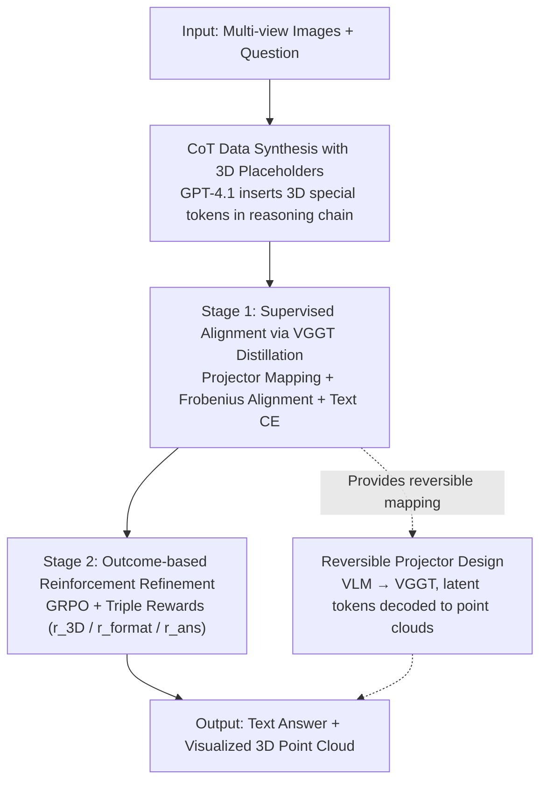

# Think with 3D: Geometric Imagination Grounded Spatial Reasoning from Limited Views

**Conference**: CVPR 2026  
**Paper**: [CVF Open Access](https://openaccess.thecvf.com/content/CVPR2026/html/Chen_Think_with_3D_Geometric_Imagination_Grounded_Spatial_Reasoning_from_Limited_CVPR_2026_paper.html)  
**Code**: https://github.com/zhangquanchen/3DThinker  
**Area**: Multimodal VLM  
**Keywords**: Spatial reasoning, 3D mental representation, VGGT distillation, latent space reasoning, GRPO

## TL;DR
3DThinker enables VLMs to directly generate a sequence of "3D latent tokens" within the reasoning chain and align them with the geometric features of the 3D foundation model VGGT. Without requiring any 3D priors as input or relying on dense annotations, it performs spatial reasoning by "imagining 3D scenes" from limited 2D views. It consistently outperforms strong baselines across 8 spatial understanding benchmarks, with the largest model even surpassing o3.

## Background & Motivation
**Background**: Systems like embodied AI and autonomous driving interact with the real 3D world but often only receive limited, non-interchangeable views from multiple cameras. Enabling VLMs to "reconstruct the complete scene and then reason" is a core problem for spatial intelligence. Currently, the community follows two main paths: one is **textual/2D visual cue reasoning**—such as MindCube training models to generate cognitive maps of 3D layouts, or Ego3D using external models like GroundingDINO + DepthAnythingV2; the other is **treating auxiliary modalities as extra inputs**—directly feeding point clouds, camera parameters, and depth maps, or calling external encoders for pre-computed 3D tokens.

**Limitations of Prior Work**: The first path has inherently limited representation power, as text/2D cannot capture complex 3D layouts, and cognitive maps rely heavily on BEV annotations or external models, failing on low-resolution or unfiltered images. The second path restricts the model to scenarios where "point clouds/depth must exist," rendering it unusable for monocular images. Furthermore, calling external tools introduces overhead, and more importantly, these 3D capabilities are "external plug-ins" rather than **endogenous internal abilities** of the model.

**Key Challenge**: Models either settle for insufficient text/2D representations or rely on external labels and tools—neither allows the VLM to **indigenously** develop 3D geometric understanding during the reasoning process. The most related work, Mirage, uses ground-truth image embeddings for supervision to continue multimodal trajectories without pixel-wise generation, but it relies heavily on GT image supervision and remains trapped in the "think with image" (2D) paradigm, failing to meet the requirements of "learning 3D directly from 2D" and being "annotation-free."

**Goal**: The authors decompose the requirements into three metrics: **G1 3D Imagination**: learning geometry directly from limited 2D images without 3D inputs; **G2 Annotation-free**: not depending on dense annotation data; **G3 Endogenous**: not calling any external priors or auxiliary models during inference.

**Key Insight**: Humans perform spatial reasoning by first "imagining" a 3D scene (mental imagery). The authors hypothesize that instead of forcing the VLM to explicitly generate point clouds (which requires heavy annotation and generation capability), it should generate a **compact implicit 3D token** within the reasoning chain and **align** this implicit representation with the feature space of an existing 3D foundation model (VGGT) through distillation.

**Core Idea**: Insert "3D special tokens" into the CoT as placeholders for the mental 3D scene. Using a two-stage training process—supervised alignment via VGGT feature distillation (S1) and outcome-based reinforcement learning (S2)—the VLM learns to "think with 3D." This enables endogenous 3D imagination, and because the projector is reversible, the implicit tokens can be decoded back into point clouds, addressing the long-standing interpretability issue of latent space reasoning.

## Method

### Overall Architecture
The input to 3DThinker is a set of multi-view images $\mathcal{I}=\{I_1,\dots,I_n\}$ and a question $Q$. The output is a text answer, accompanied by a 3D implicit representation generated mid-reasoning that can be reconstructed into a point cloud. The pipeline involves three steps: first, using a strong model (GPT-4.1) to **synthesize CoT data with 3D placeholders**; second, using **supervised training** to align the VLM-generated 3D latent tokens with VGGT geometric features (using cross-entropy to maintain textual coherence); finally, using **outcome-based reinforcement training** to refine the entire reasoning trajectory end-to-end while maintaining 3D alignment. Summary: 2D multi-view → VLM outputs 3D latent tokens during reasoning → tokens aligned to VGGT geometry via projector → answer derived with text; latent tokens are reversible to scene point clouds.

### Key Designs

**1. CoT Data Synthesis with 3D Placeholders: Feeding 3D Reasoning Paradigms to Text-based VLMs**

VLMs naturally generate text tokens and do not know when to "imagine 3D." The solution is synthesizing training corpora: given multi-view images $\mathcal{I}$, question $Q$, and GT answer $R$, a high-level model like GPT-4.1 completes the reasoning chain $o = M(Q,\mathcal{I},R)$ and **inserts 3D special tokens as placeholders** representing the mental 3D scene. Each trajectory $o^{(i)}$ consists of interleaved text and 3D placeholders, forming the dataset $\mathcal{D}=\{(Q^{(i)},\mathcal{I}^{(i)},R^{(i)},o^{(i)})\}$. This step defines the "skeleton" of where 3D tokens appear; the actual geometric meaning of the latent states is learned in Stage 1.

**2. Stage 1 Supervised Alignment: Learning Geometry Without 3D Labels**

Explicitly generating point clouds is too heavy. Instead, the authors **distill** features from the 3D foundation model VGGT into the 3D tokens generated during VLM reasoning. Specifically, a trajectory is split into $o = o_{\text{pre}} \oplus t_{\text{3D}} \oplus o_{\text{post}}$, where $t_{\text{3D}}=\{t_1,\dots,t_k\}$ are mental 3D tokens. Corresponding "salient vectors" $F_{\text{latent}}=\{h_1,\dots,h_k\}$ are extracted from the VLM's last hidden layer. Simultaneously, patch-level features $F_{\text{images}}=f_{\text{enc}}(\mathcal{I})$ and geometric features $F_{\text{3D}}=f_{\text{vggt}}(\mathcal{I})$ are extracted. A projector maps the latent representation to a space compatible with VGGT $F_{\text{proj}}=\mathrm{Projector}(F_{\text{latent}},F_{\text{images}})$, aligned via Frobenius loss:

$$\mathcal{L}_{3D} = \| F_{\text{proj}} - F_{\text{3D}} \|_F^2.$$

To prevent 3D alignment from breaking language coherence, a cross-entropy loss $\mathcal{L}_{\text{text}}=\mathcal{L}_{\text{text}}^{\text{pre}}+\mathcal{L}_{\text{text}}^{\text{post}}$ is added. Total objective: $\mathcal{L}_{\text{total}}=\lambda_{3D}\mathcal{L}_{3D}+\lambda_{\text{text}}\mathcal{L}_{\text{text}}$ ($\lambda_{3D}=0.1, \lambda_{\text{text}}=1$).

**3. Stage 2 Outcome-based Reinforcement: Refining 3D Imagination via Result Signals**

Supervised learning only ensures format and basic alignment; it does not guarantee the "imagination" helps find the correct answer. Stage 2 uses outcome-based GRPO to optimize the trajectory with a **frozen projector**. For each $(Q, \mathcal{I})$, $N$ candidates $\{o_1,\dots,o_N\}$ are sampled. The reward is the sum of three terms: **$r_{3D}$** (cosine similarity between recomputed $F_{\text{proj}}^{RL}$ and VGGT features), **$r_{\text{format}}$** (strict adherence to the `<think>...</think><answer>...</answer>` format), and **$r_{\text{ans}}$** (match between answer and GT). Crucially, the outcome reward is **averaged across all tokens (including 3D tokens)** in the trajectory.

**4. Reversible Projector Design: Making Latent Reasoning "Visible"**

Latent space reasoning is often uninterpretable. Among two projector options, the authors chose the **reversible one**: Option 1 maps VLM hidden states to VGGT space ($F_{\text{proj}}$), allowing latent tokens to be decoded into point clouds via VGGT's DPT head. Option 2 maps VGGT features into VLM space but **cannot reconstruct 3D representations**. Option 1 was selected not only for better performance (75.2 vs 74.1) but because it makes the 3D mental state "visible."

## Key Experimental Results

### Main Results
Validated on MindCube-Tiny and Ego3D-Bench across multiple base VLMs. 3DThinker consistently provides gains: 51.8%~108.8% on MindCube-Tiny and 18.1%~36.9% on Ego3D-Bench. The 3DThinker-72B variant outperforms all open and closed-source models (including o3).

| Base / Method | MindCube-Tiny Overall ↑ | Ego3D-Bench Avg. ↑ |
|------|------|------|
| Qwen2.5-VL-3B (Baseline) | 33.2 | 39.1 |
| 　+3DThinker-S1 | 62.7 | 46.7 |
| 　+3DThinker-S1+S2 | **75.2** | **50.8** |
| Qwen2.5-VL-7B (Baseline) | 34.7 | 41.1 |
| 　+3DThinker-S1+S2 | **76.0** | **54.9** |
| InternVL3-78B (Baseline) | 49.9 | 59.9 |
| 　+3DThinker-S1+S2 | **78.9** | **73.3** |
| o3-2025-04-16 (Closed-source SOTA) | 56.6 | 73.0 |

Across 6 spatial benchmarks (VSI/SP/CV/SPAR/ViewSpatial/MMSI), 3DThinker outperforms specialized spatial models:

| Method (Qwen2.5-VL-7B series) | 6-bench Avg. ↑ |
|------|------|
| Qwen2.5-VL-7B (Baseline) | 41.1 |
| VILASR-7B (Prev. SOTA) | 48.4 |
| **3DThinker-S1+S2** | **64.7** |

### Ablation Study
**3D Latent Token Size**: A size of 12 is optimal. Too small lacks representation; too large causes text generation to degrade.

**Component Design**:
- **Position**: Moving 3D tokens inside the `<think>` block drops accuracy from 75.2 to 42.0 due to language interference.
- **Projector**: Mapping VGGT → VLM is not reversible and slightly weaker (74.1).
- **Rewards**: $r_{\text{ans}}$ is the most critical (dropping to 64.2 without it), followed by $r_{3D}$.

### Key Findings
- **Stage 2 gains come from dynamic spatial ability**: S1 focuses on static understanding; S2 refinement via GRPO significantly boosts dynamic tasks like rotation (e.g., 3B scores up from 62.7 to 75.2).
- **Position Sensitivity**: Tokens must be at the start or end of the reasoning chain.
- **Strong Generalization**: 3DThinker achieves high scores on Ego3D-Bench without using specific Ego3D training data.

## Highlights & Insights
- **"Aligning 3D" instead of "Generating 3D"**: Distilling VGGT features bypasses dense 3D annotations (G2) and external model overhead during inference (G3).
- **Explainability via Reversible Projector**: The VLM → VGGT mapping direction allows decoding latent tokens into point clouds, making "what the model is thinking in 3D" visible for the first time.
- **Outcome Reward Distribution**: Averaging rewards across the trajectory ensures the "imagination" serves the final conclusion.

## Limitations & Future Work
- **Reliance on VGGT Quality**: The 3D supervision upper bound is determined by VGGT's own geometric accuracy.
- **Weakness in Temporal Tasks**: Tasks involving dynamic rotation or real-world scale alignment show smaller improvements.
- **Synthesis Dependency**: Data synthesis relies on GPT-4.1; future work could explore self-bootstrapping 3D-CoT.

## Related Work & Insights
- **vs. Mirage (think with image)**: Mirage is stuck in a 2D paradigm and requires GT image supervision; 3DThinker elevates this to 3D mental imagery via VGGT distillation.
- **vs. MindCube / Ego3D-VLM (Cognitive Map)**: These rely on external model outputs which fail on low-res images; 3DThinker's perception is endogenous.
- **vs. VLM-3R / 3DRS (Input Augmentation)**: These require massive 3D foundation model inference or per-pixel coordinates; 3DThinker has zero inference overhead beyond the VLM itself.

## Rating
- Novelty: ⭐⭐⭐⭐⭐ 
- Experimental Thoroughness: ⭐⭐⭐⭐⭐ 
- Writing Quality: ⭐⭐⭐⭐ 
- Value: ⭐⭐⭐⭐⭐ 

<!-- RELATED:START -->

## Related Papers

- [\[CVPR 2026\] Beyond 3D VQAs: Injecting 3D Spatial Priors into Vision-Language Models for Enhanced Geometric Reasoning](beyond_3d_vqas_injecting_3d_spatial_priors_into_vision-language_models_for_enhan.md)
- [\[ICLR 2026\] MindCube: Spatial Mental Modeling from Limited Views](../../ICLR2026/vlm_reasoning/mindcube_spatial_mental_modeling_from_limited_views.md)
- [\[CVPR 2026\] G$^2$VLM: Geometry Grounded Vision Language Model with Unified 3D Reconstruction and Spatial Reasoning](g2vlm_geometry_grounded_vision_language_model_with_unified_3d_reconstruction_and.md)
- [\[CVPR 2026\] SpaceTools: Tool-Augmented Spatial Reasoning via Double Interactive RL](spacetools_tool-augmented_spatial_reasoning_via_double_interactive_rl.md)
- [\[ICML 2026\] 3ViewSense: Spatial and Mental Perspective Reasoning from Orthographic Views in Vision-Language Models](../../ICML2026/vlm_reasoning/3viewsense_spatial_and_mental_perspective_reasoning_from_orthographic_views_in_v.md)

<!-- RELATED:END -->
