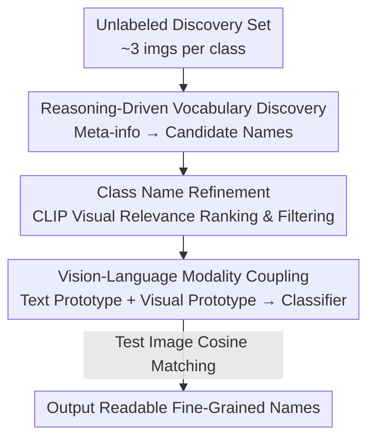

# Thinking Beyond Labels: Vocabulary-Free Fine-Grained Recognition using Reasoning-Augmented LMMs

**Conference**: CVPR 2026  
**Paper**: [CVF Open Access](https://openaccess.thecvf.com/content/CVPR2026/html/Demidov_Thinking_Beyond_Labels_Vocabulary-Free_Fine-Grained_Recognition_using_Reasoning_Augmented_LMMs_CVPR_2026_paper.html)  
**Code**: https://github.com/demidovd98/FiNDR  
**Area**: Multimodal VLM  
**Keywords**: Vocabulary-Free Fine-Grained Recognition, Reasoning-Augmented LMM, Dynamic Class Name Discovery, Open-World Recognition, CLIP Modality Coupling  

## TL;DR
FiNDR utilizes a reasoning-augmented Large Multimodal Model (LMM) to directly "think of" fine-grained class names for unlabeled images. By employing CLIP for visual filtering and modality coupling to construct a classifier, it pushes vocabulary-free recognition to SOTA on 5 fine-grained datasets (avg. cACC +9.5%), even surpassing the zero-shot upper bound that uses "ground truth class names."

## Background & Motivation
**Background**: Fine-grained recognition requires distinguishing visually similar sub-classes within the same super-category (e.g., 200 species of birds, 196 car models). Traditional approaches rely on massive vocabularies pre-defined by domain experts. However, in open-world scenarios, such vocabularies are often incomplete or entirely absent, giving rise to "Vocabulary-Free Fine-Grained Recognition"—where the model must discover the class name list and classify test images into these discovered names without any pre-defined labels.

**Limitations of Prior Work**: Existing vocabulary-free methods fall into three categories, each with significant drawbacks. ① Clustering methods (KMeans, Sinkhorn) utilize only visual features, outputting non-semantic cluster IDs rather than human-readable names. ② Zero-shot methods with pre-defined vocabularies (CLIP + WordNet, CaSED) still require a large, rigid candidate list and fail when labels are missing or noisy. ③ Dynamic vocabulary discovery (FineR, E-FineR) uses a VLM to describe images followed by a text-only LLM to infer labels; however, this long multi-stage pipeline **propagates errors across levels**, and LLM-generated attributes are often not tailored to specific images, leading to unreliability under intra-class variation.

**Key Challenge**: Models are either tethered to fixed vocabularies (Zero-shot) or fragile multi-stage heuristic pipelines (Dynamic discovery). Furthermore, these dynamic methods have consistently failed to surpass the "zero-shot classifier with known ground truth names," which is regarded as an insurmountable upper bound. The root cause is that text-only LLMs cannot see the images and have limited knowledge bases, leading them to confidently provide incorrect names (e.g., naming a white dog a "Golden Retriever" or giving placeholder labels like "Possible Cat Breeds").

**Goal**: Construct a fully automated system featuring **zero prior class names** that can generate semantically accurate fine-grained names and perform robust classification while avoiding error propagation.

**Key Insight**: Recent reasoning-augmented LMMs (with explicit/implicit Chain-of-Thought) can simultaneously process visual and textual inputs, decompose problems, retrieve latent knowledge, and self-correct. This perfectly aligns with the requirements of vocabulary-free tasks: visual discrimination and contextual knowledge. The authors hypothesize that delegating naming to a unified LMM capable of both seeing and reasoning is more reliable than "VLM description + Text LLM reasoning" pipelines.

**Core Idea**: Empower a reasoning LMM to directly generate descriptive candidate names for each image (replacing fragile pipelines), then use a VLM as a "semantic validator" for filtering and ranking. Finally, use modality coupling to blend textual and visual prototypes into a final classifier—the entire chain requires zero supervision, zero training, and zero pre-defined vocabularies.

## Method

### Overall Architecture
Given a minimal "discovery set" $D_\text{disc}=\{x_i\}_{i=1}^N$ (defaulting to 3 unlabeled images per class), FiNDR (Fine-grained Name Discovery via Reasoning) transforms it into an inferable fine-grained classifier in two main phases without touching any ground truth names or attribute metadata:

- **Vocabulary Discovery Phase**: A reasoning LMM first infers dataset-level "meta-information" (super-category, granularity unit, required expert type) from a few randomly sampled images, which is then used as a frozen context. Given this context, the LMM provides a fine-grained candidate name $\tilde c_i$ for each image, which are normalized and cleaned to form the initial candidate vocabulary $\tilde C$.
- **Classifier Preparation Phase**: CLIP computes the visual relevance between each candidate name and images in the discovery set, filtering out names that do not align with visual evidence to obtain a refined vocabulary $\tilde C^*$. Textual prototypes of each class name and visual prototypes of their pseudo-labeled samples are then coupled into a unified vision-language classifier $W_{VL}$. At inference time, the visual features of test images are matched against $W_{VL}$ via cosine similarity, outputting **human-readable semantic names** instead of numerical indices.

### Key Designs

**1. Reasoning-Driven Vocabulary Discovery: Replacing pipelines with a single LMM**

This step addresses "multi-stage pipeline error propagation" and "blind text-only LLMs." Instead of VLM-generated descriptions passed to a text LLM, a single reasoning LMM (Qwen2.5-VL-72B-Instruct) is used for two-round naming. Round one involves **dataset-level meta-info inference**: 3 images $S=\{x_a,x_b,x_c\}$ are sampled to let the LMM output $m^\star = M_\text{meta}(S) = (c_\text{meta}, u_\text{type}, e_\text{expert})$, representing the general category, the unit of granularity, and the specific domain expert (e.g., "Ornithologist"). Round two uses this frozen $m^\star$ to query labels for each image: $\tilde c_i = M_\text{main}(x_i, m^\star)$. This step-by-step prompting clarifies "what is being classified" before per-image discrimination, proving more robust than independent guesses. Finally, predictions undergo normalization (case, pluralization, whitespace) and filtering of syntactically corrupt strings to produce $\tilde C$.

**2. Class Name Refinement: Using CLIP as a semantic validator**

Some LMM-generated names may not represent images in the set (hallucinations or over-generalization). A visual validation step using CLIP text-image alignment is applied: for each candidate $c\in\tilde C$, the average cosine similarity between its text embedding $t_c$ and the visual features $v_j$ of the discovery set is calculated as the visual relevance score:

$$\text{score}(c) = \frac{1}{N}\sum_{j=1}^{N}\cos(t_c, v_j) = \frac{1}{N}\sum_{j=1}^{N}\frac{t_c^\top v_j}{\lVert t_c\rVert\cdot\lVert v_j\rVert}.$$

By keeping only high-ranking candidates, the refined vocabulary $\tilde C^*\subseteq\tilde C$ is obtained. This shrinks the semantic space to align with real visual evidence.

**3. Visual-Language Modality Coupling: Balancing textual and visual prototypes**

Textual prototypes alone are vulnerable to ambiguity or domain shift. FiNDR constructs and blends textual and visual prototypes for each $c\in\tilde C^*$. The textual prototype $t_c$ is directly encoded by CLIP's text branch. For the visual prototype, images in the discovery set are pseudo-labeled by their highest similarity to $\tilde C^*$, forming set $U_c$. To mitigate the lack of diversity in small samples, $K=10$ random crops and horizontal flips are applied to each image, and the augmented features are averaged:

$$v_c = \frac{1}{K\cdot|U_c|}\sum_{i=1}^{|U_c|}\sum_{k=1}^{K}\frac{f_V(\text{Aug}_k(x_i^c))}{\lVert f_V(\text{Aug}_k(x_i^c))\rVert}.$$

The final vision-language classifier prototype is a linear mixture: $W_{VL}^{(c)} = \alpha\cdot t_c + (1-\alpha)\cdot v_c$, with the coupling coefficient fixed at $\alpha=0.7$. This allows visual evidence to compensate for noisy text labels. At inference, $\tilde y = \arg\max_{c\in\tilde C^*}\cos(f_V(x), W_{VL}^{(c)})$ is used.

## Key Experimental Results

### Main Results
Evaluation on five fine-grained benchmarks (CUB-200, Cars-196, Dogs-120, Flowers-102, Pets-37) under the vocabulary-free setting (3 unlabeled images/class). Metrics include clustering accuracy (cACC) and semantic accuracy (sACC).

| Method | Vocabulary Source | Avg. cACC | Avg. sACC |
| :--- | :--- | :--- | :--- |
| KMeans | None (Pure Visual) | 36.7 | — |
| CaSED | Predefined | 43.7 | 52.6 |
| BLIP-2 | Auto Discovery | 47.2 | 58.6 |
| FineR | Auto Discovery | 57.0 | 64.3 |
| E-FineR (Prev. SOTA) | Auto Discovery | 58.4 | 66.3 |
| **FiNDR (Ours)** | Auto Discovery | **67.9** | **70.6** |
| CLIP Zero-Shot (Reference Upper Bound) | Ground Truth | 65.8 | 77.6 |

Ours improves over E-FineR by +9.5% cACC and +4.3% sACC on average. Notably, the avg. cACC (67.9%) **surpasses** the CLIP zero-shot upper bound (65.8%) using ground truth names, challenging the assumption that manual vocabularies are the performance ceiling.

### Ablation Study: Prompt Design (Table 2, CUB/Cars/Pets)

| Configuration | Pets cACC | Pets sACC | Description |
| :--- | :--- | :--- | :--- |
| Base | 76.61 | 74.02 | Simple "What is this object?" prompt |
| Base + Meta | 81.82 | 82.96 | Adding meta-class info (+5.2 cACC) |
| Base + Meta + Expert (Full) | 84.13 | 84.46 | Adding expert prefix (+1.5 sACC) |

Meta-information consistently improves scores across all datasets, while expert prefixes further refine semantic precision.

### Key Findings
- **Surpassing the upper bound**: The discovered vocabulary's clustering accuracy exceeds the zero-shot classifier using ground truth names. This suggests rigid manual labels are not always optimal; FiNDR often provides more precise labels (e.g., scientific names) that sACC might underestimate.
- **cACC Gain vs. sACC Gain**: Gains in cACC are larger than sACC in Flowers and Cars. This is because visual clustering is correct, but the descriptive names do not perfectly match the "biased" single ground truth name in traditional benchmarks.
- **Open-source parity**: With careful prompting, Qwen2.5-VL (Open-source) achieves 76.65% sACC on CUB-200, nearing Gemini2.5-Flash (78.04%).

## Highlights & Insights
- **Unified Reasoning LMM**: Compressing the pipeline into a single vision-capable reasoning LMM eliminates error propagation at the source.
- **Meta-info as Context**: Inferring category/granularity/expert first creates a task profile, a low-cost yet high-gain prompt engineering strategy.
- **VLM as Validator**: Using CLIP to filter hallucinations and modality coupling to hedge against noisy text labels provides a practical paradigm for weak-label scenarios.

## Limitations & Future Work
- The sACC metric is flawed as it only rewards a single standard ground truth name, systematically underestimating precise but non-official discovered names.
- Reliance on large LMMs (72B) for the discovery phase introduces computational costs, though inference uses lightweight ViT-B/16.
- Future work could include adaptive modality coupling coefficients based on naming confidence and evaluation protocols that accommodate multiple valid names.

## Related Work & Insights
- **vs. FineR / E-FineR**: These suffer from cascade errors in multi-stage pipelines where text LLMs cannot see images. FiNDR uses a unified vision-reasoning LMM to surpass the zero-shot bound.
- **vs. Zero-shot (CaSED / WordNet)**: These require pre-defined large-scale vocabularies which lack open-world coverage; FiNDR generates these dynamically and achieves higher clustering accuracy.
- **vs. Clustering (KMeans)**: Pure visual methods lack semantics; FiNDR provides human-interpretable names.

## Rating
- Novelty: ⭐⭐⭐⭐⭐ 
- Experimental Thoroughness: ⭐⭐⭐⭐ 
- Writing Quality: ⭐⭐⭐⭐ 
- Value: ⭐⭐⭐⭐⭐ 

<!-- RELATED:START -->

## Related Papers

- [\[CVPR 2026\] Chart-FR1: Visual Focus-Driven Fine-Grained Reasoning on Dense Charts](chart-fr1_visual_focus-driven_fine-grained_reasoning_on_dense_charts.md)
- [\[CVPR 2026\] ReasonMap: Towards Fine-Grained Visual Reasoning from Transit Maps](reasonmap_towards_fine-grained_visual_reasoning_from_transit_maps.md)
- [\[CVPR 2026\] Thinking With Videos: Multimodal Tool-Augmented Reinforcement Learning for Long Video Reasoning](thinking_with_videos_multimodal_tool-augmented_reinforcement_learning_for_long_v.md)
- [\[CVPR 2026\] HandVQA: Diagnosing and Improving Fine-Grained Spatial Reasoning about Hands in Vision-Language Models](handvqa_diagnosing_and_improving_fine-grained_spatial_reasoning_about_hands_in_v.md)
- [\[CVPR 2026\] SpaceTools: Tool-Augmented Spatial Reasoning via Double Interactive RL](spacetools_tool-augmented_spatial_reasoning_via_double_interactive_rl.md)

<!-- RELATED:END -->
