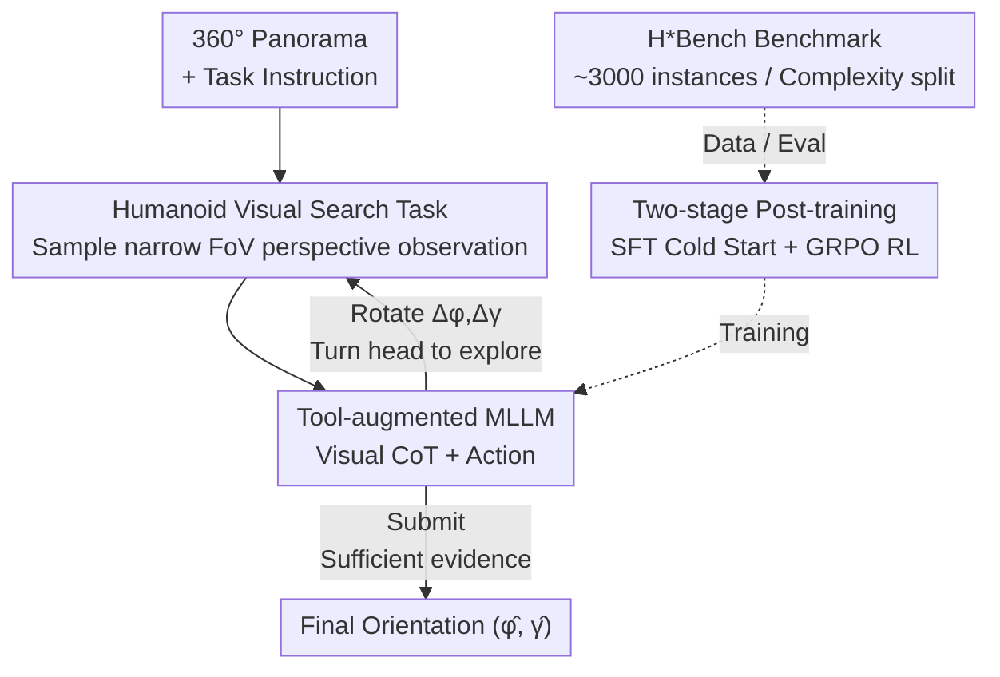

# Thinking in 360°: Humanoid Visual Search in the Wild

**Conference**: CVPR 2026  
**Paper**: [CVF Open Access](https://openaccess.thecvf.com/content/CVPR2026/html/Yu_Thinking_in_360deg_Humanoid_Visual_Search_in_the_Wild_CVPR_2026_paper.html)  
**Code**: https://humanoid-vstar.github.io  
**Area**: Multimodal VLM / LLM Reasoning / Embodied Visual Search  
**Keywords**: Humanoid Visual Search, 360° Panorama, Visual Chain-of-Thought, Embodied Reasoning, Post-training  

## TL;DR
The paper elevates "visual search" from cropping and zooming in static 2D images to an embodied task where humanoid agents **actively turn their heads** to find objects/paths in a 360° panorama (HVS). It uses panoramic images as a hardware-free, lightweight simulator to close the "perception-action" loop, proposes a matching in-the-wild benchmark H\*Bench, and utilizes a two-stage post-training pipeline with SFT+GRPO to boost the object search success rate of a 3B open-source model from 14.83% to 47.38% and path search from 6.44% to 24.94%.

## Background & Motivation

**Background**: Currently, the strongest visual search methods are mostly built upon multimodal large language models (MLLMs), leveraging their rich world knowledge (e.g., object co-occurrence relations) to localize targets in images. Representative works like V\* and its successors (Chain-of-Focus, Mini-o3, etc.) follow a paradigm where: given a static, low-resolution image, the model "looks closer" at details within a fixed canvas through purely computational actions like **cropping, zooming, and selecting ROIs**.

**Limitations of Prior Work**: This paradigm has two fundamental deficiencies. First, it is **non-interactive**—without an interactive simulator, the model cannot change its field of view to obtain information outside the initial sight, and what is unseen remains unseen. Second, it is **disembodied**—visual reasoning is completely decoupled from actions in the physical world, so searching is rarely driven by actual embodied tasks (manipulation, navigation) and degrades into abstract perception exercises.

**Key Challenge**: Human visual search relies on the **coordination of head (cephalomotor) and eye (oculomotor) movements**—the head is responsible for large rotations to explore unseen regions, while the eyes handle fine-grained scanning within the observed content. Existing MLLM methods only mimic the "eyes" (zooming on a static canvas) but completely lack the "head" (altering the physical viewpoint). Adding the "head" traditionally requires 3D simulators or real hardware; however, the former are difficult to build and suffer from poor photorealism, while the latter are hard to scale and replicate, mostly restricted to simple household scenes.

**Goal**: To construct an embodied, interactive, and highly scalable research platform for visual search, and push it into **complex in-the-wild scenarios that truly test visual-spatial reasoning** (subway hubs, large shopping malls, urban streets).

**Key Insight**: The authors' key observation is that human reasoning during navigation is **intermittent**, triggered only at key decision points (stopping to observe, judge, and disambiguate). Abstracting whole-body movement into the atomic action of "turning the head" perfectly captures these key cognitive points. A single high-resolution 360° panoramic image is sufficient to act as a lightweight, closed-loop environment where the agent can "turn its head to change the input," thereby bypassing 3D simulations and real hardware.

**Core Idea**: Using a 360° panoramic image as a hardware-free simulator, allowing the MLLM to iteratively invoke "turning the head" as an action tool, reasoning while turning (visual chain-of-thought), transforming from a passive "image describer" into an active "embodied searcher."

## Method

### Overall Architecture

The task is called **Humanoid Visual Search (HVS)**: a humanoid agent with a narrow field of view (FoV) is placed in a world represented by a single 360° panoramic image. Given a natural language instruction, it must locate the target through a sequence of "head turning" actions and finally submit the optimal orientation. The environment is the panorama $S_o=\{o_{\phi,\gamma}\}$, where each observation $o_{\phi,\gamma}$ is a narrow-FoV perspective view sampled from the panorama based on yaw $\phi$ and pitch $\gamma$. The goal of HVS is formalized as finding the orientation that maximizes the probability of task success given instruction $x$ and observation $o_{\phi,\gamma}$:

$$(\phi^*, \gamma^*) = \arg\max_{\phi,\gamma} P(r_s \mid o_{\phi,\gamma}, x)$$

This is instantiated into two concrete subtasks: **Humanoid Object Search (HOS)**—bringing the target object into the foveal region at the center of the viewport, which serves as a precursor to manipulation; and **Humanoid Path Search (HPS)**—finding a viable path to the destination and aligning the body orientation with it, serving as a precursor to locomotion (HPS only needs yaw alignment $\phi^*$, as the ground can be approximated as a plain).

During inference, the model behaves as a tool-augmented MLLM with policy $\pi_\theta(y_t, a_t \mid o_t, x, H_t)$: at each time step $t$, based on the current observation $o_t$, instruction $x$, and history $H_t=\{(o_i,y_i,a_i)\}_{i=1}^{t-1}$, it first generates a textual chain-of-thought rationale $y_t$, followed by an action $a_t$. The action space consists of only two primitives—**rotate** $a_t^{rot}=(\Delta\phi,\Delta\gamma)$ to update the viewport (right/up is positive, yaw is cyclic), and **submit** $a_t^{sub}$ to finalize the current orientation as the prediction $(\hat\phi,\hat\gamma)$ and terminate the episode. This closed-loop process of "rotate to explore $\rightarrow$ perceive new content $\rightarrow$ continue reasoning" forms a visual chain-of-thought.

Since MLLMs are pre-trained on static, disembodied internet data, they naturally lack spatial common sense and active 3D planning capabilities (even GPT-4o achieves only around 20% success rate on this task). The authors adopt a **two-stage post-training** method to transform the MLLM into a competent search agent: Stage 1 utilizes SFT to inject basic task reasoning and tool-use capabilities, and Stage 2 utilizes GRPO reinforcement learning to refine it into an exploratory policy. All data and evaluation are provided by the authors' newly constructed **H\*Bench** benchmark.

### Key Designs

**1. Humanoid Visual Search Task: Closing the perception-action loop with a 360° panorama as a hardware-free simulator**

This design directly addresses the two prior limitations—"non-interactive" and "disembodied." Actions in traditional 2D visual search are confined to cropping and zooming on a fixed canvas, unable to perceive the world beyond the initial field of view. Conversely, enabling the model to turn its head and observe the world typically demands cumbersome 3D simulators or real hardware that are difficult to build and scale. The key insight of the authors is that abstracting whole-body movement into the single atomic action of "turning the head" allows **a single 360° panoramic image to represent the entire observable world**. The agent starts with only a narrow-FoV perspective image $o_{\phi_t,\gamma_t}$, and each output $a^{rot}=(\Delta\phi,\Delta\gamma)$ resamples a new viewpoint from the panorama ($\phi_{t+1}=\phi_t+\Delta\phi$, $\gamma_{t+1}=\gamma_t+\Delta\gamma$). Thus, the closed-loop of "turning the head to change visual input" is inexpensively realized—offering both interactivity and embodiment without physical hardware. This precisely mirrors the human nested search mechanism where "the head explores the unseen, and the eyes exploit the seen": large head rotations take care of exploration, while fine alignment before submission corresponds to eye saccades.

**2. Tool-Augmented MLLM and Visual Chain-of-Thought: Invoking "turning the head" recursively as an action tool**

Having the environment is not enough; the MLLM must learn to couple visual reasoning with physical actions. The authors leverage the "MLLM + Tool" paradigm, but with a critical distinction: previous tool-use paradigms perform computational operations like OCR, cropping, or zooming **on static image files**, where the actions are strictly inside a 2D canvas. Here, the authors turn the tool into a **real-world physical action—active head rotation**. At each step, the model first generates an observation-aligned textual reasoning trajectory $y_t$ (e.g., "Nothing is seen here; I should turn around" or "I see the ticket gate sign; evidence is sufficient"), and then decides whether to continue exploring with $a^{rot}$ or terminate with $a^{sub}$. The multi-step reasoning history $\{(o_i,y_i,a_i)\}$ is concatenated into a **visual chain-of-thought**, successfully upgrading passive visual reasoning into active embodied reasoning. This serves as the bridge from a passive "describer" to an active "searcher."

**3. Two-Stage Post-Training: SFT cold start to build behavioral priors, GRPO reinforcement learning to refine policy**

MLLMs pre-trained on internet data lack spatial common sense and active planning, yielding a performance around only 20% even for GPT-4o in zero-shot settings. The authors bridge this gap via two-stage post-training. **Stage 1 (SFT)** conducts full-parameter fine-tuning on a set of carefully constructed multi-turn trajectories, teaching the model to generate structured action plans from multimodal inputs and establishing baseline reasoning and tool-use priors. This cold-start dataset is constructed using human-annotated optimal actions combined with GPT-4o-generated, human-verified, hallucination-free chain-of-thought rationales (totaling 2,000 multi-turn trajectories). **Stage 2 (RL)** uses GRPO (Group Relative Policy Optimization) to further refine the policy, encourage long-horizon reasoning, and elevate the behavioral priors from imitation learning into a robust, generalizable exploration policy. Empirical results show a clear division of labor: SFT contributes the vast majority of performance gains (the 3B model's HOS increases from 14.83% to 40.83%, HPS from 6.44% to 23.00%), whereas RL provides a moderate polishing (HOS improves by another 6.55%, HPS by 1.94%). Furthermore, **applying RL directly without a prior SFT phase breaks the instruction-following ability**, meaning the order of stages cannot be reversed.

**4. H\*Bench Benchmark: Moving visual search from indoor homes to in-the-wild complex worlds**

Investigating visual-spatial reasoning requires complex environments. Existing embodied platforms either suffer from synthetic appearances or are constrained to household settings. H\*Bench addresses this by utilizing high-resolution panoramic videos (up to $7680\times3840$) to construct approximately 3,000 annotated task instances. Each instance is evaluated under 4 different starting orientations, totaling 12,000 search episodes across 12 countries, 6 macro-scene categories, and 18 fine-grained scene types (transportation hubs, large retail centers, public institutes, urban streets, etc.). For annotation, annotators freely rotate the camera within a perspective interface, write natural language instructions, and draw compact bounding boxes. The center of the bounding box is back-projected to the panorama to calculate the optimal orientation $(\phi^*,\gamma^*)$. To ensure interpretable evaluation, a **complexity split** is designed: HOS is split by the target's initial visibility $d$ (the ratio of visible area to total area) into Easy ($d\ge0.5$), Medium ($0\le d<0.5$), and Hard ($d=0$, completely invisible initially). HPS is categorized into Easy, Medium, Hard, and Extreme based on two dimensions: "textual cues presence" $\times$ "cue alignment with the ground-truth path". Evaluation uses a tolerance zone to determine success: $\tau_\phi=30°, \tau_\gamma=20°$ for HOS (simulating human foveal vision) and a stricter $\tau_\phi=10°$ for HPS (demanding precise locomotion directions).

### Loss & Training
- **SFT**: Full-parameter fine-tuning on mixed object and path search data for 3 epochs; training framework is LLaMA-Factory.
- **RL (GRPO)**: Trained for 70 steps based on SFT-tuned Qwen2.5-VL-3B to produce HVS-3B, using a framework based on VAGEN. The reward function is ablated (with combinations of format, correctness, and distance-to-goal, as detailed in the table below).
- **Efficiency Discovery**: Short GRPO rollouts coupled with inference-time scaling perform comparably to long rollouts (10 turns) while converging significantly faster; retaining only 2 turns of historical context during inference is sufficient.

## Key Experimental Results

### Main Results (H\*Bench Success Rate %, Overall)

| Model | HOS Object Search | HPS Path Search | Description |
|------|------|------|------|
| Qwen2.5-VL-3B (base) | 14.83 | 6.44 | Zero-shot open-source small model |
| + SFT | 40.83 | 23.00 | SFT contributes the majority of gains |
| + RL = **HVS-3B** | **47.38** | **24.94** | Object search rate more than tripled |
| Qwen3-VL-8B + SFT = HVS-8B | 60.29 | 32.87 | Strongest HOS after fine-tuning |
| Qwen3-VL-4B + SFT = HVS-4B | 54.71 | 31.00 | 4B fine-tuning |
| MiMo-Embodied-7B + SFT | 23.71 | 31.56 | Trained on embodied data, largest HPS improvement |
| GPT-4o (proprietary) | 19.75 | 23.69 | Zero-shot proprietary |
| Gemini2.5-Pro (proprietary) | 31.96 | 33.00 | Strongest zero-shot baseline |

Key metrics: ① Even top-tier proprietary models achieve only ~30% in zero-shot settings, indicating that HVS remains an open challenge. ② After post-training, the smallest 3B model outperforms Gemini 2.5 Pro (31.96%) in object search (47.38%), though all fine-tuned models still fall short of Gemini's 33.00% in path search. ③ Larger models are not always better—in the Gemma-3 and Qwen 2.5-VL series, 4B/3B models outperform 12B/7B models in HOS.

### Ablation Study: Reward Shaping on HPS (GRPO)

| Reward Configuration | Overall | Easy | Medium | Hard | Extreme |
|------|------|------|------|------|------|
| SFT (baseline) | 23.44 | 26.00 | 24.56 | 24.77 | 12.50 |
| format + correctness | 22.38 | 33.80 | 17.32 | 21.73 | 7.87 |
| format + corr + distance | 21.37 | 34.40 | 15.13 | 20.09 | 6.94 |
| format + distance | 21.31 | 29.80 | 17.54 | 20.56 | 11.11 |

All reward variants **only yield improvements on the Easy split** (peaking at 34.40%), while consistently **degrading performance on more difficult splits** (with Overall scores all lower than the SFT baseline of 23.44%). This highlights the intrinsic challenge of path search: it is exceptionally difficult to design a reward function that behaves consistently with the ground-truth target across all difficulty levels.

### Embodied vs. Disembodied (Cross-Benchmark Comparison)

| Method | V\*Bench (2D Static) | H\*Bench (Embodied) |
|------|------|------|
| Mini-o3 | 88.2 | 2.5 |
| Chain-of-Focus | 88.0 | 11.6 |
| **HVS-3B (Ours)** | 65.5 | 38.4 |

2D visual search methods are nearly saturated on the static V\*Bench (88%+), but **plummet to 2.5%/11.6%** when evaluated on the embodied H\*Bench. This proves that capabilities learned from passive internet data fail to transfer to 3D active interaction. In contrast, while achieving 38.4% on H\*Bench, our HVS-3B maintains a performance of 65.5% on V\*Bench, indicating that it acquires 3D embodied search capabilities without severely sacrificing its original 2D ability.

### Key Findings
- **SFT outlines the structure, RL refines the performance**: SFT contributes the vast majority of the gains (HOS +26.00%, HPS +16.56%), while RL provides a moderate boost (+6.55% / +1.94%). Implementing RL before SFT is ineffective and disrupts instruction-following capabilities.
- **Path search is a tough nut to crack**: Its performance ceiling is noticeably lower. The authors attribute this to its heavy reliance on physical, spatial, and social common sense (such as "cannot walk through walls," or the functions of stairs, caution tapes, and crosswalks). Such common sense is implicit, contextualized, and procedural, making it difficult to inject via post-training. RL training even **leads to regression** on the Medium (23.03% -> 20.18%) and Extreme splits (14.81% -> 12.04%) of HPS.
- **Bi-directional cross-task synergy**: Training solely on object search improves path search success from 6.4% to 20.7%; training purely on path search boosts object search from 14.8% to 29.5%. This demonstrates that the dual skills of active exploration and visual localization mutually reinforce each other.
- **Efficiency**: Short rollout + inference-time scaling matches long rollout configurations; keeping a history of only 2 turns of context during inference is sufficient.

## Highlights & Insights
- **"Panorama = Hardware-free Embodied Simulator" is an exceptionally clever simplification**: Capturing the observation that navigation reasoning occurs primarily at key decision points, it abstracts whole-body locomotion into mere head rotation. This bypasses the complete engineering overhead of 3D simulation and real robots while simultaneously preserving interactivity and embodiment. This is the most transferable takeaway of the paper: when your task demands "actively changing perspective" but cannot afford real physical/synthetic environments, a single panorama might be all you need.
- **Invoking "turning the head" as a tool** elevates the visual chain-of-thought from "zooming on static images" to "physically altering orientations in a 3D world." This cleanly bridges passive perceptual reasoning and active embodied reasoning.
- **Honestly quantifying the performance gap**: Instead of boasting about superficial SOTA, the paper repeatedly points out that path searching remains largely unresolved even after post-training and that RL training degrades on hard samples. Explaining "what remains unsolved" with higher clarity than "how strong we are" gives the benchmark great long-term value.
- **Interpretable complexity split**: Categorizing HOS by initial visibility $d$ and HPS by "cue-path alignment" provides high readability into precisely where and when the model fails, rather than offering just a single overall success rate.

## Limitations & Future Work
- **Limitations acknowledged by the authors**: Post-training only reinforces low-level sensorimotor abilities (visual localization, exploration). It offers limited help for high-level reasoning requiring physical, spatial, and social common sense (especially in HPS), and RL even degrades on more complex tasks. Designing a reward function that aligns with ground-truth objectives across all difficulty levels remains difficult.
- **The task remains an abstracted simplification**: Condensing whole-body locomotion to the single atomic action of "turning the head" and approximating the world with a single panorama circumvents continuous movement, dynamic environments, and multi-step navigation execution. It evaluates "determining where to look" rather than "actually walking there", leaving a noticeable gap to physical robot deployment.
- **Flat-world assumption in path search**: HPS only aligns the yaw angle $\phi^*$ by approximating the ground as a flat plane. Modeling multi-level vertical paths (stairs, escalators) is simplified away, though this is precisely where physical-social common sense is the hardest to capture.
- **Future directions**: The authors recommend designing more robust reward functions, more efficient visual tokenizers, pre-training methods capable of injecting "action-oriented spatial world knowledge," and balancing model performance across different difficulties. They also emphasize that scaling the collection of embodied search data is the key to unlocking in-the-wild visual-spatial reasoning.

## Related Work & Insights
- **vs V\* / Chain-of-Focus / Mini-o3 (2D Visual Search)**: These methods crop and zoom inside static 2D images, where actions are computational operations on image files. This work replaces these computational actions with physical head turning and replaces the environment with a closed-loop 360° panorama. Consequently, while they achieve 88%+ on V\*Bench, they plummet to 2.5%/11.6% on H\*Bench. In contrast, our HVS-3B remains robust in both (65.5% / 38.4%).
- **vs Visual Navigation / Vision-Language Navigation**: Traditional navigation focuses on traversing an entire trajectory as quickly as possible, relying heavily on hard-to-build 3D simulators or physical robots, and is mostly restricted to indoor home environments. This work focuses exclusively on the search-reasoning taking place at "key decision points" and closes the loop directly using panoramas, bypassing 3D simulations and hardware, thus making it highly scalable.
- **vs Cosmos-Reason1 / Gemini Robotics-ER (Embodied Reasoning MLLM)**: These works enable MLLMs to perceive the physical world via videos and make embodied decisions, yet active, interleaved multi-modal visual search remains largely unexplored. This work explicitly bridges this gap with "active head rotation + visual chain-of-thought."

## Rating
- Novelty: ⭐⭐⭐⭐⭐ Elevates visual search from a 2D static canvas to a 360° panoramic embodied closed-loop; the "hardware-free simulator" setup is both elegant and essential.
- Experimental Thoroughness: ⭐⭐⭐⭐ Solid coverage of multiple open-source, proprietary, and embodied models, HOS/HPS dual tasks, complexity splits, reward ablations, and cross-task/cross-benchmark analyses; however, physical deployment on real robots is missing.
- Writing Quality: ⭐⭐⭐⭐⭐ Extremely clear motivational derivation, honest about failures and limitations, and the complexity split makes the conclusions highly interpretable.
- Value: ⭐⭐⭐⭐⭐ Proposes a new task + the first in-the-wild embodied visual search benchmark, paving a scalable research path for embodied reasoning in humanoid robotics, assistive technologies, and AR.

<!-- RELATED:START -->

## Related Papers

- [\[CVPR 2026\] Thinking with Programming Vision: Towards a Unified View for Thinking with Images](thinking_with_programming_vision_towards_a_unified_view_for_thinking_with_images.md)
- [\[ICLR 2026\] Mini-o3: Scaling Up Reasoning Patterns and Interaction Turns for Visual Search](../../ICLR2026/vlm_reasoning/mini-o3_scaling_up_reasoning_patterns_and_interaction_turns_for_visual_search.md)
- [\[ICLR 2026\] SpatiaLab: Can Vision-Language Models Perform Spatial Reasoning in the Wild?](../../ICLR2026/vlm_reasoning/spatialab_can_vision-language_models_perform_spatial_reasoning_in_the_wild.md)
- [\[CVPR 2026\] Thinking Diffusion: Penalize and Guide Visual-Grounded Reasoning in Diffusion Multimodal Language Models](thinking_diffusion_penalize_and_guide_visual-grounded_reasoning_in_diffusion_mul.md)
- [\[CVPR 2026\] VideoAuto-R1: Video Auto Reasoning via Thinking Once, Answering Twice](videoauto-r1_video_auto_reasoning_via_thinking_once_answering_twice.md)

<!-- RELATED:END -->
