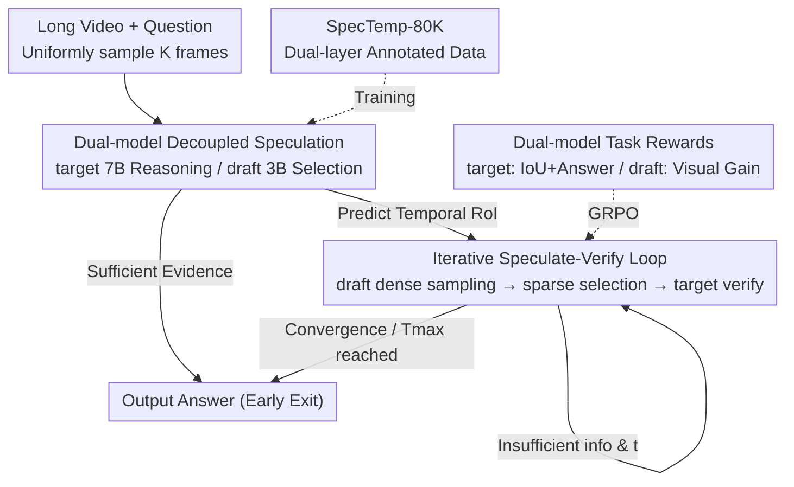

# Thinking with Drafts: Speculative Temporal Reasoning for Efficient Long Video Understanding

**Conference**: CVPR 2026  
**Paper**: [CVF Open Access](https://openaccess.thecvf.com/content/CVPR2026/html/Hu_Thinking_with_Drafts_Speculative_Temporal_Reasoning_for_Efficient_Long_Video_CVPR_2026_paper.html)  
**Code**: To be confirmed  
**Area**: Video Understanding  
**Keywords**: Long Video Understanding, Speculative Decoding, Dual-model Collaboration, Frame Selection, Reinforcement Learning  

## TL;DR
SpecTemp offloads the time-consuming frame magnification process in the "thinking-with-frames" paradigm to a lightweight 3B draft MLLM. This draft model performs dense sampling and selects sparse keyframes, allowing the 7B target MLLM to focus solely on temporal reasoning and verification. Through an iterative speculative-verification loop, it maintains or improves accuracy across 8 video benchmarks while reducing inference latency by approximately 20%.

## Background & Motivation

**Background**: The state-of-the-art approach for long video understanding is the "thinking-with-frames" paradigm. Instead of processing the entire video at once, the model alternates between two tasks: extracting "temporal cues" from the long duration (identifying segments likely to contain answers) and performing dense frame sampling for local inspection. This iteration gradually converges attention onto the most informative segments for evidence-based reasoning across long sequences.

**Limitations of Prior Work**: This paradigm faces a critical efficiency bottleneck as high-level reasoning trajectories and densely sampled visual tokens accumulate in the context, causing the multimodal sequence to grow excessively. By plotting attention maps on Qwen2.5-VL-7B, the authors observed that language tokens focus sparsely on a small subset of visual tokens, indicating a clear "modal boundary." Statistics show a long-tail distribution where **over 90% of visual tokens have attention scores below $10^{-3}$**, contributing little to reasoning while occupying context and slowing down prefill.

**Key Challenge**: Precision requires dense sampling to capture details, but the resulting massive redundancy in visual tokens degrades inference efficiency. Sensing (requiring density and coverage) and reasoning (requiring precision and speed) are forced into the same large model and context, leading to mutual interference.

**Key Insight**: Inspiration is drawn from LLM speculative decoding, where a lightweight draft model quickly predicts intermediate tokens for parallel verification by a stronger target model, accelerating inference without losing accuracy. If "frame magnification/dense exploration"—the most time-consuming step—is treated as a "speculative" target offloaded to a small model, can perception and reasoning be decoupled? This aligns with neural synergy: a fast sensing pathway (lemniscal) scans the scene, followed by a slower cognitive pathway (extralemniscal) for integration and verification.

**Core Idea**: Use a "lightweight draft MLLM for speculative dense sampling/frame selection + strong target MLLM for temporal reasoning and verification" collaboration to decouple temporal perception from reasoning through an iterative convergence process.

## Method

### Overall Architecture
SpecTemp is a dual-system collaborative framework: the **target MLLM (7B)** handles temporal reasoning and verification, while the **draft MLLM (3B)** specializes in dense perception and fine-grained frame selection. The significant asymmetry in parameter sizes ($|\pi_{\text{draft}}| \ll |\pi_{\text{target}}|$) allows the small model to perform cheap dense exploration while the large model focuses on high-level reasoning.

The joint likelihood is decomposed into a product of target and draft collaboration:

$$\prod_{\le T_{\max}} \pi_{\text{target}}\!\left(W^a, V^d \mid W^q, V^s\right)\cdot \pi_{\text{draft}}\!\left(V^s \mid V^d\right)$$

Where $V^d$ represents densely sampled frames (e.g., 1 fps) within the target's predicted Region of Interest (RoI), $V^s$ represents the sparse representative frames (e.g., 2 frames) selected by the draft, and $T_{\max}$ is the maximum number of iterations.

Mechanism (Algorithm 1): ① Initially sample $K$ frames uniformly for the target's preliminary reasoning; if evidence is sufficient, output the answer directly (early exit). ② Otherwise, the target outputs a temporal RoI for further inspection; the draft densely samples within this zone and returns a few sparse keyframes. ③ The target continues reasoning and verification with these frames, repeating the draft speculation if information remains insufficient, until convergence or $T_{\max}$ is reached. Notably, the draft is conditioned only on the **current** reasoning trajectory, while the target utilizes the **entire history**, allowing the small model to remain unburdened by historical context.

### Key Designs

**1. Dual-model Speculative Decoupling: Offloading Dense Perception**

The core design addresses the bottleneck where "thinking-with-frames" piles dense visual tokens into the 7B model's context, slowing prefill. SpecTemp offloads the "dense sampling + frame selection" labor to the 3B draft model. The draft samples at 1 fps within the target's specified region but only returns a sparse subset $V^s$ (2 frames per round) to the target. The target processes only sparse frames, avoiding the dense token flood. Latency analysis shows that by moving dense exploration to the small model, prefill time is significantly shortened, bringing SpecTemp's total latency (2.3s) below VideoChat-R1.5 (2.8s) and a pure 7B baseline (2.5s).

**2. Iterative Speculate-Verify Loop: Progressive Attention Convergence**

In the first round, the target performs initial reasoning $T_0, V^d_0, W^a = \pi_{\text{target}}(W^q, V^s_0)$. $T_0$ (trajectory + RoI) and $W^a$ (answer) are mutually exclusive—it either answers or triggers a temporal evidence search. Each round, the draft speculates $V^s_t = \pi_{\text{draft}}(V^d_t; T_{t-1})$ and the target verifies $(T_t, V^d_t, W^a) = \pi_{\text{target}}(V^s_t; T_{<t})$, where $T_{<t}$ accumulates history. This loop allows attention to **converge progressively**, adding only a few frames in suspicious areas rather than scanning the whole video densely at the start. Setting $T_{\max}=3$ balances accuracy and efficiency.

**3. Mechanism for Dual-model Task Rewards: Specialty-Driven Reinforcement Learning**

To ensure functional specialization, distinct rewards are designed during the RFT phase (GRPO). The target receives three signals: Format Reward $R^{\text{target}}_{\text{format}}$ (structure: `<think>/<segment>/<answer>`), Answer Reward $R_{\text{answer}}$ (correctness vs. GT), and IoU Reward $R_{\text{IoU}}$ (overlap between predicted evidence segment and GT). $R_{\text{target}}=R^{\text{target}}_{\text{format}}+R_{\text{answer}}+R_{\text{IoU}}$. The IoU reward is crucial for precise temporal localization. The draft receives two signals: Format Reward $R^{\text{draft}}_{\text{format}}$ and **Visual Information Gain Reward**:

$$R_{\text{visual}} = \text{Sim}_{\text{CLIP}}(q, f_i) - \max_{f_j \in F_{\text{prev}}} \text{Sim}_{\text{CLIP}}(f_i, f_j)$$

The first term rewards relevance to the question via CLIP similarity, while the second term **penalizes redundancy** by subtracting the maximum similarity with previously selected frames, forcing the draft to select complementary information.

**4. SpecTemp-80K Dual-layer Dataset: Supervising the "Where to Look" and "Which to Pick"**

Lacking existing data for dual-model collaboration, the authors built an 80K dataset with synchronized dual-layer labels: 1) Data collection (Short <1min: CLEVRER/PerceptionTest/etc.; Medium 1-10min: LLaVA-Video/etc.; Long >10min: MovieChat/Ego4D). 2) GPT-4o generates scene-level captions (coarse segments for target) and frame-level captions (fine-grained evidence for draft). 3) GPT-4o synthesizes multi-turn `<think>/<segment>/<frame>/<answer>` trajectories. 4) Manual filtering ensures consistency. This dual-layer supervision is the premise for models to learn their respective roles.

## Key Experimental Results

Target/draft are initialized with Qwen2.5-VL (7B + 3B). Initial uniform sampling is 10 frames; draft samples at 1 fps and selects 2 frames/round, $T_{\max}=3$.

### Main Results

Short Video Benchmarks (Accuracy / Avg Frames / Latency):

| Model | Frames | TempCompass | MVBench | MMVU(mc) | VSI-Bench | Latency(s) |
|------|------|-------------|---------|----------|-----------|---------|
| Qwen2.5-VL-7B | 16 | 72.2 | 64.1 | 65.7 | 34.3 | 2.1 |
| **SpecTemp** | 13.7 | 75.3 (+3.1) | 68.7 (+4.6) | 67.8 (+2.1) | 37.4 (+3.1) | **1.8** |
| VideoChat-R1.5 | 64 | 77.3 | 70.6 | 70.1 | 39.4 | 5.8 |
| **SpecTemp** | 47.6 | 77.2 | 69.3 | 70.4 | 39.7 | 4.7 (19% faster) |

Long Video Benchmarks:

| Model | Frames | Video-Holmes | LongVideoBench | MLVU | Video-MME | Latency(s) |
|------|------|--------------|----------------|------|-----------|---------|
| Qwen2.5-VL-7B | 16 | 35.0 | 54.5 | 40.6 | 56.0 | 4.1 |
| **SpecTemp** | 14.5 | 47.0 (+12.0) | 57.5 (+3.0) | 48.6 (+8.0) | 62.4 (+6.4) | **3.7** |
| VideoChat-R1.5 | 64 | 45.1 | 60.6 | 52.3 | 63.4 | 11.5 |
| **SpecTemp** | 58.1 | 47.8 | 61.4 | 50.9 | 64.1 | 8.9 (23% faster) |

SpecTemp shows significant gains over the 7B baseline on long videos (+12.0% on Video-Holmes), emphasizing that temporal localization is the primary lever for precision in long-form content.

### Ablation Study

Frame Selection Strategy (LongVideoBench as example):

| Selection Strategy | Frames | MMVU(mc) | Video-Holmes | LongVideoBench | Video-MME |
|--------------------|--------|----------|--------------|----------------|-----------|
| Uniform            | 16     | 65.8     | 39.5         | 55.3           | 57.3      |
| Target + Uniform   | 16     | 66.3     | 43.2         | 55.6           | 58.3      |
| Target + CLIP      | 16     | 67.1     | 45.1         | 56.7           | 60.5      |
| **Ours (Target + Draft)** | 14.1 | **67.8** | **47.0** | **57.5** | **62.4** |

### Key Findings
- **Trained Draft > Heuristics**: While Target + CLIP out-performs uniform sampling by +2.5%, the trained Target + Draft is superior across all benchmarks with fewer adaptive frames (14.1), proving that frame selection is a skill worthy of RL training.
- **Small Model Collapse**: Running the 3B model alone is fast (1.7s) but accuracy drops to 40.3%, failing at reasoning. The dual-model approach achieves both superior accuracy (57.5%) and best efficiency (25.0).
- **Bottleneck is LLM Prefill**: Latency analysis reveals prefill dominates total time. By offloading dense exploration to 3B and passing only sparse frames to 7B, SpecTemp minimizes prefill overhead.
- **RL Enhances Collaboration**: SFT establishes output structures (format acc reaches 98.7%+), while RL refines temporal localization and synergy via IoU and visual gain rewards, yielding a +3.0% gain over baseline.

## Highlights & Insights
- **Scaling Speculative Decoding to "Perception Actions"**: Traditional speculative decoding predicts tokens. SpecTemp predicts "where to look densely," treating frame magnification—the most expensive part of video understanding—as a target for speculation and verification.
- **Redundancy Penalty in Rewards**: The $R_{\text{visual}}$ term (similarity to $q$ minus similarity to $F_{\text{prev}}$) explicitly forces complementarity. This trick is applicable to any "Select K representative samples" task.
- **Intentional Asymmetry**: Assigning light context/history to the draft and full history to the target prevents the small model from becoming a bottleneck itself.

## Limitations & Future Work
- **GPT-4o Dependency**: The 80K dataset relies on GPT-4o synthesis. Quality and domain coverage are limited by the teacher model. Consistency with human annotation for synthesized trajectories lacks quantitative analysis.
- **Baseline Configuration Mismatch**: Calculations against 16-frame and 64-frame baselines use different iteration budgets; cross-row comparisons require caution.
- **Moderate Speed-up**: A 20-23% reduction in latency is significant but requires maintaining an extra 3B model, which may not be cost-effective for all deployment scales.
- **Fixed Iterations**: The $T_{\max}=3$ is empirical. Whether hyper-long videos require more iterations or more robust convergence criteria remains unexplored.

## Related Work & Insights
- **vs. thinking-with-frames (VideoChat-R1.5, etc.)**: These interleave reasoning and dense inspection within a single model, leading to context bloat. SpecTemp decouples them for efficiency.
- **vs. Token Compression/Selection**: Traditional methods often lose fine-grained details during one-time compression; SpecTemp adopts a dynamic "dense sampling on demand" approach.
- **vs. Speculative Thinking**: Extends the idea of speculating reasoning steps (rather than just tokens) to the domain of multimodal temporal perception.

## Rating
- Novelty: ⭐⭐⭐⭐ Abstracting speculative decoding into a "perception action" is a fresh and self-consistent perspective.
- Experimental Thoroughness: ⭐⭐⭐⭐ Covers 8 benchmarks, multiple ablation sets, and latency decomposition.
- Writing Quality: ⭐⭐⭐⭐ Clear motivation (attention long-tail analysis) and logical flow.
- Value: ⭐⭐⭐⭐ Provides a reusable dual-model decoupling paradigm and frame-selection reward tricks for long video MLLMs.

<!-- RELATED:START -->

## Related Papers

- [\[CVPR 2026\] REVISOR: Beyond Textual Reflection, Towards Multimodal Introspective Reasoning in Long-Form Video Understanding](revisor_beyond_textual_reflection_towards_multimodal_introspective_reasoning_in_.md)
- [\[ICLR 2026\] TimeSearch-R: Adaptive Temporal Search for Long-Form Video Understanding via Self-Verification Reinforcement Learning](../../ICLR2026/vlm_reasoning/timesearch-r_adaptive_temporal_search_for_long-form_video_understanding_via_self.md)
- [\[ACL 2026\] TemporalVLM: Video LLMs for Temporal Reasoning in Long Videos](../../ACL2026/vlm_reasoning/temporalvlm_video_llms_for_temporal_reasoning_in_long_videos.md)
- [\[CVPR 2026\] Towards Sparse Video Understanding and Reasoning](towards_sparse_video_understanding_and_reasoning.md)
- [\[CVPR 2026\] VideoARM: Agentic Reasoning over Hierarchical Memory for Long-Form Video Understanding](videoarm_agentic_reasoning_over_hierarchical_memory_for_long-form_video_understa.md)

<!-- RELATED:END -->
