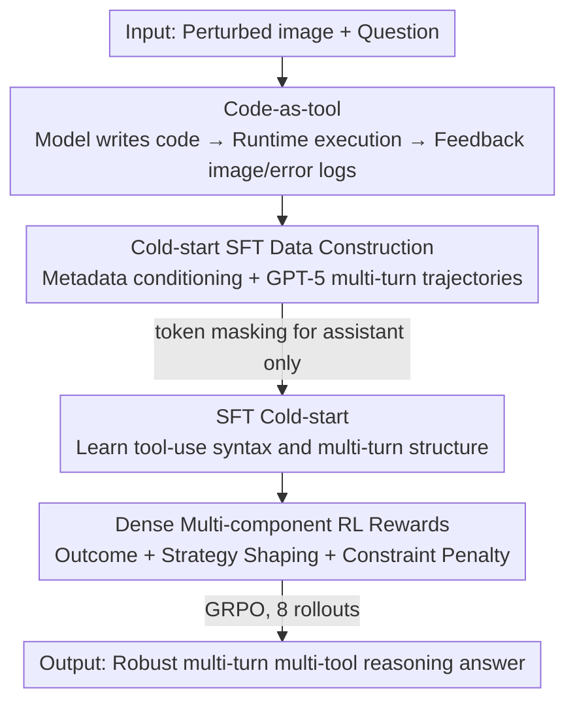

# Thinking with Programming Vision: Towards a Unified View for Thinking with Images

**Conference**: CVPR 2026  
**Paper**: [CVF Open Access](https://openaccess.thecvf.com/content/CVPR2026/html/Guo_Thinking_with_Programming_Vision_Towards_a_Unified_View_for_Thinking_CVPR_2026_paper.html)  
**Code**: https://github.com/ByteDance-BandAI/CodeVision  
**Area**: Multimodal VLM  
**Keywords**: Thinking with Images, Code-as-tool, Tool calling, Reinforcement Learning, Dense process rewards  

## TL;DR
This paper proposes CodeVision, which enables MLLMs to directly "write code" as a unified tool interface to manipulate images (rotation, flipping, cropping, enhancement, etc.). It employs a two-stage training process of "SFT cold-start + dense process reward RL" to empower the model with robust multi-turn, multi-tool reasoning capabilities on images contaminated by orientation perturbations. CodeVision achieves an average Gain of over ten points on a self-constructed orientation transformation benchmark compared to base models and nearly doubles the score of the second-best model on the multi-tool benchmark MVToolBench.

## Background & Motivation
**Background**: "Thinking with images" is an emerging paradigm post-o3, where MLLMs no longer passively describe images but actively call tools (zoom in, OCR, etc.) to manipulate images and gather evidence before reasoning. Current mainstream approaches focus almost exclusively on **the crop (crop/zoom-in) tool** and are evaluated on "small object search" benchmarks like V\* and HRBench.

**Limitations of Prior Work**: The authors identify three overlooked issues. First, **the necessity of tools is questionable**—using tools on existing benchmarks often yields only a 2–5% accuracy improvement, and pure RL without tools can match this, suggesting current tasks do not sufficiently push tool potential. Second, **flexibility and scalability are poor**—many methods require manual specification of tool names and parameters; even renaming `crop` to `zoomin` might require retraining, hindering generalization to new tools. Third, **multi-turn multi-tool capabilities are weak**—most systems use only one tool per turn, and those supporting multiple turns often perform "repeated cropping" rather than combining different tools across turns.

**Key Challenge**: A fundamental conflict exists between fixed tool registries and the "open, composable tool space" required for real-world tasks; simultaneously, existing evaluation tasks are too simplistic, making tools appear optional and obscuring core problems.

**Key Insight**: The authors conducted a diagnostic experiment—taking 200 images, applying 90/180/270-degree rotations or horizontal/vertical flips, and asking models to identify the transformation. Even GPT-5 and Gemini2.5-Pro performed poorly (while humans scored 100%), with simple orientation changes causing up to an **80%** performance drop. This suggests that orientation transformations are a type of real-world perturbation where tools are "truly indispensable" (correction is required for recognition), serving as a perfect scenario to force tool necessity.

**Core Idea**: Inspired by o3, **"writing code" itself is used as the sole tool interface**—the model generates code to invoke any image operation, bypassing manual tool registries. Combined with data and dense process rewards for "multi-turn multi-tool combinations," the model is trained into an agent capable of planning, error correction, and discovering new tools.

## Method

### Overall Architecture
CodeVision takes an image (potentially with orientation perturbations) and a question as input, outputting a final answer after multiple rounds of tool calls. The core vehicle is "**code-as-tool**": the model writes code in each round, executed by a controlled runtime (invoking any image library), which feeds new images/error logs back into the context until an answer is reached. Training is conducted in two serial stages: first, an SFT **cold-start** to teach basic tool-calling syntax and multi-turn patterns; followed by RL using **GRPO + dense multi-component rewards** to teach strategies for "when, which, and how many" tools to use. To support this, the authors constructed SFT/RL datasets and three new benchmarks (orientation-transformed OCRBench/ChartQAPro + multi-tool MVToolBench).

### Key Designs

**1. Code-as-tool: Using code as the unified interface to replace fixed tool registries**

To address the fragility of manual tool names/parameters, the model **directly writes code** rather than maintaining a tool registry. This expands the tool space from a "finite registry" to a "nearly boundless set of operations expressible in code." This offers three advantages: (1) **Emergence of new tools**—the model invokes tools never seen in training (e.g., brightness adjustment, blurring, edge detection). (2) **Efficiency**—multiple operations can be chained in one turn (e.g., contrast then grayscale). (3) **Robustness**—the model can read runtime errors to modify code and recover from failures, improving OOD generalization. Essentially, visual interaction is reformulated as a programming task.

**2. Cold-start SFT: Using metadata conditioning + GPT-5 for multi-turn trajectories and token masking**

To counteract the massive action space of code generation where pure RL exploration often fails, SFT provides a "warm-up." Data construction (Figure 3) samples from multiple domains (handwritten, OCR, charts, math) and tags each sample with **metadata**—including ground-truth answers and a target type (`single-tool / multi-tool / multi-crop / error-handling / no-tool`). A critical feature is **metadata-conditioned image transformation**: if a tool requirement is `rotate-180`, the original image is rotated 180 degrees initially, making the "rotate back" tool call **essential**. For cropping, extremely small text regions (≤ 0.01% area) are targeted. For error-handling, tool or runtime errors are intentionally introduced to require log reading and retry strategies. **GPT-5** generated approx **6,000** high-quality trajectories. During training, token-level masking $m_t \in \{0,1\}$ is applied to **calculate loss only on the assistant side** (reasoning/tool tokens):

$$\mathcal{L}_{\text{SFT}}(\theta) = -\sum_{t=1}^{T} m_t \log p_\theta(y_t \mid x, y_{<t})$$

SFT does not perform online tool execution; instead, it uses cached results to preserve the multi-turn structure while avoiding runtime variance.

**3. Dense Multi-component RL Reward: Process signals to stabilize training and prevent reward hacking**

During the RL stage (GRPO), a dense, multi-component reward system is used. The total reward for a trajectory $\tau=(s_1,a_1,\dots,s_T,a_T)$ is:

$$R_{\text{total}}(\tau) = R_{\text{outcome}}(\tau) + \beta_1\sum_{t=1}^{T} R_{\text{strategy}}(a_t) - \beta_2 P_{\text{cost}}(\tau)$$

**Outcome reward** $R_{\text{outcome}}$ evaluates terminal answer accuracy $r_{acc}\in\{0,+1\}$ and format $r_{fmt}\in\{0,+1\}$. **Strategy shaping** $R_{\text{strategy}}$ provides dense process signals: (a) **Must-use tool set $S_{req}$**—discrete tools (rotate/flip) receive a one-time reward upon first correct use; continuous crop tools are rewarded based on **IoU** improvements relative to the historical best. (b) **Suggested tool reward**—for tools that are helpful but not pre-defined. By comparing $K=8$ trajectories, an empirical performance Gain is calculated as the "inferred tool necessity reward" $r_{nec}$:

$$r_{nec} = \max\!\left(0,\; \frac{\sum_{i\in G_{tool}} r^i_{acc}}{|G_{tool}|} - \frac{\sum_{i\in G_{notool}} r^i_{acc}}{|G_{notool}|}\right)$$

Finally, **Constraint Penalty** $P_{\text{cost}}$ serves as guardrails against reward hacking: **Round penalty** (limiting calls beyond $|S_{req}|+1$); **Low-quality reasoning penalty** (penalizing correct answers derived from poor crop IoU); and **Improper tool usage penalty** (penalizing redundant transformations on normal images).

### Loss & Training
Both stages utilize three base models (Qwen2.5-VL-7B, Qwen3-VL-8B/32B-Thinking). SFT: 2 epochs, batch 128, lr 5e-6. RL: Using GRPO on SFT checkpoints for 2 epochs, lr 1e-6, batch 64, 8 rollouts per sample, KL 0.001. RL data (~40k samples) includes heavier reasoning/perception tasks with difficulty filtering.

## Key Experimental Results

### Main Results
**Orientation Robustness (OCRBench perception / ChartQAPro reasoning, average of 5 transformations)**: CodeVision maintains performance on perturbed images, whereas strong base models degrade significantly.

| Model | OCRBench Avg | ChartQAPro Avg |
|------|------|------|
| GPT-4o | 52.7 | 37.4 |
| Gemini2.5-Pro | 62.6 | 59.3 |
| Qwen3-VL-235B-Thinking | 63.4 | 42.2 |
| Qwen2.5-VL-7B (Base) | 56.0 | 24.4 |
| **CodeVision-7B (Ours)** | **73.4** (+17.4 Gain) | 31.7 |
| Qwen3-VL-8B-Thinking (Base) | 52.2 | 29.5 |
| **CodeVision-8B (Ours)** | **75.4** | **40.7** |
| Qwen3-VL-32B-Thinking (Base) | 55.7 | 36.2 |
| **CodeVision-32B (Ours)** | **79.5** | **54.3** |

**Single-tool / Multi-tool Benchmarks**: Competitive on single-tool benchmarks (V\*, HRBench) and establishes a new SOTA on the multi-tool benchmark MVToolBench.

| Model | V\* | HRBench4k | HRBench8k | MVToolBench |
|------|-----|-----------|-----------|-------------|
| GPT-4o | 67.9 | 65.0 | 60.1 | 8.5 |
| Gemini2.5-Pro | 83.8 | 85.0 | 85.1 | 32.6 |
| Qwen2.5-VL-7B (Base) | 74.6 | 69.4 | 67.5 | 18.1 |
| **CodeVision-7B (Ours)** | 83.7 | 75.6 | 72.2 | **60.1** |
| **CodeVision-8B (Ours)** | 82.4 | 77.1 | 73.4 | **62.7** |
| **CodeVision-32B (Ours)** | **86.2** | **84.3** | 76.1 | **65.4** |

CodeVision-7B's score of 60.1 on MVToolBench nearly doubles Gemini2.5-Pro (32.6), highlighting the advantage of combining multiple tools.

### Ablation Study
Ablations based on CodeVision-7B (Table 3):

| Configuration | ChartQAPro-Verti | MVToolBench | Note |
|------|------|------|------|
| Qwen2.5-VL-7B | 17.0 | 18.1 | Base |
| Qwen2.5-VL-7B-SFT | 35.8 | 26.6 | Cold-start SFT only |
| **CodeVision-7B (Full)** | **67.4** | **60.1** | Full Model |
| w/o Strategy Reward | 61.5 | 50.7 | MVToolBench drops 9.4 |
| w/o Constraint Penalty | 66.3 | 55.9 | V\*/Multi-tool degradation |

### Key Findings
- **Strategy shaping rewards contribute the most**: Without them, performance drops across the board, proving that outcome rewards alone cannot learn complex multi-tool strategies.
- **Constraint penalties are necessary guardrails**: Without them, the model engages in reward hacking (e.g., repeatedly rotating already-correct images to gain policy scores).
- **Cold-start SFT is indispensable**: Directly performing RL on the base model fails to converge due to the massive code action space; SFT provides the necessary "warm start."
- **Emergence of tools is real**: The model utilizes numerous tools not seen in training (brightness, blurring) and chains operations within a single turn.

## Highlights & Insights
- **Replacing "tool registry" with "programming language" is a paradigm shift**: By making the tool space equivalent to "code-expressible operations," extensibility, composition, and error correction are gained natively.
- **Orientation transformations effectively isolate tool necessity**: Rotation/flipping perturbations create a scenario where tools are mandatory for recognition, removing ambiguity regarding tool utility.
- **Reward design targets specific hacking behaviors**: The penalties for rounds, low-quality reasoning, and improper usage address real cheating patterns observed during training.
- **Dual-track rewards**: The combination of must-use (fixed budget) and suggested (rollout-inferred $r_{nec}$) provides a replicable template for process reward design in agent-based RL.

## Limitations & Future Work
- Absolute scores for the 7B version on ChartQAPro remain relatively low (31.7), suggesting orientation-induced reasoning remains difficult for smaller models.
- "Indispensable tool" scenarios currently revolve around orientation and cropping; whether this generalizes to broader geometric transformations or segmentation remains to be verified. ⚠️ Note that MVToolBench has a small sample size (~500), which may introduce variance.
- High reliance on GPT-5 for SFT trajectories and computational costs of GRPO with online tool execution.
- Potential security concerns regarding arbitrary code execution in the "code-as-tool" interface are not deeply discussed.

## Related Work & Insights
- **vs Crop-centric "thinking-with-images" (e.g., Thyme)**: Previous works mostly iterate on cropping with limited tool Gain; this work uses code-as-tool to open an infinite action space and benchmarks on orientation tasks to prove tool necessity.
- **vs Manual tool registry methods**: Existing methods are fragile to tool renaming and parameter changes; CodeVision is naturally compatible with new tools and schemas and implements self-correction via error logs.
- **vs Pure RL/Outcome-only agents**: Ablations demonstrate that pure outcome rewards fail to capture complex strategies, whereas "SFT cold-start + dense process reward" provides a stable training paradigm.

## Rating
- Novelty: ⭐⭐⭐⭐⭐ "Code-as-tool" unifies thinking-with-images and orientation tasks effectively prove tool necessity.
- Experimental Thoroughness: ⭐⭐⭐⭐ Extensive base models and benchmarks, though some new benchmarks have limited scale.
- Writing Quality: ⭐⭐⭐⭐⭐ Logical progression from motivation to reward design is very clear.
- Value: ⭐⭐⭐⭐⭐ Provides a practical, scalable paradigm for multi-modal tool agents with dense process rewards.

<!-- RELATED:START -->

## Related Papers

- [\[ICLR 2026\] DeepEyes: Incentivizing "Thinking with Images" via Reinforcement Learning](../../ICLR2026/vlm_reasoning/deepeyes_incentivizing_thinking_with_images_via_reinforcement_learning.md)
- [\[ICLR 2026\] Medical Thinking with Multiple Images](../../ICLR2026/vlm_reasoning/medical_thinking_with_multiple_images.md)
- [\[CVPR 2026\] LongVT: Incentivizing "Thinking with Long Videos" via Native Tool Calling](longvt_incentivizing_thinking_with_long_videos_via_native_tool_calling.md)
- [\[CVPR 2026\] Thinking with Drafts: Speculative Temporal Reasoning for Efficient Long Video Understanding](thinking_with_drafts_speculative_temporal_reasoning_for_efficient_long_video_und.md)
- [\[CVPR 2026\] PointThinker: Point-Incentivized Parallel Thinking for Multimodal Large Language Model](pointthinker_point-incentivized_parallel_thinking_for_multimodal_large_language_.md)

<!-- RELATED:END -->
## Related Papers

- [\[CVPR 2026\] MUPO: All Roads Lead to Rome - Incentivizing Divergent Thinking in Vision-Language Models](mupo_all_roads_lead_to_rome_incentivizing_divergent_thinking_in_vlms.md)
- [\[CVPR 2026\] PointThinker: Point-Incentivized Parallel Thinking for Multimodal Large Language Model](pointthinker_point-incentivized_parallel_thinking_for_multimodal_large_language_.md)
- [\[CVPR 2026\] All Roads Lead to Rome: Incentivizing Divergent Thinking in Vision-Language Models](all_roads_lead_to_rome_incentivizing_divergent_thinking_in_vision-language_model.md)
- [\[CVPR 2026\] R-4B: Incentivizing General-Purpose Auto-Thinking in MLLMs via Bi-Mode Annealing and Reinforce Learning](r-4b_incentivizing_general-purpose_auto-thinking_in_mllms_via_bi-mode_annealing_.md)
- [\[ICML 2026\] Efficient Reasoning with Hidden Thinking](../../ICML2026/multimodal_vlm/efficient_reasoning_with_hidden_thinking.md)

<!-- RELATED:END -->
