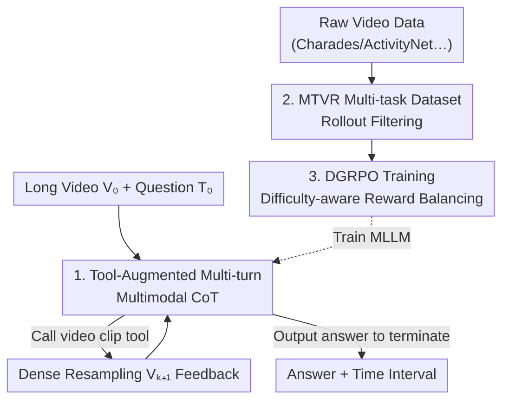

# Thinking With Videos: Multimodal Tool-Augmented Reinforcement Learning for Long Video Reasoning

**Conference**: CVPR 2026  
**Paper**: [CVF Open Access](https://openaccess.thecvf.com/content/CVPR2026/html/Zhang_Thinking_With_Videos_Multimodal_Tool-Augmented_Reinforcement_Learning_for_Long_Video_CVPR_2026_paper.html)  
**Code**: Project Page (The paper stating "Code is available at the project page", specific URL not provided ⚠️)  
**Area**: Multimodal VLM / Video Understanding  
**Keywords**: Long Video Reasoning, Multimodal CoT, Tool Augmentation, Temporal Grounding, GRPO

## TL;DR
VITAL equips Multimodal Large Language Models (MLLMs) with a "video clipping" tool, allowing them to densely resample suspicious time intervals into new frames during the reasoning chain to form a "multimodal chain-of-thought." Combined with difficulty-aware DGRPO reinforcement learning to stabilize multi-task training, it achieves 7B-level SOTA performance in long video QA and temporal grounding.

## Background & Motivation

**Background**: Inspired by the use of GRPO to enhance reasoning capabilities in DeepSeek-R1, many recent works perform RL post-training on MLLMs. This enables them to generate a text-based Chain-of-Thought (CoT) before answering video questions, targeted at tasks like Video Question Answering (VQA) and temporal grounding.

**Limitations of Prior Work**: Pure text-based CoT suffers from two critical flaws. First, **insufficient cross-modal interaction**—during reasoning, the model can only reflect on the initial sparse samples of frames and cannot "re-watch" key segments. Second, **aggravated hallucinations**, particularly in long videos with long reasoning chains, where models tend to deviate during self-reflection. An example in Figure 1 of the paper is intuitive: text-only CoT predicts the interval for "Greg's Microscope" as 260.94–335.93s (IoU only 49.9%, failure), while the version capable of seeing frames predicts 296.00–336.00s (IoU 90.7%, success).

**Key Challenge**: High information density in long videos conflicts with the context length limits of MLLMs, necessitating sparse sampling (e.g., a few dozen frames per video). If a target event falls between frames, text-based reasoning cannot recover the missing visual evidence. The fundamental issue is that **visual evidence is static and one-off during the reasoning process**.

**Goal**: To enable MLLMs to **dynamically and actively acquire new visual evidence** during reasoning, chaining "thinking-seeing-thinking again" into a multimodal CoT, while solving the instability in multi-task RL training caused by varying task difficulties.

**Key Insight**: Transfer the "thinking with images" concept (using zoom-in, detection, or segmentation tools as seen in DeepEyes or OpenThinkImg) to the video domain. The critical tool for video is not zooming but **temporal clipping + dense resampling**—locating a suspicious interval and then feeding back a densely sampled sequence of frames.

**Core Idea**: Deploy a "video clipping" tool that the model invokes within the CoT as needed to resample frames from segments of interest and insert them back into the reasoning chain (i.e., multimodal CoT). Use Difficulty-aware GRPO (DGRPO) to stabilize multi-task RL training.

## Method

### Overall Architecture

VITAL (Video Intelligence via Tool-Augmented Learning) follows the mainstream MLLM architecture of "Visual Encoder + LLM" (backbone is Qwen2.5-VL-7B) but integrates a **visual toolbox** during inference. Given a long video $V_0$ and a question $T_0$, the model enters **multi-turn generation**: in each turn, it outputs a `<think>` block and decides whether to call a tool or provide the answer. If a tool is called, the toolbox returns a set of densely resampled frames $V_{k+1}$ back into the context for the next turn. This iterates until the model outputs `<answer>`, forming a multimodal CoT trajectory of alternating text reasoning and new visual evidence.

To teach a standard MLLM when to use or stop using tools, architecture alone is insufficient; data and training are required. VITAL employs a full pipeline: first constructing two multi-task datasets via rollout filtering (MTVR-CoT-72k for SFT cold start, MTVR-RL-110k for RL), followed by reinforcement learning using difficulty-aware DGRPO. The workflow spans "Training (Data Generation → SFT → DGRPO)" and "Inference (Tool-Augmented Multi-turn Generation)".

### Key Designs

**1. Tool-Augmented Multi-turn Multimodal CoT Generation: "Re-watching" during reasoning**

Addressing the "one-off visual evidence" pain point, VITAL transforms single-shot inference into multi-turn interaction. At turn $k$, the model generates output $O_k = f_{\text{MLLM}}(\{T_i, C_i, V_i\}_{i=0}^{k})$ based on the full history, where $T_i$ represents text reasoning, $C_i$ the tool call, and $V_i$ the visual input. A parser extracts the reasoning step and tool call $(T_{k+1}, C_{k+1}) = p(O_k)$. If a valid tool is called, the toolbox executes $V_{k+1} = g_{\text{tool}}(C_{k+1})$; otherwise, if $C_{k+1}$ is the final answer, the process terminates with $A_{k+1} := C_{k+1}$. This produces the multimodal CoT trajectory $\tau = \{T_1, C_1, V_1, \dots, T_n, A_n\}$.

The core tool is the **video clipping tool** $V_{k+1} = g_{\text{clip}}(V_0, t_{\text{start}}, t_{\text{end}})$, which returns a **densely sampled** sequence within the given boundaries. This recovers local details lost in sparse global sampling—the model first estimates a rough interval and then "zooms in" temporally, much like a human fast-forwarding to a segment before checking frame-by-frame. Ablations (Tab. 7/8) show this outperforms clip captioning or clip QA tools, which introduce textual hallucinations.

**2. MTVR Multi-task Dataset + Rollout Filtering: Providing sufficient trajectories**

Models do not learn tool use spontaneously. Quality trajectories are needed for SFT and RL. The authors constructed MTVR-CoT-72k (SFT) and MTVR-RL-110k (RL) covering: Video Temporal Grounding (VTG), Reasoning VQA, and Grounded VQA. A key observation is that **temporal grounding and VQA are mutually beneficial**—grounding provides the basis for clipping, while VQA evaluates overall reasoning.

Data quality is ensured via **rollout filtering**: ① Generate 8 rollouts per sample using an MLLM at high temperature (1.0) to encourage diversity. ② Retain only **medium difficulty** samples, discarding those where rollouts are all correct (PassAll@k) or all incorrect (PassNone@k). ③ Use a stronger model (Gemini 2.5) to synthesize the text CoT (and multimodal CoT for long videos). For temporal grounding, tool parameters are initialized with ground-truth intervals plus 20% noise; for long video QA, the annotator model selects parameters autonomously.

**3. DGRPO (Difficulty-aware GRPO): Solving "Difficulty Imbalance" in multi-task RL**

Multi-task GRPO faces two types of imbalance. **Task-level imbalance**: Simple tasks like short video classification gain rewards quickly, while long video temporal grounding (IoU reward) progresses slowly due to the lack of discriminative power in continuous IoU functions. **Sample-level imbalance**: As RL progresses, the proportion of simple samples increases, causing optimization to plateau. DGRPO uses two-layer scaling (Alg. 1).

The reward consists of $\hat{R} = \text{Scale}(R_{\text{acc}}, \alpha_i, \beta_i) + R_{\text{format}} + R_{\text{tool}}$. **Task-level scaling**: Only for temporal grounding, the IoU reward is normalized based on task difficulty parameters $\alpha_i, \beta_i$ as $S_1 = \text{clamp}(\frac{R_{\text{IoU}} - \alpha_i}{\beta_i - \alpha_i}, 0, 1)$, stretching flat IoU signals into a discriminative 0–1 range. **Sample-level scaling**: Sample difficulty is defined as the mean reward of $G$ rollouts: $D_{i,j} = \frac{1}{G}\sum_k \hat{R}(\tau^k_{i,j})$. This is mapped to a weight $w_{i,j} = \text{clamp}(2 - D_{i,j}, 0, 1) \times 0.5 + 0.5$. The final reward $R = \hat{R} \cdot w_{i,j}$ provides larger gradients to harder tasks/samples, stabilizing training.

### Loss & Training
Four-stage training, one epoch per stage (640 H100 GPU hours): Stages ①② perform SFT + GRPO on MTVR-CoT/MTVR-RL; Stages ③④ include tool data (MTVR-CoT-Tool / MTVR-RL-Tool) for SFT + DGRPO. Optimized with AdamW, cosine scheduler, weight decay 1e-2; LR: SFT 1e-5 / RL 1e-6; batch size SFT 256 / RL 64; 8 rollouts per sample. Based on the verl + vLLM framework.

## Key Experimental Results

### Main Results

VITAL-7B achieves 7B-class SOTA on long video temporal grounding and QA, with the toolbox (∆Toolbox) providing consistent gains.

| Task / Benchmark | Metric | VITAL-7B (No Tool) | VITAL-7B | ∆Toolbox | Comparison |
|------|------|------|------|------|------|
| VidChapters-7M (Long Grounding) | R@0.5 | 25.8 | 34.7 | +8.9 | Prev. SOTA ReVisionLLM 27.4 |
| VUE-TR-Vision (Long Grounding) | IoU(AUC) | 31.6 | 35.3 | +3.7 | Vidi-1.5-9B 49.7 (Larger) |
| LongVideo-Reason (Long QA) | Acc | 73.2 | 79.3 | +6.1 | LongVILA-R1-7B 72.0 |
| Video-MME (Long QA) | Acc | 63.5 | 66.1 | +2.6 | Qwen2.5-VL-7B 65.2 |
| Charades-STA (Short Grounding) | mIoU | 57.1 | 59.9 | +2.8 | VideoChat-R1-7B 60.8 |
| ReXTime (Grounded VQA) | mIoU | 40.9 | 47.6 | +6.7 | Temporal-RLT-7B 39.0 |

Gains are most significant in long video scenarios (LongVideo-Reason 79.3% vs. prev. SOTA 72.0%), confirming that multimodal CoT compensates for missing information in long contexts.

### Ablation Study

Training stage ablation (Tab. 5, ∗ denotes tool-augmented): Thinking, DGRPO, and tool-augmented RL show cumulative improvements, with average scores increasing from 37.9 to 57.1.

| Config | Style | LVR Acc | VidCh mIoU | MMMU Acc | Cha mIoU | Avg |
|------|------|------|------|------|------|------|
| ① Qwen2.5-VL (Baseline) | No CoT | 60.1 | 0.5 | 47.4 | 43.6 | 37.9 |
| ③ SFT+GRPO | No CoT | 63.3 | 23.5 | 50.2 | 56.2 | 48.3 |
| ⑤ SFT+GRPO | CoT | 66.0 | 25.8 | 52.0 | 57.2 | 50.3 |
| ⑥ SFT+DGRPO | CoT | 70.2 | 28.8 | 52.1 | 57.1 | 52.1 |
| ⑦ ⑥ + SFT∗+DGRPO∗ (Full Tool) | CoT | 79.3 | 35.0 | 54.2 | 59.9 | 57.1 |

Tool selection ablation (Tab. 7/8): In zero-shot settings, adding captioning or QA tools causes grounding mIoU to plummet (e.g., GPT on VidChapters drops to 2.0). After training VITAL, the video clip tool outperforms caption/QA tools (Avg 57.1 vs. 51.8/53.0), proving clipping is more efficient and hallucination-free.

### Key Findings
- **Tool-augmented RL (⑥→⑦) has the highest contribution**: Average score jumps by +5.0. LongVideo-Reason surges from 70.2 to 79.3, showing that teaching the model to use tools is more effective than simple difficulty balancing for long videos.
- **DGRPO vs. GRPO (⑤→⑥)**: Average score 50.3→52.1. Gains are concentrated in hard tasks (LVR 66.0→70.2, VidCh 25.8→28.8), while simple short video tasks remain stable.
- **Multi-task Synergy**: Training TG+RQA+GQA together (Tab. 6) yields an avg score of 53.9, significantly higher than single-task models (TG 45.4 / RQA 42.4).
- **Adaptive Tool Use**: Models typically call tools 0–2 times per sample. Excessive calls degrade performance (Fig. 6), indicating the model learns to "watch only when necessary."

## Highlights & Insights
- **Clipping is better than description for "Thinking with Video"**: Evaluations show that clip captioning or QA tools introduce textual hallucinations. Returning raw visual evidence (frames) directly into the context is superior—a valuable lesson for visual agents.
- **DGRPO's two-layer scaling is a reusable RL recipe**: Using difficulty parameters to reshape the reward landscape for tasks and weighting samples by relative failure is a robust strategy for any multi-task RL setting with varied reward scales.
- **Rollout filtering for data curation**: Filtering by PassAll@k / PassNone@k ensures the training focuses on medium-difficulty samples, complementing DGRPO at the data level.

## Limitations & Future Work
- **Static Toolset**: Only the clipping tool was retained; caption/QA tools were discarded due to zero-shot hallucinations. Including them in the training domain might help with semantic abstraction tasks.
- **Dependence on Strong Labelers**: The pipeline uses Gemini 2.5 as a teacher and tool executor. Parameters for long video grounding tools were preset with GT noise, potentially limiting the exploration of autonomous tool discovery ⚠️.
- **Implementation Details**: Many details on tool execution and DGRPO implementation are relegated to the supplementary material, affecting immediate reproducibility from the main text.

## Related Work & Insights
- **vs. Text-only Video RL (VideoChat-R1, Time-R1, DeepVideo-R1)**: These only reason at the text level with one-shot visual input. VITAL allows supplemental visual evidence, showing a ~7 point lead in long video QA.
- **vs. Image "Thinking with Images" (DeepEyes, OpenThinkImg)**: VITAL targets the temporal dimension via clipping and resampling rather than spatial zoom-in/detection.
- **vs. Long Video Compression (LongVA, LongVILA)**: These rely on token compression or massive contexts. VITAL's "on-demand resampling" is more computationally efficient for looking at details within long sequences.

## Rating
- Novelty: ⭐⭐⭐⭐ Systematically introduces tool-augmented multimodal CoT to long videos and addresses multi-task RL imbalance with DGRPO.
- Experimental Thoroughness: ⭐⭐⭐⭐⭐ 11+ benchmarks and extensive ablations across training stages, data, and tool choices.
- Writing Quality: ⭐⭐⭐⭐ Figure 1 and Alg. 1 are very clear, though some critical implementation details are in the appendix.
- Value: ⭐⭐⭐⭐ Provides a reusable recipe for video agents and RL post-training for developers.

<!-- RELATED:START -->

## Related Papers

- [\[CVPR 2026\] LongVT: Incentivizing "Thinking with Long Videos" via Native Tool Calling](longvt_incentivizing_thinking_with_long_videos_via_native_tool_calling.md)
- [\[CVPR 2026\] Learning Transferable Temporal Primitives for Video Reasoning via Synthetic Videos](learning_transferable_temporal_primitives_for_video_reasoning_via_synthetic_vide.md)
- [\[CVPR 2026\] SpaceTools: Tool-Augmented Spatial Reasoning via Double Interactive RL](spacetools_tool-augmented_spatial_reasoning_via_double_interactive_rl.md)
- [\[CVPR 2026\] Incentivizing Versatile Video Reasoning in MLLMs via Data-Efficient Reinforcement Learning](incentivizing_versatile_video_reasoning_in_mllms_via_data-efficient_reinforcemen.md)
- [\[ICLR 2026\] FrameThinker: Learning to Think with Long Videos via Multi-Turn Frame Spotlighting](../../ICLR2026/vlm_reasoning/framethinker_learning_to_think_with_long_videos_via_multi-turn_frame_spotlightin.md)

<!-- RELATED:END -->
