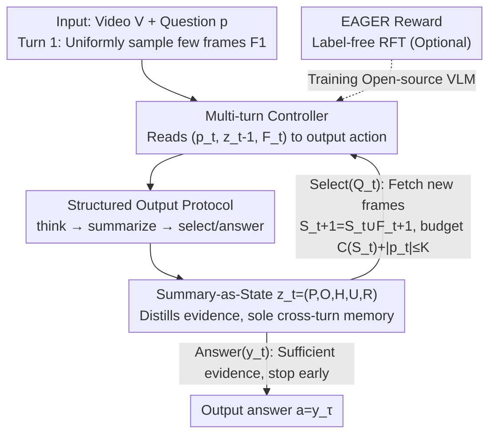

# Towards Sparse Video Understanding and Reasoning

**Conference**: CVPR 2026  
**arXiv**: [2602.13602](https://arxiv.org/abs/2602.13602)  
**Code**: https://sparsevideounderstanding.github.io (Project page, no open-source code)  
**Area**: Video Understanding  
**Keywords**: Video Question Answering, Frame Selection, Multi-turn Reasoning, Summary-as-State, Reinforced Fine-tuning

## TL;DR
ReViSe reforms video question answering as "question-driven multi-turn sparse frame selection"—selecting only a few frames per turn, compressing verified evidence into a structured "summary-as-state" across turns, and stopping early once confident. It serves as a plug-and-play wrapper for any VLM and supports reinforced fine-tuning using the label-free reward EAGER, achieving higher accuracy on multiple VQA benchmarks with only a few frames.

## Background & Motivation
**Background**: Current video understanding using LLMs/VLMs mainly adopts uniform sampling. Existing methods either use captioners to convert frames into text for LLM reasoning (losing fine-grained visual details) or feed visual features directly into VLMs (e.g., LLaVA, QwenVL). In both cases, frames are **uniformly sampled**.

**Limitations of Prior Work**: Uniform sampling faces two major issues (following the categorization in VideoTree). **(L1) Information Overload**: Long videos are highly redundant; feeding too many redundant frames overwhelms the LLM, slowing down reasoning and interfering with judgment. **(L2) Insufficient Perception of Key Information**: Video content is hierarchically and temporally structured; missing semantically salient frames across multiple scales causes the model to lose clues necessary for answering.

**Key Challenge**: The root of these issues is **semantic sparsity**—for a specific question, only a small subset of frames is truly relevant. Uniform sampling is "question-agnostic," failing to identify critical frames (missing keys) while being burdened by irrelevant ones (redundancy).

**Goal**: To decouple video understanding into two sub-problems: (a) how to select only the most informative frames for the current question; (b) how to **compactly accumulate** seen evidence during multi-turn interactions to avoid re-reading the entire history.

**Key Insight**: Drawing an analogy to RNN hidden states, since evidence is accumulated step-by-step, there should be a **continuously updated compact memory** that carries only "task-critical" information to decide "where to look next." This transforms frame selection from a one-time coverage problem into a state-driven sequential decision process.

**Core Idea**: Replace raw dialogue history with a "summary-as-state" transmitted across turns. This turns multi-turn frame selection into a loop of "reading frames → updating state → deciding next frames or answering." The model is taught to select accurately and stop early via the label-free reward EAGER.

## Method

### Overall Architecture
ReViSe (Reasoning with Video Sparsity) models video QA as an agent interaction process of **at most T turns**. Given video $V=\{x_i\}_{i=0}^{L-1}$ and question $p$, the goal is to produce answer $a$ within a visual token budget $K$. Instead of consuming all frames at once, it iteratively: (i) selects a small batch of frames likely to reduce uncertainty; (ii) distills the evidence into a structured summary state $z_t$ carried across turns; (iii) stops early once cumulative evidence is sufficient.

The system consists of three modules: the **Multi-turn Controller** decides which frames to view and when to stop; the **Structured Output Protocol** externalizes reasoning and state via fixed labels; the **Summary-as-State** serves as the sole cross-turn memory, accumulating verified evidence. In each turn, the VLM outputs a `<think>` trajectory, followed by either a `<summarize>` state + `<select>` request (intermediate turns) or an `<answer>` (final turn). The next turn proceeds only with new frames and the updated summary. The model can be used as a **plug-and-play wrapper for closed-source VLMs** (§3.2) or reinforced via EAGER rewards for open-source VLMs (§3.3).

### Key Designs

**1. Multi-turn Question-driven Frame Selection: From "Max Coverage" to Sequential Decision**

Addressing L1 (Information Overload), ReViSe avoids large-scale uniform sampling by splitting selection into at most $T$ turns. Let $S_t=\bigcup_{j=1}^{t}F_j$ be the frames included up to turn $t$. In each turn $t\geq 2$, the agent outputs an action $a_t\in\{\textsc{Select}(Q_t),\textsc{Answer}(y_t)\}$ based on $(p_t,z_{t-1},F_t)$, where $Q_t$ are indices of **new** frames requested. Selecting Answer terminates the process at step $\tau\leq T$. The total budget is constrained by $C(S_t)+|p_t|\leq K$, where $C(F)$ is the visual token cost.

The optimization objective is:
$$\max_{\{Q_t\},\,\tau\leq T}\ \mathcal{R}\bigl(\pi_\theta(p,z_{\tau-1},S_{\tau-1})\bigr)\quad\text{s.t.}\ C(S_{\tau-1})+|p_\tau|\leq K.$$
By reading a few frames, identifying missing pieces, and fetching targeted frames, the model approaches the answer with minimal frame usage.

**2. Summary-as-State z_t=(P,O,H,U,R): Persistent Memory addressing L2**

Addressing L2 (Insufficient key information perception), ReViSe formalizes memory as a quintuple with a **fixed order P→O→H→U→R**: $P_t$ (Previously seen), $O_t$ (Observations), $H_t$ (belief Hypotheses), $U_t$ (Uncertainties), and $R_t$ (Reasons for next steps). This is the **only** state carried across turns, stored in the `<summarize>` field.

This is effective because the state is **cumulative**: $z_{t-1}$ contains the essence of $\{z_0,\dots,z_{t-2}\}$. Conditioning only on $z_{t-1}$ is equivalent to conditioning on the state history, keeping memory costs constant and avoiding re-reading raw history (mitigating L1). $R_t$ drives the next proposal $Q_{t+1}$, while the stability of $H_t/U_t$ signals when to stop. This binds selection and termination to an explicit state, ensuring consistency.

**3. Structured Output Protocol + Plug-and-Play: Transparency and Versatility**

Each response starts with a `<think>` trajectory. Select turns output `<think>…</think><summarize>…</summarize><select>…</select>`, while Answer turns output `<think>…</think><answer>…</answer>`. The `<think>` trajectory is **not persisted**, keeping the prompt volume low. Only the `<summarize>` state is carried over.

Since the logic (multi-turn dialogue, adaptive selection, state updates) runs **outside** the VLM, ReViSe treats closed-source VLMs as frozen black boxes, allowing multi-turn orchestration via APIs without parameter updates—this is the basis for its plug-and-play capability.

### Loss & Training
For open-source VLMs, ReViSe models interaction as a finite-step MDP $\mathcal{M}=\langle\mathcal{S},\mathcal{A},\mathcal{T},r,\gamma\rangle$. The policy $\pi_\theta$ is optimized at the token level.

The proposed **EAGER (Evidence-Adjusted Gain for Efficient Reasoning)** reward is a dense, **label-free** (requiring only answer labels and model scores) reward. It uses the temperature-calibrated log-odds margin $m_t=\log p_\theta(y^\star\mid p_t,z_{t-1},S_t)-\max_{y\neq y^\star}\log p_\theta(y\mid p_t,z_{t-1},S_t)$, comprising:

- **(i) Confidence Gain** $r_t^{\text{conf}}=[m_{t+1}-m_t]_+$: Rewards new frames that increase the gap between the correct option and the strongest distractor.
- **(ii) Summary Adequacy** $r_t^{\text{sum}}=\mathds{1}[\arg\max_{y}p_\theta(y\mid p_\tau,z_{\tau-1})=y^\star]$: At the terminal stage, the question is asked using **only the final summary**. A reward is given only if the answer is correct, forcing the summary to be self-sufficient.
- **(iii) Correct & Early Stopping** $r_t^{\text{stop}}=1+\beta[T_{\text{stop}}-\tau]_+$: Rewards correct answers within a small turn budget $T_{\text{stop}}$.

The policy is optimized via **GRPO**. Since 3B-class VLMs have weak instruction-following, the model undergoes supervised format fine-tuning using **8,000 multi-turn dialogues** distilled from GPT-4o before RL.

## Key Experimental Results

### Main Results
Backbones: Qwen2-VL-7B, Qwen2.5-VL(3B/7B), InternVL2-8B, GPT-4o. Datasets: VideoEspresso, NExT-QA, EgoSchema. Budget: Max 3 frames/turn, max 4 turns.

VideoEspresso (Avg Acc %, #Frames refers to average processed frames per video):

| Backbone + Method | #Frames | Avg Acc | Gain vs Orig. |
|------|------|------|------|
| InternVL2-8B | FPS=1 | 28.7 | — |
| InternVL2 + ReViSe | 2.87 | 32.1 | +3.4 |
| Qwen2-VL-7B | FPS=1 | 28.5 | — |
| Qwen2-VL + ReViSe | 6.25 | 37.8 | +9.3 |
| GPT-4o | FPS=3 | 26.4 | — |
| **GPT-4o + ReViSe** | 7.99 | **48.9** | **+22.5** |

GPT-4o + ReViSe achieved the **best performance in 13 out of 14 categories** with single-digit frames.

Plug-and-play Comparison (EgoSchema subset / NExT-QA, Acc % + Frames/Captions):

| Dataset | Method | Acc (%) | Frames/Caps |
|------|------|------|------|
| EgoSchema | VideoAgent | 60.2 | 8.4 |
| EgoSchema | VideoTree | 66.2 | 62.4 |
| EgoSchema | LLoVi | 57.6 | 180 |
| EgoSchema | **GPT-4o + ReViSe** | 60.6 | **9.8** |
| NExT-QA | VideoTree | 73.5 | 56 |
| NExT-QA | VideoAgent | 71.3 | 8.2 |
| NExT-QA | LVNet | 61.1 | 12 |
| NExT-QA | **GPT-4o + ReViSe** | 63.8 | **8.4** |

ReViSe operates consistently in the "ultra-low frame budget" range, using 6–7× fewer frames than VideoTree and 13–18× fewer than LLoVi/MC-ViT-L without relying on captioners.

Reinforced Fine-tuning (RFT, Qwen2.5-VL-3B):

| Dataset | Method | Acc (%) | Frames | Rounds | Time(s) |
|------|------|------|------|------|------|
| VideoEspresso | Direct Reasoning | 12.6 | 8.0 | 1.00 | 1.02 |
| VideoEspresso | Plug-and-Play | 20.1 | 5.2 | 1.86 | 1.73 |
| VideoEspresso | **Reinforced FT** | **27.8** | 4.1 | 1.37 | 1.02 |
| NExT-QA | Direct Reasoning | 23.6 | 8.0 | 1.00 | 0.88 |
| NExT-QA | Plug-and-Play | 31.7 | 5.3 | 1.74 | 1.22 |
| NExT-QA | **Reinforced FT** | **51.3** | 3.9 | 1.32 | 0.62 |

RFT significantly outperformed plug-and-play on NExT-QA (51.3 vs 31.7) while reducing frames, turns, and inference time.

### Ablation Study
(VideoEspresso + Qwen2.5-VL-7B)

| Configuration | Key Metrics | Note |
|------|---------|------|
| Full model | Highest acc, min turns, lowest latency | Complete model |
| Increasing allowed turns | 1 turn (38.3%@4.60f) → 4 turns (**42.1%@2.89f**) | More turns improve accuracy and reduce average frames due to early stopping (mean ≈ 2.3) |
| w/o Persistent State | Acc −18.34%, computation nearly doubled | Forces context reconstruction every turn |
| w/o Structured (P/O/H/U/R) | Significant drop, max runtime increase (+32.14s) | Explicit state propagation is critical for stability |

### Key Findings
- **Persistent state is the primary contributor**: Removing it causes an 18.34% drop in accuracy. The value of multiple turns lies in compressing seen frames into state.
- **Structured fields are essential**: Removing the P/O/H/U/R structure increases runtime significantly (32.14s), proving that explicit states suppress redundant context needs.
- **More turns = Higher Accuracy & Efficiency**: The Pareto front for accuracy vs. frame count is monotonic; allowing more turns enables the model to fetch Targeted frames and stop early, using fewer frames on average.

## Highlights & Insights
- **Adapting RNN hidden states to VLM multi-turn reasoning**: "Summary-as-state" acts as a text-based hidden state carrying task-critical info, solving the "long context vs. efficiency" dilemma by maintaining a constant-cost memory.
- **Clever "Summary Adequacy" in EAGER**: Requiring an answer based solely on the summary forces the model to encode evidence into the state rather than relying on raw history.
- **Confidence gain via log-odds margin**: The $[m_{t+1}-m_t]_+ \ $ reward only credits frames that truly widen the gap for the correct option, providing a dense signal for frame selection without manual keyframe labels.
- **Dual setup (Plug-and-play + RFT)**: The framework covers both closed-source and open-source models under a unified architecture.

## Limitations & Future Work
- **Limitations identified by authors**: (1) Dependence on backbone visual fidelity; (2) Multi-turn latency from API calls; (3) Lack of spatial cropping within frames.
- **Observations on limitations**: Absolute accuracy on VideoEspresso is relatively low (48.9% for GPT-4o), indicating this is a "low-budget" specialist rather than a general SOTA across all settings. RFT was only verified on 3B models.
- **Future directions**: Adaptive spatial cropping, stronger visual encoders, and extension to open-ended generation.

## Related Work & Insights
- **vs VideoAgent**: Both do multi-turn selection, but VideoAgent is caption-based and re-reads history; ReViSe reasons in visual space and uses compact states.
- **vs VideoTree**: VideoTree achieves higher accuracy (73.5% NExT-QA) but uses significantly more frames (56 vs 8.4); ReViSe prioritizes efficiency.
- **vs Single-turn/RL methods**: ReViSe differentiates itself through **persistent state maintenance** across iterations and its label-free EAGER reward.

## Rating
- Novelty: ⭐⭐⭐⭐ The combination of "summary-as-state" and EAGER is novel for multi-turn VQA.
- Experimental Thoroughness: ⭐⭐⭐⭐ Thorough benchmarks and ablations, though RFT is limited to 3B backbones.
- Writing Quality: ⭐⭐⭐⭐ Clear formalization; state designs are well-explained.
- Value: ⭐⭐⭐⭐ High practical utility for engineering efficient video reasoning agents.

<!-- RELATED:START -->

## Related Papers

- [\[CVPR 2026\] Thinking with Drafts: Speculative Temporal Reasoning for Efficient Long Video Understanding](thinking_with_drafts_speculative_temporal_reasoning_for_efficient_long_video_und.md)
- [\[CVPR 2026\] Reinforcing Structured Chain-of-Thought for Video Understanding](reinforcing_structured_chain-of-thought_for_video_understanding.md)
- [\[CVPR 2026\] SegCompass: Exploring Interpretable Alignment with Sparse Autoencoders for Enhanced Reasoning Segmentation](segcompass_exploring_interpretable_alignment_with_sparse_autoencoders_for_enhanc.md)
- [\[CVPR 2026\] Agentic Video Summarization via Self-Reflecting Multimodal Understanding](agentic_video_summarization_via_self-reflecting_multimodal_understanding.md)
- [\[CVPR 2026\] VideoARM: Agentic Reasoning over Hierarchical Memory for Long-Form Video Understanding](videoarm_agentic_reasoning_over_hierarchical_memory_for_long-form_video_understa.md)

<!-- RELATED:END -->
