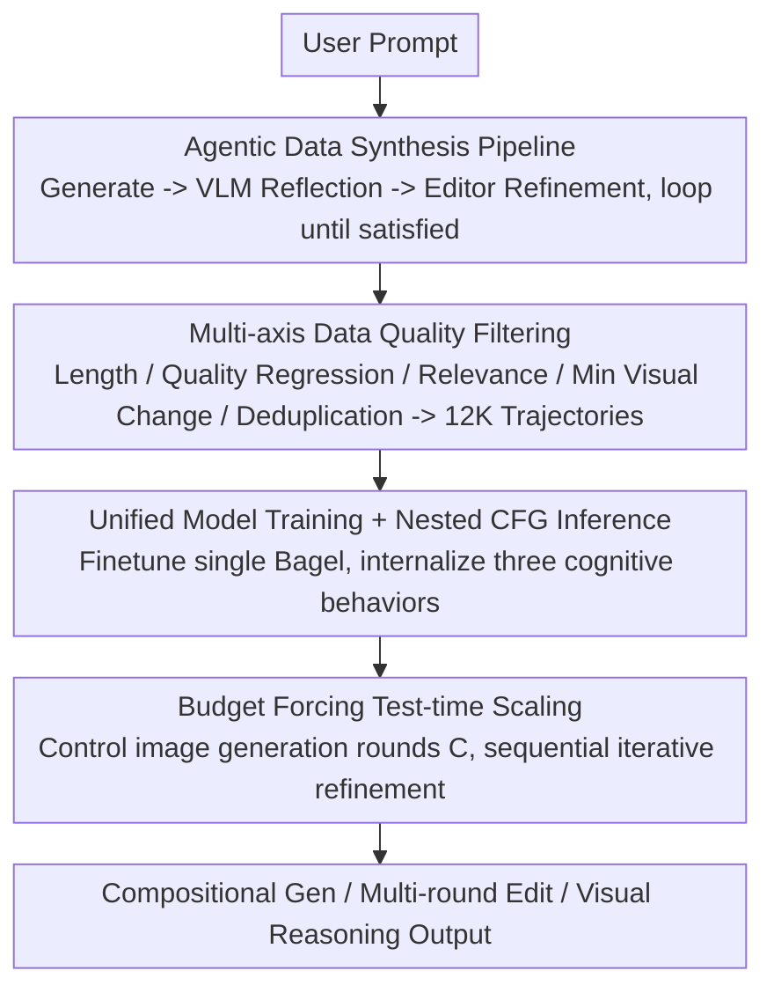

# UniT: Unified Multimodal Chain-of-Thought Test-time Scaling

**Conference**: CVPR 2026  
**Paper**: [CVF Open Access](https://openaccess.thecvf.com/content/CVPR2026/html/Chen_UniT_Unified_Multimodal_Chain-of-Thought_Test-time_Scaling_CVPR_2026_paper.html)  
**Code**: TBD  
**Area**: Multimodal VLM  
**Keywords**: Unified Multimodal Model, Test-time Scaling, Multimodal Chain-of-Thought, Iterative Refinement, Agentic Data Synthesis  

## TL;DR
UniT transfers "test-time scaling" from language models to unified multimodal models. By using a multi-model agent pipeline to synthesize "generate→reflect→refine" multi-round Chain-of-Thought (CoT) data, it finetunes a single unified model (Bagel) to iteratively generate, verify, and correct images during inference. Controlled by "budget forcing" over the number of generation rounds, UniT achieves significant improvements in compositional generation, multi-round editing, and visual reasoning.

## Background & Motivation
**Background**: Unified multimodal models (e.g., Bagel, Janus-Pro) integrate visual understanding and image generation into a single architecture. Theoretically, they enable seamless interleaving of "seeing" and "drawing" within a dialogue, achieving stronger cross-modal grounding than modular pipelines. However, in practice, they are almost entirely **single-pass**, providing an output in one go without mechanisms for evaluation, reflection, or revision.

**Limitations of Prior Work**: Many multimodal tasks are inherently multi-step: compositional generation (multiple objects, complex spatial relations), multi-round editing (gradual instruction accumulation), and complex visual reasoning. In these scenarios, "getting it right in one shot" is nearly impossible, requiring instruction decomposition, intermediate result verification, and iterative error correction. Single-pass unified models are ineffective for such tasks.

**Key Challenge**: In language models, test-time scaling (TTS, via extending CoT, multiple sampling, or iterative refinement) has been proven highly effective by o1 and DeepSeek-R1. However, bringing this to unified multimodal models is difficult because the required capabilities for TTS are scattered across different specialized models—image generation relies on diffusion models, verification on VLMs, and refinement on editing models. No unified framework exists to integrate data synthesis, model training, and inference mechanisms.

**Goal**: To enable a **single unified model** to iteratively generate, reflect, and refine during inference, similar to reasoning LLMs, with an adjustable inference budget (allocating more compute to difficult tasks).

**Key Insight**: The authors discovered that a **multi-model agent pipeline (Generator + VLM Critic + Editor) can act as a "teacher" to synthesize multi-round CoT trajectories**. These trajectories inherently contain three cognitive behaviors: verification, subgoal decomposition, and content memory. These behaviors can then be **distilled into a single unified model**, allowing it to be self-sufficient during inference.

**Core Idea**: Train a unified model using "agent-synthesized multi-round CoT data" to internalize cognitive behaviors dispersed across multiple specialized models into a single architecture. This enables sequential (Chain-of-Thought) test-time scaling through budget forcing—where sequential scaling is more compute-efficient and scalable than best-of-N parallel sampling.

## Method

### Overall Architecture
UniT consists of three tightly coupled components: **(i) Agentic Data Synthesis**—a multi-model pipeline automatically produces multi-round "generate-reflect-refine" trajectories with explicit CoT; **(ii) Unified Model Training**—finetuning Bagel with approximately 12K high-quality trajectories to internalize multimodal reasoning patterns; **(iii) Test-time Scaling Inference**—the trained single model uses "budget forcing" to control the number of image generation rounds, completing all planning, generation, reflection, and refinement independently.

A key distinction: **The multi-model agent framework is used only for synthesizing training data.** During inference, only the single unified Bagel model is used without calling any external models. The pipeline is a distillation closed-loop: "Teacher team produces data → Student model internalizes → Student reasons independently."

### Key Designs

**1. Agentic Data Synthesis Pipeline: Recording cognitive behaviors from specialized models**

The pain point is that unified models cannot naturally "reflect and refine," and multi-round CoT trajectories cannot be manually labeled at scale. The authors built an automated pipeline: ① Llama-4-Scout-17B generates 20K diverse prompts covering compositional attributes and spatial relations; ② Flux Pro produces the initial image (complex prompts are first decomposed by Qwen3-VL into subgoals); ③ Qwen3-VL performs **verification**—judging if the image meets the prompt, providing explicit CoT if it fails, identifying defects, planning improvements, and writing edit instructions; ④ Flux Kontext / Qwen-Image-Edit **refines** based on instructions; ⑤ Steps ③ and ④ repeat until the VLM determines the criteria are met. This cycle naturally records three cognitive behaviors: **verification** (matching output to instructions), **subgoal decomposition** (breaking complex instructions into sequential edits), and **content memory** (maintaining understanding of image content across rounds). This is effective because, rather than making a weak model learn reflection from scratch, a team of strong specialized models "performs" the reasoning process, explicitly recording the interactions between generation, verification, and planning.

**2. Multi-axis Data Quality Filtering: Ensuring clean data for TTS success**

The synthesized trajectories vary in quality, so the authors apply five filtering rules: ① Length constraint—trajectories over 8 rounds are removed to balance efficiency and reasoning depth; ② Quality regression—if the final instruction-following quality is worse than any of the first three images (measured by Qwen3-VL), the trajectory is discarded; ③ Relevance filtering—if an edit instruction is semantically unrelated to the original task (measured by Llama-4-Scout), it is removed; ④ Minimal visual change—rounds with LPIPS < 0.03 between adjacent images are removed as they are redundant; ⑤ Benchmark deduplication—training prompts are checked against evaluation sets via 5-gram matching to prevent data leakage. 12K high-quality trajectories remain after filtering. Ablations (Table 6) show that different filters affect different capabilities: removing relevance filtering hurts compositional tasks most, while removing minimal visual change filtering hurts multi-round editing—demonstrating that multi-dimensional data refinement is a prerequisite for TTS scaling.

**3. Unified Model Training + Nested CFG Inference: Internalizing behaviors into a single model**

Training uses Bagel (a unified architecture for both understanding and generation) for 700 H100 hours on the synthesized data. To simulate real user input in multi-round editing, 10% of intermediate edit instructions are excluded from the loss. Inference employs **nested classifier-free guidance (CFG)**: first applying text CFG (comparing current text instructions vs. none), then image CFG (comparing history images vs. none). Formally, let $v_t$ be the fully conditioned prediction, $v_{t,\text{unc}}$ be text unconditional, and $v_{i,\text{unc}}$ be image unconditional. The model first calculates $v_{\text{text}}=v_{t,\text{unc}}+s_t(v_t-v_{t,\text{unc}})$, then $v_{\text{final}}=v_{i,\text{unc}}+s_i(v_{\text{text}}-v_{i,\text{unc}})$, with $s_t=4.0,\ s_i=2.0$. This nesting of image guidance over text guidance allows the model to **independently control prompt following and visual consistency**, maintaining strong alignment with text while ensuring structural coherence across rounds. The authors found that the original Bagel, without training, suffers from image quality collapse and hallucinations as context images increase, proving that **training is essential** and these behaviors cannot be induced by prompting alone.

**4. Budget Forcing for Sequential TTS: Controlling image rounds instead of tokens**

The authors adapt "budget forcing" from text TTS to the multimodal domain. While text methods control the number of reasoning tokens, UniT controls the **number of image generation rounds** ($C$), as diffusion generation dominates reasoning latency. Specified compute budget $C$ represents the rounds of image generation, where each round consists of a text CoT segment followed by one image generation/edit. Forcing is achieved in two ways: ① **Forced extension**—if the model attempts to stop before $C$ rounds, EOS is suppressed, "Let's edit the image" is appended, and generation is forced after reasoning; ② **Budget constraint**—if the model exceeds $C$ images, only the $C$-th final image is taken. This mechanism allows for a clean comparison between **sequential CoT scaling** (iterative refinement, each round based on the previous) and **parallel best-of-N scaling** (independently sampling N and selecting the best). An emergent phenomenon of note: models trained on short trajectories (average 3.6 rounds) generalize to longer reasoning chains (average 4.7 rounds) during testing—a "beyond-training-distribution extrapolation" previously seen only in pure text models.

## Key Experimental Results

### Main Results
Covering text-to-image (T2I), compositional editing, multi-round editing, and visual reasoning. UniT is compared against Bagel (no CoT baseline), Bagel+CoT (text-only CoT), and the full UniT (multimodal CoT). Unless otherwise specified, results use $C=10$ (ImgEdit uses $C=4$).

| Task / Benchmark | Metric | Bagel | Bagel+CoT | UniT |
|:---|:---|:---|:---|:---|
| Comp. Gen (OneIG-Bench) | Alignment ↑ (Overall) | 0.764 | 0.790 | **0.843** |
| Multi-object Edit (CompBench) | Overall ↑ | 0.936 | 0.956 | **0.988** |
| Multi-round Edit (ImgEdit) | Human Eval 0-10 (Overall) | 1.31 | 1.92 | **4.26** |
| Visual Reasoning (MIRA) | Acc ↑ (Overall) | 7.5 | 9.2 | **11.5** |

Compared to single-pass generation, UniT improves CompBench multi-object editing by 5.56%, ImgEdit human evaluation by 2.95 points, OneIG instruction following by 10.34%, and out-of-distribution visual reasoning (MIRA) by 53.33% (all $C=1 \to C=10$, except ImgEdit $C=1 \to C=4$ with a 225.19% relative gain). While UniT (11.5) on MIRA still trails GPT-5 (16.5) and Qwen2.5-VL-72B (13.1), this is due to base model scale; the methodological contribution proves that TTS can transfer to the multimodal domain.

### Sequential vs. Parallel Scaling

| Task | Sequential Gain relative to Parallel (C=10, ImgEdit C=4) |
|:---|:---|
| OneIG-Bench | +4.85% |
| CompBench | +3.89% |
| ImgEdit | +71.77% |
| MIRA | +33.72% |

Sequential scaling outperforms parallel best-of-N in all tasks and is **2.5× more compute-efficient** (e.g., sequential $C=4 \approx$ parallel $N=10$). This is because sequential scaling accumulates successful edits, performs explicit CoT error correction per round, and leverages expanded text context, whereas parallel samples do not learn from each other and saturate quickly.

### Ablation Study
**Cognitive Behavior Ablation (Table 5)**: Removing one behavior from the agent framework and retraining.

| Configuration | OneIG Align(%) | CompBench(%) | ImgEdit | MIRA Acc(%) |
|:---|:---|:---|:---|:---|
| All behaviors | 84.3 | 98.8 | 4.26 | 11.5 |
| w/o Verification | 81.2 (-3.1) | 96.8 (-2.0) | 3.55 (-0.71) | 9.6 (-1.9) |
| w/o Subgoal Decomp. | 80.5 (-3.8) | 96.3 (-2.5) | 3.75 (-0.51) | 10.3 (-1.2) |
| w/o Content Memory | 82.8 (-1.5) | 97.8 (-1.0) | 2.45 (-1.81) | 10.8 (-0.7) |

**Data Quality Ablation (Table 6)**: Removing one filter axis. Removing relevance filtering hurts compositional tasks most (OneIG -3.1, CompBench -2.5); removing minimal visual change hurts multi-round editing (ImgEdit -1.16); removing quality regression hurts visual reasoning (MIRA -1.5).

### Key Findings
- **Content memory is the lifeline of multi-round editing**: Removing it causes ImgEdit to drop from 4.26 to 2.45 (-42.5%), whereas it only affects single-round tasks by 1.0-1.5%.
- **Subgoal decomposition dominates compositional tasks**: Its removal leads to the largest drops in OneIG/CompBench (-3.8% / -2.5%), confirming the value of multi-step planning.
- **Verification most affects visual reasoning**: MIRA drops by 1.9% without it, as reasoning requires step-by-step self-validation.
- **Data quality is critical across all axes**: Different filters impact different capabilities; perfection in only one dimension of "cleanliness" is insufficient.

## Highlights & Insights
- **Decoupled "Teacher Synthesizes, Student Reasons"**: Using a strong specialized "teacher" team (Flux Pro + Qwen3-VL) to record cognitive behaviors and distilling them into a single student (Bagel) allows for high-quality supervision without the communication overhead of deploying multiple models. This paradigm is transferable to any scenario requiring complex behaviors that are difficult for a single model to learn directly.
- **Switching the TTS "compute knob" from tokens to image rounds**: This is a key insight for implementing budget forcing in multimodal contexts. Since diffusion generation dominates latency, controlling the number of images accurately corresponds to compute costs.
- **Short-to-long extrapolation**: The emergence of a model trained on 3.6 rounds generalizing to 4.7 rounds suggests that "test-time scaling" is a general cross-modal paradigm rather than being exclusive to language models.
- **Sequential efficiency over parallel**: The conclusion that sequential scaling is 2.5× more efficient is practical: in generative multimodality, iterative refinement is superior because it builds on successes and explicitly corrects errors.

## Limitations & Future Work
- **Base model performance ceiling**: UniT (11.5) is far behind GPT-5 (16.5) on MIRA. The authors acknowledge this is a gap in the Bagel base model scale/data rather than the method itself.
- **Dependency on strong external teachers**: The synthesis pipeline relies on numerous cutting-edge specialized models, making reproduction expensive and limiting the student's quality to the teacher's ceiling.
- **Sequential scaling latency**: While sequential scaling optimizes performance, it sacrifices latency as each round waits for diffusion sampling. Parallel scaling is faster; the authors suggest speculative decoding or KV-cache reuse, but no empirical speedup data is provided.
- **Budget upper bound constrained by VRAM**: $C$ is capped at 10 (ImgEdit at 4 rounds); scaling behavior beyond this budget remains unknown.
- **Heuristic hyperparameter tuning**: Nested CFG scales ($s_t=4.0, s_i=2.0$) are empirical without systematic sensitivity analysis.

## Related Work & Insights
- **vs. Text-only TTS (o1 / DeepSeek-R1)**: While those control reasoning tokens, UniT transfers the concept to multimodality by controlling image rounds and proves that "short-train-long-test" and "sequential > parallel" laws hold.
- **vs. Unified CoT (Uni-CoT)**: Uni-CoT couples macro/micro reasoning for VLU but does not study compute scaling or iterative editing. UniT focuses on **test-time scaling** and **cross-round refinement**.
- **vs. Reflection-based Refinement**: These methods also use kritik+refinement for generation. UniT differs by using a single unified model for both semantic correctness and visual quality refinement, establishing multimodal CoT as a paradigm for both generation and understanding.
- **vs. Modular Pipelines**: Traditional approaches chain independent perception/verification/generation models. UniT performs everything within a single model, eliminating inter-model communication and maintaining a seamless multimodal context.

## Rating
- Novelty: ⭐⭐⭐⭐⭐ First to systematically transfer test-time scaling to unified multimodal models; the decoupled training/inference design is original.
- Experimental Thoroughness: ⭐⭐⭐⭐ Covers four task types and sequential vs. parallel comparisons, though lacks latency measurements and has teacher model dependency.
- Writing Quality: ⭐⭐⭐⭐⭐ The three-component framework, key distinctions, and emergent phenomena are clearly articulated.
- Value: ⭐⭐⭐⭐ Provides a compute-adjustable reasoning paradigm for unified models; findings on sequential efficiency have high transfer value.

<!-- RELATED:START -->

## Related Papers

- [\[CVPR 2026\] Fuel Gauge: Estimating Chain-of-Thought Length Ahead of Time in Large Multimodal Models](fuel_gauge_estimating_chain-of-thought_length_ahead_of_time_in_large_multimodal_.md)
- [\[CVPR 2026\] Scaling Test-Time Robustness of Vision-Language Models via Self-Critical Inference Framework](scaling_test-time_robustness_of_vision-language_models_via_self-critical_inferen.md)
- [\[CVPR 2026\] Chain-of-Thought Guided Multi-Modal Object Re-Identification](chain-of-thought_guided_multi-modal_object_re-identification.md)
- [\[CVPR 2026\] DuetSVG: Unified Multimodal SVG Generation with Internal Visual Guidance](duetsvg_unified_multimodal_svg_generation_with_internal_visual_guidance.md)
- [\[CVPR 2026\] When Visualizing is the First Step to Reasoning: MIRA, a Benchmark for Visual Chain-of-Thought](when_visualizing_is_the_first_step_to_reasoning_mira_a_benchmark_for_visual_chai.md)

<!-- RELATED:END -->
