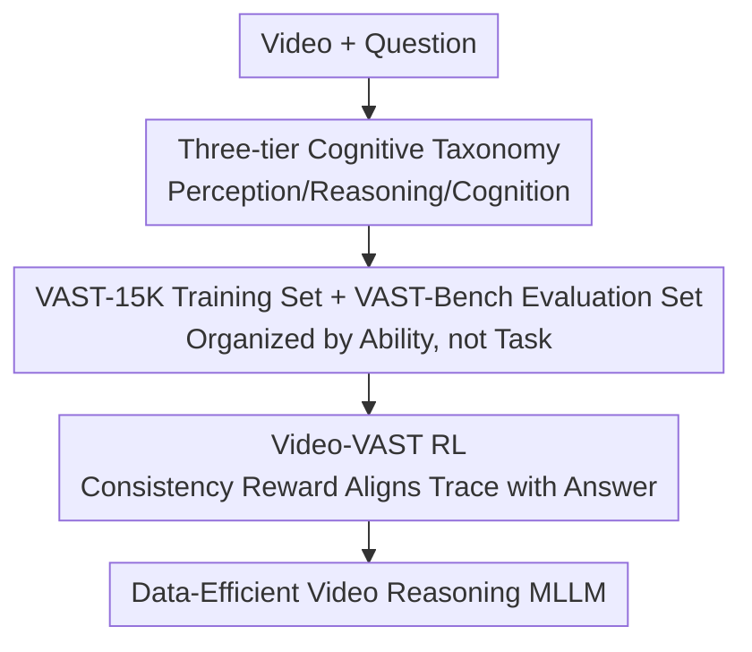

# VAST: Video Ability-Stratified Taxonomy for Data-Efficient Video Reasoning

**Conference**: CVPR 2026  
**Code**: [zhongan-wang.github.io/VAST](https://zhongan-wang.github.io/VAST)  
**Paper**: [CVF Open Access](https://openaccess.thecvf.com/content/CVPR2026/html/Wang_VAST_Video_Ability-Stratified_Taxonomy_for_Data-Efficient_Video_Reasoning_CVPR_2026_paper.html)  
**Area**: Video Understanding / Video Reasoning / Reinforcement Learning  
**Keywords**: Video reasoning, ability-stratified taxonomy, data-efficient RL, consistency reward, MLLM

## TL;DR
VAST advocates for organizing video reasoning training data by "underlying reasoning abilities" rather than "task formats." It proposes a three-tier cognitive taxonomy (Perception/Reasoning/Cognition) with the accompanying VAST-15K/VAST-Bench. Utilizing the Video-VAST reinforcement learning framework, which adds only a consistency reward without modifying the architecture, it achieves 66.3% on MVBench, surpassing Video-R1's 62.7% while saving approximately 72% of GPU hours and 96% of training samples.

## Background & Motivation
**Background**: Reinforcement Learning (RL) has become an effective means to enhance the video reasoning capabilities of Multimodal Large Language Models (MLLMs), following the success of large reasoning models.

**Limitations of Prior Work**: Existing methods suffer from low efficiency due to two main reasons: ① **Data is organized by task format rather than underlying ability**—this leads models to learn task-specific patterns instead of transferable abilities. To achieve generalization, one must cover massive "ability $\times$ task" combinations, making RL training coats extremely high. ② **Reliance on complex algorithmic designs to compensate for inefficiency**—specialized temporal architectures or multi-objective reward frameworks increase the complexity of training.

**Key Challenge**: Task format $\neq$ reasoning ability. When data is partitioned by task, models overfit to task patterns and fail to transfer one ability to other tasks. Consequently, systems must rely on scaling data and architectures, making them increasingly expensive.

**Goal**: To train video reasoning capabilities with better generalization using fewer data and computational resources.

**Core Idea**: Organize video understanding data according to a **cognitive ability hierarchy** (Perception $\to$ Reasoning $\to$ Cognition) and use a simple **consistency reward** RL (without architectural modifications) to align reasoning traces with final answers.

## Method

### Overall Architecture
VAST is a tripartite system composed of a "cognitive taxonomy + data/benchmark + RL framework." The taxonomy divides video understanding into three layers; VAST-15K (training set) and VAST-Bench (evaluation set) are constructed accordingly. Video-VAST (RL with consistency reward) is then used for training on this data without any architectural changes.

### Key Designs

**1. Three-tier Cognitive Taxonomy: Organizing Data by Ability (Perception/Reasoning/Cognition) rather than Task Format**

VAST structures video understanding into three progressive abilities: **Perception**—identifying what is in the video; **Reasoning**—performing temporal/causal inference based on perception; and **Cognition**—higher-level understanding and abstraction. The key shift is that training data is organized by these three **abilities** rather than task formats (QA/caption/grounding, etc.). Consequently, the model learns "transferable abilities" rather than "task-specific patterns," allowing it to generalize without covering every "ability $\times$ task" combination—this is the primary source of data efficiency. Based on this, VAST-15K (training) and VAST-Bench (evaluation with layer-wise diagnostics) were constructed.

**2. Video-VAST Consistency Reward: Aligning Reasoning Traces with Final Answers without Architectural Changes**

Addressing the pain point of "compensating for inefficiency with complex temporal architectures or multi-objective rewards," Video-VAST takes the opposite approach: **it makes no architectural modifications**. Instead, it adds a **consistency reward** in the RL process to encourage the model to generate reasoning traces that are consistent with the final answer. The intuition is that when the model's "thinking" and "answering" are aligned, the reasoning is authentic rather than post-hoc fabrication. This self-consistency signal serves as high-quality training supervision. Coupled with ability-stratified data, the consistency reward allows the model to learn robust, transferable reasoning using minimal samples.

## Key Experimental Results

### Main Results
Comparison with Video-R1 under identical training settings:

| Method | MVBench | VAST-Bench | GPU Hours | Training Samples |
|------|---------|-----------|--------|----------|
| Video-R1 | 62.7% | 54.3% | Baseline | Baseline |
| **Ours (Video-VAST)** | **66.3%** | **57.4%** | **~72% saved** | **~96% saved** |

Core finding: Higher accuracy achieved with significantly lower compute and data requirements (~72% fewer GPU hours, 96% fewer samples).

### Ablation Study

| Configuration | Result | Description |
|------|------|------|
| Full Video-VAST | Best | Ability-stratified data + Consistency reward |
| Task-organized data | Worse generalization | Learned task patterns instead of abilities |
| w/o Consistency reward | Trace-answer mismatch | Lack of self-consistency supervision |

### Key Findings
- **Data Organization > Algorithmic Complexity**: By relying solely on ability stratification and simple consistency rewards, the model outperformed Video-R1 using far less data, suggesting that the efficiency bottleneck lies in data organization rather than architecture.
- **Ability Stratification Enables Transferability**: Training by ability allows a single skill to generalize across tasks, eliminating the cost of covering exhaustive combinations.
- **Consistency Reward is Cheap, High-Quality Supervision**: Aligning "thinking" and "answering" requires no additional annotation or architecture but significantly improves quality.

## Highlights & Insights
- **"Organizing data by ability rather than task"** is the most valuable perspective shift, transferable to any multimodal reasoning task where RL training efficiency is low (image reasoning, document reasoning, embodied planning).
- **Extreme Data/Compute Savings** (96% fewer samples while remaining stronger) provide significant practical value, lowering the barrier to entry for video reasoning RL.
- **No architectural changes with only a consistency reward** demonstrates that "simple is effective," countering the trend toward complex designs to compensate for inefficiency.

## Limitations & Future Work
- The granularity and boundaries of the three-tier cognitive taxonomy are somewhat subjective and may need redefinition when migrating across datasets.
- The consistency reward depends on the quality of the reasoning trace; if the generated trace is inherently low-quality, the self-consistency signal might reinforce incorrect patterns.
- Evaluation was primarily conducted on MVBench/VAST-Bench; effectiveness on broader long-form video or complex multi-event reasoning remains to be verified.

## Related Work & Insights
- **vs Video-R1**: While both use RL for video reasoning, VAST surpasses Video-R1 with significantly less compute and data by using ability-stratified data and consistency rewards.
- **vs Specialized Temporal Architectures / Multi-objective Reward Methods**: VAST demonstrates that data organization is more critical than algorithmic complexity by using a standard architecture and a single consistency reward.
- **vs Task-Format Training Paradigms**: VAST organizes by ability, learning transferable skills rather than task-specific patterns.

## Rating
- Novelty: ⭐⭐⭐⭐ The perspective of "ability-stratified data organization" + consistency reward is relatively fresh.
- Experimental Thoroughness: ⭐⭐⭐⭐ Comparison across both accuracy and efficiency dimensions + ablations; benchmark coverage is moderate.
- Writing Quality: ⭐⭐⭐⭐ Clear logical chain from the two inefficiency causes to the taxonomy and RL framework.
- Value: ⭐⭐⭐⭐ Significantly reduces the data/compute cost of video reasoning RL, offering high practicality.

<!-- RELATED:START -->

## Related Papers

- [\[CVPR 2026\] Incentivizing Versatile Video Reasoning in MLLMs via Data-Efficient Reinforcement Learning](incentivizing_versatile_video_reasoning_in_mllms_via_data-efficient_reinforcemen.md)
- [\[CVPR 2026\] Thinking with Drafts: Speculative Temporal Reasoning for Efficient Long Video Understanding](thinking_with_drafts_speculative_temporal_reasoning_for_efficient_long_video_und.md)
- [\[CVPR 2026\] Agentic Video Summarization via Self-Reflecting Multimodal Understanding](agentic_video_summarization_via_self-reflecting_multimodal_understanding.md)
- [\[CVPR 2026\] Reinforce to Learn, Elect to Reason: A Dual Paradigm for Video Reasoning](reinforce_to_learn_elect_to_reason_a_dual_paradigm_for_video_reasoning.md)
- [\[CVPR 2026\] VideoAuto-R1: Video Auto Reasoning via Thinking Once, Answering Twice](videoauto-r1_video_auto_reasoning_via_thinking_once_answering_twice.md)

<!-- RELATED:END -->
