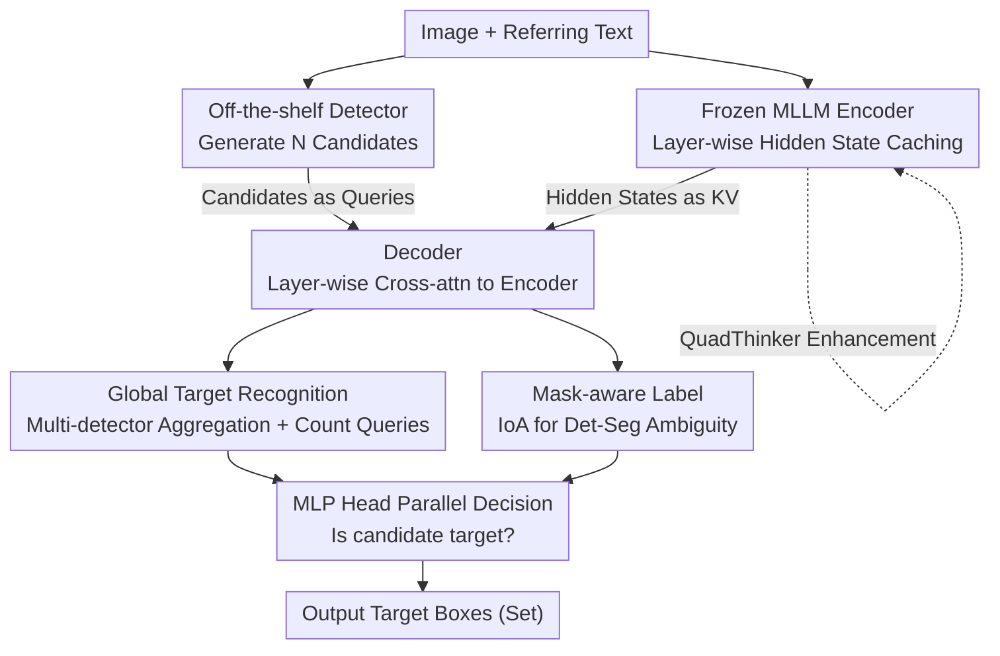

# VGent: Visual Grounding via Modular Design for Disentangling Reasoning and Prediction

**Conference**: CVPR 2026  
**Paper**: [CVF Open Access](https://openaccess.thecvf.com/content/CVPR2026/html/Kang_VGent_Visual_Grounding_via_Modular_Design_for_Disentangling_Reasoning_and_CVPR_20_26_paper.html)  
**Code**: To be confirmed  
**Area**: Multimodal VLM (Visual Grounding)  
**Keywords**: Visual Grounding, Multi-target Grounding, Modular Design, Frozen MLLM, RL Reasoning

## TL;DR
VGent decomposes visual grounding into "high-level reasoning" and "low-level box prediction". It utilizes a frozen Multimodal Large Language Model (MLLM) as an encoder responsible solely for reasoning, employs off-the-shelf detectors to generate candidate boxes, and uses a decoder to cross-attend to the encoder's hidden states to "select" target boxes. This avoids the slowness and hallucinations associated with autoregressive word-by-word decoding, achieving a massive +20.6% F1 gain on multi-target benchmarks with constant inference latency.

## Background & Motivation

**Background**: In the MLLM era, visual grounding (predicting boxes for referred objects in a text) is dominated by two paradigms. **Native-token**: Direct use of the MLLM's original vocabulary, treating box coordinates as ordinary tokens for autoregressive output (e.g., Qwen2.5-VL, Shikra, KOSMOS-2). **New-token**: Introduction of special [Det] or [Seg] tokens outside the LLM vocabulary, requiring supervised fine-tuning to map objects into these tokens for downstream decoding (e.g., LISA, GLaMM, PixelLM).

**Limitations of Prior Work**: Both paradigms have significant drawbacks. Native-token methods are inherently slow—each box coordinate token requires a full pass through the transformer stack, making inference time grow **linearly** with the number of targets. They are also prone to hallucinations, such as stopping prematurely or entering infinite loops in dense scenes. New-token methods require large-scale data collection and extensive LLM fine-tuning, which fails to leverage excellent open-source MLLMs and **degrades the general reasoning capabilities** inherited from LLM pre-training.

**Key Challenge**: The authors identify a fundamental conflict: forcing a single, monolithic model to excel at both "abstract semantic reasoning" and "precise low-level localization" inevitably leads to trade-offs, compromising both efficiency and reasoning fidelity. These two capabilities are fundamentally different and should be handled by specialized components.

**Key Insight**: The strengths of MLLMs and detectors are **complementary**: MLLMs excel at reasoning and semantic alignment, while detectors excel at efficient, high-recall localization. Why not let the MLLM handle reasoning and the detector handle box generation, using a lightweight decoder to "harmonize" the two?

**Core Idea**: A modular encoder-decoder framework utilizing a "frozen MLLM encoder + detector candidate boxes + cross-attention selection decoder." This **explicitly decouples** high-level reasoning from low-level box prediction, preserving the pre-trained power of the MLLM while completely avoiding autoregressive decoding.

## Method

### Overall Architecture

VGent is a modular encoder-decoder framework that separates "reasoning" from "selection." Given an image and a referring text, the workflow is: **(1) Encoder**: A frozen MLLM (enhanced by QuadThinker) processes the multimodal sequence to **cache hidden states layer-by-layer** (shallow layers encode identity/count, deep layers encode abstract semantics). **(2) Detector**: An off-the-shelf detector generates $N$ high-recall candidate boxes $p \in \mathbb{R}^{N\times4}$ from the image. **(3) Decoder**: Initialized from encoder layers, it projects boxes into queries $q\in\mathbb{R}^{N\times C}$ via an MLP. It layer-wise cross-attends to the corresponding encoder hidden states (keys/values), followed by an MLP head to determine if each candidate is a target. Since the decision is a **parallel** binary classification rather than autoregressive generation, inference latency remains constant regardless of target count.

Three modular enhancements are integrated: QuadThinker for multi-target reasoning, mask-aware labels to fix training ambiguity, and global target recognition to strengthen selection under multiple detector candidates.

### Key Designs

**1. Frozen MLLM Encoder + Detector Candidates + Hidden State Decoding: Decoupling Reasoning and Selection**

This core architecture addresses the conflict of single-model reasoning and localization. The encoder is a **frozen** pre-trained MLLM that preserves reasoning power while acting as a carrier for reasoning signals via its **layer-wise hidden states**. Boxes are not generated by the MLLM but proposed by a detector. The decoder is initialized from the encoder's LLM layers. The $i$-th decoder layer takes queries from the previous decoder layer and uses keys/values from the **$(i-1)$-th layer** of the encoder—this **layer-wise alignment** allows the decoder to precisely read corresponding reasoning information. The decoder performs cross-attention (candidates reading hidden states) and self-attention (candidates exchanging info), followed by an FFN. Parallel binary classification is then used for final selection.

**2. QuadThinker: Strengthening Multi-target Reasoning via GRPO**

It is observed that pre-trained MLLMs experience performance drops in multi-object scenes, identifying **multi-target reasoning as a bottleneck**. QuadThinker is a Reinforcement Learning fine-tuning paradigm based on GRPO. It uses "self-verifiable" rewards to force "local-to-global" reasoning: the model is prompted to divide the image into four quadrants, count targets in **each quadrant** (using `<top_left>`, etc., tags), summarize the total count (`<number>`), and finally output boxes in `<answer>`. Rewards include **format rewards** (checking for tags and valid JSON) and **accuracy rewards** (IoU, L1, and center distance). This verifiable reward structure explicitly suppresses hallucinations like under-counting in dense scenes.

**3. Mask-aware Label: Replacing IoU with IoA to Bridge Det-Seg Ambiguity**

Using IoU for decoder labels is problematic: detection requires one-to-one matching, while segmentation requires all pixels of an object. In cases where a detector splits a single ground truth (GT) mask into **independent boxes** (e.g., a main object and its small attachment), standard IoU-based filtering may discard small fragment candidates. The authors introduce **Intersection-over-Area (IoA)**: candidates are converted to masks via SAM, and the overlap with the union of GT masks is divided by the **area of the candidate**. Candidates with IoA > 0.6 are labeled positive. This allows small yet valid fragment proposals to be retained.

**4. Global Target Recognition: Global Info Injection via Learnable Count Queries**

To enhance selection when using multiple detectors, a global target awareness is introduced. Candidates from multiple detectors are **aggregated** into a unified set. A small set of **learnable queries** is concatenated with candidate queries. Half of these are trained to predict the **total target count**, and half predict the **count of positive candidates** (based on mask-aware labels). These learnable queries encode global information and broadcast it to each candidate query via self-attention, allowing for a more holistic understanding of the "target group."

### Loss & Training

The main task uses BCE loss (weight 1) for candidate classification; learnable count queries use L1 loss (weight 10). The learning rate is 2e-5 with linear decay. During the QuadThinker stage, Qwen2.5-VL-7B is fine-tuned using GRPO on MaskGroups-HQ + VisionReasoner-7K for 1 epoch (batch 16, lr 1e-6). After RL, the encoder is frozen. The total model contains approximately 15.7B parameters.

## Key Experimental Results

### Main Results

Multi-target grounding (ORES / MaskGroups-HQ, gIoU/cIoU/F1):

| Model | Overall F1 | Overall gIoU | Overall cIoU | w/ mask-ref F1 |
|------|---------|-----------|-----------|----------------|
| RAS-13B (Prev. SOTA) | 50.89 | 64.77 | 73.13 | 48.80 |
| Qwen3-VL-30B-A3B | 53.23 | 58.76 | 57.61 | 34.98 |
| **VGent (Ours, ~15.7B)** | **71.47** | **68.42** | **75.28** | **70.45** |

Overall F1 is **+20.58%** higher than RAS-13B. On the w/ `<mask-ref>` split, gains are +8.22% gIoU and +5.83% cIoU. Notably, the much larger Qwen3-VL-30B struggles in multi-target settings, confirming that multi-target, not single-target, is the current bottleneck.

Single-target grounding (REC, RefCOCO series, Accuracy):

| Model | RefCOCO+ testB | RefCOCOg val | Average |
|------|----------------|--------------|------|
| Qwen2.5-VL-7B (backbone) | 76.9 | 87.2 | 86.6 |
| InternVL3.5-38B | 84.7 | 89.7 | 89.1 |
| **VGent (Ours)** | **83.3** | **90.4** | **90.1** |

Average accuracy is 90.1%, surpassing larger models like InternVL3.5-38B. Compared to its backbone Qwen2.5-VL-7B, it shows an average gain of +3.5%.

### Ablation Study

QuadThinker and Modular Design (MaskGroups-HQ w/o mask-ref, F1 by target count):

| Configuration | Overall | 6–10 targets | 11+ targets |
|------|------|-----------|----------|
| (1) Qwen2.5-VL | 45.72 | 41.33 | 15.97 |
| (2) + Detection RL | 54.89 | 56.79 | 41.43 |
| (3) + Number RL | 58.17 | 61.35 | 50.39 |
| (4) (1)+VGent Framework | 58.77 | 64.33 | 53.84 |
| (5) (3)+VGent Framework | **60.55** | **65.07** | **54.53** |
| (6) (5)+Full Train (Unfrozen) | 45.66 | 53.26 | 49.39 |

Decoder Enhancements (Building on (5)):

| Configuration | F1 | gIoU | cIoU |
|------|----|------|------|
| (7) + HQ Data | 69.70 | 65.02 | 65.84 |
| (8) + Mask-aware Label | 70.47 | 67.06 | 69.35 |
| (9) + Global Target Recognition | **71.60** | **69.72** | **72.78** |

### Key Findings
- **Gains increase with target density**: In the 11+ targets bucket, F1 improves from a baseline 15.97 to 54.53, proving the modular design specifically addresses the multi-target bottleneck where LLMs typically fail.
- **Encoder must remain frozen**: Configuration (6) involving joint training (unfrozen encoder) drops F1 from 60.55 to 45.66, confirming that altering the pre-trained reasoning space causes systemic degradation.
- **Decoder enhancements are cumulative**: Mask-aware Label mainly improves gIoU/cIoU by recovering fragmented candidates, while Global Target Recognition boosts F1/cIoU by adding global context.
- **Constant Inference Latency**: Unlike autoregressive MLLMs whose latency scales linearly with boxes, VGent maintains a fast, constant speed.

## Highlights & Insights
- **"Frozen MLLM + Hidden State KV" is a brilliant design**: It treats hidden states as existing reasoning signals for an external decoder. This enables adding localization capabilities at zero cost to general reasoning power.
- **Layer-wise Alignment**: Initializing the decoder from LLM layers and matching $i$ to $i-1$ ensures the "abstraction level" of the reader matches the signal, which is more interpretable than random initialization.
- **IoA as a replacement for IoU**: This is highly transferable. For any scenario where detection boxes conflict with pixel recall (instance segmentation, open-vocabulary detection), normalizing by candidate area is a robust trick to save "fragment" proposals.
- **QuadThinker Quadrant Counting**: Translating "hallucination" into a verifiable "quadrant step-by-step" RL reward is a practical recipe for improving MLLM counting accuracy.

## Limitations & Future Work
- **Dependency on Detector Recall**: The decoder can only select from what the detector provides. If a detector misses an object, VGent cannot recover it; multi-detector aggregation is only a partial fix.
- **Heavy Pipeline**: Combining a frozen MLLM, multiple detectors, SAM for masks, and a decoder results in a long deployment chain and ~15.7B parameters.
- **Mask Dependence on SAM**: Segmentation performance relies on SAM's prompt-to-mask quality; biases in SAM may propagate to evaluation metrics.
- **Learnable count query normalization** (/1000) is somewhat ad-hoc and requires further validation across different object scales.

## Related Work & Insights
- **vs. Native-token (Qwen2.5-VL / Shikra)**: These models are slow and linear with target count. VGent uses parallel prediction, making it faster and more hallucination-resistant.
- **vs. New-token (LISA / GLaMM)**: These require invasive LLM tuning and new data. VGent is modular, keeping the LLM frozen and the reasoning space intact.
- **vs. RAS (Previous SOTA)**: RAS concatenates object features into sequences for classification; VGent uses hidden state cross-attention + QuadThinker + IoA, leading to a massive +20.58% F1 improvement.

## Rating
- Novelty: ⭐⭐⭐⭐⭐ The decoupling paradigm of "Frozen MLLM as KV, Detector as Query" is highly novel and consistent.
- Experimental Thoroughness: ⭐⭐⭐⭐ Multi/single-target evaluation and bucketing are comprehensive, though results for additional benchmarks are shifted to the appendix.
- Writing Quality: ⭐⭐⭐⭐ Clear chain of Motivation-Conflict-Solution with strong visualizations.
- Value: ⭐⭐⭐⭐⭐ Directly addresses the multi-target bottleneck. The "Frozen backbone + IoA label" insights are highly valuable for practical implementation.

<!-- RELATED:START -->

## Related Papers

- [\[CVPR 2026\] Dr. Seg: Revisiting GRPO Training for Visual Large Language Models through Perception-Oriented Design](dr_seg_revisiting_grpo_training_for_visual_large_language_models_through_percept.md)
- [\[CVPR 2026\] DocSeeker: Structured Visual Reasoning with Evidence Grounding for Long Document Understanding](docseeker_long_document_understanding.md)
- [\[ICML 2026\] Decomposed On-Policy Distillation for Vision-Language Reasoning: Steering Gradients for Visual Grounding](../../ICML2026/vlm_reasoning/decomposed_on-policy_distillation_for_vision-language_reasoning_steering_gradien.md)
- [\[ICLR 2026\] Fostering Video Reasoning via Next-Event Prediction](../../ICLR2026/vlm_reasoning/fostering_video_reasoning_via_next-event_prediction.md)
- [\[ICML 2026\] Learning GUI Grounding with Spatial Reasoning from Visual Feedback](../../ICML2026/vlm_reasoning/learning_gui_grounding_with_spatial_reasoning_from_visual_feedback.md)

<!-- RELATED:END -->
