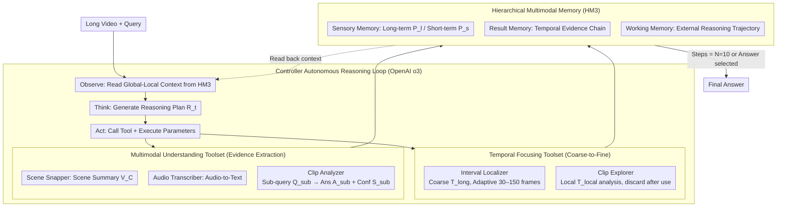

# VideoARM: Agentic Reasoning over Hierarchical Memory for Long-Form Video Understanding

**Conference**: CVPR 2026  
**arXiv**: [2512.12360](https://arxiv.org/abs/2512.12360)  
**Code**: [https://milvlg.github.io/videoarm/](https://milvlg.github.io/videoarm/)  
**Area**: Video Understanding / LLM Agent  
**Keywords**: Long-form Video Understanding, Agentic Reasoning, Hierarchical Memory, Coarse-to-Fine Reasoning, Token Efficiency

## TL;DR
VideoARM proposes an agentic reasoning paradigm based on Hierarchical Multimodal Memory (HM3). Through an adaptive cycle of "observe-think-act-memorize" and a coarse-to-fine tool-use strategy, it surpasses SOTA on long-video understanding benchmarks while reducing token consumption to 1/34 of DVD.

## Background & Motivation

1. **Background**: Long-form video understanding requires capturing fine-grained spatiotemporal details and reasoning over long-range dependencies across videos ranging from tens of minutes to hours. The long-context capabilities and cross-modal alignment of MLLMs provide a foundation for this. Existing LLM-driven methods fall into two categories: hand-crafted reasoning pipelines (e.g., LLoVi, VideoTree) and autonomous agentic reasoning (e.g., DVD).

2. **Limitations of Prior Work**: (a) Hand-crafted methods (VideoTree) follow a fixed pipeline of segmenting $\rightarrow$ clustering $\rightarrow$ scoring $\rightarrow$ tree-building $\rightarrow$ reasoning, which limits autonomy and fails to fully exploit the reasoning capabilities of stronger base models. (b) Agentic methods (DVD) perform exhaustive preprocessing on all 10-second segments to build a database, resulting in extremely high token consumption (~4 million tokens for a 30-minute video), and the database remains static during reasoning.

3. **Key Challenge**: Exhaustive preprocessing is both token-wasteful and introduces query-irrelevant redundancy; meanwhile, hand-crafted pipelines restrict the potential for autonomous reasoning. How can reasoning quality be maintained while significantly reducing token consumption?

4. **Goal**: To design an adaptive, on-demand agentic reasoning paradigm that replaces static exhaustive preprocessing to achieve efficient and flexible long-video understanding.

5. **Key Insight**: Use hierarchical memory (sensory $\rightarrow$ result $\rightarrow$ working) to replace pre-built databases, allowing the agent to dynamically construct memory on demand. Use a coarse-to-fine toolset to replace the retrieval paradigm, enabling the agent to narrow the search scope through temporal focusing and local analysis.

6. **Core Idea**: Replace the static database with dynamically constructed Hierarchical Multimodal Memory (HM3), allowing the MLLM agent to explore the video on demand within an "observe-think-act-memorize" loop for token-efficient long-video reasoning.

## Method

### Overall Architecture
VideoARM addresses the fact that query-relevant information in long videos occupies only a small fraction of the total duration. Unlike DVD-style agents that pre-process every 10-second clip, VideoARM functions without exhaustive preprocessing, allowing an MLLM agent to retrieve information on demand during reasoning.

The system operates across two layers. One is the **Hierarchical Multimodal Memory (HM3)**, a three-layer structure (Sensory / Result / Working) that dynamically records observations, actions, and thoughts. The other is the **Coarse-to-Fine Reasoning Agent**, driven by a Controller (OpenAI o3). Equipped with temporal focusing and multimodal understanding toolsets, it determines the next segment to observe and the tool to use within an observe-think-act-memorize loop, terminating after a maximum of $N=10$ steps. The process mimics a "locate then zoom" strategy, focusing token expenditure only on query-relevant regions.

### Key Designs

**1. Hierarchical Multimodal Memory (HM3): Dynamic Memory over Static Databases**

HM3 decomposes the agent's context into three layers constructed incrementally. **Sensory Memory** stores visual materials, divided into a long-term sensory pool $P_l$ (frames from the current time interval, compressed via 3×2 grid mosaics to save tokens) and a short-term sensory pool $P_s$ (frames/audio from local probes, discarded immediately after analysis). **Result Memory** records tool outputs and corresponding intervals chronologically, forming an ordered evidence chain to prevent redundant exploration. **Working Memory** records reasoning trajectories and intentions before each tool call, externalizing the chain of thought. This design abstracts information from perception to semantics to cognition, reducing the context length pressure on the LLM.

**2. Temporal Focusing Toolset: Narrowing the Search Space**

To avoid exhaustive frame analysis, the "temporal funnel" tools are employed. **Interval Localizer** identifies the interval $T_{long}$ most relevant to the query based on HM3 signals and adaptively decides the number of frames $N_1$ to sample (30–150 frames). These are synthesized into a compact 3×2 grid to refresh the long-term sensory pool. **Clip Explorer** performs fine-grained probing in a local interval $T_{local}$ within the global focus, sampling $N_2$ frames for the short-term pool and capturing audio for hypothesis verification without altering the global focus.

**3. Multimodal Understanding Toolset: Multidimensional Evidence Extraction**

Three complementary tools transform pixels into semantic reasoning components. **Scene Snapper** provides a global semantic overview $V_C$ from the frames in the long-term pool. **Audio Transcriber** uses whisper-1 to provide auditory semantics when visual cues are insufficient. **Clip Analyzer** analyzes frames in the short-term pool to resolve a specific sub-query $Q_{sub}$, returning an answer $A_{sub}$ and confidence $S_{sub}$. The Controller combines these tools to balance breadth (overview) and depth (fine-grained details).

**4. Controller Reasoning Loop: Autonomous Decision Making**

Unlike fixed pipelines, VideoARM's Controller (OpenAI o3) follows a lean observe-think-act-memorize loop without predefined workflows. In each iteration, it observes HM3 context, generates a plan $R_t$, executes a tool, and updates HM3. This "blank slate" design allows the Controller to manage tool orchestration autonomously, making the system highly sensitive to the base model's reasoning strength.

## Key Experimental Results

### Main Results

| Method | Video-MME Overall | Video-MME Long | LongVideoBench | EgoSchema |
|------|-------------------|----------------|----------------|-----------|
| GPT-4o | 71.9 | 65.3 | 66.7 | 72.2 |
| OpenAI o3 | - | 63.2 | 67.5 | 63.2 |
| DVD | - | 67.3 | 71.6 | 76.6 |
| VideoLucy | 72.5 | 66.8 | - | - |
| **VideoARM (o3+GPT-4.1)** | **80.1** | **75.3** | **73.7** | **78.2** |
| **VideoARM (o3+GPT-4o)** | **82.8** | **81.2** | **78.0** | 76.2 |

### Token Efficiency

| Method | Theoretical (30min/1query) | Empirical (10 videos/30 queries) |
|------|------------------------|---------------------------|
| DVD | 3.98M tokens | 64.21M tokens |
| **VideoARM** | **0.08M (1/50 of DVD)** | **1.89M (1/34 of DVD)** |

### Ablation Study

| Configuration | Video-MME Long |
|------|----------------|
| Full (o3 + GPT-4.1) | 76.5 |
| w/o Short-term sensory pool | 72.5 (-4.0) |
| w/o Long-term sensory pool | 67.0 (-9.5) |
| w/o Result memory | Failure (Infinite loop) |
| w/o Working memory | 75.5 (-1.0) |
| Controller: GPT-4o | 40.5 |
| Controller: Qwen3-VL | 54.9 |

### Key Findings
- VideoARM achieves 81.2% on Video-MME Long, significantly surpassing DVD's 67.3% (+13.9pp) while consuming only 1/34 of the tokens.
- Long-term sensory memory is critical (-9.5% when removed), showing that temporal focusing effectively reduces the search space.
- Reasoning capability is paramount; swapping o3 for GPT-4o as the Controller dropped performance to 40.5%.
- Adaptive frame sampling (avg. 49.8 frames) outperforms fixed sampling (76.5 vs 74.0).

## Highlights & Insights
- **Dynamic Memory vs. Static Database**: Instead of costly pre-processing, on-demand construction mimics lazy evaluation in computer science, focusing resources on query-relevant content.
- **Cognitive Architecture**: The sensory-working-result hierarchy aligns with human cognitive models. Externalizing Working Memory effectively sidesteps LLM context window limits.
- **Controller Autonomy**: Entrusting tool orchestration to a strong reasoning model (o3) rather than hard-coded logic maximizes the potential of frontier models.

## Limitations & Future Work
- Heavy reliance on expensive APIs (o3, GPT-4o, whisper-1) limits local deployment.
- A 10-step reasoning budget may be insufficient for ultra-long videos (>1h).
- Frame sampling and mosaic strategies may lead to loss of fine-grained spatial details.
- Significant performance drop when using open-source models as Controllers suggests high dependency on closed-source model reasoning.

## Related Work & Insights
- **vs. DVD**: VideoARM replaces "exhaustive preprocessing + retrieval" with "on-demand reasoning + memory," achieving a 34x token efficiency gain and +13.9pp accuracy improvement.
- **vs. VideoTree**: VideoARM uses adaptive tool-calling rather than fixed hierarchical clustering, offering greater flexibility.
- **Insight**: The paradigm of dynamic hierarchical memory is applicable to other domains requiring exploration of large-scale information, such as long-document analysis and multimodal RAG.

## Rating
- Novelty: ⭐⭐⭐⭐ (HM3 and on-demand reasoning are innovative, though the cycle itself is known).
- Experimental Thoroughness: ⭐⭐⭐⭐⭐ (Tested on 5 benchmarks with extensive ablations).
- Writing Quality: ⭐⭐⭐⭐ (Clear structure and detailed tool descriptions).
- Value: ⭐⭐⭐⭐ (Significant token efficiency gains for practical long-form video applications).

<!-- RELATED:START -->

## Related Papers

- [\[CVPR 2026\] OASIS: On-Demand Hierarchical Event Memory for Streaming Video Reasoning](oasis_on-demand_hierarchical_event_memory_for_streaming_video_reasoning.md)
- [\[CVPR 2026\] REVISOR: Beyond Textual Reflection, Towards Multimodal Introspective Reasoning in Long-Form Video Understanding](revisor_beyond_textual_reflection_towards_multimodal_introspective_reasoning_in_.md)
- [\[CVPR 2026\] Agentic Video Summarization via Self-Reflecting Multimodal Understanding](agentic_video_summarization_via_self-reflecting_multimodal_understanding.md)
- [\[CVPR 2026\] Thinking with Drafts: Speculative Temporal Reasoning for Efficient Long Video Understanding](thinking_with_drafts_speculative_temporal_reasoning_for_efficient_long_video_und.md)
- [\[ICLR 2026\] TimeSearch-R: Adaptive Temporal Search for Long-Form Video Understanding via Self-Verification Reinforcement Learning](../../ICLR2026/vlm_reasoning/timesearch-r_adaptive_temporal_search_for_long-form_video_understanding_via_self.md)

<!-- RELATED:END -->
