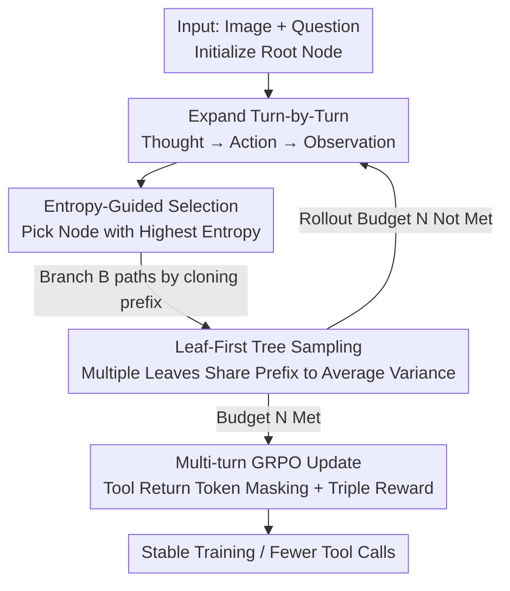

# VisionLeaf: Entropy-Guided Leaf-First Reasoning for Efficient and Accurate Think-with-Image

**Conference**: CVPR 2026  
**Paper**: [CVF Open Access](https://openaccess.thecvf.com/content/CVPR2026/html/Gui_VisionLeaf_Entropy-Guided_Leaf-First_Reasoning_for_Efficient_and_Accurate_Think-with-Image_CVPR_2026_paper.html)  
**Code**: To be released (authors state: All our code will be released)  
**Area**: Multimodal VLM / Visual Reinforcement Learning / Think-with-Image  
**Keywords**: think-with-image, GRPO, entropy-guided, tree sampling, tool calling

## TL;DR
VisionLeaf treats the multi-turn tool calling in think-with-image as a reasoning tree. Instead of a single-chain rollout from the root as in standard GRPO, it performs "leaf-first" splitting at nodes with the highest entropy. This approach improves Qwen2.5-VL-7B performance on VStar and HR-Bench by approximately 4.2% while nearly halving the number of tool calls, without modifying the model or training data.

## Background & Motivation
**Background**: The think-with-image paradigm has gained traction recently. Models no longer answer after a single glance at an image; instead, they embed "crop/zoom" visual tool calls into the reasoning loop, extracting local details on demand and feeding results back into subsequent reasoning. Open-source works like PixelReasoner and DeepEyes generally use Group Relative Policy Optimization (GRPO) from the LLM domain to train such visual agents.

**Limitations of Prior Work**: The authors observe that directly applying GRPO to think-with-image leads to two issues: **training instability** and **excessive tool calls** during inference (e.g., cropping multiple times unnecessarily). Fundamentally, GRPO is designed for single-turn VQA and lacks adaptation for "multi-turn dialogue + tool injection."

**Key Challenge**: Think-with-image naturally forms a multi-node "reasoning chain" where each tool call depends on the previous step, yet rewards are only provided at the final leaf node (answer correctness). This creates two problems: ① Early nodes receive backpropagated signals with the highest variance—even if an early crop strategy is correct, an error in a later leaf sends a negative gradient to that correct early decision; ② Each tool call causes a surge in token entropy (larger action space/uncertainty), but vanilla GRPO only allows **one** branch at any intermediate node. This creates a mismatch between increased exploration space and static exploration paths, further amplifying variance.

**Goal**: Redesign the RL sampling method for think-with-image to make training more stable, inference more efficient, and performance higher, without modifying the base model or adding training data.

**Key Insight**: Since instability arises from "high variance at early nodes + single branching at high-entropy nodes," the solution is to organize multiple rollouts into a tree with shared prefixes and split multiple branches at nodes with the highest entropy (highest uncertainty, most worth exploring).

**Core Idea**: Replace the "root-to-leaf single chain" rollout of GRPO with a "leaf-first + entropy-guided" tree rollout—branching more at high-entropy nodes to allow multiple leaves to share and average the variance of early prefixes.

## Method

### Overall Architecture
VisionLeaf is a **sampling strategy modification** built on top of GRPO. It does not change the model architecture or the core loss function; it only changes "how a set of rollouts is sampled from a prompt." A rollout is modeled as a search tree expanded turn by turn: each node corresponds to a partial trajectory, and a "turn" is a triplet $(T_i, A_i, O_i)$—thought, action (crop/zoom command), and observation (image crop). There is a maximum of 5 turns. While standard GRPO expands a single path from root to leaf, VisionLeaf maintains a "frontier of nodes to be expanded," repeatedly selecting nodes with the highest local uncertainty (entropy) to clone the prefix and sample $B$ one-turn continuations until the fixed rollout budget $N$ is met. Because many leaves share the same early prefix, the estimates for early decisions are averaged across multiple leaves, reducing variance. Modern autoregressive inference can reuse KV cache for shared prefixes, making "multi-branching" more computationally efficient than single chains.

### Key Designs

**1. Leaf-First Tree Rollout: Variance Averaging via Shared Prefixes**

To address the "high variance at early nodes" issue, VisionLeaf changes the set of rollouts from "$G$ independent root-to-leaf chains" to "a tree with shared prefixes." Formally, the state of the $i$-th node at depth $j$, $n_j^{(i)}$, is its prefix $s(n_j^{(i)}) = \big((T_0, A_0, O_0), \dots, (T_j, A_j, O_j)\big)$. The algorithm maintains a set of candidate nodes $A$, advances them by one turn, estimates their entropy, selects $n^*$ with the highest entropy, and clones $B$ children from it. This repeats until the number of leaves $|C| \ge N$. Since many final leaves share the same early nodes, early decisions are estimated by a cluster of leaves rather than a single noisy trajectory, directly mitigating high variance. Unlike vanilla GRPO, which branches only at the root (all rollouts diverge from the initial prompt), VisionLeaf branches at the leaves, which better fits the hierarchical nature of multi-step image analysis.

**2. Entropy-Guided Selection: Allocating Exploration Budget Wisely**

The criterion for selection is crucial for multi-branching. The authors define node entropy as the entropy of the distribution of the first token in the next turn $H(n) := -\sum_x p_\theta(x \mid s(n)) \log p_\theta(x \mid s(n))$ (implemented using min-entropy for efficiency). The algorithm always selects $n^* \in \arg\max_{n \in A} H(n)$ to split. The motivation is straightforward: tool calls cause a surge in token entropy, indicating the action space has opened up and is most worth exploring. Sampling more branches at high-entropy nodes concentrates the exploration budget on branches with maximum uncertainty and potential gain. Ablations (Table 2) show that high-entropy selection outperforms random and low-entropy selection—the latter is even worse than random as it traps the model in a narrow exploration space.

**3. Multi-turn GRPO + Tool Token Masking: Preventing Gradient Pollution**

Think-with-image trajectories alternate between "model-generated tokens" and "tool-returned image payload tokens," the latter varying significantly in length. If standard GRPO processes all tokens equally, tool-returned tokens would contribute incorrect signals and distort normalization scales. VisionLeaf introduces a binary mask operator $I(o_{i,t}) \in \{0,1\}$, which is 1 only for tokens generated by the LLM. The clipped GRPO term is accumulated only where $I(o_{i,t})=1$ and normalized by the count of optimizable tokens. This ensures tool payloads do not enter the gradient calculation or affect the loss scale, stabilizing multi-turn optimization.

**4. Three-item Reward + Tool Gate: Suppressing Reward Hacking**

To align with DeepEyes and prevent "calling tools for the sake of calling," the total reward is the sum of three components: accuracy reward $R_{acc}$, strict format penalty $R_{format}$, and tool efficiency reward $R_{tool}$:

$$R(\tau) = \phi_1 R_{acc} + \phi_2 R_{format} + \phi_3 \mathbb{I}_{acc>0} R_{tool}$$

Where $\phi_1=0.8,\ \phi_2=-0.2,\ \phi_3=1.2$. The key is the gate $\mathbb{I}_{acc>0}$: **tool rewards are only granted if the successful tool call leads to a correct answer**. This prevents reward hacking where the model outputs fake tool call strings or irrelevant text to farm tool rewards, effectively linking "using tools" with "using tools correctly."

### Loss & Training
The base model is Qwen2.5-VL-7B-Instruct, trained using the VeRL framework with GRPO: batch size 128, learning rate $1\times10^{-6}$, 16 rollouts per prompt, maximum 5 turns. Rollout backends use sglang with asynchronous acceleration. The training set is identical to DeepEyes (DeepEyes-Datasets-47k), and evaluation follows the DeepEyes LLM-as-a-Judge protocol to ensure fair comparison.

## Key Experimental Results

### Main Results
Evaluated on fine-grained visual reasoning benchmarks (VStar, MME-RealWorld, HR-Bench), VisionLeaf is compared against other think-with-image methods (all 7B unless noted):

| Dataset / Metric | Qwen2.5-VL | Pixel Reasoner | DeepEyes | VisionLeaf | Gain vs Strongest Baseline |
|------------------|------------|----------------|----------|------------|----------------------------|
| VStar Overall    | 0.744      | 0.843          | 0.806    | **0.848**  | +4.2% vs DeepEyes          |
| MME-RealWorld    | 0.446      | —              | 0.519    | **0.540**  | +2.1pt                     |
| HR-Bench 4K      | 0.689      | 0.726          | 0.743    | **0.766**  | +2.3pt                     |
| HR-Bench 8K      | 0.619      | 0.661          | 0.688    | **0.721**  | +3.3pt                     |

Notably, VisionLeaf at 84.8% on VStar surpasses the 55B PaLI-X-VPD (76.6%). Efficiency-wise, the average tool call count for VisionLeaf is significantly lower than DeepEyes, nearly halved, which also reduces token consumption and latency.

### Ablation Study
Ablation of the node selection strategy (Table 2, scores across benchmarks):

| Selection Strategy | VStar     | MME-Rel.  | MME-Dir.  | HR-4K     | HR-8K     |
|--------------------|-----------|-----------|-----------|-----------|-----------|
| High (Ours)        | **0.842** | **0.852** | **0.540** | **0.766** | **0.721** |
| Random             | 0.829     | 0.843     | 0.534     | 0.754     | 0.718     |
| Low                | 0.803     | 0.843     | 0.525     | 0.750     | 0.694     |

### Key Findings
- **Selection strategy is crucial**: High-entropy selection is globally optimal, while low-entropy is the worst, even below random. This suggests that *where* to branch is more important than *whether* to branch.
- **Efficiency and accuracy improve simultaneously**: Tree sampling uses shared prefixes to both reduce variance (accuracy) and reuse computations (efficiency), challenging the intuition that more exploration must be slower.
- **Improved localization**: Case studies show VisionLeaf accurately localizing targets with a single crop, whereas DeepEyes often fails even after multiple crops, confirming more precise tool usage.

## Highlights & Insights
- **Attributing instability to variance structure**: The authors use law of total variance $\mathrm{Var}[R\mid s] = \mathbb{E}[\mathrm{Var}(R\mid s,y)\mid s] + \mathrm{Var}(\mathbb{E}[R\mid s,y]\mid s)$ to prove tool calls increase return variance, providing a formal explanation for why early nodes are hardest to train.
- **Engineering the "High Entropy = Explore" intuition**: Transforming token entropy from a monitoring metric into a control signal for tree growth is a highly transferable idea for any multi-turn agent RL.
- **Shared prefixes make exploration "cheaper"**: Tree structures fit naturally with prefix caching in modern inference engines, distributing branching costs to near zero.
- **Zero-cost investment**: Improving both performance and efficiency solely through sampling—without changing models, data, or primary losses—lowers the barrier for practical deployment.

## Limitations & Future Work
- **Dependency on entropy reliability**: Selection is driven by the entropy of the first token. Implementing min-entropy as an approximation may introduce bias not fully discussed in the paper.
- **Hyperparameter sensitivity**: Parameters like budget $N$, branch factor $B$, and max turns are fixed; a systematic sweep of their impact on stability is missing.
- **Concentrated task scope**: Evaluation focuses on high-resolution small object detection. Benefits for more open-ended multimodal reasoning (e.g., complex multi-hop VQA) remain unverified.
- **Borrowed reward configuration**: The $\phi$ weights and gates were directly adopted from DeepEyes without independent ablation for the proposed method's specific contributions.

## Related Work & Insights
- **vs DeepEyes**: DeepEyes is the strongest baseline. While sharing the same base and data, VisionLeaf outperforms it by changing the sampling from single-chain to entropy-guided trees, suggesting sampling was the primary bottleneck.
- **vs PixelReasoner**: Also uses standard GRPO for think-with-image training and suffers from "high-entropy single branching." VisionLeaf exceeds its performance on VStar and HR-Bench.
- **vs Vanilla GRPO**: GRPO uses independent rollouts from the root. VisionLeaf can be seen as a sampling-side specialization of GRPO for multi-turn agentic scenarios, incorporating shared prefixes and high-entropy branching.
- **Insight**: For any multi-turn agent RL with terminal rewards (tool use, code execution, RAG), branching at uncertainty peaks while sharing prefixes is a low-cost, plug-and-play stabilization strategy.

## Rating
- Novelty: ⭐⭐⭐⭐ Explicitly modeling think-with-image as an entropy-guided, leaf-first tree is a fresh perspective backed by variance analysis.
- Experimental Thoroughness: ⭐⭐⭐⭐ Strong fair comparisons with baselines and selection ablations, though benchmark scope is somewhat narrow.
- Writing Quality: ⭐⭐⭐⭐ Clear chain from problem to analysis to method; effective use of figures and case studies.
- Value: ⭐⭐⭐⭐ High practical utility for think-with-image agents due to simultaneous performance gains and efficiency improvements at zero data cost.

<!-- RELATED:START -->

## Related Papers

- [\[CVPR 2026\] When to Think and When to Look: Uncertainty-Guided Lookback](when_to_think_and_when_to_look_uncertainty-guided_lookback.md)
- [\[CVPR 2026\] MMTIT-Bench: A Multilingual and Multi-Scenario Benchmark with Cognition-Perception-Reasoning Guided Text-Image Machine Translation](mmtit-bench_a_multilingual_and_multi-scenario_benchmark_with_cognition-perceptio.md)
- [\[CVPR 2026\] From Exploration to Exploitation: A Two-Stage Entropy RLVR Approach for Noise-Tolerant MLLM Training](from_exploration_to_exploitation_a_two-stage_entropy_rlvr_approach_for_noise-tol.md)
- [\[CVPR 2026\] Stable and Efficient Single-Rollout RL for Multimodal Reasoning](stable_and_efficient_single-rollout_rl_for_multimodal_reasoning.md)
- [\[CVPR 2026\] OneThinker: All-in-one Reasoning Model for Image and Video](onethinker_all-in-one_reasoning_model_for_image_and_video.md)

<!-- RELATED:END -->
