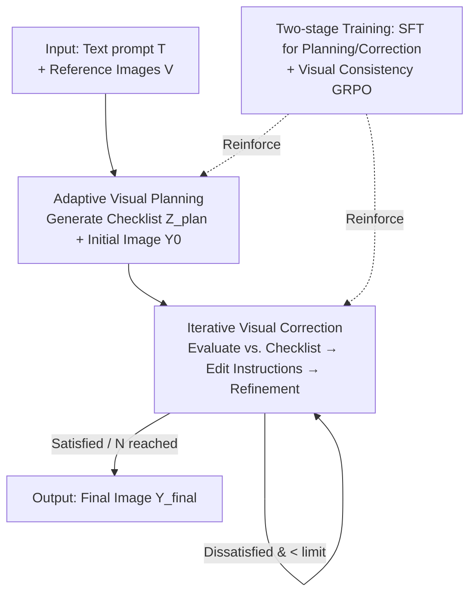

# Visual-Aware CoT: Achieving High-Fidelity Visual Consistency in Unified Models

**Conference**: CVPR 2026  
**Paper**: [CVF Open Access](https://openaccess.thecvf.com/content/CVPR2026/html/Ye_Visual-Aware_CoT_Achieving_High-Fidelity_Visual_Consistency_in_Unified_Models_CVPR_2026_paper.html)  
**Keywords**: Unified models, multi-modal CoT, visual consistency, multi-reference image generation, flow-GRPO

## TL;DR
VACoT enables unified understanding-generation models to achieve high-fidelity multi-reference image generation by first generating a structured "Adaptive Visual Planning" checklist of elements to preserve, followed by "Iterative Visual Correction" through self-reflection. By injecting this "look-and-check" capability into BAGEL via two-stage SFT + flow-GRPO training, it improves the average score on OmniContext from 5.55 to 8.26, outperforming GPT-4o on specific sub-tasks.

## Background & Motivation

**Background**: Unified models (e.g., GPT-4o, UniWorld, BAGEL) can perform both understanding and generation within a single network. Inspired by CoT, works like Uni-CoT and UiG introduce "think-before-generate" into unified models—leveraging understanding capabilities to evaluate generated images and provide feedback for iterative refinement, which significantly improves final quality.

**Limitations of Prior Work**: These CoT methods focus almost exclusively on **textual consistency**—"does the generated image align with the text prompt?"—while neglecting **visual context consistency**—"does the generated image align with the input reference images?". In tasks requiring complex visual integration like multi-reference generation, style transfer, or content editing, this leads to discrepancies: character IDs change, object attributes (color/shape) drift, or styles are lost. For example, given "a woman from image_1 standing by the table in image_2," a text-based CoT checks for "a woman and a table" but fails to verify if the woman matches the specific identity in image_1.

**Key Challenge**: Current CoT frameworks answer *does the generation align with the text prompt?* but lack the visual self-reflection to answer *does the generation align with the input images?*. Text-based alignment evaluation inherently misses fine-grained visual features like identity, specific attributes, and style.

**Goal**: Explicitly embed visual consistency into the reasoning chain of unified models—enabling them to determine "which visual elements must be maintained," evaluate "whether they are preserved," and perform corrections.

**Key Insight**: Shift from a "text-following" reasoning paradigm to a "visually-aware" reasoning paradigm—driven by a structured visual checklist to close the "planning → generation → self-check → edit" loop, reinforced by a GRPO reward customized for visual similarity.

## Method

### Overall Architecture
VACoT is built upon BAGEL (a decoder-only model with Mixture-of-Transformer-Experts, where ViT serves as the understanding expert and VAE as the generation expert, fused via unified self-attention). Given a text prompt $T$ and a visual context $V=\{v_1,\dots,v_n\}$ containing $n$ reference images, the goal is to generate an image $Y$ that aligns with $T$ while maintaining visual consistency with $V$.

Inference follows an iterative loop (Algorithm 1): the model first performs **Adaptive Visual Planning** to produce a visual checklist $Z_{plan}$ and an initial image $Y_0$. It then enters the **Iterative Visual Correction** loop—evaluating the current image against the checklist to produce an edit instruction $Z_{eval}$, and editing the image accordingly until the evaluation returns `ALL_IS_WELL` or the maximum iteration $N$ is reached. To instill these capabilities, the authors employ **two-stage training**: Stage 1 uses SFT on automatically constructed planning and correction datasets; Stage 2 further reinforces this behavior using flow-GRPO with a visual consistency reward.

### Key Designs

**1. Adaptive Visual Planning: Building a Structured Checklist of Elements to Preserve**

This addresses the pain point where text-based CoT ignores visual consistency. Borrowing from "thinking-with-image" concepts, VACoT generates a structured checklist $Z_{plan}$ before image synthesis, decomposing complex visual requirements into verifiable items. Each item is defined as $z_i=\{\text{check type},\ \text{source},\ \text{target}\}$, where check types include: **Identity** (e.g., facial features), **Style** (aesthetic consistency), and **Attribute** (color, shape, size, spatial relations).

For example, for the prompt "the woman from image_1 dancing in the style of image_2," the checklist automatically includes: ① Check identity consistency between image_1 and the generation; ② Check style consistency between image_2 and the generation. This transforms "vague fidelity requirements" into "explicit targets for subsequent evaluation." The checklist is automatically annotated by a strong VLM (Gemini) on 4k multi-reference samples from Echo-4o to form the planning dataset $D_{planning}=(T,V,Z_{plan}^{GT},Y_{final}^{GT})$.

**2. Iterative Visual Correction: Self-Reflection and Round-by-Round Refinement**

Given the current image $Y_{current}$ and the checklist $Z_{plan}$, the model performs a consistency evaluation $Z_{eval}=f_{evaluate}(Y_{current},Z_{plan},V,T)$. It determines which items are satisfied and provides specific edit instructions (e.g., "replace the man with the woman from image_1"). $Z_{eval}$ is appended to the context sequence to drive the edit $Y_{corrected}=f_{edit}(T,V,Z_{plan},Y_{current},Z_{eval})$.

The fundamental difference from text-CoT is that the evaluation is **perceptual** (comparing visual elements directly) rather than just checking for the existence of objects. The correction dataset $D_{correction}$ is constructed by using a weaker baseline model to generate low-quality images $Y_{negative}$ (with ID loss, mismatch, etc.). A VLM then evaluates these against $Z_{plan}^{GT}$ to generate $Z_{eval}^{GT}$, teaching the model to "identify flaws and issue instructions to reach the GT image."

**3. Visual Consistency GRPO: Type-Adaptive Visual Similarity Rewards**

While SFT teaches the "how-to," the RL stage using flow-GRPO pushes the visual consistency further. The composite reward measures alignment with both text and visual context:

$$R_{total}(Y_{final},V,T)=R_{visual}(Y_{final},Z_{plan},V)+R_{text}(Y_{final},T)$$

Crucially, $R_{visual}$ dynamically scores based on **checklist item types using different visual metrics**: Identity items use DINO similarity after localized grounding with GroundingDINO, while Style items use CSD-Score. $R_{text}$ uses CLIP score to measure alignment between $x_0=Y_{final}$ and $T$. Advantages $\hat{A}^i_t$ are calculated via group normalization over $G$ samples:

$$\hat{A}^i_t=\frac{R(x^i_0,V,T)-\text{mean}(\{R(x^j_0,V,T)\}_{j=1}^G)}{\text{std}(\{R(x^j_0,V,T)\}_{j=1}^G)}$$

Optimizing the policy $\pi_\theta$ directly targets "whether identity/style/attributes were actually preserved," rather than relying solely on coarse text alignment.

### Loss & Training
Two stages: **Stage 1** mixes $D_{planning}$ and $D_{correction}$ for SFT, training the model on planning and correction simultaneously. The BAGEL base objective remains cross-entropy for text and MSE for flow matching velocity prediction. **Stage 2** uses the Visual Consistency GRPO for online rollouts and reinforcement.

## Key Experimental Results

The main evaluations use the OmniContext benchmark (multi-reference generation) with BAGEL as the base, comparing against text-aligned CoT methods (UiG, Uni-CoT) and verifying base T2I performance on GenEval.

### Main Results (OmniContext, higher is better)

| Method | MULTIPLE Avg. | SCENE Avg. | Total Avg.↑ |
| :--- | :--- | :--- | :--- |
| BAGEL (Base) | ~6.02 | ~5.08 | 5.55 |
| UiG | — | — | 6.85 |
| Uni-CoT | — | — | 7.89 |
| Echo-4o | — | — | 8.09 |
| GPT-4o | — | — | 8.75 |
| **VACoT (Ours)** | — | — | **8.26** |

VACoT significantly improves the BAGEL base (5.55) to 8.26, outperforming GPT-4o in specific MULTIPLE/SCENE sub-settings. It consistently beats text-only CoT methods (UiG, Uni-CoT), proving that visual consistency is the critical bottleneck for these tasks. On GenEval, VACoT achieves a score of 0.84, higher than BAGEL (0.79), suggesting that visual perception training implicitly improves compositional consistency without degrading base T2I capabilities.

### Ablation Study (MULTIPLE Dataset, Average Score)

| Configuration | Average↑ | Description |
| :--- | :--- | :--- |
| BAGEL (gen-only, L1) | 6.02 | Direct generation, no CoT |
| BAGEL + VACoT Inference Loop | 7.89 | Planning + Eval using original BAGEL understanding |
| Ours w/o SFT | 8.06 | No SFT stage |
| Ours w/o GRPO | 8.13 | No GRPO stage |
| **Ours (Full)** | **8.44** | Full two-stage training |

| Configuration | Average↑ | Description |
| :--- | :--- | :--- |
| Ours w/o Visual Adaptive Planning | 7.92 | No visual planning (Gain: -0.52) |
| Ours w/o Iterative Refinement | 8.22 | No iterative refinement (Gain: -0.22) |
| **Ours (Full)** | **8.44** | Both planning and refinement |

### Key Findings
- **The "Planning-Check" loop is inherently valuable**: Applying the VACoT inference loop to the original BAGEL (unturned) jumps the score from 6.02 to 7.89. SFT and GRPO provide further incremental gains.
- **Visual Planning is more critical than Iterative Refinement**: Removing Adaptive Visual Planning drops the score by 0.52, while removing correction drops it by 0.22. This identifies "clarifying what to check" as the prerequisite for high-quality evaluation.
- **3 iterations is the sweet spot**: Scores improve from 7.20 (1 iter) to 7.82 (3 iters) but drop to 7.70 at 5 iters. Images that can be fixed are usually corrected within 3 rounds; further iterations cause over-correction and introduce new errors in difficult cases.

## Highlights & Insights
- **Explicitly decomposing "visual consistency" into a {type, source, target} checklist**: This is the most brilliant step—it transforms the ambiguous goal of image fidelity into a structured object that the model can evaluate and the reward system can score item-by-item.
- **Type-adaptive visual rewards**: Mapping identity/style/attributes to DINO/CSD metrics avoids the pitfalls of coarse CLIP-only scoring. This "typed reward" philosophy is transferable to any RL task requiring fine-grained visual fidelity.
- **Bootstrapping correction data via "intentional degradation"**: Generating $Y_{negative}$ using degraded BAGEL parameters and labeling edits via VLM is a low-cost way to scale "evaluation-edit" supervision.
- **Incidental finding**: Visual perception training implicitly improves compositional consistency (GenEval), suggesting that learning to "look and self-correct" provides positive feedback for synthesis quality.

## Limitations & Future Work
- **Heavy reliance on external VLMs and metrics**: Checklist annotation (Gemini) and rewards (GroundingDINO/DINO/CLIP) inherit the biases and failures of these components.
- **Low iteration ceiling and over-correction**: Gains vanish after 3 iterations, and the model lacks robust correction mechanisms for truly difficult cases.
- **Task scope**: Primarily validated on multi-reference generation (OmniContext). Style transfer and editing are shown qualitatively but lack systematic quantitative evaluation.
- **Fixed checklist types**: Consistency in lighting, perspective, or physical plausibility remains unaddressed.

## Related Work & Insights
- **vs. UiG / Uni-CoT**: While they use unified models for CoT, their evaluation only answers if the image matches the *text*. VACoT answers whether it matches the *input images*, making it significantly stronger for multi-reference consistency.
- **vs. BAGEL (Base)**: BAGEL provides the unified architecture, but its zero-shot ID retention often fails. VACoT builds a planning-correction loop on top of it to improve controllability.

## Rating
- **Novelty**: ⭐⭐⭐⭐ Explicitly introducing visual context consistency into unified CoT and designing typed visual rewards effectively fills a blind spot in text-based CoT.
- **Experimental Thoroughness**: ⭐⭐⭐⭐ Strong results on OmniContext and GenEval with comprehensive ablations, though quantitative evaluation on editing/style transfer tasks could be broader.
- **Writing Quality**: ⭐⭐⭐⭐ Logical flow from motivation to method; the contrast between CoT paradigms is clearly presented.
- **Value**: ⭐⭐⭐⭐ The "structured checklist + typed visual rewards" framework provides direct guidance for ID preservation and high-fidelity generation tasks.

<!-- RELATED:START -->

## Related Papers

- [\[CVPR 2026\] CodeV: Code with Images for Faithful Visual Reasoning via Tool-Aware Policy Optimization](codev_code_with_images_for_faithful_visual_reasoning_via_tool-aware_policy_optim.md)
- [\[CVPR 2026\] ViRC: Enhancing Visual Interleaved Mathematical CoT with Reason Chunking](virc_enhancing_visual_interleaved_mathematical_cot_with_reason_chunking.md)
- [\[NeurIPS 2025\] SpatialTraceGen: High-Fidelity Traces for Efficient VLM Spatial Reasoning Distillation](../../NeurIPS2025/vlm_reasoning/spatialtracegen_high-fidelity_traces_for_efficient_vlm_spatial_reasoning_distill.md)
- [\[CVPR 2026\] GGBench: A Geometric Generative Reasoning Benchmark for Unified Multimodal Models](ggbench_a_geometric_generative_reasoning_benchmark_for_unified_multimodal_models.md)
- [\[CVPR 2026\] Unified Generation and Self-Verification for Vision-Language Models via Advantage Decoupled Preference Optimization](unified_generation_and_self-verification_for_vision-language_models_via_advantag.md)

<!-- RELATED:END -->
