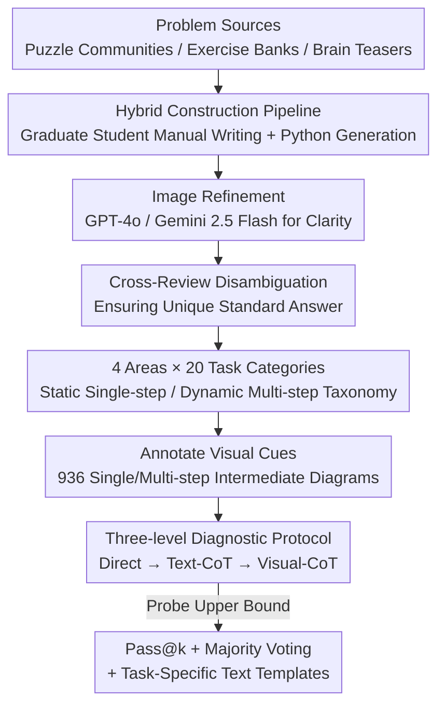

# When Visualizing is the First Step to Reasoning: MIRA, a Benchmark for Visual Chain-of-Thought

**Conference**: CVPR 2026  
**Paper**: [CVF Open Access](https://openaccess.thecvf.com/content/CVPR2026/html/Zhou_When_Visualizing_is_the_First_Step_to_Reasoning_MIRA_a_CVPR_2026_paper.html)  
**Code**: To be confirmed  
**Area**: Multimodal VLM  
**Keywords**: Visual Chain-of-Thought, Multimodal Reasoning, Benchmark, MLLM, Intermediate Visual Cues

## TL;DR
MIRA is a multimodal benchmark specifically designed for problems that "require drawing intermediate diagrams before reasoning": 546 problems across Euclidean Geometry, Physics Reasoning, Abstract Spatial & Logic Puzzles, and Causal Transformation are provided with human-annotated intermediate visual cues. A three-level diagnostic protocol ("Direct / Text-CoT / Visual-CoT") is used to isolate the contribution of visual information. Results show that even GPT-5, Gemini 2.5 Pro, and o3 achieve less than 20% accuracy under direct input, while the average relative improvement reaches 33.7% when provided with human intermediate diagrams, proving that "drawing to think" is a core missing capability in current MLLMs.

## Background & Motivation
**Background**: Chain-of-Thought (CoT) has become the dominant paradigm for enhancing Large Language Model reasoning—allowing models to decompose complex problems into step-by-step natural language intermediate reasoning, yielding significant gains in arithmetic, commonsense, and multi-hop QA. Even for multimodal models, this mechanism operates almost entirely in the text domain: every intermediate step must be "spoken" in words.

**Limitations of Prior Work**: Many real-world reasoning problems are inherently visual, requiring spatial imagination, geometric operations, or physical simulation. Humans instinctively "draw to think" when solving such problems. Using pure text to describe intermediate states—such as "which face of a die is down after rolling on a board" or "how patterns are arranged on a cube net"—is a clumsy and lossy medium. Models are forced to describe visual cues word by word, leading to information loss during translation.

**Key Challenge**: Existing multimodal reasoning benchmarks largely treat images as one-time inputs, testing **perception** tasks like VQA, captioning, or grounding. In the few datasets with multi-step reasoning, intermediate steps remain purely textual and do not truly require "visual generation" for problem-solving. While tool-augmented methods (Visual Sketchpad, ViperGPT, etc.) can call external tools to draw auxiliary diagrams, their upper bound is restricted by the tools themselves, and they have not been systematically evaluated in open-ended reasoning scenarios. Consequently, there is an evaluation blind spot: **no benchmark cleanly measures whether a model can truly generate and utilize intermediate visual representations for reasoning**.

**Goal**: To construct a high-quality benchmark where problems are "unsolvable without drawing intermediate diagrams" and to design an evaluation protocol that can decouple the "contribution of visual information" from "text generation capability," thereby answering two questions: Can current models reason using integrated visual intermediates? How much does this capability contribute to solving complex visual reasoning problems?

**Key Insight**: This work formalizes the cognitive phenomenon of "human scratchpad sketching" as Visual-CoT: each problem is paired with human-annotated intermediate visual states (sketches, structural diagrams, path maps), and problem difficulty is parameterized by the "number of intermediate visual steps" (single-step vs. multi-step).

**Core Idea**: Instead of training a model that can draw, it is better first to build a benchmark that can diagnose this capability. By using "human-provided intermediate diagrams" as an upper-bound proxy, the discrepancy in accuracy caused by the presence or absence of visual intermediates is quantified as the gap in the model's "visual imagination" capability through three-level comparative experiments.

## Method
MIRA is a benchmark paper, so the "Method" refers to **data construction and evaluation protocol design**. It is structured in three layers: first, 546 problems are collected and constructed based on three core principles (with 936 human intermediate diagrams); second, problems are organized into a taxonomy of "4 Areas × 20 Task Categories × Static/Dynamic"; finally, a three-level diagnostic protocol is used for evaluation, supplemented by Pass@k / Majority Voting to probe the model's upper bound.

### Overall Architecture
The input is a multimodal problem (image $I_q$ + text $T_q$), and the output is a unique standard answer. MIRA is unique in that each problem is additionally paired with a human-annotated **intermediate visual reasoning trajectory** (single or multi-step intermediate diagrams) to be injected as needed during evaluation. The data construction pipeline involves "Source Collection → Manual Writing / Programmatic Generation → Image Refinement → Cross-Review for Disambiguation → Intermediate Visual Cue Annotation." The resulting bank is fed into a three-level "Direct / Text-CoT / Visual-CoT" evaluation to obtain diagnostic results that distinguish between "accidental calculation error" and "fundamental inability."

### Key Designs

**1. Three Data Principles + Hybrid Construction Pipeline: Ensuring "Visualization-Essential" High Quality**

To address the pain point that "existing benchmarks can be solved via text without truly testing visual reasoning," MIRA adheres to three principles for every problem: (1) **Essential reliance on intermediate visual information**—this intermediate process is analogous to a human's draft sketch when solving difficult problems, such as drawing a force analysis diagram to determine the direction of force on a positive charge; (2) **Step-by-step human-annotated visual cues** for each problem to make Visual-CoT evaluation feasible; (3) **Rigid human annotation + cross-verification** to ensure a unique, unambiguous standard answer and reliable visual reasoning trajectories.

Implementation follows a hybrid pipeline: core problems are manually authored by graduate-level researchers (inspired by Reddit visual puzzle/mystery communities, exercise banks, and brain teasers, but ensuring original phrasing and content), followed by programmatic generation using Python scripts to **precisely control difficulty**. Initial images are refined using image editing tools like GPT-4o and Gemini 2.5 Flash. The final stage is a rigorous quality check with cross-review and conflict resolution. Manual writing ensures "difficulty and novelty," while programmatic generation ensures "tunable difficulty and scalability."

**2. 4 Areas × 20 Task Categories: Parameterizing Visual Reasoning Complexity via "Static/Dynamic"**

MIRA spans four challenging areas: **Euclidean Geometry (EG)**, **Physical Reasoning (PBR)**, **Abstract Spatial & Logic Puzzles (ASLP)**, and **Causal Transformation (CT)**, totaling 20 task categories, 546 problems, and 936 intermediate diagrams. Complexity is parameterized by "how many intermediate visual frames/reasoning steps are needed": problems are categorized into **Static (single-step)**, requiring one key intermediate diagram (e.g., pattern filling on a cube net), and **Dynamic (multi-step)**, requiring a sequence of visual trajectories evolving over time (e.g., tracking the sum of the bottom face of a die as it rolls across a board). This taxonomy transforms "visual reasoning difficulty" into a controllable variable, allowing for fine-grained attribution by "single/multi-step" and "area"—revealing, for instance, that the Puzzles category (average 9.5%) is significantly harder than other areas (16.1%).

**3. Three-level Diagnostic Protocol: Decoupling "Visual Contribution" from "Textual Ability"**

This is MIRA's core contribution. It goes beyond total accuracy by using three levels of input for comparative diagnosis:

- **Level 1 Direct Evaluation**: Only the original problem $(I_q, T_q)$ is provided, measuring end-to-end problem-solving ability.
- **Level 2 Text-CoT**: The model is asked to generate a textual CoT before answering, testing the ceiling of "pure text reasoning" on MIRA.
- **Level 3 Simulated Visual-CoT**: Since current models (open-source or commercial) cannot accurately generate or interleavedly use intermediate diagrams, MIRA feeds **human-annotated intermediate diagrams** directly to the model, which then reasons based on these diagrams.

These levels are nested: Level 1→2 adds "textual thinking," while Level 2→3 adds "visual intermediates." The difference "Level 3 − Level 2" cleanly isolates the **gain from visual information** from "ability to think in text"—the key metric for answering how much visual imagination contributes. Evaluation uses micro-averaged accuracy with a robust hierarchical extraction pipeline: first parsing `<answer>` tags, then regex backup, and finally using GPT-4o as a semantic judge for remaining ambiguous outputs.

**4. Upper Bound Probing: Distinguishing "Accidental Error" from "Capability Lack"**

MIRA uses three methods to detect "potential under best-case scenarios": (1) **Pass@k** ($k=1,2,4,8$)—sampling $k$ paths per problem, where one correct path counts as success; (2) **Majority Voting** across 8 samples; (3) **Task-specific Text Templates (Tspec)**—replacing general CoT prompts with templates aligned with the Task structural logic to see if pure text can approximate visual performance. Findings are consistent: average gains are 15.3% as $k$ moves from 1 to 4, but nearly converge from 4 to 8 (+3.0%). Stronger models benefit less from expanded search (GPT-5 Pass@1→8 increases by 20.4%, while the weaker GPT-4o increases by 23.6%). This indicates that strong model failures are **not accidental calculation errors, but a fundamental lack of capability** that cannot be compensated for by repeated trials.

## Key Experimental Results

### Main Results: Overall Accuracy under Three Input Levels (Excerpt, %)
Evaluation covers 20+ models including closed-source SOTA, open-source understanding-focused, and open-source unified models. D=Direct, T=Text-CoT, V=Visual-CoT.

| Model | EG (D/T/V) | PBR (D/T/V) | Puzzles (D/T/V) | Causal (D/T/V) | Overall (D/T/V) |
|------|-----------|-------------|-----------------|----------------|-----------------|
| GPT-5.2 | 22.8 / 20.1 / 28.4 | 34.7 / 25.0 / 76.4 | 14.0 / 18.7 / 29.9 | 15.4 / 16.3 / 46.3 | **20.9 / 19.6 / 39.5** |
| Gemini 3 Pro | 20.1 / 17.0 / 20.1 | 58.3 / 58.3 / 79.2 | 22.4 / 19.6 / 19.6 | 25.2 / 30.1 / 25.2 | 27.0 / 26.2 / 29.3 |
| GPT-5 | 14.5 / 14.4 / 15.6 | 29.9 / 22.2 / 53.7 | 10.8 / 15.7 / 19.9 | 17.9 / 19.3 / 28.6 | 16.5 / 17.2 / 25.9 |
| Gemini 2.5 Pro | 10.6 / 11.1 / 15.0 | 41.1 / 27.1 / 59.5 | 11.0 / 7.1 / 9.7 | 17.2 / 17.0 / 10.1 | 16.9 / **13.8** / 18.9 |
| o3 | 15.2 / 13.3 / 18.3 | 22.4 / 16.9 / 47.6 | 11.5 / 8.5 / 12.9 | 20.1 / 20.2 / 27.5 | 16.4 / **14.1** / 23.4 |
| Closed-source Avg | 13.5 / 13.2 / 17.6 | 25.1 / 24.2 / 46.2 | 11.0 / 11.0 / 13.6 | 15.2 / 15.5 / 19.7 | 14.9 / 14.7 / 21.0 |
| GLM 4.5 V (106B) | 15.0 / 13.9 / 16.1 | 17.5 / 20.6 / 23.8 | 8.9 / 7.8 / 10.5 | 13.3 / 13.6 / 25.9 | 13.1 / 13.0 / 18.0 |
| Janus-Pro (7B) | 2.5 / 11.2 / 9.0 | 0.0 / 4.8 / 0.0 | 4.0 / 8.8 / 6.2 | 11.2 / 5.3 / 6.9 | 4.9 / 8.9 / 7.2 |

Key observations: **No model exceeds 20% accuracy** under direct input (GPT-5 is only 16.5%); even the strongest configuration (Visual-CoT for GPT-5.2) only reaches 39.5%, leaving significant room for improvement; Puzzles are the most difficult across all models.

### Ablation Study on Text Templates: General vs. Specific Text-CoT (Δ=Relative gain of Tspec, %)

| Model | EG Δ | PBR Δ | Puzzles Δ | Causal Δ | Overall Δ |
|------|------|-------|-----------|----------|-----------|
| GPT-5 | +1.2 | +11.6 | -2.0 | -0.2 | +2.7 |
| GPT-4.1-mini | +1.7 | +9.2 | -2.3 | +4.4 | +3.2 |
| Claude 4 Opus | +2.4 | -3.2 | +6.7 | +2.6 | +2.1 |
| Closed-source Avg | +1.4 | +2.6 | +1.6 | +0.1 | +1.4 |

Even when "aligning" text prompts to the Visual-CoT task structure, the overall gain is only about +1.4%, which is far below providing visual intermediate diagrams—confirming that visual intermediates cannot be replaced by text templates.

### Key Findings
- **Visual intermediates are the only effective "remedy" currently**: Injecting human Visual-CoT leads to consistent improvements across almost all models, with an average relative gain of **33.7%** (GPT-5-mini moves from 13.7% to 23.2%). Physics (average 20.7%→40.0%) benefits most, with gains nearly doubling for several closed-source models, while Puzzles remain the most stubborn (rising only about 1.0% from a 9.5% base).
- **Text-CoT can be counterproductive**: While effective on most reasoning benchmarks, textual CoT provides almost no gain or even causes performance drops on MIRA—Gemini 2.5 Pro and o3 were degraded by 18.3% and 14.0%, respectively. Models with "stronger inherent reasoning" were more likely to be distracted by standard Text-CoT.
- **Failures indicate "inability" rather than "accidental error"**: Pass@k nearly converges from 4 to 8 (average only +3.0%), and stronger models benefit less from expanded search (Majority Voting gave +5.1% to Gemini 2.5 Flash but only +0.3% to the stronger Gemini 2.5 Pro), suggesting structural absence of capability.
- **Unified (Understanding + Generation) models show potential but are limited by scale**: Bagel and Janus-Pro show relative gains of 17.3% and 46.9% under Visual-CoT, suggesting that layouts with tighter coupling of visual and linguistic generation may favor Visual-CoT, though small parameter sizes currently bottleneck absolute scores.
- **Counter-examples exist**: Gemini 3 Pro performs strongly on direct answers but worsens under Visual-CoT, exposing its weakness in multi-image reasoning—indicating that "ability to use multiple intermediate diagrams" is itself an independent capability.

## Highlights & Insights
- **The three-level nested protocol turns "visual contribution" into a subtractable delta**: Level 3 − Level 2 cleanly isolates visual gain, while Level 2 − Level 1 isolates textual reasoning gain. This "controlled experiment" evaluation design provides significantly more insight than single accuracy scores and is a transferable paradigm for any "multimodal intermediate vs. text" research.
- **Using human diagrams as an "upper bound proxy" bypasses the "model cannot draw" deadlock**: Since current models cannot generate or interleavedly use intermediate diagrams, the authors perform this step for the model. This decouples the questions of "Is visual useful for answering?" and "Can the model draw itself?"—proving utility first and leaving autonomous generation for the future.
- **Pass@k convergence and smaller gains for strong models provide powerful evidence for "capability gaps"**: This directly counters the argument that low scores are due to sampling luck, presenting a logically rigorous argument.
- **The cognitive metaphor of "drawing to think" is engineered into a quantifiable benchmark**: Formalizing human scratchpad intuition into the "number of single/multi-step intermediate diagrams" is an elegant parameterization.

## Limitations & Future Work
- **Visual-CoT is a "temporary solution" rather than the final answer**: The authors state that while human-fed diagrams prove visual utility, closing this gap requires new training paradigms that allow models to generate and use visual intermediates in a tightly coupled manner. MIRA itself diagnoses but does not train.
- **Scalability is limited by reliance on human annotation**: 546 problems and 936 diagrams manually created and cross-verified by graduate students are difficult to scale to tens of thousands; programmatic generation, while helpful, is concentrated in parameterizable problem types.
- **Dependency on GPT-4o as a semantic judge**: Using GPT-4o for ambiguous outputs introduces potential biases and errors from the judge model itself, making it a latent source of noise in long-term evaluation.
- **"Intermediate diagram correctness" is not evaluated independently**: Level 3 feeds standard intermediate diagrams, bypassing the assessment of "quality of model-generated intermediate diagrams"—which is precisely where future "think-while-drawing" models should be tested.

## Related Work & Insights
- **vs. Visual CoT / Tool-augmented Methods (Visual Sketchpad, ViperGPT, VisProg)**: These methods call external tools to draw auxiliary diagrams; their upper bound is capped by tool capabilities and they are not systematically evaluated in open-ended reasoning. MIRA avoids tool orchestration and uses human-annotated diagrams to specifically measure "the model's capacity to utilize visual intermediates."
- **vs. Existing Multimodal Benchmarks (MMMU, MMStar, RealWorldQA)**: These primarily test perception (VQA / captioning / grounding), with textual intermediate steps if any. MIRA problems are specifically designed to be "unsolvable without visual generation/utilization" and quantify visual contribution, filling a blind spot in "true visual reasoning."
- **vs. Unified Generative MLLMs (Janus-Pro, Bagel, Show-o)**: These models can theoretically produce intermediate sketches but are often optimized for photorealistic synthesis rather than task-oriented abstract diagrams. MIRA provide a clear metric for what they "ought to be tested on" and demonstrates their relative potential under Visual-CoT.

## Rating
- Novelty: ⭐⭐⭐⭐⭐ First to engineer "drawing to think" into a benchmark and decouple visual contribution via a three-level protocol.
- Experimental Thoroughness: ⭐⭐⭐⭐⭐ Covers 20+ models from 6 providers × 3 input levels × Pass@k / Majority Voting / Specific Templates with multi-perspective verification.
- Writing Quality: ⭐⭐⭐⭐ Motivation and protocol are clear and powerful; tables are dense, and some upper-bound probe details are brief.
- Value: ⭐⭐⭐⭐⭐ Exposes a structural weakness in current SOTA MLLMs and sets a reliable metric for future "think-while-drawing" training paradigms.

<!-- RELATED:START -->

## Related Papers

- [\[CVPR 2026\] Chain-of-Thought Guided Multi-Modal Object Re-Identification](chain-of-thought_guided_multi-modal_object_re-identification.md)
- [\[CVPR 2026\] Reinforcing Structured Chain-of-Thought for Video Understanding](reinforcing_structured_chain-of-thought_for_video_understanding.md)
- [\[CVPR 2026\] EmoThinker: Advancing Visual-Acoustic Emotion Analysis via Structural Token Selection and Chain-of-Thought Reasoning](emothinker_advancing_visual-acoustic_emotion_analysis_via_structural_token_selec.md)
- [\[CVPR 2026\] Grounded Chain-of-Thought for Multimodal Large Language Models](grounded_chain-of-thought_for_multimodal_large_language_models.md)
- [\[CVPR 2026\] When to Think and When to Look: Uncertainty-Guided Lookback](when_to_think_and_when_to_look_uncertainty-guided_lookback.md)

<!-- RELATED:END -->
