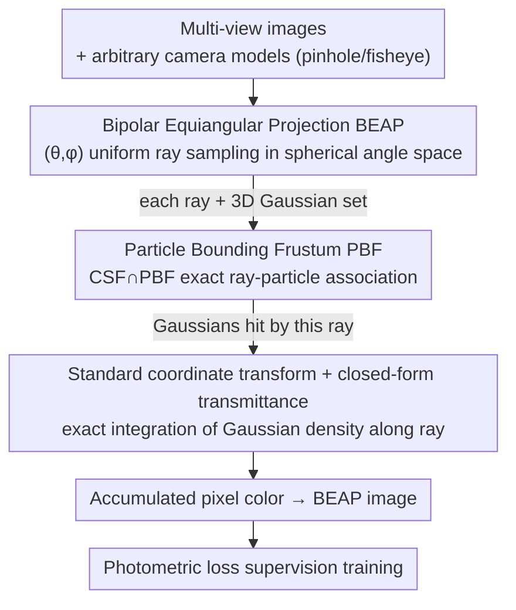

# 3DGEER: 3D Gaussian Rendering Made Exact and Efficient for Generic Cameras

**Conference**: ICLR 2026  
**arXiv**: [2505.24053](https://arxiv.org/abs/2505.24053)  
**Code**: [https://zixunh.github.io/3d-geer](https://zixunh.github.io/3d-geer)  
**Area**: 3D Vision  
**Keywords**: 3D Gaussian Splatting, Ray Tracing, Fisheye Camera, Wide Field-of-View Rendering, Real-time Rendering  

## TL;DR
The 3DGEER framework is proposed, which achieves geometrically exact and real-time efficient 3D Gaussian rendering under any camera model by deriving a closed-form solution for integrating Gaussian density along rays, designing Particle Bounding Frustums (PBF) for precise and efficient ray-particle association, and introducing Bipolar Equi-Angular Projection (BEAP) to unify wide field-of-view camera representations. It comprehensively outperforms existing methods on fisheye and pinhole datasets.

## Background & Motivation

**Background**: 3D Gaussian Splatting (3DGS) achieves efficient rendering by projecting 3D Gaussians into 2D Gaussians via EWA splatting, maintaining a good balance between quality and efficiency in narrow field-of-view (FoV) scenes.

**Limitations of Prior Work**: EWA splatting is based on a first-order Taylor expansion linear approximation, which suffers from severe non-linear distortion in wide FoV (e.g., 180° fisheye cameras). Projection errors lead to significant degradation in reconstruction quality. Existing fisheye extensions (FisheyeGS, GS++) remain limited by projection approximations. While ray-tracing methods (EVER, 3DGRT) are free from projection errors, they rely on BVH traversal, resulting in low frame rates. Hybrid methods (3DGUT) using Unscented Transform approximations for association still introduce errors and grid artifacts.

**Key Challenge**: The true projection of a 3D Gaussian under a non-linear camera model is not a symmetric 2D Gaussian; any method relying on linear projection geometry inevitably introduces approximation errors. Meanwhile, exact ray-tracing methods cannot achieve real-time efficiency due to the algorithmic complexity and parallelization difficulties of BVH.

**Goal**: (a) How to derive an exact closed-form solution for integrating Gaussian density along a ray? (b) How to perform efficient and accurate ray-particle association without using BVH? (c) How to unify the representation of cameras with arbitrary FoV and enhance reconstruction quality?

**Key Insight**: Starting from first principles, each anisotropic Gaussian is mapped to a canonical coordinate system to become isotropic, allowing for the derivation of a closed-form integral. Association problems are solved at the frustum level rather than in screen space, and equi-angular sampling is designed to replace traditional projection.

**Core Idea**: By obtaining exact closed-form transmissivity through canonical coordinate transformation, PBF association at the frustum level, and unified BEAP projection, this work achieves both geometrically exact and real-time efficient Gaussian rendering for any camera for the first time.

## Method

### Overall Architecture
The input is a set of multi-view images with arbitrary camera models (pinhole, fisheye, etc.), and the output is a rendered image of a novel view. The Mechanism of 3DGEER is to rewrite the entire rendering pipeline from "projecting to 2D then approximating" to "exact integration of true 3D Gaussians along the ray," using a unified image representation to accommodate cameras of any FoV. Specifically: First, Bipolar Equi-Angular Projection (BEAP) organizes images into uniform ray samples in $(\theta, \phi)$ spherical angular space. For each ray, Particle Bounding Frustums (PBF) are used to accurately determine which Gaussians are hit within the 3D frustum space. Then, closed-form transmissivity is obtained via canonical coordinate transformation to precisely integrate Gaussian density along the ray and accumulate pixel colors. Finally, the model is trained under photometric loss supervision in the BEAP image space. The sequence of the three components corresponds to "what space organizes the rays → which Gaussians are hit by each ray → how to calculate color after hitting."

### Key Designs

**1. Bipolar Equi-Angular Projection (BEAP): Accommodating arbitrary FoV with a unified representation and more uniform ray sampling**

The first step of rendering is deciding which image space to use for organizing rays. Pinhole planar projections explode under wide FoV—a 180° fisheye cannot be represented losslessly by a single planar projection, which is the first hurdle in wide FoV reconstruction. BEAP samples rays uniformly in $(\theta, \phi)$ spherical angular space and then maps them to a discrete image via linear transformation. This offers three advantages: First, it losslessly represents any FoV camera (including 180° fisheye) without the distortion seen in pinhole projections. Second, image tiles share the same parametrization as the Camera Sub-Frustums (CSF) used in PBF, allowing association results to be directly reused, facilitating GPU parallelization. Third, the sampling distribution is more uniform—pinhole projections under-sample at the edges, while equidistant projections over-sample the center. BEAP achieves a near-uniform ray distribution in 3D space. Ablations prove this is more critical than simply having a "larger FoV."

**2. Particle Bounding Frustum (PBF): Exact association in 3D frustum space, no longer dependent on BVH or screen-space approximation**

With uniformly sampled rays, the next step is to determine which Gaussians each ray hits—without using projection approximations for speed. This work moves association from screen space to frustum space: in camera space, directions are described by two spherical angles $\theta = \arctan(d_{c,x}/d_{c,z})$ and $\phi = \arctan(d_{c,y}/d_{c,z})$. Each Gaussian defines a Particle Bounding Frustum (PBF) bounded by four tangent planes. Ray-particle association is reduced to the intersection detection of a Camera Sub-Frustum (CSF) and a PBF—analogous to tile-AABB mapping in 3DGS. After transforming constraints to canonical space, angular boundaries can be solved in closed form via the quadratic equation $\mathcal{T}_{22}c^2 - 2\mathcal{T}_{02}c + \mathcal{T}_{00} = 0$. Compared to BVH traversal in EVER/3DGRT and screen-space approximations in EWA/UT, PBF is both exact and compact—boundaries are directly tied to the true 3D covariance. Each tile associates with only ~475 Gaussians on average, 3-5x fewer than EWA/UT, making the association phase more suitable for GPU parallelization.

**3. Canonical Coordinate Transform + Closed-form Transmissivity: Making transmissivity dependent only on ray-to-Gaussian distance, eliminating projection approximations**

After determining the hit Gaussians, the final step is calculating the color—the core of "Exact" rendering. The root of wide FoV error is EWA's approximation of projecting 3D Gaussians into symmetric 2D Gaussians. This work bypasses this: for each anisotropic Gaussian, a transformation $\mathbf{x} = RS\mathbf{u} + \boldsymbol{\mu}$ is defined to restore it to an isotropic form $\mathcal{G}_{\mathbf{I},\mathbf{0}}(\mathbf{u}) = \frac{1}{\rho}\exp(-\frac{1}{2}\|\mathbf{u}\|^2)$ in canonical coordinates, turning the transmissivity integral into a measure-preserving substitution with a simple closed-form solution. The transmissivity is $T = \sigma \exp(-\frac{1}{2}D^2_{\mu,\Sigma})$, where $D^2 = \frac{\|\mathbf{o}_u \times \mathbf{d}_u\|^2}{\|\mathbf{d}_u\|^2}$ is the squared perpendicular Mahalanobis distance from the ray to the Gaussian center. Crucially, transmissivity depends only on the distance from the ray to the Gaussian in canonical space and is independent of the camera model, thus introducing no projection approximation. This expression is numerically equivalent to previous "maximum response" heuristics, but this work provides a mathematical explanation from first principles as to why it is projection-exact.

### Loss & Training
Standard photometric loss is used for supervision in the BEAP space. After 30k iterations of training, results are projected back to the original image space for full-FoV evaluation. The entire forward and backward processes ensure numerical stability through closed-form derivation, requiring no post-processing like filtering degenerate Gaussians.

## Key Experimental Results

### Main Results

**ScanNet++ Dataset (180° Fisheye):**

| Method | Training FoV | Full PSNR↑ | Full SSIM↑ | Full LPIPS↓ | Center PSNR | Edge PSNR |
|------|---------|-----------|-----------|------------|---------|---------|
| FisheyeGS | Full | 27.81 | 0.946 | 0.139 | 32.44 | 23.28 |
| EVER | Full | 29.47 | 0.924 | 0.167 | 29.93 | 28.72 |
| 3DGUT | Full | 30.64 | 0.944 | 0.150 | 31.87 | 28.84 |
| **3DGEER** | Full | **31.50** | **0.953** | **0.126** | **32.64** | **28.94** |

**MipNeRF360 Dataset (Narrow FoV Pinhole):**

| Method | PSNR↑ | SSIM↑ | LPIPS↓ | FPS↑ |
|------|-------|-------|--------|------|
| 3DGS | 27.21 | 0.815 | 0.214 | 343 |
| EVER | 27.51 | 0.825 | 0.233 | 36 |
| 3DGRT | 27.20 | 0.818 | 0.248 | 52 |
| 3DGUT | 27.26 | 0.810 | 0.218 | 265 |
| **3DGEER** | **27.76** | **0.821** | **0.210** | **327** |

### Ablation Study

**BEAP Comparison (ScanNet++):**

| Training Space | Full PSNR↑ | Full SSIM↑ | Full LPIPS↓ | Center PSNR | Edge PSNR |
|---------|-----------|-----------|------------|---------|---------|
| Perspective (Central) | 29.84 | 0.943 | 0.131 | 32.21 | 26.23 |
| Perspective (Full) | 21.11 | 0.853 | 0.300 | 21.32 | 20.46 |
| Equidistant (Full) | 31.05 | 0.948 | 0.135 | 32.21 | 28.56 |
| **BEAP (Full)** | **31.50** | **0.953** | **0.126** | **32.64** | **28.94** |

**Transmissivity Function Ablation (ScanNet++):**

| Transmissivity Method | Full PSNR↑ | LPIPS↓ | Gaussian Count (k) |
|-----------|-----------|--------|------------|
| 3DGS Splats | 22.86 | 0.177 | 1396.4 |
| FisheyeGS Splats | 27.90 | 0.141 | 920.6 |
| **Exact Integration (Ours)** | **31.50** | **0.126** | **591.8** |

### Key Findings
- PBF produces extremely tight bounds, with each tile associating with only ~475 Gaussians on average, which is 3-5x fewer than EWA/UT schemes, leading to a 2.5-5x speedup in the association phase.
- Brute-force increasing the number of Gaussians (FisheyeGS expanded to 3.6-5M) cannot compensate for projection approximation errors: PSNR saturates at 29.3, while 3DGEER reaches 32.1 with only 550-700K Gaussians.
- Ablation experiments replacing the transmissivity function clearly show that inconsistency between exact association and approximate transmissivity leads to clipping errors and artifacts.
- In cross-camera generalization experiments (training on pinhole, testing on fisheye), 3DGEER performs best, demonstrating that geometric exactness brings stronger generalization capabilities.

## Highlights & Insights
- **Canonical Space Closed-form Solution**: Revealing the mathematical essence of "maximum response" heuristics as projection exactness is an elegant combination of theory and practice. Derivation from first principles ensures numerical stability without requiring degenerate Gaussian filtering.
- **Frustum-level Association**: Stepping out of screen-space thinking to solve association directly in 3D frustum space is a methodological breakthrough. By binding quadratic equations with true 3D covariance, both exactness and efficiency are maintained.
- **Philosophy of BEAP**: At a fixed resolution, the uniformity of information distribution is more important than a larger FoV—Full-FoV perspective projection can even perform worse than using only the central region. This finding is insightful for all rendering tasks involving wide FoV.

## Limitations & Future Work
- Validated only on static scenes; extensions to dynamic scenes and temporal data are yet to be explored.
- Whether BEAP's uniform sampling strategy can be further improved with content-aware weighted sampling remains to be verified.
- Experiments were mainly conducted on indoor (ScanNet++) and medium-scale scenes; performance in large-scale outdoor scenes is unverified.
- Numerical precision of canonical coordinate transforms for extreme Gaussian shapes (e.g., extremely elongated ones) may require further analysis.

## Related Work & Insights
- **vs 3DGS**: 3DGS uses EWA splatting for 2D projection approximation, which is fast but has large wide FoV errors; 3DGEER uses ray integration for exact calculation, maintaining similar speed while leading in accuracy.
- **vs EVER/3DGRT**: These ray-tracing methods are geometrically exact but slow due to BVH (36-68 FPS); 3DGEER replaces BVH with PBF to reach 327 FPS, a speedup of over 5x.
- **vs 3DGUT**: 3DGUT uses UT approximation for association, which is fast but introduces grid artifacts; 3DGEER's exact association in frustum space avoids this issue.

## Rating
- Novelty: ⭐⭐⭐⭐⭐ Achieves geometric exactness and real-time efficiency simultaneously for any camera model for the first time; all three components have strong theoretical foundations.
- Experimental Thoroughness: ⭐⭐⭐⭐⭐ Covers 4 datasets, multiple camera models, cross-camera generalization, detailed ablations, and runtime analysis.
- Writing Quality: ⭐⭐⭐⭐⭐ Rigorous mathematical derivation, clear logical narrative, and highly informative charts.
- Value: ⭐⭐⭐⭐⭐ Clears key obstacles for 3DGS applications in wide FoV scenarios like autonomous driving and robotics.

<!-- RELATED:START -->

## Related Papers

- [\[CVPR 2025\] ActiveGAMER: Active GAussian Mapping through Efficient Rendering](../../CVPR2025/3d_vision/activegamer_active_gaussian_mapping_through_efficient_rendering.md)
- [\[CVPR 2026\] Exact-GS: Mathematically Rigorous and Accurate 3D Gaussian Splatting for 3D X-ray Reconstruction](../../CVPR2026/3d_vision/exact-gs_mathematically_rigorous_and_accurate_3d_gaussian_splatting_for_3d_x-ray.md)
- [\[ICLR 2026\] MEGS2: Memory-Efficient Gaussian Splatting via Spherical Gaussians and Unified Pruning](megs2_memory-efficient_gaussian_splatting_via_spherical_gaussians_and_unified_pr.md)
- [\[ICLR 2026\] Horseshoe Splatting: Handling Structural Sparsity for Uncertainty-Aware Gaussian-Splatting Radiance Field Rendering](horseshoe_splatting_handling_structural_sparsity_for_uncertainty-aware_gaussian-.md)
- [\[CVPR 2026\] CaT-GS: Efficient 3DGS Rendering for Large-Scale Scenes with Inter-frame Caching and Tile Scheduling](../../CVPR2026/3d_vision/cat-gs_efficient_3dgs_rendering_for_large-scale_scenes_with_inter-frame_caching_.md)

<!-- RELATED:END -->
