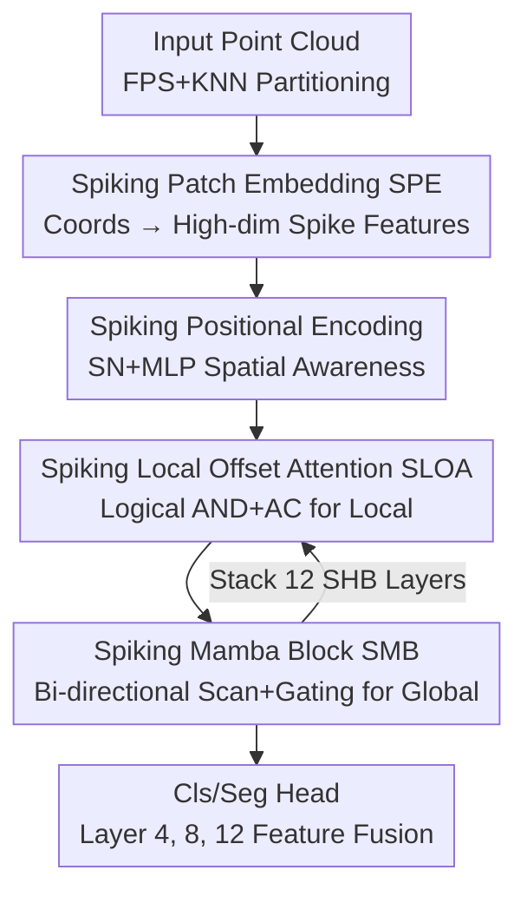

# 3DSMT: A Hybrid Spiking Mamba-Transformer for Point Cloud Analysis

**Conference**: ICLR2026  
**OpenReview**: [https://openreview.net/forum?id=KkoS6y0pHP](https://openreview.net/forum?id=KkoS6y0pHP)  
**Code**: TBD (Original text claims open source)  
**Area**: 3D Vision / Point Cloud Analysis / Spiking Neural Networks  
**Keywords**: Point cloud analysis, Spiking Neural Networks, Mamba, Local Offset Attention, Energy efficiency

## TL;DR
3DSMT integrates the event-driven low-power characteristics of Spiking Neural Networks (SNNs) with the local modeling of Transformers and the linear-complexity global modeling of Mamba into a hybrid architecture. By utilizing "Spiking Local Offset Attention + Spiking Mamba Blocks," it achieves SOTA results among SNN methods in classification, few-shot, and segmentation tasks, with energy consumption being dozens of times lower than ANN counterparts, while even outperforming several ANN models.

## Background & Motivation
**Background**: Point cloud analysis (classification, segmentation) represents a foundational capability for autonomous driving, robotics, and AR/VR. Mainstream approaches have evolved from early PointNet/PointNet++ (MLP) to Point Transformer (utilizing self-attention for global dependencies), and more recently, works like PointMamba that introduce State Space Models (Mamba) to point clouds. While highly accurate, these methods are centered on traditional Artificial Neural Networks (ANNs).

**Limitations of Prior Work**: Point clouds are inherently sparse and unordered. Feeding them into dense-computation deep models results in substantial "unnecessary computation and energy consumption." Specifically, the dot-product self-attention in Transformers exhibits $O(N^2)$ quadratic complexity relative to the number of points $N$, making it inefficient for large-scale point clouds. Although Mamba reduces complexity to linear $O(N)$, it is naturally designed for ordered sequences; thus, it lacks natural adaptation to unordered point clouds, where forcing sequence order creates unstable "pseudo-sequence dependencies." Most fundamentally, both Transformers and Mamba are limited by the inherent energy inefficiency of the ANN paradigm, making deployment difficult on power-constrained edge devices like drones, mobile robots, and AR/VR headsets.

**Key Challenge**: There is a sharp trade-off between accuracy and energy efficiency. Spiking Neural Networks (SNNs) utilize sparse, event-driven binary spike communication and replace multiply-accumulate (MAC) operations with additions, achieving ultra-low power on neuromorphic hardware. Their sparsity naturally aligns with the sparse distribution of point clouds. However, existing SNN point cloud methods (Spiking PointNet, P2SResLNet, SPT, SPM) often sacrifice excessive accuracy for energy savings, leaving a significant gap compared to ANN models due to insufficient feature representation and immature training mechanisms.

**Goal**: To construct a unified architecture that simultaneously possesses "local geometric modeling + linear-complexity global modeling + SNN low power," elevating the accuracy of SNN-based point cloud methods to a level competitive with ANNs.

**Key Insight**: The authors observe that Transformers excel at local fine-grained relationships, Mamba excels at linear-complexity global dependencies, and SNNs excel at sparse low-power computing. Their strengths are complementary. The key is to "spikify" both the local modeling of attention and the global modeling of SSMs within a single SNN framework.

**Core Idea**: Within a unified spiking framework, Spiking Local Offset Attention is used to capture local features, and Spiking Mamba Blocks are used for global features. The model is trained directly via surrogate gradients (avoiding the temporal overhead of ANN-SNN conversion) to achieve an optimal balance between accuracy and energy efficiency.

## Method

### Overall Architecture
3DSMT is a spiking neural network specifically designed for point clouds. Given a point cloud $P\in\mathbb{R}^{N\times 3}$ with $N$ points, the pipeline consists of three stages: "Patch Embedding → Stacked 12 Hybrid Blocks → Task Head." First, **Spiking Patch Embedding (SPE)** maps low-dimensional point coordinates into high-dimensional spiking feature sequences. This sequence then passes through $M=12$ cascaded **Spiking Hybrid Blocks (SHB)**. Inside each SHB, **Spiking Local Offset Attention (SLOA)** captures local features, followed by the **Spiking Mamba Block (SMB)** for global features, complemented by **Spiking Positional Encoding (SPE-pos)** for spatial awareness.

Specifically, the input uses Farthest Point Sampling (FPS) to select $L$ center points, and local patches are constructed via KNN. Since spiking neurons have spatio-temporal dimensions, patches are replicated $T$ times across time steps $t\in[0,T)$ before being fed into the network. After embedding, a learnable `[CLS]` token is added to form a sequence of length $L+1$. The SHB is organized with residual connections:

$$O_{i'} = \text{SLOA}(\text{LN}(O_{i-1}+S_{pos})) + O_{i-1}, \quad O_i = \text{SMB}(\text{LN}(O_{i'})) + O_{i'}$$

The segmentation head borrows from PointBERT, concatenating features from the 4th, 8th, and 12th SHB layers to output point-wise part probabilities. The classification head consists of stacked linear layers.

### Key Designs

**1. Spiking Local Offset Attention (SLOA): Capturing local geometry via logical operations while eliminating float energy costs of softmax.**

This target addresses the pain point where "local geometric details are critical, but standard self-attention relies on softmax for floating-point MACs, which is expensive and power-hungry." SLOA first utilizes K-Norm (propagating center point features to neighbors) and K-Pool (local feature aggregation) as inspired by Mamba3D to obtain $S_1=\text{K-Pool}(\text{K-Norm}(S))$. It then uses Spiking Neuron (SN) layers to convert local features into binary $\{0,1\}$ spike sequences $S_2$. Linear transformations then produce $Q, K, V$ (via Linear-BN-Spiking, or LBS), and attention is calculated as $A=Q\cdot K^T\cdot V$.

The key insight is that since spike sequences are naturally sparse and non-negative, the computation of the attention matrix $A$ can be implemented directly using "Logical AND + Accumulation (AC)," completely bypassing the floating-point MACs introduced by softmax in traditional ANNs. Instead of using the attention features directly, the model calculates the **offset** between the attention features and the input $S_2$ (element-wise subtraction), passing it through SN and MLP before adding it back to $S_2$:

$$S_3 = \text{MLP}(\text{SN}(S_2 - \text{SN}(A))) + S_2$$

This "offset attention" allows the model to explicitly highlight feature differences within local regions, strengthening the capture of fine-grained structural changes.

**2. Spiking Mamba Block (SMB): Spikifying global modeling of unordered point clouds with bi-directional scanning + gating to solve "pseudo-sequence dependency."**

Mamba's strength is linear-complexity global modeling, but it is oriented toward ordered sequences. SMB integrates Mamba's global modeling with SNN's energy efficiency and uses bi-directional scanning to resolve the ordering issue. In the workflow, input features $Z$ are converted into binary spike sequences $Z_1$ via SN to reduce redundancy. The process then splits: the SSM branch encodes $Z_1$ into $Z_S$ via Linear+SN, then uses bi-directional scanning to obtain dependencies in two directions: $Z_L=\text{L+SSM}(\text{Conv1d}(Z_S))$ and $Z_C=\text{C-SSM}(\text{Conv1d}(Z_S))$. The gating branch produces a sparse spike gating matrix $Z_G$, which performs a Hadamard product with $Z_L$ and $Z_C$ for feature selection:

$$Z_2 = (Z_L\otimes Z_G) + (Z_C\otimes Z_G), \quad Z_3 = \text{Lin}(\text{SN}(Z_2))$$

Here, L+SSM is the original Mamba scanning strategy, and C-SSM is the channel-flip scanning proposed by Mamba3D. SMB also uses non-causal Conv1D to eliminate temporal artifacts. Its effectiveness lies in spike sparsification compressing feature redundancy, bi-directional scanning completing missing directional information, and dynamic spike gating selectively activating salient features while suppressing noise.

**3. Spiking Positional Encoding (SPE-pos): Restoring spatial structural information in the spiking domain.**

Unordered point clouds lose geometric information without spatial positions, and positional encoding must also be spikified to integrate into SNNs. The authors designed a learnable encoding by alternately stacking SN layers and MLPs. For each point $p=(x,y,z)$, SN uses membrane potential dynamics to initialize raw coordinates into spatio-temporal features, followed by MLP transformations. Each SHB is injected with this encoding $S_{pos}\in\mathbb{R}^{(L+1)\times C}$ to enhance spatial perception.

**4. Full Spiking Hybrid + Surrogate Gradient Training: Integrating local, global, and position into an event-driven framework with IF neurons.**

The overarching design of 3DSMT is "Hybrid + Full Spiking." SHB integrates SLOA (local), SMB (global), and SPE-pos (position) into the same spiking framework using residual connections across 12 layers. At the base, Integrate-and-Fire (IF) neurons are used due to their low memory and energy requirements. Training follows "surrogate gradient direct training," avoiding the extra temporal overhead of ANN-SNN conversion. This hybrid design allows the model to capture Transformer's local details, Mamba's linear global modeling, and SNN's energy efficiency simultaneously.

### Loss & Training
The model is implemented via PyTorch + SpikingJelly and trained directly using surrogate gradients. Two SNN-specific hyperparameters are crucial: spike Threshold and TimeStep. Experiments searched combinations of thresholds $\{0.5, 1.0, 1.5, 2.0\}$ and time steps $\{1, 2, 3, 4\}$. The optimal configuration was TimeStep=3 and Threshold=1.0. A threshold too low introduces noise, while one too high suppresses useful features. Exceeding 3 time steps introduces redundancy that degrades performance. SLOA neighborhood $k=4$ and token count $L=128$ were optimal. Voting post-processing can further improve classification results.

## Key Experimental Results

### Main Results
Classification: Three variants of ScanObjectNN + ModelNet40, comparing ANN and SNN methods (Energy in mJ, FLOPs in G).

| Method | Type | FLOPs | PB_T50_RS OA | ModelNet40 OA | Energy |
|------|------|-------|------|------|------|
| PCM | ANN | 45.0 | 88.1 | 93.4 | 207.0 |
| PTv2 | ANN | 17.1 | - | 93.7 | 78.7 |
| SIM | ANN | 3.6 | 87.3 | 92.7 | 16.6 |
| SPM (Prev. SOTA) | SNN | 1.5 | 84.2 | 92.3 | 5.4 |
| **3DSMT (w/ vot.)** | SNN | **1.3** | **92.0 (+7.8)** | **95.2 (+2.9)** | **4.3** |

Highlights: 3DSMT achieves a 7.8% gain over the previous best SNN (SPM) on the most difficult ScanObjectNN variant (PB_T50_RS). On ModelNet40, its 95.2% OA is 2.9% higher than SPM with 1.1 mJ less energy. Compared to ANNs: it outperforms the Mamba-based PCM (93.4%) by 1.8% with 1/48 the energy and exceeds the Transformer-based PTv2 (93.7%) by 1.5% with 1/18 the energy.

Few-shot (ModelNet40): 5-way 10/20-shot reached 92.8%/96.2%, and 10-way 10/20-shot reached 87.2%/92.1%, significantly surpassing SpikePointNet and equaling the ANN-based Mamba3D. Part Segmentation (ShapeNetPart): Cat.mIoU 82.7%, Ins.mIoU 85.1% (highest among SNNs). Semantic Segmentation (S3DIS): mIoU 70.2% is best for SNNs, with only 11.4 mJ energy (compared to PTv3's 73.6% requiring 687.7 mJ). Efficiency-wise, training/inference latency is 298ms/142ms, and VRAM usage is 10.1G/4.6G, outperforming the SPT series and Mamba3D.

### Ablation Study
Hybrid architecture ablation (ModelNet40 / ScanObjectNN, Table 7):

| Config | Type | ModelNet40 OA | Energy | Description |
|------|------|------|------|------|
| Full | ANN | 94.9 | 36.3 | ANN ceiling, but high energy |
| No-MT | SNN | 92.1 | 3.3 | No Transformer or Mamba, baseline |
| Only-T | SNN | 93.8 | 4.1 | Transformer only |
| Only-MB | SNN | 94.0 | 4.0 | Bidirectional Mamba only |
| Full-MUT | SNN | 94.2 | 4.3 | Hybrid + Unidirectional SSM |
| **Full-MBT** | SNN | **94.7** | 4.3 | Hybrid + Bidirectional SSM (Ours) |

Scanning Strategy (Table 11): Unidirectional SSM 94.2% → L-SSM+C-SSM Bidirectional 94.7%. Sorting Strategy (Table 10): "No Order" (94.7%) outperformed Shuffle/Z-order, proving the model directly handles unordered point clouds.

### Key Findings
- **Hybrid + Bidirectional are the primary drivers**: Progression from No-MT (92.1%) to Only-T/Only-MB to Full-MBT (94.7%) shows consistent improvement as modules are added. Bidirectional SSM yields a 0.5% gain over unidirectional with zero additional energy.
- **SNN reduces energy to a fraction of ANN**: The ANN "Full" config achieves 94.9% with 36.3 mJ, whereas SNN "Full-MBT" achieves 94.7% with only 4.3 mJ—a mere 0.2% accuracy gap for an 8.4x reduction in energy.
- **Hyperparameter Sweet Spots**: TimeStep=3, Threshold=1.0, $k=4$, and $L=128$ all represent peaks in performance.
- **Real-world data shows greater advantages**: Segmentation gains (+0.3~0.4%) were smaller than classification, as ShapeNetPart uses noise-free synthetic data. 3DSMT's advantages are more pronounced on ScanObjectNN, which contains real-world noise and occlusions.

## Highlights & Insights
- **Spikifying the attention matrix into "Logical AND + Accumulate"**: By leveraging the sparse, non-negative nature of spike sequences, the model bypasses floating-point MACs. This is a core mechanism for SNN energy efficiency that can be transferred to other neuromorphic hardware tasks.
- **Offset Attention over standard Attention**: Calculating the difference between attention features and input highlights local structural variations more effectively than raw attention—a lightweight but powerful detail-enhancement trick.
- **Complementary Engineering Philosophy**: The logic of Transformer for local, Mamba for linear global, and SNN for low power is clean and easy to replicate.
- **Cost-free gains from bidirectional scanning**: Combining L-SSM and C-SSM compensates for missing directional information in unordered point clouds without increasing energy consumption.

## Limitations & Future Work
- The task scope is limited to classification, few-shot, and segmentation, excluding more complex tasks like object detection or scene understanding.
- The improvement on ShapeNetPart is marginal (+0.3~0.4%), which the authors attribute to the dataset's low discriminative power, though it also indicates 3DSMT's advantage in part segmentation is less significant.
- A gap remains compared to the strongest ANNs (e.g., PTv3 achieving 73.6% on S3DIS). 3DSMT's selling point is the balance of accuracy and efficiency rather than absolute accuracy.
- Energy advantages of SNNs rely on actual neuromorphic hardware deployment; the paper uses estimated values. Actual gains on general GPUs require further hardware-specific evaluation.
- Potential improvements: Unifying SLOA's offset attention with SMB's gating, or exploring adaptive time steps to bypass the rigid sweet-spot limitations.

## Related Work & Insights
- **vs PointMamba / Mamba3D (ANN Mamba)**: These introduced Mamba/bidirectional scanning to point clouds. This work adopts K-Norm/K-Pool and C-SSM but spikifies the process and adds a Transformer branch, reducing energy to a fraction while yielding higher accuracy.
- **vs SPM (Prev. SOTA, Spiking Mamba)**: SPM was the first spiking Mamba point cloud framework. This work replaces its temporal-flip strategy with a "horizontal-flip + channel-flip" strategy and adds spiking offset attention, outperforming it by 7.8% on PB_T50_RS.
- **vs SPT (Spiking Transformer)**: SPT was the first spiking Transformer for point cloud classification but has high FLOPs (14.0G). 3DSMT achieves higher accuracy with 1.3G FLOPs by offloading global signaling to Mamba's linear complexity.
- **vs Point Transformer / PTv2/PTv3 (ANN Transformer)**: While ANN Transformers are accuracy leaders, their energy is extreme (PTv3 uses 687.7 mJ on S3DIS). This work achieves comparable accuracy with only 11.4 mJ for edge deployment.

## Rating
- Novelty: ⭐⭐⭐⭐ First to integrate spiking offset attention and spiking bidirectional Mamba into a unified SNN framework; solid combination of innovations, though individual components have prior origins.
- Experimental Thoroughness: ⭐⭐⭐⭐⭐ Covers five task categories; ablations are detailed, including threshold-timestep combinations and scanning strategies.
- Writing Quality: ⭐⭐⭐⭐ Clear structure and complete formulas, though some expressions are slightly unpolished.
- Value: ⭐⭐⭐⭐ Provides a practical SNN paradigm for high-performance, low-power point cloud analysis, significant for edge 3D perception.

<!-- RELATED:START -->

## Related Papers

- [\[ICLR 2026\] Spiking Discrepancy Transformer for Point Cloud Analysis](spiking_discrepancy_transformer_for_point_cloud_analysis.md)
- [\[ICCV 2025\] Efficient Spiking Point Mamba for Point Cloud Analysis](../../ICCV2025/3d_vision/efficient_spiking_point_mamba_for_point_cloud_analysis.md)
- [\[CVPR 2025\] Spectral Informed Mamba for Robust Point Cloud Processing](../../CVPR2025/3d_vision/spectral_informed_mamba_for_robust_point_cloud_processing.md)
- [\[AAAI 2026\] DAPointMamba: Domain Adaptive Point Mamba for Point Cloud Completion](../../AAAI2026/3d_vision/dapointmamba_domain_adaptive_point_mamba_for_point_cloud_completion.md)
- [\[AAAI 2026\] Graph Smoothing for Enhanced Local Geometry Learning in Point Cloud Analysis](../../AAAI2026/3d_vision/graph_smoothing_for_enhanced_local_geometry_learning_in_point_cloud_analysis.md)

<!-- RELATED:END -->
