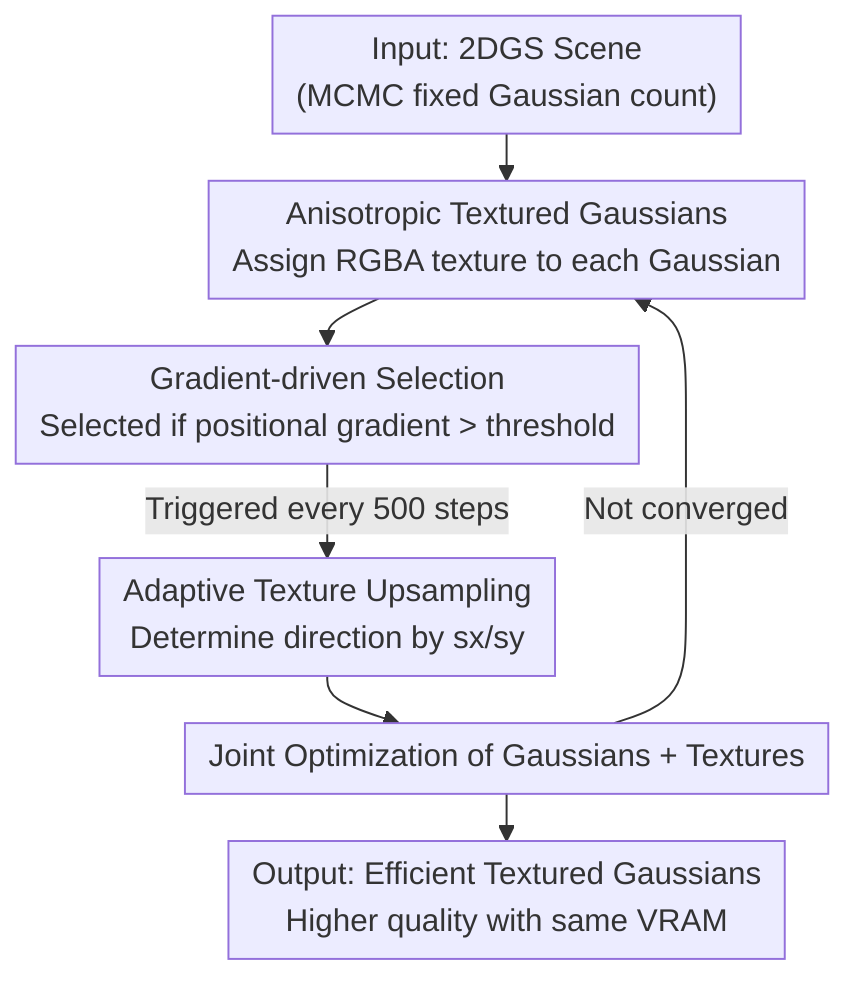

# A²TG: Adaptive Anisotropic Textured Gaussians for Efficient 3D Scene Representation

**Conference**: ICLR2026  
**OpenReview**: [https://openreview.net/forum?id=EPN5MU4liR](https://openreview.net/forum?id=EPN5MU4liR)  
**Code**: To be confirmed  
**Area**: 3D Vision / Gaussian Splatting / Scene Representation  
**Keywords**: Gaussian Splatting, Textured Gaussians, Anisotropic Texture, Adaptive Resolution, Memory Efficiency

## TL;DR
A²TG assigns an "anisotropic texture" with adaptive resolution and aspect ratio to each 2D Gaussian. By utilizing gradient-driven selection and upsampling rules, texture parameters are allocated only to Gaussians that truly require high-frequency details, achieving higher rendering quality and lower VRAM consumption than fixed-square textured Gaussian Splatting under the same memory budget.

## Background & Motivation
**Background**: 3D Gaussian Splatting (3DGS) and its planar variant, 2D Gaussian Splatting (2DGS), have become mainstream representations for high-quality, real-time 3D scene rendering. To enable individual Gaussians to carry richer appearances, recent "Textured Gaussians" works assign a learnable texture map to each Gaussian to express higher-frequency appearances than Spherical Harmonics (SH).

**Limitations of Prior Work**: Existing textured Gaussian methods mostly assign a **fixed-size square texture** (e.g., uniform $4\times4$) to every primitive. However, Gaussians in a scene vary significantly—some cover large areas with high-frequency details requiring fine textures, while others cover only a few pixels, have near-zero opacity, or are occluded. A one-size-fits-all square texture wastes parameters on Gaussians that do not need detail, inflating storage and VRAM.

**Key Challenge**: Fixed square textures ignore the **geometric anisotropy** of the Gaussians themselves. 2D Gaussians are often elongated elliptical patches. Using square textures to fit elongated structures results in either insufficient resolution or wasted pixels in unimportant directions—the texture shape does not match the Gaussian geometry.

**Goal**: Allocate texture parameters "on demand"—deciding both **whether** to increase texture resolution and **what shape** to use (square or elongated anisotropic).

**Key Insight**: The authors observe that **positional gradients**, commonly used in densification, naturally mark areas of high frequency and reconstruction error. The same signal can determine which Gaussians deserve more texture budget. Meanwhile, the ratio of the Gaussian's two semi-axes ($s_x/s_y$) naturally indicates the direction for adding detail.

**Core Idea**: Use "gradient guidance" to select which Gaussians to upscale and "Gaussian anisotropy" to determine the texture aspect ratio. Replacing fixed square textures with **adaptive anisotropic textures** ensures parameters are spent where they matter most within the same VRAM budget.

## Method

### Overall Architecture
A²TG is built upon 2DGS, representing scenes as a set of flat 2D Gaussians. Each Gaussian has a center $\mu_i$, 2D scales $s_i$, rotation quaternion $r_i$, opacity $o_i$, and SH coefficients $c_i^{SH}$. UV coordinates are defined in the local space of each Gaussian for consistent sampling.

The training consists of two stages. **Stage 1** uses 2DGS with MCMC densification for 30,000 steps, with textures fixed at $1\times1$ and zeroed (effectively no texture), aimed at stabilizing the total Gaussian count. **Stage 2** freezes the Gaussian count, enables textures (alpha initialized to 1), and trains for another 30,000 steps. In each step, Gaussian and texture parameters are updated, followed by the core "Gradient-Driven Adaptive Texture Control": Gaussians needing higher resolution are **selected** via positional gradients, then their textures are **upsampled** according to their anisotropy.



### Key Designs

**1. Anisotropic Textured Gaussians: Aligning Texture Shape with Gaussian Geometry**

To address the mismatch between fixed square textures and elongated Gaussians, A²TG assigns an RGB texture $T_i^{RGB}$ and an alpha texture $T_i^A$ to each 2D Gaussian with **independent width and height**. Local UV coordinates from $[-1,1]$ are remapped to $[0,T_i^u]$ and $[0,T_i^v]$, where $T_i^u$ and $T_i^v$ are the specific dimensions for the $i$-th Gaussian. The final color contribution $c_i(x)$ is the sum of SH color and texture color: $c_i(x)=c_i^{SH}+T_i^{RGB}(u(x))$, while its alpha is $\alpha_i(x)=o_i\cdot G(u(x))\cdot T_i^A(u(x))$. SH handles smooth low-frequency components, while textures handle high-frequency residuals. Rectangular textures allow elongated Gaussians to avoid wasting pixels.

**2. Gradient-Driven Gaussian Selection: Selecting "Deserving" Gaussians**

Indiscriminately upscaling all textures is wasteful. The authors leverage the positional gradient signal $\nabla_{\mu_i}L$ from the L1+SSIM loss $L$ between rendered and training views. For instance, the x-component is: $\dfrac{\partial L}{\partial \mu_{i,x}}=\sum_{k=1}^{3}\dfrac{\partial L}{\partial c^k}\cdot\dfrac{\partial c^k}{\partial \alpha_i}\cdot\dfrac{\partial \alpha_i}{\partial \mu_{i,x}}$. This gradient encodes three types of information: pixel difference ($\partial L/\partial c^k$), occlusion/visibility from other Gaussians ($\partial c^k/\partial \alpha_i$), and local pixel contribution. Following AbsGS, the absolute gradients are accumulated over covered pixels. If the magnitude exceeds a threshold $\|\nabla_{\mu_i}L\|_2>k_G$, the Gaussian is deemed to contain high-frequency content and is selected for upsampling.

**3. Adaptive Texture Upsampling: Determining Shape via Anisotropy**

Once selected, A²TG determines the upsampling direction based on the ratio of the Gaussian's semi-axes $s_x$ and $s_y$ rather than uniform doubling. The rules are: if $s_x/s_y>k_A$ and $s_y<k_S$, double only $T^u$ (adding details along the long axis); if $s_y/s_x>k_A$ and $s_x<k_S$, double only $T^v$; otherwise, double both dimensions. $k_A$ and $k_S$ are preset thresholds. Upsampling occurs every 500 steps, allowing gradients to accumulate. Individual texture sizes vary within $\{1,2,4\}\times\{1,2,4\}$.

### Loss & Training
The training employs standard 2DGS L1 + SSIM reconstruction loss. Depth distortion and normal consistency terms from 2DGS are disabled to prioritize image fidelity over mesh quality. Two 30,000-step stages are used. Key hyperparameters: $k_A=4.0$, $k_S=0.01$, $k_G=0.00002$. Adaptive upsampling is performed at iterations 500 and 1000.

## Key Experimental Results

Datasets: Mip-NeRF 360 (7 scenes), Tanks and Temples (2), Deep Blending (2). Metrics: PSNR / SSIM / LPIPS, alongside Gaussian count (#GS) and trainable parameter memory (MB).

### Main Results

**Setting 1: Quality comparison under fixed VRAM budget (~200 MB)**

| Dataset | Method | PSNR↑ | SSIM↑ | LPIPS↓ | VRAM |
|--------|------|-------|-------|--------|------|
| Mip-NeRF 360 | Textured Gaussians* | 28.37 | 0.832 | 0.188 | 200.0 MB |
| Mip-NeRF 360 | **A²TG (Ours)** | **28.51** | **0.838** | **0.174** | 199.7 MB |
| DeepBlending | Textured Gaussians* | 29.51 | 0.897 | 0.198 | 200.0 MB |
| DeepBlending | **A²TG (Ours)** | **29.86** | **0.900** | **0.187** | **189.4 MB** |

Under the same VRAM budget, A²TG achieves the highest quality because it trades expensive texture parameters for more Gaussians.

**Setting 2: Memory overhead comparison under fixed Gaussian count**

| #GS | Method | PSNR↑ (Mip-NeRF 360) | VRAM Increase |
|-----|------|------------------------|----------|
| 1M | Textured Gaussians* | 28.81 | +110% |
| 1M | **A²TG (Ours)** | 28.70 | **+25%** |
| 500k | Textured Gaussians* | 28.47 | +110% |
| 500k | **A²TG (Ours)** | 28.31 | **+28%** |

At fixed #GS, Textured Gaussians yields slightly higher PSNR (~+0.4 dB), but requires over **4x more** texture memory (+110% vs +25~28%).

### Ablation Study

Comparison at #GS = 1M across three datasets:

| Configuration | PSNR↑ | SSIM↑ | LPIPS↓ | VRAM↓ | Description |
|------|-------|-------|--------|-------|------|
| w/o Upscaling | 27.03 | 0.854 | 0.170 | 232.0 | No upscaling; lowest VRAM, worst quality |
| w/o Anisotropy | 27.38 | 0.859 | 0.162 | 298.2 | Isotropic upsampling only; higher VRAM |
| **Ours (full)** | 27.37 | 0.858 | 0.163 | 286.5 | Anisotropic; similar quality, less VRAM |

## Key Findings
- **Upscaling drives quality**: Removing upscaling reduces VRAM but significantly degrades quality, proving adaptive resolution is the primary source of detail.
- **Anisotropy drives efficiency**: Removing anisotropy yields similar quality but higher VRAM usage, confirming that anisotropic textures more efficiently represent elongated Gaussians.
- **Sparse Allocation**: In the Garden scene, **62.4%** of Gaussians remain at $1\times1$, with non-square textures concentrated on sharp edges, proving the budget is spent sparingly.
- **SH-Texture Complementarity**: Removing textures loses high-frequency details (leaves, grass), while removing SH loses low-frequency lighting—validating the dual-representation approach.

## Highlights & Insights
- **Dual-purpose Signal**: Reusing positional gradients (from densification) to allocate texture budget is elegant, as it naturally incorporates occlusion and reconstruction error without manual rules.
- **Geometry-Driven Shape**: Using the $s_x/s_y$ ratio to determine texture shape leverages the inherent anisotropy of Gaussians as a lever for efficiency.
- **Orthogonality**: A²TG is orthogonal to 3DGS compression methods (Vector Quantization, pruning), allowing for combined usage.

## Limitations & Future Work
- **Unidirectional Scaling**: Currently only supports upsampling; the authors intend to implement downscaling to further optimize memory.
- **Texture Compression**: The textures themselves are uncompressed, leaving room for further optimization.
- **Fixed Count Quality**: Under fixed #GS, it slightly trails heavy-parameter methods in PSNR (~0.4 dB).

## Related Work & Insights
- **vs Textured Gaussians (Chao et al., 2025)**: Replaces fixed $4\times4$ square textures with adaptive $\{1,2,4\}\times\{1,2,4\}$ anisotropic ones, reducing memory by 4x for a negligible quality trade-off.
- **Insight**: The strategy of "using training gradients as capacity indicators + using primitive geometry to shape attachments" is valuable for any representation learning problem where primitives have variable-capacity auxillary features.

## Rating
- Novelty: ⭐⭐⭐⭐ Solid concept replacing fixed textures with gradient/geometry-driven ones.
- Experimental Thoroughness: ⭐⭐⭐⭐ Comprehensive evaluation across budgets and ablations.
- Writing Quality: ⭐⭐⭐⭐ Clear motivation and honest trade-off analysis.
- Value: ⭐⭐⭐⭐ Significant progress in memory efficiency for textured Gaussians.

<!-- RELATED:START -->

<div class="related-papers" markdown="1">
```markdown
# Placeholder for related papers list
```
</div>

## Related Papers

- [\[ICLR 2026\] ComGS: Efficient 3D Object-Scene Composition via Surface Octahedral Probes](comgs_efficient_3d_object-scene_composition_via_surface_octahedral_probes.md)
- [\[CVPR 2025\] Textured Gaussians for Enhanced 3D Scene Appearance Modeling](../../CVPR2025/3d_vision/textured_gaussians_for_enhanced_3d_scene_appearance_modeling.md)
- [\[CVPR 2026\] SGI: Structured 2D Gaussians for Efficient and Compact Large Image Representation](../../CVPR2026/3d_vision/sgi_structured_2d_gaussians_for_efficient_and_compact_large_image_representation.md)
- [\[ICLR 2026\] MEGS2: Memory-Efficient Gaussian Splatting via Spherical Gaussians and Unified Pruning](megs2_memory-efficient_gaussian_splatting_via_spherical_gaussians_and_unified_pr.md)
- [\[CVPR 2026\] EfficientVPR: Toward Efficient Visual Place Recognition via Scene-Aware Prompt Tuning and Adaptive Feature Enhancement](../../CVPR2026/3d_vision/efficientvpr_toward_efficient_visual_place_recognition_via_scene-aware_prompt_tu.md)

</div>

<!-- RELATED:END -->
