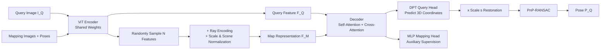

# A Scene is Worth a Thousand Features: Feed-Forward Camera Localization from a Collection of Image Features

**Conference**: ICLR 2026  
**OpenReview**: [https://openreview.net/forum?id=rmDA02o8MV](https://openreview.net/forum?id=rmDA02o8MV)  
**Project Page**: [https://nianticspatial.github.io/fastforward/](https://nianticspatial.github.io/fastforward/)  
**Code**: TBD  
**Area**: 3D Vision / Visual Localization  
**Keywords**: Camera Relocalization, Feed-forward Localization, DUSt3R, Scene Coordinate Regression, Relative Pose Regression, Multi-view  

## TL;DR
FastForward compresses "mapping" into a single feature extraction step: it uses a set of features randomly sampled from posed mapping images and anchored in 3D space as the scene map. A DUSt3R-style feed-forward network then predicts the 3D coordinates of the query image in one pass to solve the pose. This achieves mapping in seconds and localization in 0.5s, while its accuracy matches or even surpasses SCR/structured methods that require minutes to hours for mapping.

## Background & Motivation
- **Background**: The core of visual localization (estimating the camera pose of a query image) is "how the scene is represented." Mainstream approaches fall into four categories: structured methods rely on SfM to build 3D models followed by PnP-RANSAC; Scene Coordinate Regression (SCR) and Absolute Pose Regression (APR) implicitly encode the scene into network weights; Relative Pose Regression (RPR) estimates the relative pose between the query and retrieved mapping images.
- **Limitations of Prior Work**: High-accuracy methods (Structured / SCR) have high mapping costs—SfM triangulation takes minutes to hours, and SCR training (even compressed to 5 min for ACE or 25 min for GLACE) still requires retraining per scene and generalizes poorly to unseen areas or requires dense coverage. Mapping-efficient RPR only needs images + poses (obtainable in real-time via SLAM), but its accuracy generally lags; attempting to improve accuracy through triangulation slows down localization.
- **Key Challenge**: **Mapping speed** and **localization accuracy** have long been at opposite ends of a see-saw; no prior work has achieved structured-level accuracy while keeping mapping cost "nearly free."
- **Goal**: Extreme reduction of mapping overhead—leaving only a retrieval step—while maintaining localization accuracy comparable to SCR/structured methods.
- **Key Insight**: The authors ask "what is the **minimum map representation** that supports accurate and efficient localization," and the answer is **a collection of image features encoding local appearance + 3D position**. **Core Idea**: Inspired by DUSt3R, the model replaces "two images" with "one query image + a collection of features randomly sampled from multiple mapping images." This allows the network to directly regress 3D coordinates of query points in the map coordinate system in a single feed-forward pass, bypassing pair-wise relative pose estimation and transferring scale directly from the mapping poses.

## Method

### Overall Architecture
Given a set of posed mapping images $M=\{I_k\}$, the goal is to estimate the query pose $P_Q$ relative to $M$. The process consists of three steps: (1) Use a weight-shared ViT encoder to extract features, **randomly sample** $N$ features from mapping images, and add ray encodings to form the "map representation"; (2) The decoder performs self-attention + cross-attention between query features and the map representation, and a DPT head predicts 3D coordinates for query pixels (in normalized space, then multiplied by scale factor $s$ to restore metric scale); (3) Use the predicted 2D-3D correspondences to run PnP-RANSAC for the pose. The architecture is initialized with DUSt3R weights (encoder frozen, decoder fine-tuned).

### Key Designs

**1. Sparse Feature Map: Hundreds of features are enough to describe a scene.** All modern localization systems extract neural features from mapping images, but the full set of features is heavy and redundant—similar regions provide no new information. FastForward posits that "a few hundred" features are sufficient to represent a scene, so it fixes the map representation size to $N$ and **randomly samples** $N$ features from all mapping features (in experiments, $N=3000$ for Wayspots, ~20% of total features; $N=1500$ for Indoor6). This brings two direct benefits: the mapping phase only requires a single feature extraction without training or triangulation; the inference phase allows "free expansion" of the number of mapping images because the map size is constant, meaning query latency and VRAM usage do not scale with the number of mapping images (as shown in Figure 1, costs for 1/3/9 mapping images are nearly identical). Random sampling is used instead of heuristic selection because it is unknown which regions are useful for a new query.

**2. Scene and Scale Normalization: Enabling cross-dataset and cross-scale generalization.** Scale is inherently ambiguous in monocular vision; multi-view methods must "distill" scale from mapping poses to ensure consistency; however, scale ranges vary significantly across scenes during cross-dataset training. The authors solve this with a simple normalization trick: first, designate one mapping image $I_0$ as the reference and transform other poses to $\bar P_k = P_0^{-1}P_k$ to center the scene at the origin; then take the maximum translation component $s=\max\{|x|,|y|,|z|\}_k^K$ as the scene scale and scale all translations to $\hat t=[x/s,y/s,z/s]^T$. The network predicts coordinates in the normalized space and multiplies them back by $s$ at the end. Thus, the network learns "dimensionless coordinates," delegating the source of metric information to the poses rather than the images—ablations show this significantly improves robustness to unseen scales, a key reason FastForward generalizes to large-scale Cambridge while MASt3R (also DUSt3R-based) fails.

**3. Ray Encoding: Notifying the network of the origin of mapping features.** Throwing a bunch of features into a network doesn't tell it which camera they came from or their viewing direction. The authors provide each sampled feature $f_{ij}^k$ with a ray encoding: parameterizing the camera as ray vectors including origin $\hat t^k$ and viewing direction $r_{ij}^k=(K_kR_k)^{-1}[u_{ij},v_{ij},1]^T$ (where $u,v$ are the center pixels of the feature token, and $K,R$ are intrinsics and rotation). These are tokenized via Fourier encoding (similar to NeRF) and projected by an MLP to the feature dimension, resulting in $R_{ij}^k$. The map representation is $F_M=\{R_n+f_n\}$. Ray encoding provides sparse features with 3D geometric priors, allowing the attention mechanism to reason about spatial structures beyond appearance similarity.

**4. DUSt3R-style Encoder-Decoder + Dual-Head Supervision: Single feed-forward scene reasoning.** The encoder uses pre-trained DUSt3R weights and is frozen, tokenizing images into $F\in\mathbb{R}^{T\times d}$ ($d=1024$). The decoder is also DUSt3R-initialized but fine-tuned, with **cross-attention** inserted between self-attention and MLP layers to allow interaction between query features and the map representation—$\bar F_Q=\mathrm{Decoder}_Q(F_Q,F_M)$, $\bar F_M=\mathrm{Decoder}_M(F_M,F_Q)$. Thus, the map representation adaptively adjusts to the query. The query head uses a DPT head to regress 3D coordinates (requiring spatial structure capture), while the mapping head uses a single-layer MLP (for training supervision only). Training uses DUSt3R's confidence-weighted regression loss $\ell_{Conf}=\sum_v\sum_i C_i\ell_{Reg}(v,i)-\alpha\log(C_i)$, encouraging the network to predict low confidence for ambiguous areas like sky or translucent objects. Auxiliary supervision on the mapping head was found to improve query prediction accuracy.

## Key Experimental Results

### Main Results

Wayspots (Small outdoor, Unseen group comparison, et=median translation error m / er=rotation error °):

| Method | Group | et ↓ | er ↓ | 10cm,10° Acc ↑ | Mapping Time | Latency |
|---|---|---|---|---|---|---|
| ACE (SCR) | Seen | 1.33 | 9.08 | 51.9% | 5 min | 0.1s |
| GLACE (SCR) | Seen | 1.43 | 8.87 | 52.4% | 25 min | 0.1s |
| E5+1 (ALKD-LG) | Unseen | 0.51 | 7.74 | 46.5% | 3s | 0.8s |
| E5+1 (RoMa) | Unseen | 0.77 | 4.12 | 49.5% | 3s | 18.0s |
| Reloc3r | Unseen | 1.31 | 2.04 | 37.1% | 3s | 0.6s |
| **Ours (FastForward)** | Unseen | **0.17** | **1.75** | **51.4%** | 3s | 0.5s |

Indoor6 / RIO10 (Indoor):

| Method | Indoor6 10cm,10° | Indoor6 20cm,20° | RIO10 10cm,10° | RIO10 20cm,20° | Mapping |
|---|---|---|---|---|---|
| MASt3R+Kapture (Seen) | 89.0 | 93.6 | 24.8 | 32.6 | ~3.5h/~4h |
| GLACE (Seen) | 86.3 | 92.0 | 22.8 | 31.7 | 25 min |
| MASt3R (Unseen) | 45.9 | 76.0 | **45.1** | 58.2 | 8s/10s |
| Reloc3r (Unseen) | 57.4 | 72.8 | 21.4 | 32.9 | 8s/10s |
| **Ours (FastForward)** | **91.5** | **98.0** | 40.6 | **59.7** | 8s/10s |

Cambridge Landmarks (Large-scale outdoor, average et/er): FastForward achieves 0.27m / 0.4°, while Reloc3r achieves 0.52m / 0.5° (FastForward reduces translation error by 48%). E5+1(ALKD-LG) performs best at 0.18m/0.3° but relies on dense structural consistency; MASt3R fails (3.90m) because scales exceed the training distribution range.

### Ablation Study

| Setting | Wayspots 10cm,10° |
|---|---|
| FastForward + Top-20 Retrieval | 51.4% |
| FastForward w/o Retrieval (Random/Uniform Ref) | 47.8% |
| Reloc3r + Retrieval | 37.1% |
| Reloc3r w/o Retrieval | 19.7% |

Without retrieval, FastForward only drops 3.6 points (51.4 to 47.8), whereas Reloc3r plummets by 17.4 points (37.1 to 19.7), demonstrating that multi-view sparse map representations are far more robust to reference choice than single-reference RPR. Ablations on scale normalization (Appendix C.1) show it is critical for unseen scale ranges.

### Key Findings
- **SOTA accuracy with nearly free mapping**: In the Unseen category, FastForward leads almost across the board. In Indoor6, it outperforms MASt3R+Kapture, which requires 3.5 hours of mapping. On Wayspots, its median translation error of 0.17m makes it the only method below 0.5m.
- **Sparse vs. Dense boundaries**: On the dynamic RIO10 dataset, MASt3R (using full images) has higher 10cm accuracy, suggesting sparse maps might lose details in highly dynamic scenes. However, FastForward remains best at 20cm accuracy, showing overall robustness.
- **Mapping/Query Economics**: Compared to ACE, it takes roughly 600 relocalizations to reach the "break-even point" of structured methods; for unpredictable or long-tail locations, FastForward's on-demand localization is more cost-effective.

## Highlights & Insights
- **Redefining the "map" as a bag of features with 3D anchors** is an elegant answer to the "minimum scene representation" problem: mapping is reduced to a single forward feature extraction, completely removing training and triangulation.
- **Transferring scale from poses instead of estimating from images**, combined with normalization, allows one model to generalize across indoor/outdoor and different scales, avoiding the scale heuristics common in RPR.
- **Decoupling map size from the number of mapping images**: Keeping $N$ fixed ensures constant query latency and VRAM, which is engineering-friendly for scenarios where mapping images accumulate over time.
- **The comparison with Reloc3r is compelling**: Both are DUSt3R descendants, but while Reloc3r remains tied to two-view relative poses, FastForward uses a multi-view collection to simultaneously boost robustness and accuracy.

## Limitations & Future Work
- **Overhead of descriptor extraction for retrieval**: While building the retrieval index is fast (< 1 min for 2500 images), it is not negligible as the image count grows. Accuracy drops without retrieval, and the authors leave "how to select reference images" for future work.
- **Detail loss of sparse maps in dynamic scenes**: Lower 10cm accuracy on RIO10 compared to MASt3R suggests random sparse sampling might miss fine-grained details; adaptive or task-aware sampling is worth exploring.
- **No explicit coverage guarantee for random sampling**: Current performance relies on randomness + large $N$; whether a more efficient deterministic selection strategy exists has not been deeply investigated.

## Related Work & Insights
- **DUSt3R / MASt3R / Reloc3r Pedigree**: This work adapts the DUSt3R "pointmap prediction" paradigm to the "query + multi-view feature collection" localization problem, using scale normalization to fix the generalization gap in large-scale scenes.
- **SCR (ACE / GLACE) & Structured (hLoc / Active Search)**: As high-accuracy baselines, FastForward proves that "no-scene-specific training" can approach or even surpass them, especially indoors.
- **Semi-generalized relative pose (E5+1 solver)**: Geometric solvers are strong in dense consistent scenes but degrade in challenging ones; FastForward uses learned multi-view reasoning to pull ahead in those scenarios.
- **Insight**: This "feed-forward foundation model + sparse anchored representation" approach could be extended to SLAM relocalization, instant AR mapping, and the broader paradigm of "using a bag of features as a map" in robot navigation.

## Rating
- **Novelty**: ⭐⭐⭐⭐ — The "bag of 3D-anchored features as a map + single feed-forward localization" design is clean, insightful, and creatively extends the DUSt3R paradigm to multi-view localization.
- **Experimental Thoroughness**: ⭐⭐⭐⭐ — Covers multiple indoor/outdoor benchmarks (Wayspots/Indoor6/RIO10/Cambridge) with clear Seen/Unseen grouping; additional results (e.g., 7-Scenes) are in the appendix.
- **Writing Quality**: ⭐⭐⭐⭐ — The motivation progresses logically, the "minimum map representation" theme is consistent, and the discussion on mapping/localization economics provides practical engineering insight.
- **Value**: ⭐⭐⭐⭐ — Mapping in seconds and localization in 0.5s with accuracy matching reconstruction methods has high practical value for AR and real-time localization; backed by Niantic Spatial's industry context.

<!-- RELATED:START -->

## Related Papers

- [\[ECCV 2024\] The NeRFect Match: Exploring NeRF Features for Visual Localization](../../ECCV2024/3d_vision/the_nerfect_match_exploring_nerf_features_for_visual_localization.md)
- [\[CVPR 2026\] Pano3DComposer: Feed-Forward Compositional 3D Scene Generation from Single Panoramic Image](../../CVPR2026/3d_vision/pano3dcomposer_feed-forward_compositional_3d_scene_generation_from_single_panora.md)
- [\[ICLR 2026\] Flash-Mono: Feed-Forward Accelerated Gaussian Splatting Monocular SLAM](flash-mono_feed-forward_accelerated_gaussian_splatting_monocular_slam.md)
- [\[CVPR 2026\] FILTR: Extracting Topological Features from Pretrained 3D Models](../../CVPR2026/3d_vision/filtr_extracting_topological_features_from_pretrained_3d_models.md)
- [\[ICLR 2026\] GenFusion: Feed-forward Human Performance Capture via Progressive Canonical Space Updates](genfusion_feed-forward_human_performance_capture_via_progressive_canonical_space.md)

<!-- RELATED:END -->
