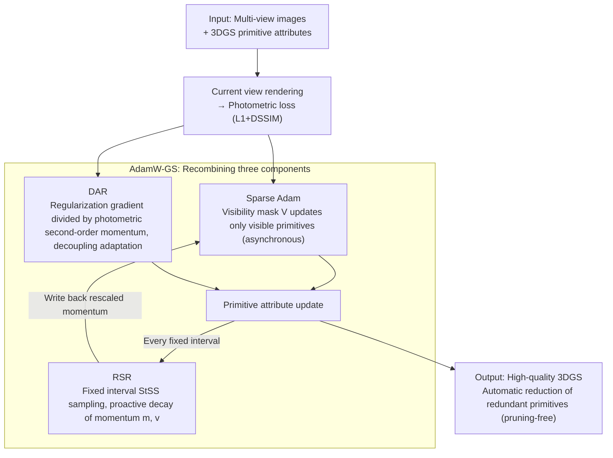

# A Step to Decouple Optimization in 3DGS

**Conference**: ICLR 2026  
**arXiv**: [2601.16736](https://arxiv.org/abs/2601.16736)  
**Code**: [https://eliottdjay.github.io/adamwgs/](https://eliottdjay.github.io/adamwgs/)  
**Area**: 3D Vision  
**Keywords**: 3DGS, Optimizer, Adam, Weight Decay, Sparse Optimization  

## TL;DR
The paper provides an in-depth analysis of overlooked optimization couplings in 3DGS, specifically update step coupling (implicit updates and momentum rescaling under invisible viewpoints) and gradient coupling (regularization and photometric loss coupling within Adam's momentum). By decoupling and reorganizing these components, the authors propose the AdamW-GS optimizer, which simultaneously improves reconstruction quality and reduces redundant primitives without requiring additional pruning operations.

## Background & Motivation

**Background**: 3DGS directly inherits the Adam optimizer and synchronous update strategies from deep learning, simultaneously updating all primitives, including those invisible from the current viewpoint.

**Limitations of Prior Work**: (a) Update step coupling: Zero gradients for primitives in invisible views still lead to momentum rescaling and "implicit updates," affecting efficiency and effectiveness; (b) Gradient coupling: Regularization losses and photometric losses are coupled within Adam’s adaptive gradients, making regularization effects uncontrollable—returning either overly strong or too weak results. While Sparse Adam improves efficiency, it leads to performance degradation.

**Key Challenge**: Primitive optimization in 3DGS differs from weight optimization in DNNs; each attribute has physical meaning, and each primitive possesses unique importance, yet existing optimizers fail to account for these differences.

**Goal**: To understand and decouple optimization couplings in 3DGS and design a superior optimization strategy.

**Key Insight**: Decompose Adam's behavior in 3DGS into three components (Sparse Adam, Re-State Regularization, and Decoupled Attribute Regularization), study their individual effects, and recombine them optimally.

**Core Idea**: Introduce the decoupling philosophy of AdamW into 3DGS, replacing coupled regularization with an adaptive form $\nabla\mathcal{R}/\sqrt{\hat{v}}$, allowing regularization intensity to automatically adjust according to the optimization state of each primitive.

## Method

### Overall Architecture
This paper aims to clarify the hidden costs of directly applying DNN-style Adam and synchronous updates to 3DGS. The authors first decompose Adam's behavior in 3DGS into three components for observation before recombining the beneficial parts. First, Sparse Adam restricts updates to primitives visible in the current viewpoint to examine the utility of "implicit updates" for invisible primitives. Second, finding that the "implicit updates" lost in Sparse Adam actually rely on momentum rescaling, they introduce Re-State Regularization (RSR) to proactively decay momentum and explicitly recover this benefit. Third, Decoupled Attribute Regularization (DAR) extracts the regularization gradient from Adam's adaptive momentum, using the photometric loss's own second-order momentum to regulate intensity. Once all three components are validated, they are combined into the final AdamW-GS: each step renders the current viewpoint to calculate photometric loss, uses Sparse Adam to update only visible primitives with DAR applying decoupled regularization, and employs RSR to rescale momentum at fixed intervals.

### Key Designs

**1. Sparse Adam + Re-State Regularization: Salvaging "Implicit Updates" from Side Effects**

Vanilla 3DGS performs synchronous updates on all primitives; even those invisible in the current view are modified. While their gradients are zero and they should remain static, Adam's momentum term $v$ continues to decay, pushing the parameters regardless—this is the overlooked "implicit update." Sparse Adam uses a visibility mask $\mathcal{V}$ to disable these updates, setting $\beta' = \beta \cdot \mathcal{V} + (1-\mathcal{V})$ to update only visible primitives. However, the authors observed that while this increases training stability, it lacks exploration; implicit updates, though noisy, help activate regularization and remove redundant primitives. RSR’s logic is: if momentum rescaling ($v$ decreasing) is what is truly useful, do not rely on implicit updates as a side effect. Instead, actively sample primitives at fixed intervals and directly decay momentum via $m^{new} = \alpha_1 m^{old}$ and $v^{new} = \alpha_2 v^{old}$. This retains the benefits of momentum decay in amplifying regularization intensity without the uncontrollable perturbations of implicit updates.

**2. Decoupled Attribute Regularization: Adapting Regularization Intensity to Primitive State**

In 3DGS, regularization losses (L1 on opacity and scale) are bundled with photometric losses in Adam’s adaptive gradient, making regularization effects uncontrollable—increasing $\lambda$ tenfold to boost regularization often causes optimization to collapse. DAR draws inspiration from AdamW’s decoupled weight decay, pulling the regularization term out of the update equation:

$$\theta_{t+1} = \theta_t - \eta\left[\frac{\hat{m}'_t}{\sqrt{\hat{v}'_t}+\epsilon} + \min\left(\lambda_\theta \frac{\nabla\mathcal{R}/N_I}{\sqrt{\hat{v}'_t}+\epsilon}, \mathcal{C}_t\right)\right]$$

Crucially, $\hat{v}'_t$ is calculated solely from the photometric loss gradient. Thus, regularization intensity is automatically adjusted by this second-order momentum: in under-optimized regions where the photometric gradient $\nabla\ell$ and $\hat{v}$ are large, regularization is suppressed to not interfere with reconstruction. Near saddle points where $\nabla\ell$ and $\hat{v}$ are small, regularization is amplified to help primitives escape. An outer $\min(\cdot, \mathcal{C}_t)$ with a clipping constant prevents overshooting. This makes AdamW-GS more suitable for 3DGS than constant penalties, as different primitives require adaptive rather than one-size-fits-all regularization.

**3. AdamW-GS: Recombining the Validated Components**

Combining the three strategies results in the complete AdamW-GS: viewpoint-aware asynchronous updates (Sparse Adam) + periodic proactive momentum decay (RSR) + adaptive decoupled regularization (DAR). This combination is not a simple stacking; each component was verified to provide specific gains. Consequently, the final optimizer improves reconstruction quality while simultaneously removing redundant primitives, eliminating the need for extra pruning steps.

### Loss & Training
The photometric loss ($L_1 + \text{DSSIM}$) remains unchanged, while regularization losses (opacity $L_1$ + scale $L_1$) are applied via the DAR mechanism. Noise regularization is added to the vanilla 3DGS to promote exploration.

## Key Experimental Results

### Main Results

**MipNeRF360 Dataset (vanilla 3DGS vs AdamW-GS):**

| Method | PSNR↑ | SSIM↑ | LPIPS↓ | Primitives (M)↓ | Redundant Primitives↓ |
|------|-------|-------|--------|-----------|---------|
| 3DGS (Adam) | 27.507 | 0.815 | 0.216 | 3.33 | 0.23M dead |
| 3DGS (Sparse Adam) | 27.285 | 0.809 | 0.228 | 2.53 | 0.04M dead |
| **AdamW-GS (Ours)** | **27.75+** | **0.82+** | **0.20-** | **~2.5** | **Minimal** |

### Ablation Study

| Component | PSNR | $\Delta N_a$ | Description |
|------|------|------------|------|
| MCMC Baseline | 27.948 | -3.75% | Standard Adam |
| + Sparse Adam | 27.998 | +4.28% | Improved efficiency, decreased exploration |
| + AIU | 28.050 | +3.62% | Manual implicit updates restore exploration |
| + RSR | 28.017 | +0.51% | Momentum decay activates regularization |
| + DAR (opacity+scale) | **28.27+** | - | Decoupled regularization yields significant Gain |

### Key Findings
- Sparse Adam is more stable but lacks exploration; Adam's implicit updates, despite side effects, facilitate regularization activation.
- Momentum rescaling (decreasing $v$) amplifies the effective intensity of regularization, explaining the behavioral gap between Adam and Sparse Adam.
- Decoupled regularization automatically removes redundant primitives without extra pruning—AdamW-GS significantly reduces "dead primitives" in vanilla 3DGS.
- Within the 3DGS-MCMC framework, DAR promotes better primitive redistribution via stronger regularization, enhancing reconstruction quality.

## Highlights & Insights
- **Deep Transfer from DNN Optimization to 3DGS**: The core philosophy of AdamW (decoupled weight decay) is creatively applied to 3DGS, but with a crucial adaptation—recognizing the physical meaning of primitives and using $1/\sqrt{\hat{v}}$ for adaptive rather than constant penalties.
- **Discovery and Analysis of "Implicit Updates"**: Systematically analyzed the previously ignored momentum rescaling and attribute updates under zero gradients, revealing unique characteristics of Adam's behavior in 3DGS.
- **Pruning-free Redundancy Elimination**: Solving redundancy through optimizer design rather than post-processing represents a significant methodological advancement.

## Limitations & Future Work
- The sampling schedule for RSR (StSS) requires manual configuration; optimal schedules may vary across different scenes.
- Although the clipping constant $\mathcal{C}_t$ for decoupled regularization is empirically robust, it lacks theoretical guidance.
- Validated primarily on standard scenes like MipNeRF360 and Tanks&Temples; testing on larger-scale scenes is required.
- Applicability to various downstream extensions of 3DGS has not been fully verified.

## Related Work & Insights
- **vs AdamW (Loshchilov & Hutter)**: AdamW decouples $L_2$ regularization as a constant decay; AdamW-GS further utilizes $1/\sqrt{\hat{v}}$ for adaptive decoupling, better suited for 3DGS where primitive importance varies.
- **vs Rota Bulò et al. 2025**: They used constant opacity decay to replace resets, a form of AdamW-style update; this paper argues constant penalties are insufficient and require adaptation based on primitive state.
- **vs Sparse Adam (Mallick et al.)**: Sparse Adam only addresses efficiency while sacrificing performance; this work recovers performance while maintaining efficiency through RSR and DAR.

## Rating
- Novelty: ⭐⭐⭐⭐ Introduces an optimizer design perspective to 3DGS analysis, discovering and explaining previously ignored coupling phenomena.
- Experimental Thoroughness: ⭐⭐⭐⭐⭐ Validated across dual frameworks (3DGS + 3DGS-MCMC) with extensive ablations and step-by-step component analysis.
- Writing Quality: ⭐⭐⭐⭐ In-depth analysis, though the variety of symbols and experimental variants poses a moderate reading threshold.
- Value: ⭐⭐⭐⭐ Offers a new understanding of 3DGS optimization and provides practical optimizer improvements.

<!-- RELATED:START -->

## Related Papers

- [\[ICCV 2025\] 3DGS-LM: Faster Gaussian-Splatting Optimization with Levenberg-Marquardt](../../ICCV2025/3d_vision/3dgslm_faster_gaussiansplatting_optimization_with_levenbergm.md)
- [\[ICLR 2026\] Joint Optimization for 4D Human-Scene Reconstruction in the Wild](joint_optimization_for_4d_human-scene_reconstruction_in_the_wild.md)
- [\[CVPR 2026\] GAI-GS：用几何代数注意力把光线-物体交互注入 3DGS 的无线信道预测框架](../../CVPR2026/3d_vision/a_geometric_algebra-informed_3dgs_framework_for_wireless_channel_prediction.md)
- [\[ICLR 2026\] Path Matters: Unveiling Geometric Implicit Bias via Curvature-Aware Sparse View Optimization](path_matters_unveiling_geometric_implicit_bias_via_curvature-aware_sparse_view_o.md)
- [\[ICLR 2026\] Test-Time Optimization of 3D Point Cloud LLM via Manifold-Aware In-Context Guidance and Refinement](test-time_optimization_of_3d_point_cloud_llm_via_manifold-aware_in-context_guida.md)

<!-- RELATED:END -->
