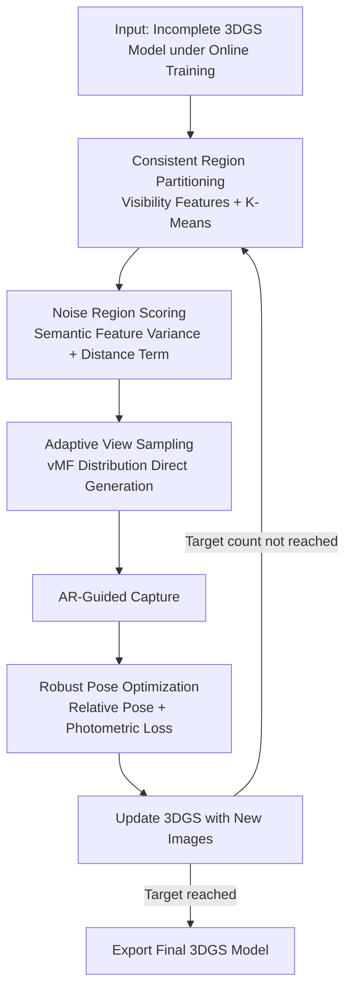

# Active Learning of 3D Gaussian Splatting with Consistent Region Partition and Robust Pose Estimation

**Conference**: ICLR2026  
**OpenReview**: [https://openreview.net/forum?id=yye5kN9jH7](https://openreview.net/forum?id=yye5kN9jH7)  
**Code**: https://github.com/csrqli/al-3dgs  
**Area**: 3D Vision  
**Keywords**: 3D Gaussian Splatting, Active Reconstruction, Next Best View, Consistent Region Partition, Robust Pose Estimation

## TL;DR
This paper proposes an online active learning algorithm for 3D Gaussian Splatting (3DGS). It guides users by suggesting the "next best view" during training. The system partitions the model into consistent regions using visibility features, identifies the most under-reconstructed areas via semantic feature variance, and directly generates the next optimal pose using a von Mises-Fisher distribution. It also incorporates a robust pose optimization module to handle noise from handheld capture, outperforming SOTAs like FisherRF on NeRF-Synthetic in few-shot settings (10/20 views).

## Background & Motivation
**Background**: 3DGS uses a set of Gaussian ellipsoids to explicitly represent radiance fields and has become the mainstream solution for new view synthesis. However, it requires a high number of training images and dense coverage; reconstructing an object typically necessitates capturing many images around it.

**Limitations of Prior Work**: This "capture-then-reconstruct" offline workflow has two major drawbacks. First, there is **no feedback** during the capture phase; users do not know which areas are sufficiently covered, leading to over-sampling or under-sampling. Second, existing active reconstruction methods (e.g., NeurAR, ActiveNeRF, FisherRF) mostly **randomly sample candidate poses and render images to evaluate information gain** (e.g., predictive uncertainty, ray entropy). This is indirect, fails to "generate" new poses directly, ignores occluded regions, and overlooks the semantic quality of the object.

**Key Challenge**: Current active reconstruction depends on the indirect chain of **candidate pose sampling + image rendering evaluation**, failing to leverage the explicit geometry of 3DGS to derive poses. Furthermore, most methods **assume perfect poses**, whereas actual poses captured by handheld devices (phones, robot arms) inevitably deviate from ideal ones, causing reconstruction quality to collapse (e.g., the wings of a phoenix toy being reconstructed as white background).

**Goal**: To develop an online active reconstruction system that can directly generate the "most informative" next pose to guide capture while maintaining reconstruction quality under noisy poses in real-world scenarios.

**Key Insight**: The authors leverage the **explicit representation** of 3DGS. Since the position and visibility of Gaussian ellipsoids are explicitly analyzable, one can bypass the "sampling-rendering-evaluation" loop. Instead, the noise distribution of the current incomplete model is analyzed to fill in under-reconstructed parts in a bottom-up manner.

**Core Idea**: A pipeline consisting of "visibility-consistent region partitioning + semantic feature variance for noise identification + direct pose generation + robust pose optimization" is used to replace indirect uncertainty estimation via rendering. This achieves an online, practical, and noise-robust system.

## Method

### Overall Architecture
The system **alternates between online 3DGS training and image acquisition**: at capture step $k$, given the current incomplete model $G_k$, an acquisition function $\{P^1_k,\dots,P^l_k\}=A(G_k)$ analyzes the model, estimates the next set of optimal poses, and **adaptively decides the number of images** $l$ to capture. Specifically, the acquisition function partitions the model into "consistent regions," selects the noisiest region via semantic variance, and samples camera poses directed toward that region. The user captures images (e.g., guided by virtual cameras in an AR interface), and a robust pose optimization module corrects the noisy poses before updating the 3DGS.

### Key Designs

**1. Consistent Region Partitioning: Dividing the model into regions visible from a single viewpoint**

To avoid issues where rendering-based metrics fail to evaluate occluded areas, the authors define "consistent regions" directly on 3DGS geometry—connected regions that are geometrically smooth, have similar textures, and, most importantly, **can be seen as a whole from a specific camera pose**. To capture this "visibility" property, a subset of $M$ Gaussians is sampled to reconstruct a surface via Alpha Shape. $N$ camera positions are sampled on a surrounding hemisphere to estimate a visibility matrix $\Gamma$, where $\Gamma_{mn}$ is a binary indicator of whether point $m$ is visible to camera $n$. The $m$-th row of $\Gamma$ is the **visibility feature** for that Gaussian. Combining this with color, position, and rotation yields a feature vector:

$$\gamma = [\,x/r,\; c/\sqrt{3},\; R,\; \Gamma_m/\sqrt{N}\,]$$

(normalized by maximum values, where $r$ is the radius and $R$ is the quaternion rotation). Clustering these vectors with K-Means produces consistent regions. This ensures that even geometrically adjacent parts (like the front and back of a thin plate) are separated due to different visibility, ensuring no occluded faces are missed.

**2. Semantic Feature Variance Scoring: Locating under-reconstructed areas via self-supervised uncertainty**

The authors use deep features learned from large-scale data to evaluate geometry. Surface vertices of the model are processed by **Point-MAE** (pre-trained self-supervisedly) to extract depth features. By performing $T$ forward passes with random input sampling and dropout masks, the norm of the variance across these instances is used as the **semantic variance score**:

$$S_{\text{sem}} = \big\| \operatorname{var}\{\tfrac{1}{T}\Sigma f_t(x)\} \big\|$$

High variance indicates unstable semantic attributes, implying high noise and poor quality. The final region selection uses a combined score:

$$S_{\text{total}} = \lambda_1 \cdot \tfrac{1}{J}S_{\text{sem}}(x_j) + \lambda_2 \cdot \min_k \|\hat{x}-\tilde{x}_k\|$$

where the second term is a **distance term** encouraging the selection of regions far from previously captured ones to ensure coverage.

**3. Adaptive Coverage View Sampling: Directly generating poses directed at noisy regions**

Instead of filtering candidates, the system **directly generates poses**. A line is projected from the region center along its normal to intersect a bounding sphere at point $p$. Using $p$ as the mean direction $\mu$, camera positions are sampled from a von Mises-Fisher (vMF) distribution $v(\mu, \kappa)$ with concentration parameter $\kappa = \eta_1\cdot N_r/N_{\text{all}}$. This acts like a spherical Gaussian, ensuring cameras "look at" the target. The **number of images is also adaptive**, set to $\eta_2\cdot N_r/N_{\text{all}}$, allocating more captures to larger/more significant regions.

**4. Robust Pose Optimization: Freezing Gaussians and optimizing relative poses to eliminate capture noise**

To handle deviations between ideal and actual handheld poses, the system optimizes only the **relative rigid body transformation** $T \in SE(3)$ between them:

$$T^* = \arg\min_T L_{\text{pose}}(TP, P), \quad L_{\text{pose}} = L_{\text{rgb}}\big(c(TP),\, \hat{c}(P)\big)$$

The photometric loss minimizes the difference between the rendered image at $TP$ and the actual captured ground-truth image $\hat{c}(P)$. Optimization is performed on the Lie algebra $\tau = \log T$. **Gaussian properties are frozen** during pose optimization to prevent noisy poses from corrupting the model. Once aligned, 3DGS training resumes. This step is critical for reconstructing thin structures under noisy handheld conditions.

### Loss & Training
The 3DGS follows the standard L1 + SSIM photometric loss. In the online workflow, images are acquired every 300 steps, and the model is re-initialized with random points after acquisition. K-Means uses a subset of 10K Gaussians with a relative tolerance of $1\text{e-}4$. After all images are collected, an additional 10,000 steps are trained. Pose optimization uses the photometric loss in Equation (7) separately with frozen Gaussians.

## Key Experimental Results

### Main Results
On 8 objects from NeRF-Synthetic with perfect poses, using total view budgets of 10 and 20:

| Setting | Method | PSNR ↑ | SSIM ↑ | LPIPS ↓ |
|------|------|--------|--------|---------|
| 10 Views | 3DGS + Random | 22.493 | 0.873 | 0.112 |
| 10 Views | 3DGS + ActiveNeRF | 22.979 | 0.876 | 0.111 |
| 10 Views | 3DGS + FisherRF | 23.681 | 0.883 | 0.102 |
| 10 Views | **Ours** | **25.542** | **0.896** | **0.063** |
| 20 Views | 3DGS + FisherRF | 29.525 | 0.944 | 0.043 |
| 20 Views | **Ours** | **30.186** | 0.943 | **0.033** |

At 10 views, PSNR is ~1.9 higher than FisherRF, and LPIPS is significantly lower. Gains decrease at 20 views as information redundancy increases.

### Ablation Study
Blender (8 scenes), 10 total views:

| Configuration | PSNR | SSIM | LPIPS | Description |
|------|------|------|-------|------|
| w/o Γ | 21.271 | 0.863 | 0.137 | Removing visibility features from clustering |
| w/o Distance | 22.438 | 0.866 | 0.090 | Removing the distance term in Eq. (5) |
| w/o Point-MAE | 24.584 | 0.877 | 0.074 | Replacing semantic variance with Fisher info |
| Full | **25.542** | **0.896** | **0.063** | Complete model |

### Key Findings
- **Visibility Feature Γ contributes most**: Removing it causes PSNR to drop from 25.542 to 21.271, proving that visibility-based partitioning is the foundation.
- **Semantic variance outperforms Fisher Information**: Replacing Point-MAE variance with Fisher information drops PSNR to 24.584, validating that semantic-level quality assessment better locates under-reconstructed areas.
- **Distance term prevents clustering**: Its removal drops performance to 22.438, proving that forcing exploration of distant regions improves coverage efficiency.
- **Noisy Pose Scenarios**: In handheld captures of 4 real objects, omitting pose optimization leads to collapsed geometry, while robust optimization restores reconstruction quality.

## Highlights & Insights
- **Shifting from "Rendering Evaluation" to "Explicit Geometry Analysis"**: This is the core innovation. Since 3DGS is explicit, visibility and noise can be read directly from the geometry to **directly generate** poses, capturing occluded areas.
- **Visibility Matrix + Clustering**: Using a binary matrix indicating if camera positions on a hemisphere see a point is a lightweight yet effective geometric prior for separating visually distinct structures.
- **Self-Supervised Feature Variance for Uncertainty**: Applying MC-Dropout style uncertainty to 3DGS evaluation through Point-MAE provides quality assessment without training extra uncertainty heads.
- **Frozen Gaussian Pose Optimization**: By treating the ideal pose as an initialization and optimizing only relative Lie algebra transforms, the system elegantly handles handheld capture noise.

## Limitations & Future Work
- **Large-scale Adaptation**: The method was primarily validated on object-level data; its efficiency in large-scale scenes remains to be explored.
- **Computational Overhead**: Each step requires Alpha Shape reconstruction, visibility matrix estimation for $M$ Gaussians, and $T$ Point-MAE passes. Online overhead is not negligible.
- **Hyperparameter Sensitivity**: The system relies on several parameters ($\lambda, \eta, N, M, T$) that may require tuning for different objects.
- **Future Directions**: Extending semantic variance to scene-level and incorporating navigation/path-length constraints for robotics/UAV exploration.

## Related Work & Insights
- **vs. FisherRF**: FisherRF selects frames from a pre-collected set using Laplace approximation; **Ours** generates new poses and handles noise.
- **vs. NeurAR / ActiveNeRF**: These methods add uncertainty outputs to NeRF and are based on rendering evaluation; **Ours** uses explicit 3DGS geometry to handle occlusions.
- **vs. GenNBV**: GenNBV uses RL for policy generalization in simulators; **Ours** is based on real-time geometric analysis and self-supervised variance without simulation training.

## Rating
- Novelty: ⭐⭐⭐⭐ 
- Experimental Thoroughness: ⭐⭐⭐⭐ 
- Writing Quality: ⭐⭐⭐⭐ 
- Value: ⭐⭐⭐⭐ 

<!-- RELATED:START -->

## Related Papers

- [\[ICLR 2026\] Learning Unified Representation of 3D Gaussian Splatting](learning_unified_representation_of_3d_gaussian_splatting.md)
- [\[ICLR 2026\] NGS-Marker: Robust Native Watermarking for 3D Gaussian Splatting](ngs-marker_robust_native_watermarking_for_3d_gaussian_splatting.md)
- [\[CVPR 2026\] WildPose: A Unified Framework for Robust Pose Estimation in the Wild](../../CVPR2026/3d_vision/wildpose_a_unified_framework_for_robust_pose_estimation_in_the_wild.md)
- [\[CVPR 2026\] ComPose: A Unified Completion-Pose Framework for Robust Category-Level Object Pose Estimation](../../CVPR2026/3d_vision/compose_a_unified_completion-pose_framework_for_robust_category-level_object_pos.md)
- [\[ECCV 2024\] Learning 3D Geometry and Feature Consistent Gaussian Splatting for Object Removal](../../ECCV2024/3d_vision/learning_3d_geometry_and_feature_consistent_gaussian_splatting_for_object_remova.md)

<!-- RELATED:END -->
