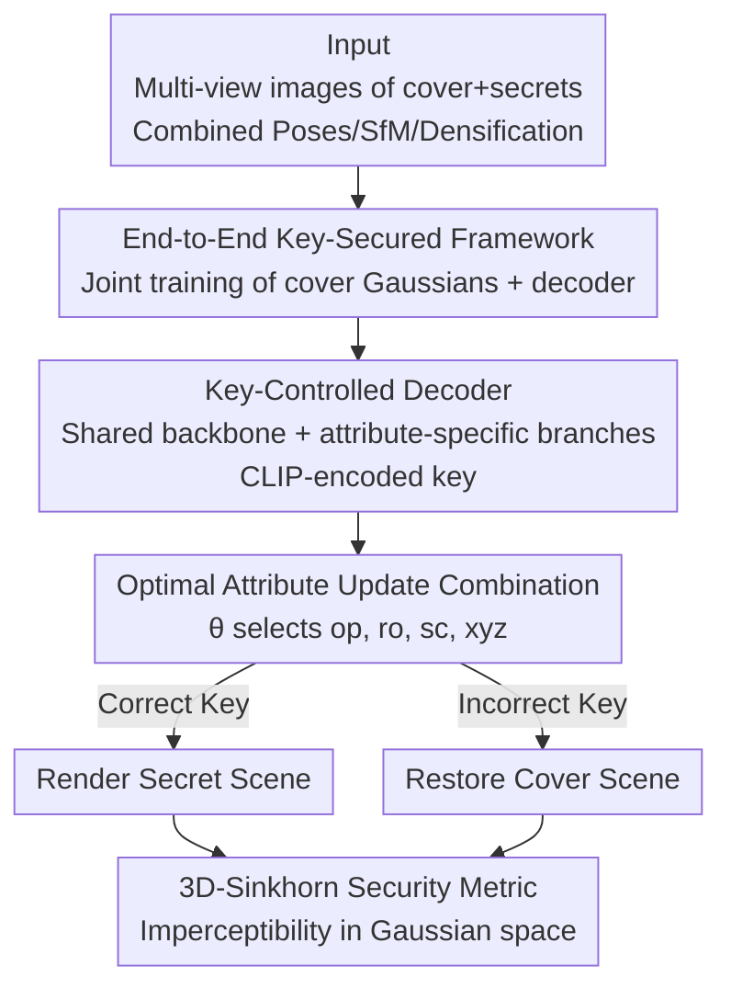

# All That Glitters Is Not Gold: Key-Secured 3D Secrets within 3D Gaussian Splatting

**Conference**: ICLR2026  
**OpenReview**: [https://openreview.net/forum?id=CcxIDaTfLB](https://openreview.net/forum?id=CcxIDaTfLB)  
**Code**: https://github.com/RY-Paper/KeySS  
**Area**: 3D Vision / 3D Gaussian Splatting / 3D Steganography / Copyright Protection  
**Keywords**: 3D Gaussian Splatting, Steganography, Key Control, Optimal Transport, Multi-Secret Hiding

## TL;DR
KeySS transforms "hiding multiple 3DGS secret scenes within a single 3DGS cover scene" into an end-to-end trainable framework. It employs a decoder controlled by CLIP-encoded keys to directly map cover Gaussians to secret Gaussians; incorrect keys result in reconstructing only the cover. The study identifies that different Gaussian attributes contribute unequally to hiding secrets (opacity is effective, while spherical harmonics are nearly useless). It proposes the 3D-Sinkhorn distance to measure steganographic imperceptibility in the Gaussian parameter space, ultimately surpassing GS-Hider in reconstruction fidelity and anti-detection security.

## Background & Motivation
**Background**: 3D Gaussian Splatting (3DGS) has enabled high-quality, efficient scene reconstruction, naturally leading to "3D steganography"—hiding a secret 3D scene within an innocuous-looking cover 3D scene for copyright protection or secure distribution. Similar to image/audio steganography, the goal is to keep the "existence" and "content" of the secret invisible to unauthorized users while ensuring reliable recovery for authorized users.

**Limitations of Prior Work**: Existing 3DGS steganography methods modify the standard 3DGS pipeline. GS-Hider replaces standard spherical harmonics (SH) with "coupled color features" and uses a specialized scene decoder for rendering. Although it achieves high fidelity, these modifications leave observable anomalies in the `.ply` file structure, potentially exposing the presence of hidden data. WaterGS improves imperceptibility via hierarchical SH encryption and autoencoder-based opacity mapping, but its separate encryption of SH and opacity makes the pipeline disconnected and non-end-to-end, and its complex embedding process prevents hiding multiple secrets in a single cover.

**Key Challenge**: The fundamental tension in steganography is **Impeceptibility vs. Fidelity**. A seemingly simple approach is to "hide" secrets by setting certain Gaussian attributes to zero (e.g., secret Gaussian opacity to 0), but this is highly insecure—an attacker can instantly reveal the secret by restoring zero-value attributes. Relying solely on a single attribute is neither secure nor does it fully exploit the expressive power of Gaussians.

**Goal**: ① Ensure the steganographic cover scene remains entirely consistent with standard 3DGS in both file format and rendering process (leaving no trace); ② Support hiding multiple secrets in the same cover, retrievable by corresponding keys; ③ Defend against unauthorized access (incorrect keys); ④ Provide a metric capable of measuring imperceptibility directly in the 3D parameter space.

**Key Insight**: The authors observe that **"all that glitters is not gold"—not all Gaussian attributes are equally useful for hiding secrets**. Experiments show that modifying opacity effectively hides secrets, while modifying SH is nearly useless or even destabilizes training. Since attribute contributions are unequal, one should systematically identify the "optimal attribute combination" to balance fidelity and security rather than blindly using all attributes or just one.

**Core Idea**: Train a **key-controlled decoder** to directly transform cover Gaussians $G_{cover}$ into secret Gaussians $G_{secret}^s = D(G_{cover}, k_s)$ while maintaining standard formats and rendering. A correct key extracts the secret; an incorrect key restores the cover. This is complemented by an **optimal attribute update combination** search and a **3D-Sinkhorn** security metric.

## Method

### Overall Architecture
KeySS is an **end-to-end framework trained jointly from scratch**. The input consists of multi-view 2D images (with aligned camera poses) for both a cover scene and several secret scenes. The output is a set of **standard format** cover Gaussians $G_{cover}$ and a key-controlled decoder $D$. During inference, given a 16-character key $k_s$, the decoder transforms the cover Gaussians into the $s$-th secret Gaussian set $G_{secret}^s = D(G_{cover}, k_s)$, which is then rendered via **standard 3DGS**. If an incorrect key is provided, the decoder is trained to restore only the cover scene, leaking no secret information.

The crux is that the cover scene appears as an ordinary `.ply` file with standard attributes (opacity $\alpha$, rotation $r$, scale $s$, position $\mu$, and spherical harmonics $c$), using standard alpha-blending. The secrets are entirely encoded within the "decoder + key," making them undetectable at the file and rendering levels. The pipeline is driven by three types of losses: cover reconstruction loss $L_{cover}$, secret reconstruction loss $L_{secret}^s$, and incorrect key loss $L_{incorrect}$, supplemented by training tricks such as combined camera poses, combined SfM initialization, and combined densification.

### Key Designs

**1. End-to-End Key-Secured Framework: Making Steganographic Covers Indistinguishable from Standard 3DGS**

Addressing the "pipeline modification leaves traces" issue in GS-Hider/WaterGS, KeySS shifts the "hiding" process entirely to a learnable transformation $G_{secret}^s = D(G_{cover})$. Given $S+1$ sets of multi-view images (1 cover + $S$ secrets), the framework learns: (1) a standard 3DGS model $G_{cover}=\{G_i(x)\}_{i=1}^N$ to reconstruct the cover; and (2) transformations to decode $G_{cover}$ into multiple secret models $G_{secret}^s$. Both cover and secret reconstructions are constrained by a combination of L1 and SSIM losses:

$$L_{cover} = (1-\lambda_{cover})L_1(I_{pred\ cover}, I_{gt\ cover}) + \lambda_{cover} L_{SSIM}(I_{pred\ cover}, I_{gt\ cover})$$

The same applies to $L_{secret}^s$. Since the cover remains a valid standard Gaussian rendered via standard alpha-blending, unauthorized users see no anomalies, fundamentally eliminating risks associated with pipeline modification and ensuring compatibility with future 3DGS improvements.

**2. Key-Controlled Decoder: One Key per Secret using CLIP Encoding, Incorrect Keys Restore the Cover**

To achieve "multi-secret hiding + unauthorized resistance," the decoder is conditioned on a user key $k_s$: $G_{secret}^s = D(G_{cover}, k_s)$. The 16-character alphanumeric key is tokenized and passed through a CLIP (ViT-L/14) text encoder $E$, followed by average pooling to obtain the key embedding $k = \text{AvgPool}(E(k))$. CLIP is chosen for its ability to map arbitrary text to semantic embeddings, ensuring a large and semantically separable key space. This embedding is concatenated with normalized Gaussian attributes and fed into the decoder. The decoder uses a decoupled structure: a shared backbone extracts common features $h = \text{MLP}_{common}(\text{concat}(\alpha,r,s,\mu,c,k))$, which then enter attribute-specific MLP branches to generate updated attributes.

Resistance to unauthorized access is achieved via $L_{incorrect}$. During training, random incorrect keys are generated, and the decoder is forced to reconstruct only the cover:

$$L_{incorrect} = (1-\lambda_{incorrect})L_1(I_{pred\ incorrect}, I_{gt\ cover}) + \lambda_{incorrect} L_{SSIM}(I_{pred\ incorrect}, I_{gt\ cover})$$

This prevents the secret from being extracted or its existence from being exposed. Multiple secrets are supported at near-zero cost by adding secret loss terms $L_{secret}^s$ without changing the architecture.

**3. Optimal Attribute Update Combination: Systematic Search Reveals op+ro+sc+xyz is Best**

Acknowledging that "not all attributes are gold," the authors use a binary vector $\theta \in \mathbb{R}^5$ to toggle the updates of the five attribute branches:

$$[\alpha^*, r^*, s^*, \mu^*, c^*]^\top = [\alpha, r, s, \mu, c]^\top + \theta \circ [\text{MLP}_{op}(h), \text{MLP}_{ro}(h), \text{MLP}_{sc}(h), \text{MLP}_{po}(h), \text{MLP}_{sh}(h)]^\top$$

By systematically traversing attribute combinations, they found that modifying opacity (op) is most effective for hiding, while SH (sh) contributes little or even disrupts training stability. However, relying only on opacity has a fatal security flaw (zero-value detection). The final conclusion is that combining opacity with rotation, scale, and position (op, ro, sc, xyz) significantly outperforms single-attribute schemes in both security and fidelity.

**4. 3D-Sinkhorn Security Metric: Quantifying Imperceptibility in Parameter Space**

Traditional 2D metrics (PSNR/StegExpose) fail to detect statistical anomalies in 3D representations. The authors introduce a security metric based on the Sinkhorn distance (optimal transport with entropic regularization) to measure distribution differences between the "steganographic cover" and the "original cover" in the Gaussian parameter space. Histograms of normalized attributes $g_i = \text{hist}(f_i)$ and $g_i^{gt} = \text{hist}(f_i^{gt})$ are used to calculate:

$$d = \sum_i \text{Sinkhorn}(g_i, g_i^{gt})$$

A smaller $d$ indicates higher imperceptibility. The Sinkhorn distance provides computational efficiency via regularization while preserving geometric correspondence for 3D analysis. A composite score is used for attribute selection:

$$\text{score} = (\text{PSNR}_{cover} + \text{PSNR}_{secret}) \cdot (1 - d)$$

Experiments confirm that schemes modifying only opacity leave distinct statistical signatures in the parameter space that are invisible to 2D metrics but caught by 3D-Sinkhorn.

### Loss & Training
The total loss is a weighted sum of three objectives:

$$L = \beta_{cover} L_{cover} + \sum_{s=1}^{S}\beta_{secret}^s L_{secret}^s + \beta_{incorrect} L_{incorrect}$$

Four strategies are used: **Combined Camera Poses** (merging poses and using pre-trained models to generate GT for missing views), **Combined SfM Initialization** (initializing with merged point clouds), **Triple Loss Backpropagation**, and **Combined Densification** (using gradients from both cover and secret views to guide cloning/splitting). Details: 30,000 iterations, 24GB RTX 6000, 500k Gaussian limit; $\lambda$ values at 0.5, $\beta_{cover}=\beta_{secret}=0.5$, $\beta_{incorrect}=0.01$.

## Key Experimental Results

The dataset follows the GS-Hider protocol (Mip-NeRF360 and Deep Blending scenes). Evaluation uses PSNR on unseen views.

### Main Results

| Setting | Type | Metric | KeySS | GS-Hider | Note |
|------|------|------|-------|----------|------|
| Single Secret (avg) | Cover | PSNR↑ | 25.980 | 25.817 | Higher cover fidelity |
| Single Secret (avg) | Secret | PSNR↑ | 26.427 | 25.178 | Secret recovery +4.9% |
| Fidelity Loss | Cover | Gap to Upper Bound dB↓ | 0.511 | 1.388 | Closer to vanilla 3DGS |
| Incorrect Key | vs Secret | PSNR↓ | 10.341 | — | Low PSNR = Effective defense |

Note: The 3DGS-GT (KeySS) cover upper bound is 26.518 dB. Under an incorrect key, "vs Secret" PSNR is only 10.341, while "vs Cover" is 25.916 (successful cover restoration).

### Multi-Secret and Security

| Dimension | Data | Note |
|------|------|------|
| Multi-Secret PSNR | Comparable to single secret (e.g., Bicycle secret1=29.031) | Scalable by adding loss terms |
| StegExpose AUC | KeySS-best 0.45 / multi 0.38 vs GS-Hider 0.29 | Closer to 0.5 (random guess) is better |
| Decoder Params | MLPs only 125.7k | Lightweight, first to support 3D-Sinkhorn |

### Key Findings
- **Attribute Inequality**: Opacity is effective; SH is nearly useless. The (op, ro, sc, xyz) combination is superior to single-attribute schemes.
- **2D Metric Blind Spot**: StegExpose AUC is similar across combinations; 3D-Sinkhorn is required to reveal parameter-level statistical differences.
- **Robust Defense**: Incorrect keys yield PSNR ~10 dB vs secret, ensuring unauthorized users cannot recover content.

## Highlights & Insights
- **The "Not All Gold" Insight is Grounded**: Searching for useful attributes rather than using all or one provides significant engineering value.
- **Format Invariance is the Root of Security**: By not changing point formats or rendering, secrets are hidden purely in the "decoder + key," ensuring outward compliance.
- **3D-Sinkhorn Fills a Gap**: Measuring security in the parameter space rather than the image space reveals hidden statistical fingerprints.
- **Zero-Cost Multi-Secret Scaling**: Supports multiple secrets retrievable via different keys simply by adding secret loss terms.

## Limitations & Future Work
- **Dependency on Aligned Multi-View GT**: Requires aligned poses and images for all scenes, increasing data preparation costs.
- **Baseline Comparison Constraints**: Limited by non-open-source baselines (WaterGS, SecureGS), necessitating reliance on reported values.
- **Scale and Key Space**: Gaussian limit of 500k and 16-char keys; scalability to larger scenes and key collision risks are not fully explored.
- **Future Directions**: Exploring differentiable attribute selection instead of discrete toggling and exploring steganography-specific key encoders.

## Related Work & Insights
- **vs GS-Hider**: GS-Hider modifies the pipeline and lacks multi-secret support. KeySS maintains standard formats, is end-to-end, and achieves higher fidelity (+4.9% for secrets).
- **vs WaterGS**: WaterGS uses disconnected encryption. KeySS is unified and end-to-end.
- **vs SecureGS**: SecureGS lacks explicit security key mechanisms and multi-secret capabilities.
- **Insight**: Using optimal transport in representation space to measure distribution manipulation is a transferable idea for watermarking and adversarial detection.

## Rating
- Novelty: ⭐⭐⭐⭐ (Attribute insight + key-controlled multi-secret + 3D-Sinkhorn)
- Experimental Thoroughness: ⭐⭐⭐⭐ (Extensive ablation and security tests)
- Writing Quality: ⭐⭐⭐⭐ (Clear motivation and illustrations)
- Value: ⭐⭐⭐⭐ (Practical for 3D asset security; first open-source code with 3D metric)

<!-- RELATED:START -->

## Related Papers

- [\[ICLR 2026\] CLoD-GS: Continuous Level-of-Detail via 3D Gaussian Splatting](clod-gs_continuous_level-of-detail_via_3d_gaussian_splatting.md)
- [\[ICLR 2026\] Learning Unified Representation of 3D Gaussian Splatting](learning_unified_representation_of_3d_gaussian_splatting.md)
- [\[ICCV 2025\] Not All Frame Features Are Equal: Video-to-4D Generation via Decoupling Dynamic-Static Features](../../ICCV2025/3d_vision/not_all_frame_features_are_equal_video-to-4d_generation_via_decoupling_dynamic-s.md)
- [\[ICLR 2026\] SSD-GS: Scattering and Shadow Decomposition for Relightable 3D Gaussian Splatting](ssd-gs_scattering_and_shadow_decomposition_for_relightable_3d_gaussian_splatting.md)
- [\[ICLR 2026\] Human3R: Everyone Everywhere All at Once](human3r_everyone_everywhere_all_at_once.md)

<!-- RELATED:END -->
