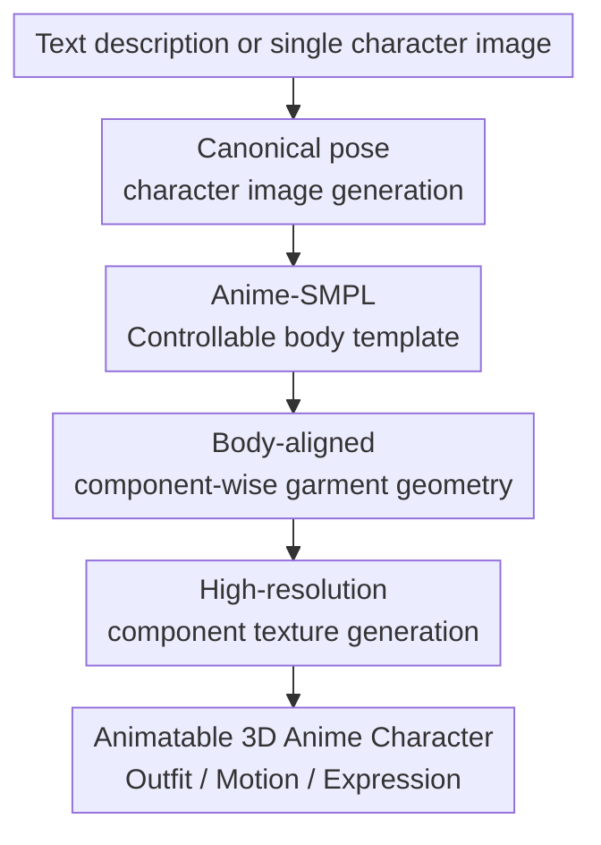

# Anime-Ready: Controllable 3D Anime Character Generation with Body-Aligned Component-Wise Garment Modeling

**Conference**: ICLR 2026  
**OpenReview**: [https://openreview.net/forum?id=BRoAjhYWoQ](https://openreview.net/forum?id=BRoAjhYWoQ)  
**Code**: TBD  
**Area**: 3D Vision  
**Keywords**: 3D Character Generation, Anime Character, Animatable Human Model, Component-wise Garment Modeling, Texture Generation  

## TL;DR
Anime-Ready normalizes text or single images into A-pose anime character images, then utilizes Anime-SMPL, a body-aligned component-wise garment DiT, and fragmented texture generation to advance 3D anime characters from "looking similar" to animation-ready assets with skeletons, swappable outfits, and expression control.

## Background & Motivation
**Background**: 3D character generation has rapidly evolved through SDS optimization, multi-view reconstruction, LRM/triplane, and 3D latent diffusion. In the realm of realistic humans, mature parametric models like SMPL/SMPL-X support animation, pose control, and outfit changes. Conversely, anime character generation relies more on large models to generate full character meshes from single images or text, where representative methods typically reconstruct the character as a monolithic 3D object.

**Limitations of Prior Work**: Anime characters are not merely real human models with different textures. They possess exaggerated eyes, non-realistic proportions, complex hairstyles, layered clothing, and numerous accessories. Direct monolithic generation often results in blurriness at details like hands, hair, or skirts, and unstable mesh topology. Crucially, many results lack reliable skeletons, unified topology, and skinning weights, rendering them static ornaments rather than assets usable in animation, games, or VTuber pipelines.

**Key Challenge**: Parametric human models provide controllability and animation capabilities, but templates like SMPL assume realistic human proportions. 3D generation models produce stylized appearances but lack constraints for stable alignment with body structures. Productive anime character generation requires "generation quality" and "industrial controllability" to hold simultaneously: characters must look good, clothing must not clip, the body must be drivable, and the face and hands require fine-grained control.

**Goal**: Ours decomposes the problem into three sub-tasks: constructing an animatable body template suited for anime proportions; generating hair, tops, bottoms, and accessories as independent components that fit the body; and generating clear textures for the body and each garment component to avoid color bleeding common in full-map projections.

**Key Insight**: The usability of an anime character is not determined by a single large model, but by the alignment of "body template, garment geometry, texture projection, and animation control." Therefore, instead of end-to-end monolithic generation, the character is decoupled into body + garment components, using a unified body template as the geometric anchor.

**Core Idea**: Use Anime-SMPL to provide an animatable anime body skeleton, then use body surface latent tokens to constrain component-wise garment generation, and perform high-resolution texture generation for the body and garments separately. This simultaneously improves mesh quality, texture clarity, and animation controllability.

## Method

### Overall Architecture
The input to Anime-Ready can be text or a character image in any pose. The system first generates or normalizes a frontal canonical pose image, then regresses Anime-SMPL body parameters to obtain an anime body with unified topology, joints, and LBS weights. Subsequently, points are sampled on the body surface and encoded into body latent tokens as explicit geometric conditions for garment generation. Finally, body UV textures and individual garment component textures are generated and assembled into an animatable 3D anime character.

The focus of this pipeline is not purely "image-to-3D," but rather ensuring each stage preserves structural information required for downstream animation and editing. The body handles the skeleton, topology, and expression control; garments act as independent components for detail and swappability; the texture stage avoids baking the entire character into a single contaminated map.

### Key Designs
**1. Anime-SMPL Controllable Body Template: Transforming Anime Characters from Static Meshes to Drivable Bodies**

The advantage of the original SMPL lies in its stable topology, skeleton, and skinning structure, but its mean human and shape space are designed for real humans, leading to obvious misfits in face shapes, ears, leg proportions, and exaggerated eyes when applied to anime characters. Instead of applying SMPL as a direct prior, Anime-Ready reconstructs Anime-SMPL using 20,000 anime characters aligned to a unified template, allowing all characters to share the same topology of 12,489 vertices, vertex order, and face connectivity.

In terms of parametrization, Anime-SMPL mainly models shape variations in the canonical pose. Ours performs PCA on these character meshes, retaining the top 98 principal components, using the shape parameter $\beta$ to represent different anime body types and facial proportions. The joint regression matrix $J$ is estimated via non-negative least squares: given the vertex matrix $V \in \mathbb{R}^{N \times 3}$ and target joint positions $B_V \in \mathbb{R}^{K \times 3}$, solve $\min_{J \ge 0} \lVert JV - B_V \rVert_F^2$ subject to $J\mathbf{1}_N = \mathbf{1}_K$. This step ensures generation results natively include joints, LBS weights, and unified UV layouts, enabling motion, finger control, and blendshape expression control.

**2. Body-Aligned Component-wise Garment Geometry: Growing Hair and Clothing from the Body**

Legacy monolithic generation mixes body, clothes, hair, and accessories into one representation. When clothing layers are complex, the model must simultaneously decide "what the clothes are" and "where they attach," often resulting in skirts clipping into legs, tight-fitting clothes deviating from the body, or collapsed hair structures. Ours explicitly splits non-body parts into four categories: hairstyles, upper garments, lower garments, and accessories. Each category generates an independent high-resolution textured mesh, allowing each component to be edited, retargeted, and textured individually.

Geometric constraints originate from Anime-SMPL itself. The system samples point clouds on the estimated 3D body surface, encodes them into body latent tokens using a VecSet VAE encoder, and concatenates these tokens with noised garment component tokens as input to the VecSet Diffusion Model. The garment token length is 3072, while body latent tokens use a lower resolution of 512 to preserve spatial contours while reducing computation. Thus, the model does not just guess garment positions from a 2D condition map but directly "sees" the body surface in 3D latent space, significantly benefiting tight-fitting items like swimwear and reducing clipping/misalignment.

**3. MoE-structured Multi-Shape DiT: One Generator for Four Component Categories with Category Specialization**

Geometric differences between the four components are vast: hair features complex outlines and fine tufted structures, upper garments cling to the torso, lower garments may include skirts and leg occlusions, and accessories are unstable in scale and position. Training separate models for each category is costly and inefficient in data utilization; using a fully shared DiT tends to mix shape priors. Therefore, ours introduces a Mixture-of-Experts (MoE) in the Multi-Shape DiT, specialized through four MLP expert branches based on component category while sharing other parameters.

DINOv2 encodes the canonical-pose image as condition tokens, joined by timestep, noised latent tokens, body latent tokens, and a learnable label token. The label token indicates which component is being generated, and a router directs information to the corresponding expert branch. The output represents garment components via SDF, with 3D meshes extracted via marching cubes. This design decouples "shared character visual semantics" from "component-level geometric patterns."

**4. High-Resolution Component Texture Generation: Decomposing Appearance into Components before Multi-view Projection**

Directly driving MVAdapter with the full canonical-pose image and normal map leads to color contamination between adjacent components (e.g., hair textures picking up face colors). Amino-Ready processes the body and garments separately. For the body, ours utilizes the unified UV layout of Anime-SMPL to generate textures across six semantic regions: body skin, facial skin, left eye, right eye, eyebrows, and eyelashes. For garments, the full-body image is decomposed into enlarged independent views of each component.

The garment texture pipeline uses all component normal maps and the canonical-pose image as conditions, exchanging information via multi-component self-attention before fusion via cross-attention with label and timestep embeddings. After obtaining independent images for each component, they are fed into MVAdapter to generate six canonical views (front, back, left, right, top, bottom), which are back-projected onto the 3D surface. By assigning dedicated resolution to each component and resolving occlusions, the resulting textures are clearer and exhibit less color bleeding than monolithic projections.

### Loss & Training
The Anime-SMPL shape prediction network uses the frontal canonical character image to predict shape parameters $\hat{\beta}$, trained with an MSE loss against ground truth $\beta$. The joint regression matrix is solved using least squares with non-negative and row-sum constraints.

2D canonical pose generation features two entry points: text-to-image and image-to-image. The text entry fine-tunes PixArt-$\Sigma$ using text descriptions paired with frontal canonical pose character images. The image entry uses ReferenceUNet and CLIP to extract reference features, supplemented by a general A-pose skeleton image as a pose condition. Training data consists of rendered anime characters with various views, poses, and expressions, augmented with lighting changes, contour line variations, and pose-estimation style cropping.

In terms of training costs, the Anime-SMPL shape prediction network takes ~4 hours on a single NVIDIA L20. The MoE-structured Multi-Shape DiT uses 16 A100s with AdamW at a learning rate of $1 \times 10^{-4}$ for ~10 days. 2D canonical pose generation, body texture, and garment component texture modules each take ~2 days on 8 A100s. Inference time is ~5s for image generation, ~2s for Anime-SMPL prediction, ~40s for Multi-Shape DiT, ~10s for body texture, and ~360s for garment texture, identifying high-res garment texturing as the bottleneck.

## Key Experimental Results

### Main Results
A user study replaced metrics like PSNR/SSIM/LPIPS due to disparate training data across methods: CharacterGen and StdGEN use Anime3D, Hunyuan3D 2.0 uses large-scale data including ObjaverseXL, while Ours uses a private dataset of 20k aligned anime characters. 30 participants evaluated 16 random characters on mesh quality, texture quality, and fidelity (scale 1-5).

| Method | Mesh Quality↑ | Texture Quality↑ | Fidelity↑ |
|:---|:---:|:---:|:---:|
| CharacterGen | 2.58 | 2.14 | 2.51 |
| StdGEN | 2.69 | 2.23 | 2.52 |
| Hunyuan3D 2.0 | 3.14 | 3.49 | 3.42 |
| **Ours** | **3.83** | **3.75** | **3.74** |

Ours achieves the highest scores across all three perceptual metrics. Compared to the strongest baseline, Hunyuan3D 2.0, mesh quality increases from 3.14 to 3.83, validating that Anime-SMPL and component-wise generation improve structural quality. Texture quality and fidelity also lead, showing that component-based modeling does not sacrifice fidelity to the input.

### Ablation Study
| Configuration / Comparison | Observations | Conclusion |
|:---|:---|:---|
| SMPL vs. Anime-SMPL | Ear shapes, facial contours, leg proportions | Anime-SMPL fits exaggerated proportions better; SMPL appears too realistic. |
| w/o Body Latent Tokens | Garment fit, clipping issues | DiT guesses layout but tight-fitting clothes often deviate or clip. |
| w/ Body Latent Tokens | Garment fit, clipping issues | Explicit geometry enables surface-following generation; swimwear improves significantly. |
| w/o MoE Layers | Component quality, alignment | Shared DiT confuses different shape priors; upper garment quality drops. |
| w/ MoE Layers | Component quality, alignment | Expert branches preserve specialized geometric patterns; better quality/alignment. |

### Key Findings
- Anime-SMPL serves as the control anchor. Without a template suited for anime proportions, subsequent garment generation—even if visually pleasing—fails to support stable skeleton binding and expression/motion control.
- Body latent tokens contribute specifically to garment-body spatial relationships. They allow the generator to see the 3D body surface, reducing uncertainty in depth prediction from 2D images.
- MoE functions less as a scale expander and more as a separator for shape distributions. Specialized experts are more suitable than a fully shared architecture for categories with large geometric variance like hair vs. accessories.
- Garment texture generation is the current inference bottleneck. The 360s duration is significantly higher than other stages, indicating that while high-res multi-component projection improves quality, it is not yet a real-time asset pipeline.

## Highlights & Insights
- **Animation-First Generation Philosophy**: Ours does not merely chase single-frame visual quality but incorporates skeletons, unified topology, UV, and skinning from the outset. This is more critical for games and Vtubing than a simple 3D mesh that "looks like" the character.
- **Body as a Coordinate System for Garments**: Body latent tokens are a practical design, as garment usability depends significantly on relative positioning to the body surface. This can be extended to generating wearable assets like shoes, hats, or backpacks.
- **Component-wise Texture Mitigates Bleeding**: Splitting components before independent multi-view generation mirrors industrial asset workflows and facilitates subsequent re-texturing of specific items.
- **Anime-SMPL as a Bridge Between Generation and Editing**: A unified template makes garment retargeting, motion control, and facial expression control straightforward, proving that parametric and generative models are complementary rather than mutually exclusive.

## Limitations & Future Work
- The 20k private dataset limits reproducibility and complicates direct comparisons with open-source baselines. While user studies reflect perceptual quality, quantitative metrics for clipping rates, animation stability, and topological quality are still needed.
- Pose canonicalization can fail for characters with complex poses or excessive accessories. Distortions in the canonical image propagate to parameter regression and garment generation, necessitating stronger multi-view or skeletal constraints.
- Garment meshes extracted via marching cubes from SDFs suffer from double-sided issues, impacting physical simulation. Ours suggests exploring mesh generation methods (vertices/faces) to reduce post-processing burdens.
- Texture misalignment between projection and geometry remains, as does cross-view inconsistency. Future work could explore generating component textures directly in 3D or UV space to eliminate seams from back-projection.

## Related Work & Insights
- **vs CharacterGen**: CharacterGen focuses on pose canonicalization but results are closer to static reconstructions. Ours introduces Anime-SMPL and component-wise modeling to generate "animatable assets."
- **vs StdGEN**: Both use semantic decomposition, but the decomposition in Ours (body, hair, top, bottom, access.) aligns more closely with industrial asset structures and provides body-aligned geometric constraints.
- **vs Hunyuan3D 2.0**: Hunyuan3D 2.0 is a strong general asset baseline but does not address anime-specific topology, rigging, or body-garment alignment. The strength of Ours lies in task specialization.
- **vs SMPL/SMPL-X**: Parametric models are valuable for control, but standard templates fail on anime proportions. The insight is that stylized domains require their own reconstructed parametric models rather than forced real-human priors.

## Rating
- **Novelty**: ⭐⭐⭐⭐☆ Integrating Anime-SMPL, body-aligned tokens, MoE-based components, and component-wise textures into an animation-ready pipeline is a strong cohesive design, though individual modules build on existing DiT and parametric model concepts.
- **Experimental Thoroughness**: ⭐⭐⭐☆☆ User studies and qualitative visualizations support the core claims, but engineering metrics for clipping rates or animation stability are missing.
- **Writing Quality**: ⭐⭐⭐⭐☆ Structure and pipeline details are clear. The main drawback is the reliance on private data results which limits precise replication.
- **Value**: ⭐⭐⭐⭐☆ Significant practical value for anime and game production, particularly the direction of "generation-is-rigging" for controllable assets.

<!-- RELATED:START -->

## Related Papers

- [\[CVPR 2025\] StdGEN: Semantic-Decomposed 3D Character Generation from Single Images](../../CVPR2025/3d_vision/stdgen_semantic-decomposed_3d_character_generation_from_single_images.md)
- [\[CVPR 2026\] ReWeaver: Towards Simulation-Ready and Topology-Accurate Garment Reconstruction](../../CVPR2026/3d_vision/reweaver_towards_simulation-ready_and_topology-accurate_garment_reconstruction.md)
- [\[ICLR 2026\] Color3D: Controllable and Consistent 3D Colorization with Personalized Colorizer](color3d_controllable_and_consistent_3d_colorization_with_personalized_colorizer.md)
- [\[CVPR 2026\] PartDiffuser: Part-wise 3D Mesh Generation via Discrete Diffusion](../../CVPR2026/3d_vision/partdiffuser_part-wise_3d_mesh_generation_via_discrete_diffusion.md)
- [\[CVPR 2026\] SwiftTailor: Efficient 3D Garment Generation with Geometry Image Representation](../../CVPR2026/3d_vision/swifttailor_efficient_3d_garment_generation_with_geometry_image_representation.md)

<!-- RELATED:END -->
