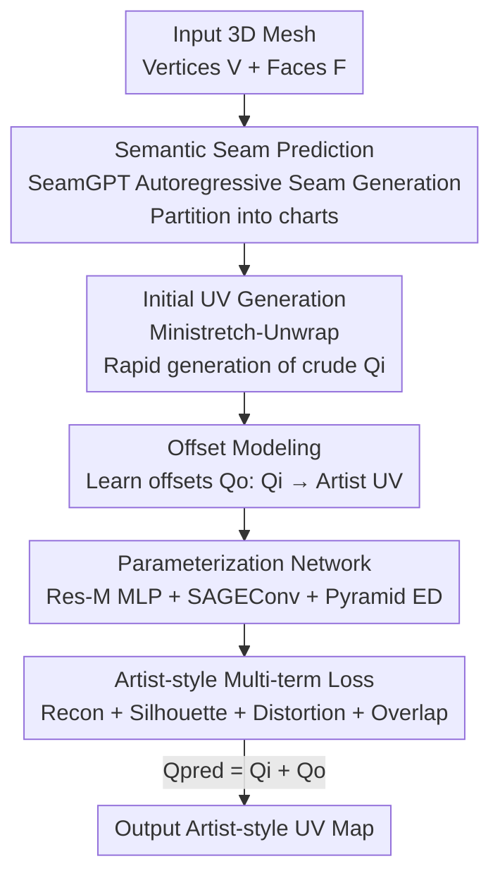

# ArtUV: Artist-style UV Unwrapping

**Conference**: ICLR2026  
**OpenReview**: [https://openreview.net/forum?id=LN7VQ3ed1t](https://openreview.net/forum?id=LN7VQ3ed1t)  
**Code**: TBD  
**Area**: 3D Vision  
**Keywords**: UV Unwrapping, Artist-style, Surface Seams, Autoencoder, Mesh Parameterization

## TL;DR
ArtUV automates the "manual UV unwrapping by professional artists" into an end-to-end two-stage process: first using SeamGPT to predict semantic seams, then utilizing a Graph Convolutional + Pyramid Autoencoder to regress "crude UVs" from traditional software into clean, low-distortion artist-style UV maps, outperforming Blender/Maya and even manual work in terms of distortion, utilization, and speed.

## Background & Motivation
**Background**: UV unwrapping (parameterization) is the fundamental task of mapping each vertex $(x,y,z)$ on a 3D mesh to 2D plane coordinates $(u,v)$, serving as the foundation for all downstream rendering stages like texture editing and light mapping. Mainstream approaches fall into three categories: top-down (finding seams on 3D surfaces to cut the mesh into charts, then unwrapping each chart with low distortion and packing them into a full UV map), bottom-up (treating the surface as discrete triangles and merging them based on energy functions), and learning-based (using cyclic mapping networks for 3D→2D→3D round-trips, trained unsupervised via physical constraints like bijectivity).

**Limitations of Prior Work**: High-quality UV maps must satisfy not only basic criteria like "no overlap and low distortion," but also high-level artist standards—clean boundaries, high space utilization, and semantic coherence (e.g., limbs and torso in a character model should be separate for easier texturing). However, existing methods have major drawbacks: top-down requires experienced artists to manually set seams and move UV islands, which is time-consuming; bottom-up discrete-clustering naturally produces fragmented UV maps with messy islands; learning-based methods require long per-scene training and often rely on point cloud inputs, which destroys topological relationships between vertices and results in chaotic, overlapping, and nearly unusable outputs.

**Key Challenge**: Both bottom-up and learning-based methods lack semantic awareness and cannot produce layouts that align with artist intuition. Meanwhile, traditional top-down methods rely on humans to fix semantic seams and clean up layouts. Essentially, there is a gap between "automation" and "artist-grade quality"—automated methods are not aesthetically pleasing, and aesthetically pleasing methods are not automated.

**Goal**: Develop a fully automatic, end-to-end UV unwrapping method that produces results in seconds while satisfying artist standards for semantic coherence, neatness, and low distortion. The authors decompose this into two sub-problems: 1) how to automatically generate semantically reasonable seams; 2) how to automatically "repair" crude UVs from traditional software into an artist style.

**Key Insight**: Rather than forcing a network to learn the difficult 3D→2D mapping from scratch (which the authors found hard to master even with ground truth), it is better to mimic the actual artist workflow—first use existing optimization methods to quickly generate an initial UV, then let the model only learn "how an artist would fine-tune this initial map," i.e., learning the **offsets** between the initial UV and the artist UV.

**Core Idea**: Model artist-style UV unwrapping as "learning vertex-wise offsets from initial UV to artist UV," combined with SeamGPT for semantic seam provision, forming an end-to-end pipeline of "semantic seams + offset regression."

## Method

### Overall Architecture
ArtUV replicates the two-stage artist workflow: **Surface Seam Prediction** and **Artist-style UV Parameterization**. The input is a 3D mesh $M$ (vertex set $V\in\mathbb{R}^{N\times3}$, face set $F\in\mathbb{R}^{M\times3}$), and the output is an artist-style UV map ready for 2D editing.

In the first stage, SeamGPT predicts semantically meaningful seams on the mesh surface, cutting the mesh into several charts. In the second stage, each chart first uses optimization methods like Ministretch-Unwrap to quickly generate a crude initial UV map $Q_i$. This initial UV, along with mesh information, is fed into the ArtUV parameterization module (an autoencoder). Instead of directly predicting final coordinates, the module predicts the **offsets** $Q_o$ required for each vertex. The final UV is $Q_{pred}=Q_i+Q_o$. This process preserves topology and ensures semantic consistency, producing UV maps ready for professional rendering pipelines.

### Key Designs

**1. SeamGPT Semantic Seam Prediction: Modeling "Where to Cut" as Autoregressive Sequence Generation**

The first step of UV unwrapping is seam cutting. Fragmentation and lack of semantics are common issues in automated methods—if the cut is wrong, the unwrap will be poor regardless. ArtUV replicates SeamGPT: formalizing surface cutting as a sequence prediction problem. Seam vertices are spatially sorted and quantized, with each token representing a coordinate value; six consecutive tokens define a seam segment. Specifically, point clouds are sampled on vertices and edges of the input mesh and compressed into a latent shape condition via a point cloud encoder. Then, an hourglass-shaped autoregressive decoder stacks multiple Transformers per layer, with intermediate layers bridged by causal downsampling/upsampling, to autoregressively output coordinate tokens from SOS to EOS. Finally, the discrete tokens are projected to the nearest points on the mesh surface to obtain seam vertices. Compared to treating seams as point-wise binary classification, autoregressive "next seam point" modeling mimics professional workflows and provides semantically reasonable cuts for both artist-made and AI-generated meshes.

**2. Offset Modeling: Learning the Artist's "Fine-tuning" instead of 3D→2D Mapping**

Directly learning the mapping $M \to P \in [0, 1]$ from all mesh information $I_M=\{V, F, N, C, D\}$ (vertices, faces, normals, degree, curvature) is difficult. The authors explicitly state that even with ground truth, learning this mapping is a hard task, and simple projection is not the goal—the goal is a clean, low-distortion, artist-style map. Therefore, ArtUV borrows from the top-down workflow, using the initial UV map $Q_i$ generated by optimization methods as initialization. This is merged into the input $I=I_M \cup Q_i$, allowing the model to only learn "how much each vertex should move when an artist manually adjusts it," i.e., predicting the offset $Q_o$, calculated as $Q_{pred} = Q_i + Q_o$. This reduces a difficult generation problem into a residual regression problem with a good initial solution, ensuring stability while focusing on the truly hard task of "tuning to artist style."

**3. Parametric Network (Res-M MLP + SAGEConv + Pyramid ED): Balancing Input Importance, Local Topology, and Global Structure**

To adjust initial UVs to artist style, the network must account for three factors: input importance, local consistency of neighboring vertices, and global layout structure. The network consists of three parts. **Res-M MLP** (Residual MLP) performs importance-based adaptive dimension mapping, dynamically allocating feature dimensions according to the observed importance of inputs in UV tasks ($Q_i > V > C = N = D$; initial UV, vertices, and curvature/normals/degree are mapped to 128, 62, and 32/32/32 respectively). The residual structure enhances representation while preserving key input information. **SAGEConv**: Constructing a graph with vertices as nodes and face adjacency as edges, GCN is used for local feature propagation, maintaining topological consistency—something point-cloud methods fail to do, leading to topological chaos. **Pyramid ED** (Encoder-Decoder): The encoder uses stacked attention layers for global vertex interaction, followed by a coarse-to-fine decoder that extracts both global structure and local details, finally predicting the UV space offset $Q_o$.

**4. Artist-style Multi-term Loss: Encoding "Neatness, Low Distortion, and No Overlap" into the Objective**

Artist standards are subjective, so the authors decompose them into four weighted differentiable terms: $L_{total}=\omega_r L_{recon}+\omega_s L_{silhouette}+\omega_d L_{distortion}+\omega_o L_{overlap}$. The **Reconstruction Loss** $L_{recon}=\lVert Q_{gt}-Q_{pred}\rVert_1$ directly measures the coordinate difference, but before calculation, the initial coordinates $Q_i$ and ground truth $Q_{gt}$ must be aligned in rotation space using the Horn method: computing the covariance matrix $W=\sum_{i=1}^{N}(q_i-\bar q)\cdot(p_i-\bar p)$, performing SVD for $W=U\Sigma V^T$, constructing $S=\mathrm{diag}(1,\ \mathrm{sign}(\det(U)\det(V^T)))$, and obtaining the optimal rotation $R=USV^T$ to avoid penalizing overall rotation differences. The **Silhouette Loss** $L_{silhouette}=\lVert \text{Render}_{gt}-\text{Render}_{pred}\rVert_2$ uses differentiable rendering of UV silhouettes and L2 distance, forcing the model to focus on boundary information reflecting UV island neatness. The **Distortion Loss** calculates the Jacobian of the 3D→2D mapping for each face and uses SVD singular values $\sigma_1, \sigma_2$ to measure stretch: $L_{distortion}=\frac{1}{\sum_{f\in F}|A_f|}\sum_{f\in F}|A_f|\,\lVert\sigma_1^f-\sigma_2^f\rVert_1$, which tends to 0 under ideal conformal mapping. The **Overlap Penalty** captures the observation that "overlapping faces have flipped normals in the UV domain," penalizing faces with negative normals: $L_{overlap}=\sum_{f\in F}(n_f\cdot\vec z<0)$.

### Loss & Training
Weights $\omega_r, \omega_s, \omega_d, \omega_o$ are set to $1.0, 1.0, 0.0001, 0.01$. The initial UV uses Blender's ministretch algorithm. Res-M MLP is followed by 5 layers of SAGEConv yielding 512-dim features, then an 8-head 8-layer attention encoder. The coarse-to-fine decoder uses 1/2 and 1/4 downsampling, and the final output layer uses Tanh to map UV coordinates to $[-1,1]$. The model was trained on 24 H20 (96 GB) GPUs with a batch size of 32 for 700K steps; inference for models under 1000 faces stays below 10 GB VRAM, runnable on consumer GPUs.

## Key Experimental Results

### Main Results
Evaluated on the ArtUV-200K benchmark (100 diverse 3D models with manual seam labels) against professional modeling software. Manual seams were used for all methods to isolate parameterization quality. Distortion is the average conformal energy; utilization is optimized via the UVPackMaster plugin:

| Dataset | Metric | Ours | Prev. SOTA | Description |
| :--- | :--- | :--- | :--- | :--- |
| ArtUV-200K | Distortion ↓ | **9.52** | 9.66 (Maya) | Lower than all software and manual work |
| ArtUV-200K | Utilization (%) ↑ | **72.57** | 70.08 (Manual) | Significantly exceeds software and manual work |
| ArtUV-200K | Artist Rating ↑ | **4.22** | 4.12 (Manual) | Score out of 5 from 30 professional artists; slightly exceeds manual work |

On the FAM benchmark (no seam info, testing full e2e pipeline) against XAtlas / Nuvo / FAM:

| Dataset | Metric | Ours | Comparison | Description |
| :--- | :--- | :--- | :--- | :--- |
| FAM | Distortion ↓ | **8.91** | 9.44 (XAtlas) / 32.24 (Nuvo) / 76.28 (FAM) | Lowest |
| FAM | Runtime (s) ↓ | **36** | 80.4 / 2925.8 / 5656.3 | Nuvo/FAM are slow due to per-model training |
| FAM | # Fragments ↓ | 14 | 1292 (XAtlas) | XAtlas is overly fragmented/lacks semantics |

### Ablation Study
Removing the four losses one by one:

| Configuration | Key Metrics | Description |
| :--- | :--- | :--- |
| Full model | Distortion 9.52 / Overlap 0.0% / Utilization 72.57 / Artist 4.12 | Full model |
| w/o Distortion Loss | Distortion 10.56 | Unreasonable internal coordinates; distortion increases |
| w/o Overlap Loss | Overlap 29.0% | Large number of flipped overlapping faces; messy UV |
| w/o Silhouette Loss | Utilization 64.33 / Artist 3.67 | Boundaries unoptimized; utilization and artist score both drop |

### Key Findings
- Overlap loss is most "immediate": flipped overlapping faces dropped from 29.0% to 0.0% after its addition, proving the "normal flip" observation is accurate.
- Silhouette loss controls both utilization (64.33→72.57) and artist perception (3.67→4.12), confirming clean boundaries are a key perceptible signal of "artist style."
- ArtUV achieves a balance between distortion and neatness that even manual work struggles with: distortion is lower than manual (9.52 vs 10.90) with higher utilization.

## Highlights & Insights
- **"Learning offsets rather than mapping" is the core efficiency gain**: Using existing optimization solutions as initialization and only regressing residual offsets reduces a difficult generation task to a fine-tuning problem with good priors. This approach is transferable to any task where traditional solutions exist but need "styling" (e.g., layout optimization, mesh repair).
- **Normal flipping as an overlap signal is clever**: It avoids expensive geometric intersection detection; simply counting "faces with negative normals in the UV domain" provides a simple, differentiable penalty for overlaps.
- **GCN preserves topology vs Point Clouds destroy it**: Constructing graphs with face adjacency and using SAGEConv for local propagation specifically addresses the root cause of why learning methods based on point clouds produce tangled overlaps.
- **Differentiable Silhouette Loss quantifies "neatness"**: Boundary neatness is subjective; by rendering UV silhouettes and calculating L2, the artist's aesthetic intuition becomes an optimizable objective.

## Limitations & Future Work
- **Highly sensitive to seam quality**: As the authors admit, incomplete or inaccurate seams introduce severe distortion during UV initialization; even if output boundaries are clean, the interior may be deformed—a cost of the two-stage serial pipeline.
- **No support for UV island reuse**: If reused islands are not perfectly aligned, they produce severe overlapping artifacts, and adding this functionality would increase training complexity.
- **Personal note**: The artist rating depends on 30 artists scoring 10 representative cases—the sample size is small and subjective; the "slightly exceeds manual" conclusion should be taken with caution. On the FAM benchmark, distortion varies wildly (8.91 vs 76.28), which may reflect that baseline methods themselves break down on this benchmark.
- **Future outlook**: Secondary partitioning for high-distortion regions to improve seam quality; integrating island reuse by merging similar optimized islands.

## Related Work & Insights
- **vs Optimization-based (LSCM / ABF++ / SLIM / SCAF / OptCuts)**: These rely on energy minimization for parameterization. They either need predefined seams or optimize seams and parameterization jointly, often resulting in fragmentation or lack of realism. ArtUV uses learning-based offset regression to directly incorporate "neatness + semantics."
- **vs Learning-based (Nuvo / FAM)**: Nuvo uses multi-class networks for segmentation and parameterization; FAM uses physics-inspired sub-networks for bi-directional mapping. Both lack semantics and require long per-scene training; FAM's point cloud approach also destroys topology. ArtUV is generalizable, topology-preserving, and yields results in seconds.
- **vs SeamGPT**: ArtUV directly reuses SeamGPT for semantic seam prediction as a first-stage plugin, focusing its contribution on the second-stage artist-style parameterization.

## Rating
- **Novelty**: ⭐⭐⭐⭐ The combination of "learning offsets" and decoupled seam/parameterization is very solid engineering; individual components are clever assemblies of existing tech.
- **Experimental Thoroughness**: ⭐⭐⭐⭐ Comprehensive comparison against professional software, SOTA algorithms, and manual work plus full ablation; artist rating sample size is the only minor weakness.
- **Writing Quality**: ⭐⭐⭐⭐ Clear chain of motivation-method-experiment with complete formulas and architecture diagrams.
- **Value**: ⭐⭐⭐⭐⭐ UV unwrapping is a core rendering pipeline requirement usually handled manually; e2e artist-style UVs in seconds have high industrial value.

<!-- RELATED:START -->

## Related Papers

- [\[CVPR 2026\] Mesh-Pro: Asynchronous Advantage-guided Ranking Preference Optimization for Artist-style Quadrilateral Mesh Generation](../../CVPR2026/3d_vision/mesh-pro_asynchronous_advantage-guided_ranking_preference_optimization_for_artis.md)
- [\[ICCV 2025\] Tune-Your-Style: Intensity-Tunable 3D Style Transfer with Gaussian Splatting](../../ICCV2025/3d_vision/tune-your-style_intensity-tunable_3d_style_transfer_with_gaussian_splatting.md)
- [\[CVPR 2026\] MeshRipple: Structured Autoregressive Generation of Artist-Meshes](../../CVPR2026/3d_vision/meshripple_structured_autoregressive_generation_of_artist-meshes.md)
- [\[CVPR 2026\] PackUV: Packed Gaussian UV Maps for 4D Volumetric Video](../../CVPR2026/3d_vision/packuv_packed_gaussian_uv_maps_for_4d_volumetric_video.md)
- [\[CVPR 2026\] MV2UV: Generating High-quality UV Texture Maps with Multiview Prompts](../../CVPR2026/3d_vision/mv2uv_generating_high-quality_uv_texture_maps_with_multiview_prompts.md)

<!-- RELATED:END -->
