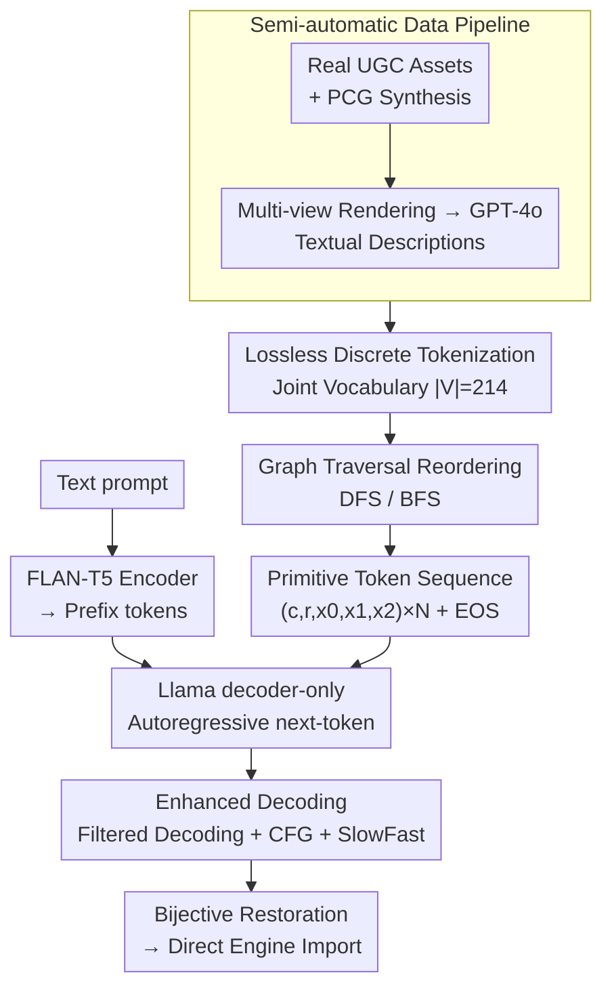

# AssetFormer: Modular 3D Assets Generation with Autoregressive Transformer

**Conference**: ICLR 2026  
**arXiv**: [2602.12100](https://arxiv.org/abs/2602.12100)  
**Code**: [https://github.com/Advocate99/AssetFormer](https://github.com/Advocate99/AssetFormer)  
**Area**: LLM/NLP  
**Keywords**: 3D generation, autoregressive transformer, modular assets, UGC, Llama, text-to-3D  

## TL;DR

AssetFormer is an autoregressive Transformer based on the Llama architecture that models modular 3D assets (composed of primitive sequences) as discrete token sequences. By utilizing DFS/BFS graph traversal reordering and joint vocabulary decoding, it generates modular 3D assets directly compatible with game engines from text descriptions.

## Background & Motivation

3D asset generation is a core requirement for UGC (User Generated Content) and the gaming industry. While mainstream 3D generation methods (e.g., NeRF, 3D Gaussian Splatting, or direct mesh generation) have improved visual quality, several critical issues remain:

1.  **Incompatibility with existing workflows**: Generated 3D content is often holistic meshes or implicit representations, making it difficult to edit, split, or reorganize in game engines without significant post-processing.
2.  **Lack of modular structure**: In real-world game development, 3D scenes and objects are typically assembled from standardized modular components (blocks). Current methods struggle to produce such structured assets.
3.  **Difficulty in discrete attribute modeling**: Each primitive in a modular asset has mixed attributes like class, rotation, and position, which are discrete and subject to structural constraints—properties that traditional continuous generation methods handle poorly.

The core insight of AssetFormer is: **Since modular 3D assets are essentially sequences of primitives with discrete attributes, why not directly model them using the mature autoregressive Transformers from the NLP field?**

## Core Problem

How to transform the modular 3D asset generation problem into a sequence-to-sequence modeling task, enabling an autoregressive Transformer to efficiently generate valid 3D assets composed of discrete primitives from text descriptions?

## Method

### Overall Architecture

AssetFormer treats modular 3D assets as sequences of primitives (blocks) with discrete attributes, generating them token-by-token using a Llama-based decoder-only Transformer. An asset consists of $N$ primitives, where the $j$-th primitive is denoted as $P_j=(c_j, r_j, \bm{x}_j)$: class $c_j$ (selected from 25 predefined blocks), rotation $r_j$ around the vertical axis (4 discrete angles), and position $\bm{x}_j=(x_0,x_1,x_2)$ (integer coordinates on a 3D grid). Each primitive occupies 5 tokens, flattening the asset into a discrete sequence of length $5N$ (plus an `<EOS>`).

The pipeline consists of three stages: First, a semi-automatic data pipeline collects "modular asset-text" pairs. Second, each asset undergoes lossless tokenization and reordering via spatial adjacency graph traversal. Finally, text prompts encoded by FLAN-T5 serve as prefix conditions for the Llama backbone (using 1D RoPE and standard next-token cross-entropy). During inference, validity is maintained via filtered decoding, consistency is improved via CFG, and speed is enhanced via SlowFast decoding. The resulting sequence is bijectively mapped back into assets ready for game engines.

### Key Designs

**1. Semi-automatic data pipeline: Bridging the text-annotation gap**

Most modular 3D asset libraries are private, resulting in a lack of public "asset-text" pairs. The authors collected real player-built home assets from a UGC platform and mapped them to 25 base primitives. These were supplemented with Procedural Content Generation (PCG) data, resulting in a dataset of 16,000 real and 4,000 synthetic assets. For text annotation, each asset was rendered from fixed views and processed by GPT-4o to generate descriptive phrase bags (e.g., "apartment, multi-story, flat roof"). Ablation shows these data sources are complementary: using only synthetic data yielded an FID of 113.560, while the mixed dataset reduced it to 55.186.

**2. Lossless Discrete Tokenization & Joint Vocabulary Filtered Decoding**

Instead of training a VQ-VAE codebook, AssetFormer leverages the inherent discrete nature of modular assets. Each attribute (class, rotation, and three coordinates $\mathcal{X}_0,\mathcal{X}_1,\mathcal{X}_2$) is bijectively mapped to a token. The joint vocabulary is formed by combining these: $\mathcal{V}=\mathcal{C}\vee\mathcal{R}\vee\mathcal{X}_0\vee\mathcal{X}_1\vee\mathcal{X}_2\vee\{\texttt{<EOS>}\}$, with $|\mathcal{V}|=214$. During inference, **filtered decoding** dynamically masks tokens that do not belong to the current attribute type (e.g., masking position tokens when the model should generate rotation), ensuring every generated sequence is valid and reconstructible.

**3. Graph Traversal Token Reordering: Spatial-to-Sequence Adjacency**

Unlike text or images, 3D assets lack a natural sequence order. The authors construct an adjacency graph based on primitive connections and use DFS or BFS traversal from a base corner to determine the order $\mathcal{A}=\{\tau_0,\dots,\tau_{n-1}\}$. This ensures that spatially adjacent primitives are also close in the sequence. Experiments show DFS (FID 55.186) slightly outperforms BFS (61.620), while raw ordering (65.215) or image-centric randomization (RAR, 83.561) perform significantly worse, highlighting the importance of spatial locality for 3D structure.

**4. CFG and SlowFast Decoding: Improving Consistency and Speed**

AssetFormer adapts Classifier-Free Guidance (CFG) for autoregressive generation, calculating:
$$l_{cfg}=l'+s\cdot(l-l')$$
where $s=2.0$ balances text alignment and diversity. Additionally, **SlowFast decoding** (speculative decoding) is introduced: a small draft model (AssetFormer-S, 87M) predicts simple, regular tokens rapidly, while the larger model (AssetFormer-B, 312M) verifies them and handles complex spatial reasoning.

## Key Experimental Results

### Main Results (vs. PCG Baseline)

- Metrics: FID (500 fixed-view renders vs. training set) and CLIP score.
- Top-k sampling (FID **55.186**) outperformed greedy (63.351) and beam search (63.333). The PCG baseline only achieved 108.476, as it failed to cover complex asset distributions.
- Compared to general 3D methods (SF3D, Trellis, etc.) that output dense meshes with texture artifacts, AssetFormer produces editable structures with clean, mapped textures.

### Ablation Study

- **Token Order**: DFS (**55.186**) > BFS (61.620) > Raw Order (65.215). RAR (Randomization) performed worst (83.561), indicating that 3D structural learning relies on consistent spatial orientation.
- **Data Source**: Real-only FID was 63.381, Synthetic-only was 113.560, while mixed data achieved **55.186**. Synthetic data provides structural "scaffolding," while real data adds diversity.
- **CFG**: Significantly improves text-3D consistency with an optimal guidance scale $s=2.0$.

## Highlights & Insights

1.  **Effective Formalization**: Transforming modular 3D generation into discrete sequence modeling leverages mature LLM technology.
2.  **Lossless Representation**: Avoids compression losses inherent in VQ-VAE by using a bijective mapping between attributes and tokens.
3.  **Graph Traversal Reordering**: A simple yet effective design that integrates spatial topology (adjacency) into 1D autoregressive modeling.
4.  **Filtered Decoding**: Elegantly handles structural constraints of multi-attribute data through dynamic vocabulary masking.
5.  **Practical Utility**: High engineering value as generated assets are immediately editable and deployable in industrial pipelines.

## Limitations & Future Work

1.  **Fixed Primitive Library**: Limited to a predefined set of components; cannot generate entirely new base primitives.
2.  **Texture and Material**: Focuses on geometry; visual attributes like lighting and PBR maps are not yet integrated.
3.  **Scale Constraints**: Token sequence length scales linearly with primitive count, potentially limiting the generation of massive 3D scenes.
4.  **Evaluation Metrics**: Conventional 2D/3D metrics (FID/CLIP) may not fully capture the quality of modular, structured assets.

<!-- RELATED:START -->

## Related Papers

- [\[ICLR 2026\] QuadGPT: Native Quadrilateral Mesh Generation with Autoregressive Models](quadgpt_native_quadrilateral_mesh_generation_with_autoregressive_models.md)
- [\[CVPR 2026\] Repurposing 3D Generative Model for Autoregressive Layout Generation](../../CVPR2026/3d_vision/repurposing_3d_generative_model_for_autoregressive_layout_generation.md)
- [\[CVPR 2026\] MeshRipple: Structured Autoregressive Generation of Artist-Meshes](../../CVPR2026/3d_vision/meshripple_structured_autoregressive_generation_of_artist-meshes.md)
- [\[CVPR 2026\] ARMFlow: AutoRegressive MeanFlow for Online 3D Human Reaction Generation](../../CVPR2026/3d_vision/armflow_autoregressive_meanflow_for_online_3d_human_reaction_generation.md)
- [\[CVPR 2026\] MajutsuCity: Language-driven Aesthetic-adaptive City Generation with Controllable 3D Assets and Layouts](../../CVPR2026/3d_vision/majutsucity_language-driven_aesthetic-adaptive_city_generation_with_controllable.md)

<!-- RELATED:END -->
## Related Papers

- [\[ICLR 2026\] QuadGPT: Native Quadrilateral Mesh Generation with Autoregressive Models](quadgpt_native_quadrilateral_mesh_generation_with_autoregressive_models.md)
- [\[CVPR 2026\] Repurposing 3D Generative Model for Autoregressive Layout Generation](../../CVPR2026/3d_vision/repurposing_3d_generative_model_for_autoregressive_layout_generation.md)
- [\[ICLR 2026\] Spiking Discrepancy Transformer for Point Cloud Analysis](spiking_discrepancy_transformer_for_point_cloud_analysis.md)
- [\[CVPR 2026\] MeshRipple: Structured Autoregressive Generation of Artist-Meshes](../../CVPR2026/3d_vision/meshripple_structured_autoregressive_generation_of_artist-meshes.md)
- [\[CVPR 2026\] ARMFlow: AutoRegressive MeanFlow for Online 3D Human Reaction Generation](../../CVPR2026/3d_vision/armflow_autoregressive_meanflow_for_online_3d_human_reaction_generation.md)

<!-- RELATED:END -->
