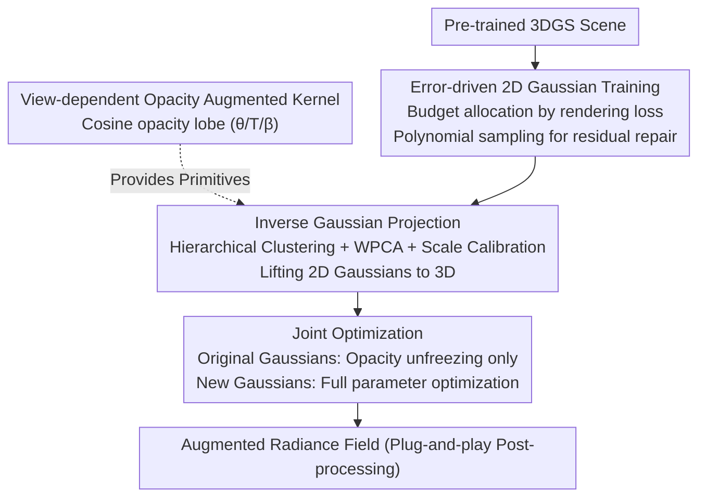

# Augmented Radiance Field: A General Framework for Enhanced Gaussian Splatting

**Conference**: ICLR 2026  
**arXiv**: [2602.19916](https://arxiv.org/abs/2602.19916)  
**Code**: [https://xiaoxinyyx.github.io/augs](https://xiaoxinyyx.github.io/augs)  
**Area**: 3D Vision  
**Keywords**: 3D Gaussian Splatting, Radiance Field Enhancement, View-dependent Opacity, Specular Modeling, Inverse Gaussian Projection  

## TL;DR
This paper proposes the Augmented Radiance Field (AugS) framework, which explicitly models specular components by designing augmented Gaussian kernels with view-dependent opacity. It introduces an error-driven compensation strategy (2D Gaussian initialization → inverse projection to 3D → joint optimization) as a plug-and-play post-processing step to enhance existing 3DGS scenes. It outperforms SOTA NeRF methods on several datasets while capturing complex lighting using only second-order Spherical Harmonics (SH).

## Background & Motivation

**Background**: 3D Gaussian Splatting (3DGS) has become a mainstream method for radiance field reconstruction due to its real-time rendering performance. However, it uses third-order Spherical Harmonics (SH) to encode color, which inherently fails to decouple diffuse and specular components.

**Limitations of Prior Work**: Low-order SH can only capture smooth color variations and cannot reproduce sharp specular highlights on glossy surfaces. Increasing the SH order leads to exponential memory growth, training instability, and diminishing returns (e.g., 4th-order SH provides only a 0.08dB PSNR gain over 3rd-order). Furthermore, SH is defined globally over the sphere, whereas surface Gaussians are typically only visible in the outward-facing hemisphere, leading to significant domain waste.

**Key Challenge**: Specular highlights are sparsely distributed and highly view-dependent. Assigning additional parameters to all Gaussian primitives to model specular components causes massive redundancy. Moreover, existing methods cannot supplement specular modeling capabilities directionally without disrupting already optimized scenes.

**Key Insight**: Inspired by the Phong shading model, this paper designs a new Gaussian kernel with view-dependent opacity to specifically model specular components. Through an error-driven compensation strategy, augmented Gaussians are adaptively inserted only in regions with high reconstruction errors, achieving explicit diffuse/specular decoupling.

**Core Idea**: Superimpose augmented Gaussian kernels with cosine-weighted opacity lobes to reconstruct complex specular highlights, combined with a 2D→3D inverse projection initialization strategy to accurately locate regions requiring enhancement.

## Method

### Overall Architecture
This work addresses the long-standing issue where 3DGS fails to separate diffuse and specular components due to SH color encoding. Instead of rebuilding the scene, it performs post-processing enhancement on a pre-trained 3DGS. The pipeline follows three steps: first, 2D Gaussians are trained in the image space of each rendered view to repair residuals, specifically targeting high-error areas; second, these optimized 2D Gaussians are back-projected into world coordinates via inverse Gaussian projection to initialize new 3D Gaussians; finally, these new Gaussians with "view-dependent opacity" are jointly optimized with the original scene Gaussians. These augmented kernels, featuring an "opacity lobe," specialize in specular components. Since they are superimposed on the original scene, this process is a plug-and-play extension for any splatting-based framework.

### Key Designs

**1. View-dependent Opacity: Making a kernel "light up" only at specific angles**

The difficulty of specular highlights lies in their sparse and highly view-dependent distribution. Adding parameters to all Gaussians is redundant. Borrowing from Phong shading, the augmented Gaussian is designed with an opacity lobe that decays with the viewing angle: $\hat{\alpha}(\theta,\beta,T,\alpha)=\alpha\cdot\left(\frac{\cos(\max(0,\min(\theta/T,\pi)))+1}{2}\right)^{\exp(\beta)}$, where $\theta$ is the angle between the current view direction and the lobe center, $T$ controls the angular span, and $\beta$ controls sharpness. A half-period cosine function is used instead of a standard Phong sharp lobe for smoother gradients and more stable training. A key property is that opacity decays to zero as the view deviates from the lobe direction, allowing an augmented Gaussian to target a specific specular view without contaminating others—costing only 5 learnable parameters per kernel (3D lobe direction + $T$ + $\beta$).

**2. Error-driven 2D Gaussian Training: Spending limited budget where reconstruction is worst**

To achieve "directional specular supplementation," the model must identify poorly reconstructed areas. After standard 3DGS training, additional 2D Gaussians are superimposed on each rendered image, treating the current rendering as a fixed background to optimize these 2D Gaussians for residual repair. Budget allocation is error-driven: the number of new Gaussians per view is proportional to its rendering loss. Within a single image, placement is determined by polynomial sampling, where a pixel's selection probability is proportional to the square of its composite loss (L1 + SSIM). To obtain accurate geometry for projection, depth maps are ray-traced, using the median depth where transmittance first drops below 0.5, which is more geometrically precise than expected depth.

**3. Inverse Gaussian Projection: Precisely lifting 2D repairs back to 3D**

Since 2D Gaussians exist only in image planes, a reliable back-projection is needed to transform them into 3D. This is achieved in three steps: first, hierarchical clustering groups foreground/background points to prevent depth blending at object boundaries; second, Weighted PCA (WPCA) estimates the rotation and scale of each 3D Gaussian from local point clouds; third, a scaling factor $k$ is calibrated by minimizing the Frobenius norm to ensure the 3D covariance projection matches the original 2D Gaussian. Semantic parameters are initialized reasonably: the lobe direction is set toward the camera (assuming it handles the current specular view), $T$ is initialized adaptively based on training view density, and $\beta$ is initialized to zero for the optimizer to learn.

**4. Joint Optimization: Enhancing specular without breaking the established scene**

New Gaussians must collaborate with the original scene without drifting it. The strategy involves "unfreezing" only the opacity parameter of the original Gaussians while freezing all other attributes, while the new Gaussians undergo full parameter optimization. SparseAdam is used to update only the visible original Gaussians' opacity, and Adam is used for new Gaussians. Iterations are set to 30 times the training set size to ensure each augmented Gaussian is sampled sufficiently, avoiding under-training for specific views.

### Mechanism Example
Consider a scene from Mip-NeRF 360 with a glossy surface: after standard 3DGS training, sharp specular highlights on metal or glass might be missing. These views show high rendering loss and receive more 2D Gaussian budget. These 2D Gaussians are optimized against the background to fill the specular spots. Subsequently, they are back-projected to 3D—hierarchical clustering separates the surface from the background, WPCA provides orientation, and the lobe direction is initialized toward the camera. During joint optimization, the new 3D Gaussians learn appropriate $T$ and $\beta$, causing them to "light up" at the specular angle and decay elsewhere. Ultimately, about 10% additional Gaussians are sufficient to cover the sparse specular distribution.

## Key Experimental Results

### Main Results (Four Major Datasets)

| Method | Mip-NeRF360 PSNR↑ | SSIM↑ | Tanks&Temples PSNR↑ | Deep Blending PSNR↑ | NeRF Synthetic PSNR↑ |
|------|-------------------|-------|---------------------|--------------------|--------------------|
| 3DGS | 27.21 | 0.815 | 23.14 | 29.41 | 33.31 |
| Zip-NeRF | 28.54 | 0.828 | - | - | 33.10 |
| 3DGS-MCMC | 28.29 | 0.840 | 24.29 | 29.67 | 33.80 |
| DBS (30k) | 28.60 | 0.844 | 24.79 | 30.10 | 34.64 |
| **Ours (MCMC, sh=2)** | **28.89** | **0.848** | **25.04** | **30.33** | 34.03 |
| **Ours (MCMC, sh=3)** | **28.96** | **0.849** | **25.06** | **30.22** | 34.35 |

- Under the MCMC framework, using only 2nd-order SH (reducing 21 parameters per primitive) achieves quality comparable to 3rd-order SH.
- Comprehensively outperforms SOTA implicit methods like Zip-NeRF and explicit methods like DBS on real-world datasets.
- Slightly trails DBS on NeRF Synthetic due to simple materials and limited lighting variation in those scenes.

### Ablation Study (Mip-NeRF 360)

| Configuration | PSNR↑ | SSIM↑ |
|------|-------|-------|
| 3DGS-MCMC Baseline | 28.33 | 0.845 |
| + Supp. Gaussians (no lobe) | 28.45 | 0.847 |
| + Fixed opacity lobe (T=0.5) | 28.60 | 0.848 |
| + Fixed β=0 | 28.93 | 0.849 |
| **Full Model** | **28.96** | **0.849** |

- Simply adding Gaussians (no lobe) yields only a 0.12dB improvement.
- Optimizing $T$ and $\beta$ provides significant gains, with the full model improving 0.63dB over the baseline.

### Key Findings: Augmentation Ratio

| Ratio | Post-Aug PSNR (Mip-NeRF 360) | Post-Aug PSNR (Tanks&Temples) |
|------|---------------------------|---------------------------|
| 5% | 28.88 | 24.95 |
| **10%** | **28.96** | **25.06** |
| 15% | 28.94 | 24.99 |

- A 10% ratio is optimal; excessive augmented Gaussians introduce redundancy.

### High-Frequency Lighting Comparison

| Method | Glossy Surface PSNR↑ | Mirror-like Surface PSNR↑ |
|------|------------------|----------------------|
| DBS (sb=2) | 41.70 | 29.48 |
| **Ours (MCMC, sh=3)** | **42.33** | **29.73** |

- In high-frequency lighting and mirror-like conditions, the flexibility of opacity lobe superposition exceeds Spherical Beta functions.

## Highlights & Insights
- **New Paradigm for Diffuse/Specular Decoupling**: Instead of modifying the rendering equation or introducing environment maps, it models diffuse and specular components using different Gaussian primitive types. The separation protocol is $I_d = \min(I_{sh_0}, I_{aug})$, $I_s = I_{aug} - I_d$.
- **Plug-and-play Post-processing**: Acts as a post-processing step for optimized 3DGS scenes without retraining the entire scene, compatible with various frameworks like 3DGS and 3DGS-MCMC.
- **Inverse Projection Engineering**: The three-step process (hierarchical clustering for depth separation, WPCA for rotation, and Frobenius norm for scale) provides a robust technical solution for 2D→3D back-projection.
- **Parameter Efficiency**: Surpasses SOTA using only 2nd-order SH, saving 21 parameters per primitive, benefiting deployment on low-end hardware.

## Limitations & Future Work
- Slightly inferior performance on simple synthetic scenes (e.g., NeRF Synthetic) where the advantage of opacity lobe superposition is limited.
- Uses sRGB color space (non-linear) for training data; overexposed pixels can cause artifacts in diffuse/specular separation.
- The 10% augmentation ratio is fixed, lacking an adaptive mechanism for varying scene complexity.
- Hierarchical clustering and WPCA are executed on the CPU, which may become a bottleneck for large-scale scenes.
- Only verified on static scenes; expansion to dynamic scenes remains unexplored.

## Related Work & Insights
- **vs 3DGS**: Original 3DGS cannot separate diffuse/specular with SH; AugS explicitly models specular with augmented kernels, improving PSNR by 1.75dB on Mip-NeRF 360.
- **vs Zip-NeRF**: Outperforms SOTA implicit Zip-NeRF (28.54 PSNR) with 28.96 PSNR while maintaining real-time rendering.
- **vs DBS (Spherical Beta)**: DBS uses Spherical Beta functions to replace SH for decoupling; AugS opacity lobes offer more flexibility in complex specular scenarios through superposition.
- **vs Spec-Gaussian**: Spec-Gaussian models appearance with anisotropic Spherical Gaussians (28.18 PSNR on Mip-NeRF 360); AugS achieves better results (28.96) through directional supplementation rather than global replacement.
- **vs VoD-3DGS**: VoD-3DGS enhances the opacity representation (symmetric matrix) for every Gaussian; AugS is more parameter-efficient by inserting few augmented Gaussians only where needed.

## Rating
- Novelty: ⭐⭐⭐⭐ The view-dependent opacity design is simple yet effective, and the inverse projection strategy is novel; however, the core idea is essentially a variant of the Phong model.
- Experimental Thoroughness: ⭐⭐⭐⭐ Four standard datasets plus high-light synthetic data and detailed ablations, though comparisons with more recent methods could be added.
- Writing Quality: ⭐⭐⭐⭐ Clear mathematical derivations and informative flowcharts, though some derivations are relegated to the appendix.
- Value: ⭐⭐⭐⭐ The plug-and-play design offers strong practical value, providing a concise solution for specular modeling in 3DGS.

<!-- RELATED:START -->

## Related Papers

- [\[ICLR 2026\] Horseshoe Splatting: Handling Structural Sparsity for Uncertainty-Aware Gaussian-Splatting Radiance Field Rendering](horseshoe_splatting_handling_structural_sparsity_for_uncertainty-aware_gaussian-.md)
- [\[ICLR 2026\] Station2Radar: Query-Conditioned Gaussian Splatting for Precipitation Field](station2radar_query_conditioned_gaussian_splatting_for_precipitation_field.md)
- [\[CVPR 2025\] 3D Convex Splatting: Radiance Field Rendering with 3D Smooth Convexes](../../CVPR2025/3d_vision/3d_convex_splatting_radiance_field_rendering_with_3d_smooth_convexes.md)
- [\[ICLR 2026\] PAT3D: Physics-Augmented Text-to-3D Scene Generation](pat3d_physics-augmented_text-to-3d_scene_generation.md)
- [\[ICLR 2026\] Einstein Fields: A Neural Perspective To Computational General Relativity](einstein_fields_a_neural_perspective_to_computational_general_relativity.md)

<!-- RELATED:END -->
