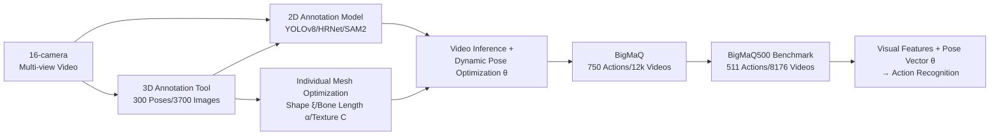

# BigMaQ: A Big Macaque Motion and Animation Dataset Bridging Image and 3D Pose Representations

**Conference**: ICLR 2026  
**OpenReview**: [https://openreview.net/forum?id=n7viYE7Xbo](https://openreview.net/forum?id=n7viYE7Xbo)  
**Code**: [https://martinivis.github.io/BigMaQ/](https://martinivis.github.io/BigMaQ/)  
**Area**: 3D Vision / Animal Pose and Shape Recovery / Action Recognition  
**Keywords**: Macaque, Multi-view MoCap, 3D Surface Mesh, Articulated Pose, Action Recognition, Non-human Primates  

## TL;DR
BigMaQ utilizes 16 calibrated cameras for markerless multi-view motion capture of real macaques, coupling "individual-specific textured 3D surface meshes + frame-wise joint rotation poses" with "ethological action labels." This constitutes the first large-scale non-human primate dataset capable of feeding generative 3D pose vectors directly into action recognition, demonstrating that adding this pose description consistently improves mAP across various vision backbones.

## Background & Motivation
- **Background**: For humans, mature 3D surface parametric models (e.g., SMPL/AMASS) and massive MoCap data allow for fine-grained descriptions of pose, shape, and individual anatomical differences. For animals, the lack of precise 3D data limits researchers to either "toy models" like SMAL with generic quadruped spaces or species-specific customizations, with behavior studies mostly confined to 2D keypoints.
- **Limitations of Prior Work**: Mesh-based tracking for non-human primates (NHPs)—especially macaques, the closest relatives to humans and critical models in neuroscience—lags significantly behind other species. Existing macaque datasets provide either sparse 2D/3D keypoints (OpenMonkeyStudio, MacaquePose) or action labels without poses (MacaqueMotionMonitor). No dataset combines accurate 3D body shapes with action recognition.
- **Key Challenge**: Sparse keypoints fail to capture the richness of motion dynamics (e.g., hand rotation, subtle postures in social interaction). Training behavior recognition and pose estimation as decoupled tasks ignores the fact that pose itself is a strong behavioral cue, a fact validated as SOTA in human action recognition.
- **Goal**: To fill this gap by providing dynamic, realistic, and individual-specific 3D surface reconstructions for macaques, and to **directly integrate** this generative pose representation into action recognition learning.
- **Core Idea**: **Dual contribution of "Dataset + Representation"**. On one hand, the work extends existing animal surface tracking methods by using artist-created high-precision macaque template meshes adapted to each subject to produce more accurate frame-wise poses than existing SOTA. On the other hand, joint rotation vectors $\theta$ are concatenated as additional features to the image/video encoder outputs, verifying that **3D generative pose parameters (rather than 2D/3D keypoint coordinates)** are key to lifting recognition performance.

## Method

### Overall Architecture
The pipeline consists of four steps: 1) Recording spontaneous macaque behavior with 16 calibrated cameras; 2) Training detection, keypoint, and segmentation models to generate 2D annotations; 3) Optimizing individual-specific template meshes against multi-view videos via differentiable rendering to obtain frame-wise 3D poses and shapes; 4) Concatenating pose vectors with visual features to train action recognition, selecting a high-quality subset, BigMaQ500, as the benchmark.

### Key Designs

**1. Individual-specific Rigged Surface Meshes: From Generic Templates to "This Monkey".** Unlike the generic quadruped shape space of SMAL, this work uses a high-precision macaque template (10,632 vertices for high-poly / 3,625 for low-poly) driven by $N_J=115$ joints via Linear Blend Skinning (LBS). Pose parameters $\theta\in\mathbb{R}^{3N_J}$ define the rotation of each joint relative to its parent in axis-angle format. Final vertices are obtained via global rotation $R$, scale $\gamma$, and translation $t$:

$$V_P = \gamma \cdot R \cdot \mathrm{LBS}(\theta; V, J, W) + t.$$

Crucially, **learnable bone lengths $\alpha$ and vertex offsets $\xi$** are introduced to adapt the template to individual anatomical differences, allowing higher accuracy than fixed-template methods like MAMMAL and the ability to distinguish between individuals.

**2. Composite Alignment Objectives under Differentiable Rendering: Keypoint + Silhouette Constraints.** Post-posed meshes are projected onto calibrated camera views using differentiable rendering to obtain predicted keypoints and silhouettes. The composite objective is optimized per frame:

$$L(\Theta) = \lambda_P L_P + \lambda_b L_b + \lambda_{sm} L_{sm} + \sum_{\text{cam } c}\big(\lambda_{kp} L^c_{kp} + \lambda_{sil} L^c_{sil}\big),$$

where $L_P$ penalizes extreme rotations, $L_b$ constrains bone lengths, $L_{sm}$ ensures smooth vertex deformation, and $L_{kp}$/$L_{sil}$ align the mesh to multi-view keypoints and SAM 2 silhouettes. Keypoints provide stronger constraints than silhouettes, making keypoint prediction errors the primary factor in final alignment quality.

**3. Temporal Consistency + Cropped Rendering for Scalability.** To process 12k videos, the authors avoid fitting on full-resolution frames. Instead, they use YOLOv8 to crop images to a maximum side length of 100 pixels and process by camera batches. **Temporal losses** are added: angular velocity for rotations (minimizing angular speed rather than Euclidean distance) and finite differences in Euclidean space for translations:

$$L_{ang} = \frac{1}{(T-1)J}\sum_{n=1}^{T-1}\sum_{j=1}^{J}\big\|\omega^{(n)}_j\big\|_2^2,\qquad L_T = L_{ang}(\theta_{:T}) + L_{ang}(r_{:T}) + \frac{1}{T-1}\sum_{n=1}^{T-1}\big\|t^{(n+1)}-t^{(n)}\big\|_2^2.$$

The practical implementation uses 6 cameras, batches of 80 frames with 10-frame overlaps, and texture optimization to scale the "individual mesh to per-action pose" optimization across the dataset.

**4. Per-vertex Photometric Textures: Enabling Arbitrary Re-rendering.** Each vertex is assigned an RGB color vector $C\in\mathbb{R}^{N_V\times 3}$. Photometric error is minimized within the foreground mask via differentiable rendering $\hat I^{(c)}=\mathcal{R}(\Pi_c, V_P, F, C, \ell)$: $L_{phot}=\sum_{p\in\Omega} S^{(c)}(p)\big(\hat I^{(c)}(p)-I^{(c)}(p)\big)^2$, with colors constrained to $[0,255]$ using a scaled sigmoid. This provides each monkey with a colorized, animatable avatar (BigMaQ-C) for controlled stimuli generation in neuroscience.

## Key Experimental Results

### Main Results: Action Recognition (Table 4, mAP)
On BigMaQ500 (511 actions / 8,176 videos), concatenating the pose vector $\theta$ significantly boosts mAP across all visual backbones. The pose-only stream is a strong baseline (43.5).

| Visual Model | Feature | mAP | mAP_L | mAP_OI | mAP_SI | mAP_O |
|---|---|---|---|---|---|---|
| — | Pose | 43.5±1.4 | 57.3 | 54.4 | 28.7 | 47.4 |
| ResNet50 | Vis | 34.3±0.5 | 50.9 | 38.6 | 22.2 | 35.9 |
| ResNet50 | Vis+Pose | **44.0±0.8** | 58.1 | 53.7 | 28.8 | 48.5 |
| ViT-base-cls | Vis | 32.9±0.7 | — | — | — | — |
| ViT-base-cls | Vis+Pose | **44.0±0.1** | 60.6 | 50.2 | 29.9 | 47.1 |
| DINOv2-base | Vis | 40.4±1.7 | — | — | — | — |
| DINOv2-base | Vis+Pose | 41.4±1.7 | 59.5 | 51.4 | 27.5 | 42.0 |
| TimeSformer | Vis | 31.9±1.2 | — | — | — | — |
| TimeSformer | Vis+Pose | 42.6±1.3 | 62.9 | 49.6 | 29.6 | 41.9 |
| VideoPrism-base | Vis | 38.3±0.2 | — | — | — | — |
| VideoPrism-base | Vis+Pose | 43.8±2.9 | 60.9 | 51.1 | 29.7 | 46.3 |

### Surface Reconstruction Comparison (Table 2/3)
Ours outperforms MAMMAL and AniMer+ in IoU, MPJPE (mm), and MPJTD (mm/frame).

| Metric | BigMaQ (Ours) | MAMMAL | AniMer+ |
|---|---|---|---|
| Per-frame IoU↑ (Single sub. mean, Table 3) | **0.844** | 0.714 | 0.591 |
| Per-frame MPJPE↓ [mm] | **26.907** | 31.661 | — |
| Sequence MPJPE↓ [mm] (Table 2 Walk) | **20.402** | 23.493 | — |
| Sequence MPJTD↓ [mm/frame] (Walk) | **6.875** | 9.961 | — |

AniMer+ (SMAL extension) often fits macaques as entirely different species like lions. MAMMAL aligns more reasonably but misses individual differences and yields lower quality.

### Ablation Study: Pose Representation (Table 5, overall mAP)
Comparing 2D/3D keypoints, mesh vertices, and joint rotation matrices, **rotation matrices (3D-Rot) are optimal** in both pose-only and vis-pose streams.

| Pose Feature | Pose-only | ViT-base-cls | DINOv2-base | VideoPrism |
|---|---|---|---|---|
| 2D-KP | 35.6 | 35.5 | 40.2 | 40.0 |
| 3D-KP | 40.8 | 34.4 | 34.5 | 34.0 |
| 3D-M (Vertices) | 35.2 | 34.4 | 36.6 | 36.0 |
| **3D-Rot ($\theta$)** | **43.5** | **44.0** | **41.4** | **43.8** |

### Key Findings
- **3D information alone is insufficient**: 3D keypoint coordinates (3D-KP) often perform worse than 2D-KP. **Generative parameters (joint rotations) that construct the 3D structure** are the true drivers of recognition gain, aligning with neuroscience claims regarding generative methods in recognition models.
- **Social interaction (SI) is hardest**: mAP_SI is lowest across all models but benefits most from pose features, highlighting the value of pose for multi-subject behavioral modeling.

## Highlights & Insights
- **First dataset to integrate generative 3D pose-shape into animal action recognition**: 173k frames of real recordings, 750+ actions, 16 views, including identity/masks/keypoints/action labels. Poses are derived from real video MoCap rather than synthetic data.
- **Philosophy of "Construction vs. Description"**: The ablation study attributes the gain specifically to "generatively constructing body structure via rotation parameters" rather than generic "3D information," providing direct guidance for pose feature selection in animal/human behavior recognition.
- **Engineering Scalability**: Cropped rendering, angular temporal losses, and texture acceleration enable expensive "per-individual, per-action" optimization at a 12k video scale, which is transferable to other species.
- **Individualized Textured Avatars**: Enable arbitrary re-rendering and controlled animation, serving neuroscience research in visual perception and social coding.

## Limitations & Future Work
- **Action labels** were annotated by only two researchers; expansion to wild macaques or other NHPs requires broader ethological expert consensus.
- **Reliance on multi-view calibrated cameras**: Performance was primarily validated in multi-view scenarios. Reconstruction quality is sensitive to keypoint/silhouette errors, especially in multi-subject scenes.
- **Single-view generalization**: The next step involves **deriving pose priors** from this high-quality 3D data to regularize single-view reconstruction (similar to existing work on dogs) for wild imagery.

## Related Work & Insights
- **Animal Shape/Pose Reconstruction**: SMAL generic spaces, bird template meshes, and AniMer (transformer + synthetic data) are existing paths. This work chooses "individual-specific templates + real multi-view MoCap" to avoid synthetic fidelity issues.
- **NHP Pose and Action Recognition**: OpenMonkeyStudio/MacaquePose/ChimpACT provide keypoints or labels but keep them decoupled. This work systemsatizes the transfer of human-side ideas (Rajasegaran et al.) where modeled poses yield SOTA action recognition to the NHP domain.
- **Insight**: When a dataset serves "recognition + generation + neuroscience stimuli," choosing **generative parametric pose (rotation)** over coordinate-based representations unifies downstream tasks while achieving superior recognition performance.

## Rating
- **Novelty**: ⭐⭐⭐⭐⭐ First large-scale NHP MoCap dataset linking generative 3D surfaces with recognition; "Construction vs. Description" insight is highly valuable.
- **Experimental Thoroughness**: ⭐⭐⭐⭐ Solid three-layer validation: reconstruction metrics, action recognition across 8 backbones, and pose representation ablations. Limited by multi-view setup.
- **Writing Quality**: ⭐⭐⭐⭐ Clear narrative on motivation and representation philosophy. Some sections are information-dense.
- **Value**: ⭐⭐⭐⭐⭐ Public dataset, code, and avatars are high-value resources for ethology, ecology, neuroscience, and 3D vision.

<!-- RELATED:START -->

## Related Papers

- [\[CVPR 2026\] RigMo: Unifying Rig and Motion Learning for Generative Animation](../../CVPR2026/3d_vision/rigmo_unifying_rig_and_motion_learning_for_generative_animation.md)
- [\[ICCV 2025\] Bridging Diffusion Models and 3D Representations: A 3D Consistent Super-Resolution Framework](../../ICCV2025/3d_vision/bridging_diffusion_models_and_3d_representations_a_3d_consistent_super-resolutio.md)
- [\[CVPR 2026\] Tracking-Guided 4D Generation: Foundation-Tracker Motion Priors for 3D Model Animation](../../CVPR2026/3d_vision/tracking-guided_4d_generation_foundation-tracker_motion_priors_for_3d_model_anim.md)
- [\[ICLR 2026\] FastGHA: Generalized Few-Shot 3D Gaussian Head Avatars with Real-Time Animation](fastgha_generalized_few-shot_3d_gaussian_head_avatars_with_real-time_animation.md)
- [\[CVPR 2026\] Hg-I2P: Bridging Modalities for Generalizable Image-to-Point-Cloud Registration via Heterogeneous Graphs](../../CVPR2026/3d_vision/hg-i2p_bridging_modalities_for_generalizable_image-to-point-cloud_registration_v.md)

<!-- RELATED:END -->
## Related Papers

- [\[CVPR 2026\] RigMo: Unifying Rig and Motion Learning for Generative Animation](../../CVPR2026/3d_vision/rigmo_unifying_rig_and_motion_learning_for_generative_animation.md)
- [\[ICCV 2025\] Bridging Diffusion Models and 3D Representations: A 3D Consistent Super-Resolution Framework](../../ICCV2025/3d_vision/bridging_diffusion_models_and_3d_representations_a_3d_consistent_super-resolutio.md)
- [\[CVPR 2026\] Tracking-Guided 4D Generation: Foundation-Tracker Motion Priors for 3D Model Animation](../../CVPR2026/3d_vision/tracking-guided_4d_generation_foundation-tracker_motion_priors_for_3d_model_anim.md)
- [\[ICLR 2026\] FastGHA: Generalized Few-Shot 3D Gaussian Head Avatars with Real-Time Animation](fastgha_generalized_few-shot_3d_gaussian_head_avatars_with_real-time_animation.md)
- [\[ICLR 2026\] Parameterization-Based Dataset Distillation of 3D Point Clouds through Learnable Shape Morphing](parameterization-based_dataset_distillation_of_3d_point_clouds_through_learnable.md)

<!-- RELATED:END -->
