# CHROMA: Consistent Harmonization of Multi-View Appearance via Bilateral Grid Prediction

**Conference**: ICLR 2026  
**OpenReview**: [https://openreview.net/forum?id=hgMsOJOm1c](https://openreview.net/forum?id=hgMsOJOm1c)  
**Code**: To be confirmed  
**Area**: 3D Vision / Novel View Synthesis  
**Keywords**: Appearance Harmonization, Bilateral Grid, Multi-view Consistency, 3D Gaussian Splatting, Feed-forward Transformer, Self-supervision  

## TL;DR
CHROMA utilizes a multi-view aware Transformer to predict per-frame 3D bilateral grid affine transformations for an entire image sequence at once. It corrects appearance inconsistencies caused by camera ISP/exposure differences to a reference frame in a feed-forward manner, significantly improving the quality of novel view synthesis without slowing down 3DGS training.

## Background & Motivation
- **Background**: Reconstruction methods like 3DGS and NeRF assume photometric consistency across multiple views. However, in real-world capture, on-device ISP processing (exposure, white balance, color correction) causes color and brightness misalignment between different views of the same scene, violating the consistency assumption and leading to floaters and color shifts.
- **Limitations of Prior Work**: Existing approaches typically learn an appearance embedding for each image (e.g., NeRF-W, WildGaussians, GS-W, Luminance-GS, BilaRF), **jointly optimizing** appearance modeling and geometric reconstruction. This adds significant computational overhead at each optimization step, often doubling training time to hours and neutralizing the "seconds-to-fit" speed advantage of 3DGS. Furthermore, the appearance recovered after removing embeddings is often uncontrollable, typically converging to an "average appearance" of all views.
- **Key Challenge**: Appearance harmonization must be **multi-view consistent** (which 2D single-frame enhancement cannot achieve) and **computationally efficient and generalizable** (avoiding per-scene retraining). Additionally, **paired real-world data is nearly impossible to collect**, as real appearance variations are unique in space-time, lacking pixel-aligned "clean/degraded" labels.
- **Goal**: To **decouple** appearance harmonization from scene optimization by creating a generalized, feed-forward preprocessing module. It processes hundreds of frames in a single forward pass and can be seamlessly integrated before 3DGS, 2DGS, DashGS, or even feed-forward reconstruction models.
- **Core Idea**: **[Feed-forward Bilateral Grid Prediction]** — Instead of directly regressing corrected images, a multi-view Transformer predicts a low-resolution 3D bilateral grid (per-vertex affine transformation) for each frame, aligned to a reference frame via cross-frame attention. This is coupled with **[Auto Reference Frame Selection]** and **[3D Foundation Model Self-supervision]** to solve the "what to align to" and "lack of ground truth" problems.

## Method

### Overall Architecture
Given a sequence of multi-view frames $\{I_i\}$ and a reference frame $I_{ref}$ defining the target appearance, the model splits each frame into patch tokens. An encoder-decoder Transformer outputs per-frame bilateral grids $B_i$ and confidence grids $C_i$. These grids are applied back to the full-resolution original images via slicing (trilinear interpolation) to obtain harmonized frames $I_i'$, which are then fed into any downstream 3DGS-based reconstructor. Training utilizes both synthetic ISP paired data (supervised) and real unpaired data (self-supervised via 3D foundation model rendering).

```mermaid
flowchart LR
    A["Reference frame I_ref + Source frames {I_i}"] --> B["Patchify + Positional Encoding"]
    B --> C["Encoder: Intra-frame Self-Attention ⇄ Global Self-Attention ×3"]
    C --> D["Decoder: Intra-frame Self-Attention ⇄ Cross-Attention with ref ×3"]
    D --> E["Grid Prediction Head<br/>Bilateral Grid B_i + Confidence Grid C_i"]
    E --> F["Slicing Full Resolution Affine<br/>Harmonized Frames I'_i + Confidence Map C'_i"]
    F --> G["Downstream 3DGS/2DGS/DashGS Reconstruction"]
    H["Reference Frame Selection<br/>LAB Photometric Score + DINO Semantic Score"] --> A
```

### Key Designs

**1. Multi-view Bilateral Grid Transformer: Predicting per-vertex affines directly with patch tokens for natural cross-view consistency.** The bilateral grid lifts the image into a low-resolution $(H_s, W_s, D)$ 3D space, where each vertex stores a set of $3\times4$ affine parameters (a $3\times3$ matrix $A$ plus bias $b$). The pixel color $d$ is corrected as $I'_d = A_d I_d + b_d$, where $\theta_d=\sum_{i,j,k} w_{ijk}(d)\theta_{ijk}$ is obtained via trilinear interpolation of neighboring vertices (slicing), using pixel luminance for the guidance dimension. The authors leverage the structural isomorphism between "Transformer patch processing" and "bilateral grid vertex local affines"—each patch token corresponds to a grid vertex. A small MLP predicts $D\times12$ affine parameters for each vertex from these tokens. The architecture uses alternating attention: the encoder alternates between "Intra-frame Self-attention (modeling spatial context)" and "Global Self-attention (exchanging information across views at the same patch position)" for 3 layers. The decoder replaces global attention with cross-attention (source frame query, reference frame key/value), allowing each source frame to align explicitly with the reference frame to output consistent multi-view grids. Since the grid resolution is much lower than the image (224×224 input, 8×8 patch → 28×28×8 vertices), it is computationally efficient and naturally encodes only low-frequency appearance, preserving high-frequency details.

**2. Uncertainty-aware Confidence Grid: Stabilizing training by down-weighting hard-to-recover regions via probability loss.** Information is often lost in overexposed or underexposed regions, and ground truth data may contain photometric noise. Hard fitting would bias the training. The authors predict an additional low-resolution confidence grid $C_i\in\mathbb{R}^{H_s\times W_s\times D\times1}$, which is sliced into a full-resolution confidence map $C'_i$. The L1 reconstruction loss is modulated into an aleatoric probability loss: $L_{conf}=\sum_i C'_i\odot\|\hat I_i - I'_i\|_1 - \beta\log(C'_i)$. This allows the model to lower confidence in regions where details are difficult to recover. A Total Variation loss $L_{TV}$ is also applied to constrain the grids to be smooth across spatial and guidance dimensions, preventing abrupt parameter changes.

**3. Auto Reference Frame Selection: Photometric reliability + Semantic representativeness to avoid poor reference frames.** The premise of aligning all frames to a reference frame is that the reference itself must be "good." Selecting a random frame might result in choosing the sky, an underexposed frame, or an outlier. The authors use a dual-scoring mechanism: semantically, the cosine similarity of DINOv2 embeddings $S_{DINO}$ is calculated (preferring information-rich frames). Since DINO is robust to lighting, underexposed frames might still score high. Thus, a photometric score $S_{LAB}$ is calculated using the CIE-LAB luminance channel: $S_{LAB}=\lambda_{ent}(-\sum_l p(l)\log p(l)) + \lambda_{ov}\frac{1}{|L|}\sum[L_{ij}\ge250] + \lambda_{un}\frac{1}{|L|}\sum[L_{ij}\le5]$. This rewards informational entropy and penalizes overexposed/underexposed pixels. The final score $S_i=\alpha S_{LAB,i}+(1-\alpha)S_{DINO,i}$ ($\alpha=0.5$) identifies the best reference frame.

**4. 3D Foundation Model Self-supervision + Synthetic ISP Data: Addressing the lack of real paired data.** One path uses **synthetic supervision**: on DL3DV (10K scenes), camera pipelines are inverted to obtain linear RGB, then random white balance, exposure, gain, gamma, and color correction matrices are added. Exposure is simulated using a day/night bimodal Gaussian mixture $e\sim\pi\mathcal{N}(\mu_{day},\sigma^2_{day})+(1-\pi)\mathcal{N}(\mu_{night},\sigma^2_{night})$. The other path uses **self-supervision** to bridge the synthetic-to-real gap: a pre-trained feed-forward 3D reconstruction model $h_\theta$ (e.g., AnySplat) predicts camera poses and Gaussians from the reference and harmonized frames. Non-reference Gaussians are re-projected to the reference view, and a VGG perceptual loss is calculated between the rendered image and the original reference frame: $L_{ss}=\mathrm{VGG}(I_{ref}-\mathrm{Rasterizer}(p_{ref},\{G_i\}))$. The total loss is $L=L_{conf}+\lambda_{tv}L_{TV}+\lambda_{ss}L_{ss}$.

## Key Experimental Results

### Main Results (Integrating across 3DGS backends; CC denotes per-channel affine color correction metrics)

| Dataset | Method | PSNR↑ | PSNR-CC↑ | SSIM-CC↑ | LPIPS-CC↓ | Time↓ |
|---|---|---|---|---|---|---|
| DL3DV (ISP var) | DashGS | 23.35 | 28.17 | 0.9029 | 0.1782 | 3m12s |
| DL3DV | WildGaussians | 18.15 | 24.08 | 0.8188 | 0.2567 | 2h10m |
| DL3DV | Luminance-GS | 20.00 | 26.14 | 0.8466 | 0.2290 | 14m29s |
| DL3DV | **DashGS + Ours** | **26.45** | **28.92** | **0.9035** | **0.1703** | 3m27s |
| MipNeRF360-VE | GS-W | 15.66 | 25.81 | 0.7580 | 0.2912 | 48m45s |
| MipNeRF360-VE | Luminance-GS | 18.12 | 23.12 | 0.7352 | 0.2851 | 22m16s |
| MipNeRF360-VE | **2DGS + Ours** | 18.99 | **26.37** | **0.8125** | **0.2446** | 25m50s |
| BilaRF (Real Night) | 3DGS-4DBAG | - | 24.90 | 0.774 | 0.256 | - |
| BilaRF | GS-W | - | 24.94 | 0.8056 | 0.2764 | 40m34s |
| BilaRF | **DashGS + Ours** | - | **26.25** | **0.8356** | **0.2158** | 3m50s |

Key Note: Backends with CHROMA generally outperform per-scene methods that jointly optimize appearance across three datasets, while training time remains nearly unchanged (DashGS + Ours takes only ~3 minutes, vs. 2 hours for WildGaussians). A forward pass for 300+ frames takes only 2-3 seconds.

### Ablation Study (MipNeRF360-VE / BilaRF, PSNR-CC)

| Ablation | PSNR-CC | SSIM-CC | LPIPS-CC |
|---|---|---|---|
| Single-frame independent | 26.19 | 0.8131 | 0.2435 |
| Random reference frame | 25.11 | 0.7559 | 0.3089 |
| DINO-only reference selection | 25.95 | 0.7871 | 0.2758 |
| **Full Model** | **26.25** | **0.8149** | **0.2428** |
| w/o self-supervision (BilaRF) | 25.21 | 0.8245 | 0.2375 |
| L1 self-supervision | 25.28 | 0.8227 | 0.2377 |
| **VGG self-supervision** | **25.60** | 0.8240 | **0.2368** |

### Key Findings
- Joint multi-view processing is superior to single-frame processing, proving that cross-view information in the Transformer provides significant gains.
- Reference frame selection has the highest impact: random selection drops PSNR from 26.25 to 25.11. Photometric scoring is essential alongside DINO.
- Self-supervision $L_{ss}$ allows training on real unpaired data, bridging the synthetic-to-real gap. VGG perceptual loss is more stable and robust to low-level noise than pixel-wise L1.
- Compared to 2D exposure correction methods (CoTF, MSEC, etc.), CHROMA is superior in PSNR-CC, motion smoothness, and temporal flickering.

## Highlights & Insights
- **Structural Isomorphism**: Mapping Transformer patch tokens directly to bilateral grid vertex affine parameters eliminates the need for heavy dense prediction heads. Compact low-frequency parameters are predicted, and slicing applies them to high-resolution images at near-zero cost.
- **Decoupling for Speed and Control**: Separating harmonization from reconstruction maintains original rendering speeds and allows explicit control over the final appearance by specifying a reference frame.
- **Feed-forward 3D Foundation as Pretext Task**: Using differentiable rendering from AnySplat as a self-supervision signal for consistency is a practical way to bypass the lack of paired real-world data.

## Limitations & Future Work
- Requires training a separate harmonization network initially (unlike per-scene methods), though it is scene-agnostic and efficient for inference.
- Only handles photometric inconsistencies from ISP; it does not explicitly model **specular highlights or reflections**. Bilateral grids are inherently smooth and cannot fit high-frequency changes from reflections.
- Does not handle transient objects (pedestrians/occlusions). Future work could embed the harmonization module into larger feed-forward reconstruction frameworks for unconstrained "in-the-wild" photo collections.

## Related Work & Insights
- **Bilateral Grid Lineage**: From Chen (2007) local affine grids to HDRNet (Gharbi 2017) using networks to predict operators, and BilaRF bringing grids into NeRF. This work extends this line to "generalized + feed-forward" multi-view spatio-temporal contexts using Transformers.
- **Appearance-aware NVS**: NeRF-W pioneered per-image embeddings. While WildGaussians, GS-W, and others follow the joint optimization route, this work argues that "whatever can be solved feed-forward should not be pushed into per-scene optimization."
- **Architectural Borrowing**: Alternating intra-frame/global attention from VGGT and self-supervised rendering signals from AnySplat illustrate the trend of reusing large feed-forward foundation models as supervision sources for downstream tasks.

## Rating
- **Novelty**: ⭐⭐⭐⭐ Mapping bilateral grid prediction to multi-view feed-forward Transformers with 3D foundation model self-supervision is a novel combination addressing key pain points.
- **Experimental Thoroughness**: ⭐⭐⭐⭐ Covers three dataset types and three backends. Ablations cover all critical components, though more large-scale in-the-wild tests would be beneficial.
- **Writing Quality**: ⭐⭐⭐⭐ Logical motivation and clear architecture.
- **Value**: ⭐⭐⭐⭐ Practical for real-world 3DGS reconstruction with its plug-and-play nature and minimal time overhead.

<!-- RELATED:START -->

## Related Papers

- [\[CVPR 2026\] Multi-view Consistent 3D Gaussian Head Avatars 'without' Multi-view Generation](../../CVPR2026/3d_vision/multi-view_consistent_3d_gaussian_head_avatars_without_multi-view_generation.md)
- [\[ICLR 2026\] FantasyWorld: Geometry-Consistent World Modeling via Unified Video and 3D Prediction](fantasyworld_geometry-consistent_world_modeling_via_unified_video_and_3d_predict.md)
- [\[ICLR 2026\] TINKER: Diffusion's Gift to 3D--Multi-View Consistent Editing From Sparse Inputs without Per-Scene Optimization](tinker_diffusions_gift_to_3d--multi-view_consistent_editing_from_sparse_inputs_w.md)
- [\[ICCV 2025\] AR-1-to-3: Single Image to Consistent 3D Object Generation via Next-View Prediction](../../ICCV2025/3d_vision/ar1to3_single_image_to_consistent_3d_object_via_nextview_pre.md)
- [\[ECCV 2024\] GaussCtrl: Multi-View Consistent Text-Driven 3D Gaussian Splatting Editing](../../ECCV2024/3d_vision/gaussctrl_multi-view_consistent_text-driven_3d_gaussian_splatting_editing.md)

<!-- RELATED:END -->
