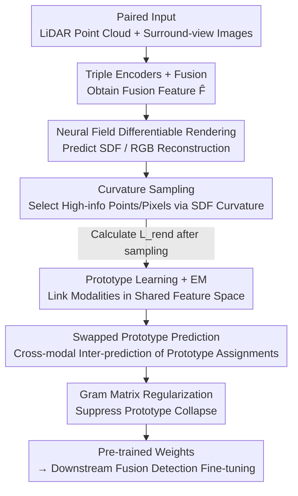

# CLAP: Unsupervised 3D Representation Learning for Fusion 3D Perception via Curvature Sampling and Prototype Learning

**Conference**: ICLR2026  
**OpenReview**: [https://openreview.net/forum?id=3qF8HeAVAO](https://openreview.net/forum?id=3qF8HeAVAO)  
**Code**: To be confirmed  
**Area**: 3D Vision / Self-supervised Representation Learning / Autonomous Driving Perception  
**Keywords**: Unsupervised Pre-training, Multi-modal Fusion, Differentiable Rendering, Curvature Sampling, Prototype Learning

## TL;DR
CLAP proposes the first unsupervised joint pre-training method for "Camera+LiDAR fusion perception." It utilizes **Curvature Sampling** to select only highly informative points/pixels, managing the VRAM overhead of differentiable rendering. Furthermore, it employs **Learnable Prototypes + EM Training** to align both modalities into a shared feature space to exploit complementarity, achieving double the downstream gains compared to the previous SOTA (UniPAD) on NuScenes and Waymo.

## Background & Motivation
**Background**: 3D perception in autonomous driving typically utilizes both cameras (RGB images) and LiDAR (point clouds), as multi-modal fusion outperforms single-modal methods. However, 3D annotation is extremely expensive, leading to the rise of unsupervised 3D representation learning—pre-training a backbone on unlabeled data and fine-tuning it on downstream tasks. Among various pre-training paradigms, **mask-and-reconstruction based on differentiable rendering** (represented by UniPAD) currently achieves state-of-the-art results.

**Limitations of Prior Work**: Differentiable rendering requires simultaneous encoding and ray-sampling-based reconstruction for large-scale point clouds and images, incurring massive VRAM costs. If **all** points and pixels from both modalities are used, even advanced GPUs can only accommodate a batch size of 1. Consequently, methods like UniPAD are forced to **pre-train each modality separately**, training LiDAR and camera encoders independently.

**Key Challenge**: Separate pre-training locks each encoder into its own modality. While image-to-3D recovery is ill-posed due to missing geometry, point clouds possess geometric clues but lack high-level semantics. These two should be complementary, but separate training fails to exploit the **complementarity between image semantics and point cloud geometry**. The fundamental bottleneck is that joint pre-training requires processing both modalities simultaneously, which is prohibited by the computational/VRAM costs of differentiable rendering.

**Goal**: Split the problem into two sub-problems: (1) How to include both modalities in differentiable rendering pre-training without exceeding VRAM limits; (2) How to explicitly model and utilize the complementarity between image semantics and LiDAR geometry.

**Key Insight**: The authors observe that sampling multiple points on the **same flat surface in a point cloud is redundant**. Low-curvature regions (e.g., road surfaces) have low information density, while high-curvature surfaces (e.g., vehicle bodies) carry high information value. Since the sampling budget for rendering reconstruction $N_L \ll N_P$, the limited quota should be allocated to high-information (high-curvature) areas rather than being distributed uniformly.

**Core Idea**: Use "Curvature Sampling" to reduce the computational cost of differentiable rendering to affordable levels, thereby achieving the **first joint differentiable rendering pre-training for fusion perception**. Use "Learnable Prototypes + EM + Swapped Prediction" to explicitly learn modality complementarity in a shared feature space. CLAP = **C**urvature samp**L**ing + le**A**rnable **P**rototype.

## Method

### Overall Architecture
CLAP aims to "jointly pre-train LiDAR, camera, and fusion encoders without labels." The workflow is as follows: paired point clouds $\mathbf{P}$ and surround-view images $\mathbf{I}$ are encoded by a LiDAR encoder $f^{enc}_P$ and a camera encoder $f^{enc}_I$ (Swin Transformer, with 2D features lifted to 3D via projection matrix $\mathbf{T}$), respectively. The concatenated features are processed by a fusion encoder $f^{enc}_{fusion}$ to obtain fusion features $\hat{\mathbf{F}}$. After a shallow 3D convolution $f^{3D}$, one path goes to **neural field differentiable rendering** for mask-and-reconstruction (predicting SDF and RGB, integrating range and color along LiDAR/camera rays to calculate $L_{rend}$ relative to ground truth). The other path feeds embeddings from both modalities into a **prototype learning** module, utilizing EM, swapped prediction, and Gram regularization losses to capture modality complementarity.

To run both modalities simultaneously without OOM, the key is **Curvature Sampling**, which compresses the reconstruction sampling points $N_L, N_C$ to approximately 1/100 of their original scale. To ensure joint pre-training benefits from complementarity, the **prototype learning** loss suite is essential. The total loss is:

$$\mathcal{L} = \omega_r \cdot \mathcal{L}_{rend}(\mathbf{P}, \tilde{\mathbf{F}}, \mathbf{I}) + \omega_{proto} \cdot \mathcal{L}_{proto}(\hat{\mathbf{P}}, \hat{\mathbf{I}}).$$

### Key Designs

**1. Curvature Sampling: Allocating Sampling Budget to High-Information Regions**

Using all points/pixels in differentiable rendering restricts the batch size to 1. Sampling must be significantly smaller than the original scale ($N_L \ll N_P$, $N_C \ll H\cdot W\cdot N_{cam}$). Direct uniform sampling (e.g., UniPAD’s "Memory-friendly Ray Sampling") performs barely better than separate pre-training due to a ~1/100 sampling ratio, contradicting the motivation that joint training should be superior. The authors observe that high-curvature surfaces (vehicles) carry much more information than low-curvature surfaces (roads), thus weighting the sampling by **curvature**.

Specifically, for each point $\mathbf{p}$ in the point cloud, the first derivative of the SDF function yields the normal $\mathbf{n} = \frac{\delta f^{SDF}([\mathbf{p}, f])}{\delta \mathbf{p}}$, normalized as $\tilde{\mathbf{n}} = \mathbf{n}/\|\mathbf{n}\|_2$. The normal is differentiated again $\mathbf{c} = \frac{\delta \tilde{\mathbf{n}}}{\delta \mathbf{p}}$, and its norm serves as the geodesic curvature, used directly as the sampling weight $\omega_n = \|\mathbf{c}_n\|_2$. $N_L$ points are drawn using PyTorch's Multinomial Sampler. On the image side, point clouds are projected back to the image plane, $\omega_n$ is assigned to corresponding pixels and densified via a Gaussian kernel of size $K_{gaus}$, after which $N_C$ pixels are sampled. Given that curvature estimates are noisy in initial epochs, uniform sampling is used for $N_{warmup}$ epochs as a warmup. Curvature estimation is performed within `torch.no_grad()`, calculated once without storing gradients. The additional computational/VRAM overhead is <1%, making it a "free" way to prioritize information density using second-order geometric quantities.

**2. Learnable Prototypes + EM Training: Aligning Modalities in a Shared Space**

Curvature sampling saves computation, but for "joint training" to be effective, the model must understand "objectness" (objects/parts) skip-unsupervised. The authors introduce $N_K$ randomly initialized learnable prototypes $\mathbf{K} \in \mathbb{R}^{N_K \times d_K}$. Each prototype represents a 3D scene fragment, serving as a shared spatial anchor. LiDAR and camera 3D embeddings $\hat{\mathbf{P}}, \hat{\mathbf{I}}$ pass through a projection head $f^{proj}$ to align at $d_K$ dimensions. After normalization, similarity matrices $\mathbf{S}_P = \dot{\mathbf{P}} \cdot \mathbf{K}^\top$ and $\mathbf{S}_I = \dot{\mathbf{I}} \cdot \mathbf{K}^\top$ are computed.

EM is used to optimize prototypes: the E-step applies softmax to $\mathbf{S}_{P/I}$ to obtain prototype assignment probabilities $\hat{\mathbf{S}}_{P/I}$. The M-step aims for "one prototype to correspond deterministically to a scene fragment," equivalent to minimizing the entropy of the similarity matrix:

$$\mathcal{L}_{EM} = -\frac{1}{N_{3D}N_K}\sum_{n}\sum_{m}\{\hat{S}^{n,m}_P \log \hat{S}^{n,m}_P + \hat{S}^{n,m}_I \log \hat{S}^{n,m}_I\}.$$

This step ensures prototypes converge from random vectors into semantically meaningful scene component representatives, with LiDAR and cameras sharing the same prototype set to bridge the modalities.

**3. Swapped Prototype Prediction: Cross-modal Supervision of Assignments**

Aligning modalities with prototypes is insufficient for deep interaction. Drawing from SwAV, the authors detach $\mathbf{S}_{P/I}$ and apply the Sinkhorn algorithm for $N_{sink}$ iterations to approximate a doubly stochastic matrix, yielding code $\mathbf{Q}_{P/I}$. The **LiDAR prototype assignments then predict the camera codes, and vice versa** (with temperature $\tau$):

$$\mathcal{L}_{SwAV} = -\frac{1}{N_{3D}N_K}\sum_{n}\sum_{m}\Big\{Q^{n,m}_I \log \frac{\exp(S^{n,m}_P)/\tau}{\sum_k \exp(S^{n,k}_P)/\tau} + Q^{n,m}_P \log \frac{\exp(S^{n,m}_I)/\tau}{\sum_k \exp(S^{n,k}_I)/\tau}\Big\}.$$

The key difference from SwAV is that CLAP's swap occurs between **two different modalities**, explicitly injecting "point cloud geometry ↔ image semantics" complementarity into pre-training.

**4. Gram Matrix Regularization: Preventing Prototype Collapse**

Randomly initialized prototypes may learn shortcuts where all prototypes collapse into the same vector. The authors utilize the Gram matrix $\mathbf{G} = \mathbf{K}\mathbf{K}^\top$ to measure pair-wise similarity, minimizing the mean of non-diagonal elements:

$$\mathcal{L}_{GMM} = \frac{1}{N_K(N_K-1)}\sum_{n}\sum_{m \neq n} G_{n,m}$$

This encourages prototypes to be orthogonal and diverse. The final prototype loss is $\mathcal{L}_{proto} = \omega_{SwAV}\mathcal{L}_{SwAV} + \omega_{EM}\mathcal{L}_{EM} + \omega_{GMM}\mathcal{L}_{GMM}$.

### Loss & Training
On the reconstruction side, $\mathcal{L}_{rend}$ adds a **surface SDF loss** (SDF should be 0 at observed LiDAR points) to optimize geometry, consisting of surface SDF, range, and color L1 losses:

$$\mathcal{L}_{rend} = \frac{1}{N_L}\sum_i (|r_i - \tilde{r}_i| + \omega_{sur}|s_i|) + \frac{\omega_C}{3 N_C}\sum_i \sum_j |c^j_i - \tilde{c}^j_i|.$$

Occupancy along rays is $\alpha_n = \max(\frac{\Phi_h(s_n) - \Phi_h(s_{n+1})}{\Phi_h(s_n)}, 0)$ (where $\Phi_h$ is sigmoid with learnable scale $h$), transmittance is $t_n = \prod_{i<n}(1-\alpha_i)$, and weight is $w_n = t_n \alpha_n$. The integrated range and color are $\tilde{r} = \sum_n w_n r_n$ and $\tilde{c} = \sum_n w_n c_n$. Key hyper-parameters: $N_L=8192$, $N_C = 1024 \times N_{cam}$, $N_{warmup}=4$, $N_K=512$, $\omega_r=2.0, \omega_{proto}=1.0$. Downstream models: BEVFusion (NuScenes) and CenterPoint (Waymo).

## Key Experimental Results

### Main Results
The evaluation protocol is rigorous: the from-scratch model is trained until convergence (extra iterations yield no gain), and then **the iteration count is fixed** for fine-tuning all pre-trained models. This ensures pre-training is not just "accelerating convergence" but providing real sample efficiency gains. Downstream tests use few-shot settings (5% NuScenes, 1% Waymo).

NuScenes fine-tuning results (5% training set):

| Init. | mAP | NDS |
|-------|-----|-----|
| Random | 48.69 | 55.28 |
| SLidR | 47.23 (−1.46) | 52.77 |
| PPKT | 49.58 (+0.89) | 55.85 |
| UniPAD (Prev. SOTA) | 49.81 (+1.12) | 55.29 |
| **CLAP** | **51.17 (+2.48)** | **57.04 (+1.76)** |

CLAP's mAP Gain (+2.48%) is more than double that of UniPAD (+1.12%). Significant improvements (>2% AP) are seen in categories like Construction Vehicle, Bus, and Motorcycle. On Waymo (1% split), CLAP's average Gain (+1.28) is nearly double the best baseline OCC-MAE (+0.74).

**Scaling properties** (Table 3): With fixed pre-training data, reducing fine-tuning data (5%→0.5%) increases CLAP's relative Gain, reaching +7.22% mAP and +4.71% NDS at 0.5% fine-tuning.

### Ablation Study

| Configuration | mAP | Description |
|------|-----|------|
| Separate Pre-training (UniPAD) | 49.81 | Baseline: individual modal training |
| Joint + Uniform Sampling | 49.55 | Uniform joint training decreases performance |
| Joint + Curvature Sampling | 50.81 | Curvature sampling provides +1.0 gain |
| Joint + Curvature + Prototype (Full) | **51.17** | Complete CLAP model |

### Key Findings
- **Uniform joint pre-training (49.55) is worse than separate training (49.81)**, validating the motivation: joint training is ineffective without selective sampling at low ratios. Curvature sampling is the key to making joint training viable (+1.0 mAP).
- Prototype learning adds an additional +0.36 mAP, proving that explicit cross-modal complementarity modeling provides tangible benefits.
- Visualizations show curvature estimation correctly weights vehicles higher than background roads; prototype assignments group similar scene components (e.g., road surfaces vs. foreground cars) without any human labels.

## Highlights & Insights
- **Second-order geometric quantities as samplers**: Using the derivative of normals (curvature) as weights is computationally almost free but effectively directs the rendering budget to information-dense areas. This "cheap physical prior for expensive sampling" is transferable to other VRAM-constrained tasks.
- **Adapting SwAV for cross-modality**: Moving from "multi-view of a single modality" to "inter-modality swap" where prototypes represent scene fragments is a natural and effective extension for fusion perception.
- **Honest evaluation protocol**: Using fixed iterations until convergence avoids the "convergence speed-up" pitfall, making the reported sample efficiency gains more credible.

## Limitations & Future Work
- **Limitations**: Unsupervised methods inevitably introduce noise in curvature estimation and prototype assignment. Scaling benefits were simulated by shrinking fine-tuning data; the impact of massive increases in pre-training data remains to be validated.
- **Scope**: Experiments are limited to LiDAR+Camera fusion for 3D detection. Whether curvature sampling holds for sparse/low-beam LiDAR or indoor point clouds is unknown.
- **Future Directions**: Scaling up the pre-training dataset; extending curvature sampling to segmentation/tracking; exploring adaptive prototype counts.

## Related Work & Insights
- **vs UniPAD**: Both use differentiable rendering for reconstruction. UniPAD trains modalities **separately** due to VRAM limits, missing complementarity. CLAP enables **joint** training via curvature sampling and doubles downstream gains.
- **vs SwAV**: SwAV's prototypes represent classes in images; CLAP's prototypes represent 3D scene fragments. Swap occurs across LiDAR and Camera modalities.
- **vs Contrastive Fusion**: While contrastive methods align modalities via feature distance, CLAP integrates geometric reconstruction and semantic complementarity within a unified generative-reconstructive framework.

## Rating
- Novelty: ⭐⭐⭐⭐⭐ First joint differentiable rendering pre-training for fusion, with specific designs for curvature and prototypes.
- Experimental Thoroughness: ⭐⭐⭐⭐ Solid results on NuScenes/Waymo, though downstream tasks are somewhat narrow and real scaling is unproven.
- Writing Quality: ⭐⭐⭐⭐ Logical flow from motivation to method; clear formulas.
- Value: ⭐⭐⭐⭐ Significantly reduces 3D labeling dependency and improves sample efficiency for autonomous driving.

<!-- RELATED:START -->

## Related Papers

- [\[CVPR 2026\] Adaptive 3D Perception for Small Aerial Targets Under Sparse Sampling via Reinforcement Learning](../../CVPR2026/3d_vision/adaptive_3d_perception_for_small_aerial_targets_under_sparse_sampling_via_reinfo.md)
- [\[ICLR 2026\] Learning Unified Representation of 3D Gaussian Splatting](learning_unified_representation_of_3d_gaussian_splatting.md)
- [\[CVPR 2026\] GM-R²: Generative Matching Learning for Unsupervised Geometric Representation and Registration](../../CVPR2026/3d_vision/gm-r2_generative_matching_learning_for_unsupervised_geometric_representation_and.md)
- [\[ICLR 2026\] CloDS: Visual-Only Unsupervised Cloth Dynamics Learning in Unknown Conditions](clods_visual-only_unsupervised_cloth_dynamics_learning_in_unknown_conditions.md)
- [\[AAAI 2026\] Point-SRA: Self-Representation Alignment for 3D Representation Learning](../../AAAI2026/3d_vision/point-sra_self-representation_alignment_for_3d_representation_learning.md)

<!-- RELATED:END -->
