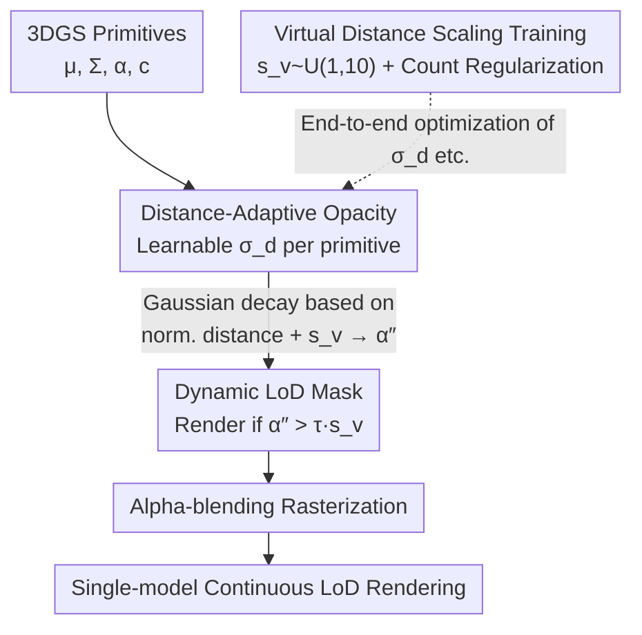

# CLoD-GS: Continuous Level-of-Detail via 3D Gaussian Splatting

**Conference**: ICLR2026  
**OpenReview**: [https://openreview.net/forum?id=zgs0L72R4c](https://openreview.net/forum?id=zgs0L72R4c)  
**Code**: TBD  
**Area**: 3D Vision  
**Keywords**: 3D Gaussian Splatting, Continuous Level-of-Detail, Real-time Rendering, Distance-Adaptive Opacity, LoD  

## TL;DR
CLoD-GS assigns a learnable "distance decay factor" to each 3D Gaussian, allowing primitive opacity to decrease smoothly with viewing distance. This achieves Continuous Level-of-Detail (CLoD) within a **single model**, eliminating the multi-version storage and "popping" artifacts of traditional discrete LoD while simultaneously reducing primitive counts and VRAM usage.

## Background & Motivation

**Background**: Level-of-Detail (LoD) is a fundamental technique in real-time graphics to control rendering overhead—rendering coarser versions of distant objects to maintain frame rates. The mainstream approach is Discrete LoD (DLoD), where multiple versions of an asset with varying precision are pre-generated and switched based on distance or screen projection size. While 3D Gaussian Splatting (3DGS) achieves SOTA quality in real-time view synthesis via explicit primitives and optimized rasterization, its rendering cost scales linearly with the number of Gaussians, necessitating LoD mechanisms.

**Limitations of Prior Work**: Directly applying DLoD to 3DGS (e.g., LODGE, Octree-GS, Hierarchical-3DGS) inherits two major drawbacks. First, storing multiple versions of Gaussian point clouds for each asset significantly increases storage and VRAM demands, limiting scene scale. Second, instantaneous switching between precision levels causes noticeable "popping" artifacts, leading to a disjointed user experience. These methods also rely on rigid explicit hierarchical structures (octrees, tiling), adding algorithmic and memory overhead.

**Key Challenge**: The fundamental issue with DLoD is its "discreteness"—it partitions continuously changing perceptual importance into a few levels, inevitably resulting in storage redundancy and visual discontinuities. Achieving true Continuous LoD (CLoD) with traditional meshes requires complex run-time topological operations like edge collapse or vertex splitting, shifting complexity from the asset side to the CPU.

**Key Insight**: The authors argue that 3DGS is inherently suited for CLoD. Since each Gaussian is a continuous volumetric distribution with a "soft" footprint, adjusting its contribution (e.g., via opacity) is naturally smooth. Furthermore, as each primitive is defined by continuous parameters, fine-grained per-primitive filtering is possible without sudden geometry removal. Since the representation is end-to-end differentiable, the LoD mechanism itself can be learned by introducing new parameters optimized during the main training process.

**Core Idea**: Introducing a **learnable distance decay factor** for each Gaussian primitive, enabling its opacity to decay smoothly based on viewpoint distance. This generates a "continuous detail spectrum" within a unified model, bypassing the storage and popping issues of DLoD.

## Method

### Overall Architecture
CLoD-GS performs a minimally invasive expansion of the standard 3DGS representation. In addition to the original position $\mu_i$, covariance $\Sigma_i$, base opacity $\alpha_i$, and spherical harmonic colors $c_i$, it adds **a single float parameter** per primitive: the distance decay factor $\sigma_{d,i}$. During rendering, each primitive's opacity is attenuated using a Gaussian-like decay based on its normalized distance to the camera and a user-adjustable "virtual distance scaling factor" $s_v$. A dynamic mask, which tightens as $s_v$ increases, determines which primitives are sent to the rasterizer. Thus, adjusting the scalar $s_v$ allows continuous sliding between quality and speed: $s_v=1$ for full precision, with larger $s_v$ simulating greater distances and filtering out secondary primitives.

To ensure the single model performs well across the entire spectrum, a **virtual distance scaling strategy** is used during training: $s_v \sim U(1,10)$ is randomly sampled to force optimization for both real and simulated distant views. This is paired with a **primitive count regularization term** to explicitly reduce primitive use in distant views. The pipeline is shown below:

### Key Designs

**1. Distance-Adaptive Opacity: Fading Primitives via Learnable Decay**

To solve the "popping" issue of DLoD, the authors smoothly reduce opacity instead of discretely deleting primitives. A learnable scalar $\sigma_{d,i}$ is added to each Gaussian $i$ to determine its visibility decay rate. During rendering, the Euclidean distance $d_i=\|\mu_i-c\|$ from the camera center $c$ to the Gaussian mean is calculated and normalized as $d'_i = d_i/\max_{j\in N_{view}} d_j$. The attenuated opacity $\alpha''_i$ is computed as:

$$\alpha''_i = \alpha_i \cdot \exp\!\left(-\frac{(d'_i \cdot s_v)^2}{2\,(\mathrm{ReLU}(\sigma_{d,i}))^2 + \epsilon}\right)$$

where $s_v\ge 1$ allows users to simulate "viewing from further away." $\mathrm{ReLU}(\cdot)$ ensures non-negative decay, and $\epsilon$ is for stability. This weights the original opacity by a Gaussian-like decay with **per-primitive learnable variance**—primitives with small $\sigma_{d,i}$ fade quickly, while those with large $\sigma_{d,i}$ are deemed "perceptually important" and persist longer.

**2. Dynamic LoD Mask: Reducing Primitive Count via Scaling Thresholds**

Reducing opacity alone does not save computation. A dynamic threshold creates a boolean mask $M_i = (\alpha''_i > \tau \cdot s_v)$. Only Gaussians with $M_i=1$ enter the rasterizer. Crucially, the threshold increases with $s_v$; larger $s_v$ means stricter exclusion and higher FPS. This compresses the "quality-performance trade-off" into a cheap per-primitive calculation based on a single scalar $s_v$.

**3. Virtual Distance Scaling Training + Quantity Reg: Ensuring Spectrum Reliability**

Training only on high-quality views fails to learn meaningful simplification. By sampling $s_v\sim U(1,10)$, the model optimizes for various distances. To avoid trivial solutions, a **primitive count regularization loss** is added. The target primitive ratio $\eta_{target}$ decreases inversely with virtual distance:

$$\eta_{target} = 1/s_v^{1.5}$$

The actual rendering ratio $\eta_{actual}=(\sum_i M_i)/N_{total}$ is penalized if it exceeds the target:

$$L_{reg} = (s_v-1.0)^2 \cdot (\mathrm{ReLU}(\eta_{actual}-\eta_{target}))^2$$

The final objective combines the standard loss $L_{render}$ with $L_{reg}$ using an adaptive weight $w_s=(1-0.5\,s_v/\max(s_v))^2$:

$$L_{total} = w_s\,(L_{render} + \lambda_{reg} L_{reg})$$

This trio of multi-scale sampling, count regularization, and adaptive weighting enables the model to learn an efficient, view-dependent representation.

### Loss & Training
Training lasts 30,000 steps, with the proposed mechanism enabled after step 5,000. The learning rate for $\sigma_{d,i}$ is 1e-2, with $\lambda_{reg}=1.0$. Each Gaussian adds only one float, resulting in approximately 1.6% additional storage.

## Key Experimental Results

### Main Results
Evaluated on 12 real-world scenes (BungeeNeRF, Tanks&Temples, Deep Blending, MipNeRF360). Metrics include PSNR, SSIM, LPIPS, #GS, VRAM, and FPS.

| Dataset | Method | PSNR↑ | SSIM↑ | LPIPS↓ | #GS(k)↓ | VRAM(MB)↓ |
|--------|------|-------|-------|--------|---------|-----------|
| BungeeNeRF | 3DGS | 27.91 | 0.917 | 0.096 | 6733 | 1592.5 |
| BungeeNeRF | MaskGaussian | 27.76 | 0.916 | 0.098 | 5298 | 1253.1 |
| BungeeNeRF | **Ours (scale=1)** | **28.05** | **0.919** | 0.100 | **4185** | **1005.9** |
| BungeeNeRF | Ours (scale=7) | 27.09 | 0.885 | 0.150 | 1855 | 445.7 |
| Deep Blending | 3DGS | 29.84 | 0.907 | 0.238 | 2486 | 588.0 |
| Deep Blending | **Ours (scale=1)** | **29.93** | **0.908** | **0.239** | 1697 | 407.7 |

Ours (scale=1) often **outperforms** original 3DGS in PSNR/SSIM while significantly reducing primitives (-38% on BungeeNeRF). Tuning scale $s_v$ higher yields speeds up to 199.1 FPS on Tanks&Temples, outperforming discrete LoD methods like H-3DGS.

### Ablation Study
Training with $s_v$ upper bound of 5, removing components:

| Configuration | PSNR↑(Bungee) | SSIM↑ | LPIPS↓ | Note |
|------|---------------|-------|--------|------|
| Full Model | 27.59 | 0.902 | 0.123 | Full Model |
| w/o Adaptive Weight $w_s$ | 27.39 | 0.894 | 0.127 | Significant drop |
| w/o Reg $L_{reg}$ | 27.56 | 0.902 | 0.123 | Minor impact |
| w/o Weight & Reg | 26.71 | 0.871 | 0.169 | Worst performance |

### Key Findings
- Removing both $w_s$ and $L_{reg}$ causes the largest drop, indicating their synergy in preventing over-pruning while promoting sparsity.
- Increasing the training range of $s_v$ makes the model more robust to simplification without harming peak quality.
- Comparisons between DLoD and CLoD show CLoD provides smooth transitions without the artifacts found at discrete boundaries.
- The training strategy is **orthogonal** and can be applied to compressed models like MaskGaussian for additive benefits.

## Highlights & Insights
- **Minimally Invasive**: Adding just one float per Gaussian enables CLoD without altering the core 3DGS differentiable rasterization pipeline.
- **Virtual Distance Leverage**: $s_v$ acts as a training lever, teaching the single model to represent the entire quality spectrum simultaneously.
- **Emergent Importance**: The model automatically assigns larger $\sigma_{d,i}$ (slower decay) to perceptually significant primitives via end-to-end optimization.

## Limitations & Future Work
- LoD is purely **distance-driven**, ignoring semantic importance or visual saliency.
- Validation is limited to static scenes; stability in dynamic or deformable scenes is unverified.
- The target ratio exponent (1.5) is empirical and may not be optimal for all scenes.
- Future work could integrate perception-driven metrics or tile-based loading for ultra-large scenes.

## Related Work & Insights
- **vs DLoD (Octree-GS / LODGE)**: Unlike these methods, CLoD-GS avoids storage redundancy and popping artifacts, and can even serve as a fine-grained internal knob for hierarchical systems.
- **vs Fast Rendering (CLoD - Milef et al. 2025)**: While others use post-training importance ranking, this work integrates LoD parameters directly into the main end-to-end training.
- **vs MaskGaussian / LightGaussian**: These are **static compression** methods; CLoD-GS provides **dynamic run-time** scalability and is orthogonal to them.

## Rating
- Novelty: ⭐⭐⭐⭐ Elegant integration of CLoD via minimal learnable parameters.
- Experimental Thoroughness: ⭐⭐⭐⭐ Extensive testing across 12 scenes with strong ablation and orthogonality checks.
- Writing Quality: ⭐⭐⭐⭐ Clear motivation and well-explained mechanisms.
- Value: ⭐⭐⭐⭐ High practical value for 3DGS-based engineering with zero popping and reduced storage.

<!-- RELATED:START -->

- **LODGE**: [LODGE: Level-of-Detail of Gaussian Splatting for Large-scale Scene](https://arxiv.org/abs/2410.16035)
- **Octree-GS**: [Octree-GS: Towards Consistent Real-time Rendering with Octree-based 3D Gaussian Splatting](https://arxiv.org/abs/2403.17822)
- **MaskGaussian**: [MaskGaussian: Towards Efficient 3D Gaussian Splatting with Masking](https://arxiv.org/abs/2403.11181)

<!-- RELATED:END -->

## Related Papers

- [\[ICLR 2026\] PD²GS: Part-Level Decoupling and Continuous Deformation of Articulated Objects via Gaussian Splatting](pd2gs_part-level_decoupling_and_continuous_deformation_of_articulated_objects_vi.md)
- [\[ICCV 2025\] VertexRegen: Mesh Generation with Continuous Level of Detail](../../ICCV2025/3d_vision/vertexregen_mesh_generation_with_continuous_level_of_detail.md)
- [\[ICLR 2026\] D²GS: Depth-and-Density Guided Gaussian Splatting for Stable and Accurate Sparse-View Reconstruction](d2gs_depth-and-density_guided_gaussian_splatting_for_stable_and_accurate_sparse-.md)
- [\[NeurIPS 2025\] LODGE: Level-of-Detail Large-Scale Gaussian Splatting with Efficient Rendering](../../NeurIPS2025/3d_vision/lodge_level-of-detail_large-scale_gaussian_splatting_with_efficient_rendering.md)
- [\[ICLR 2026\] SSD-GS: Scattering and Shadow Decomposition for Relightable 3D Gaussian Splatting](ssd-gs_scattering_and_shadow_decomposition_for_relightable_3d_gaussian_splatting.md)

<!-- RELATED:END -->
