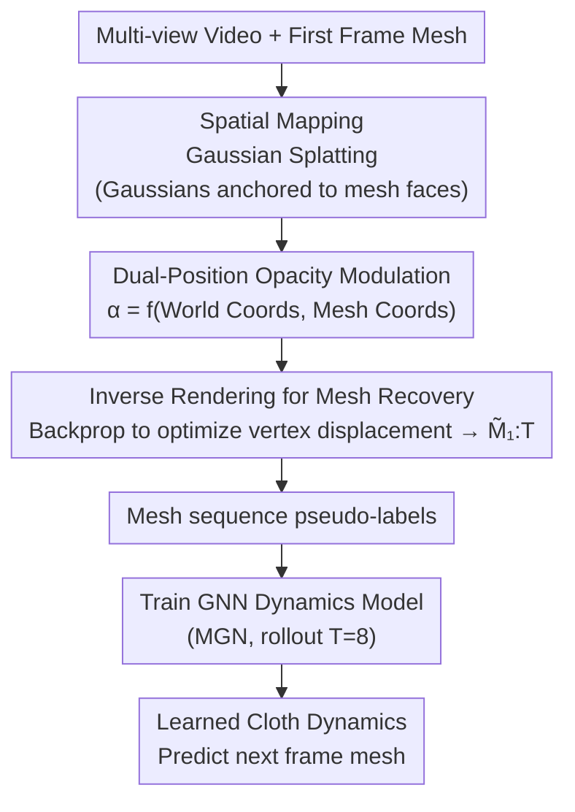

# CloDS: Visual-Only Unsupervised Cloth Dynamics Learning in Unknown Conditions

**Conference**: ICLR 2026  
**arXiv**: [2602.01844](https://arxiv.org/abs/2602.01844)  
**Code**: [https://github.com/whynot-zyl/CloDS](https://github.com/whynot-zyl/CloDS)  
**Area**: 3D Vision  
**Keywords**: Cloth Dynamics, Unsupervised Learning, Gaussian Splatting, Differentiable Rendering, Intuitive Physics

## TL;DR
CloDS introduces the first framework for unsupervised learning of cloth dynamics from multi-view videos. By establishing a differentiable mapping from 2D images to 3D meshes via Spatial Mapping Gaussian Splatting and resolving self-occlusion with dual-position opacity modulation, the GNN learns cloth dynamics near the level of full supervision without physical parameter labels.

## Background & Motivation

**Background**: Deep learning has made significant progress in simulating dynamic systems (fluids, cloth, multi-body dynamics). However, existing methods rely heavily on known physical attributes as supervision signals (e.g., particle positions, mesh node coordinates).

**Limitations of Prior Work**:
   - Physical attributes (material parameters, environmental conditions) are often unknown in real-world scenarios, limiting utility.
   - Intuitive physics methods (learning dynamics from vision) primarily target rigid body interactions and perform poorly on continuum mechanics, particularly cloth.
   - Dynamic scene novel view synthesis methods fail to generalize to unseen frames; video prediction methods struggle to maintain temporal consistency under frequent self-occlusion.

**Key Challenge**: Cloth possesses an infinite-dimensional state space, complex self-occlusion, and large non-linear deformations. Existing particle representations (e.g., NeuroFluid) are unsuitable for the thin-sheet structure of cloth, while direct mesh-based Gaussian Splatting causes perspective distortion due to self-occlusion.

**Goal**
   - Define and solve the Cloth Dynamics Grounding (CDG) problem: unsupervised learning of cloth dynamics from multi-view videos.
   - Design a differentiable 2D-3D mapping to enable GNN dynamics model training with pixel-level loss.
   - Resolve rendering distortion under large deformations and strong self-occlusion.

**Key Insight**: The problem is decomposed into the joint learning of three probabilistic models: rendering $p(Y_t|M_t)$, inverse rendering $p(M_t|Y_{1:t})$, and dynamic transition $p(M_{t+1}|M_t)$, connected via a Differentiable Visual Computing (DVC) framework.

**Core Idea**: Use mesh-based Gaussian Splatting with dual-position opacity modulation to establish a temporally consistent 2D-3D mapping, recovering 3D mesh sequences from video as pseudo-labels for dynamics learning.

## Method

### Overall Architecture
CloDS aims to learn cloth dynamics solely from multi-view videos without physical parameter supervision. The approach involves recovering the 3D mesh of each frame from video to serve as pseudo-labels, followed by training a dynamics model on this sequence. This bypasses the need for ground-truth physical annotations. The pipeline consists of three stages: First, anchoring Gaussian components to the mesh surface based on the initial mesh and multi-view images to establish a differentiable bridge between 2D and 3D (SMGS + dual-position opacity modulation). Second, performing inverse rendering to optimize vertex displacements via backpropagation, recovering the full mesh sequence $\tilde{M}_{1:T}$. Third, using the recovered mesh sequence as pseudo-labels to train a GNN dynamics model for predicting $M_{t+1}\mid M_t$.

### Key Designs

**1. Spatial Mapping Gaussian Splatting (SMGS): Establishing temporally consistent 2D↔3D differentiable mapping**

To train a GNN with pixel loss, a backpropagatable bridge must connect 3D mesh deformation to its image representation. SMGS anchors each Gaussian component to a specific triangular face of the mesh. The Gaussian center is determined by barycentric interpolation of the three vertices: $\mu_t = \beta_1 X_{t,1}^W + \beta_2 X_{t,2}^W + \beta_3 X_{t,3}^W$. The rotation matrix is derived via Gram-Schmidt orthogonalization of the face normal, and scaling is determined by edge lengths. When the mesh deforms, all Gaussians automatically follow the new vertex positions using the same $\beta$ coefficients, making the entire mapping differentiable with respect to vertex positions. SMGS builds on the mesh-Gaussian binding concept of GaMeS but adds opacity modulation to prevent failure under large deformations and self-occlusion.

**2. Dual-Position Opacity Modulation: Addressing self-occlusion via world and mesh coordinates**

Cloth folding causes significant self-occlusion. Since GaMeS does not adjust opacity during motion, weight distribution in occluded regions becomes incorrect, resulting in perspective distortion. In CloDS, the opacity of each Gaussian is dynamically generated by an MLP $f_\theta$ using two sets of coordinates:

$$\alpha_{i,t} = f_\theta\bigl(\mu_{i,t}^W,\ \mu_{i,t}^M\bigr)$$

World coordinates $\mu^W$ represent relative positions, ensuring proper weight distribution between front and back layers during overlap to eliminate perspective artifacts. Mesh coordinates $\mu^M$ represent absolute positions on the cloth, maintaining opacity when the cloth moves into previously unseen regions. Either coordinate set alone is insufficient; both are required to suppress these errors simultaneously.

**3. Inverse Rendering for 3D Labels: Recovering mesh sequences via backpropagation**

With the differentiable SMGS mapping, 3D meshes can be extracted from images. This step is critical for the unsupervised scheme, replacing physical simulators and removing the need for 3D mesh annotations. Given the current mesh $M_t$, the world coordinate displacement $\Delta x_t^W$ of each vertex is optimized so that the SMGS rendering of the next frame $\tilde{I}_{t+1}$ aligns with the ground truth image $Y_{t+1}$. By proceeding recursively from the first frame, the entire sequence $\tilde{M}_{1:T}$ is recovered for dynamics training.

### Loss & Training
- **Stage 1** (Gaussian Construction): Standard 3DGS loss $\mathcal{L}_{render} = (1-\lambda)\mathcal{L}_1 + \lambda\mathcal{L}_{D-SSIM}$ with $\lambda=0.2$.
- **Stage 2** (Mesh Recovery): $\mathcal{L}_{geometry} = \mathcal{L}_1(\text{SMGS}(\tilde{x}_{t+1}^W), Y_{t+1}) + \gamma\mathcal{L}_{edge}$ where edge loss maintains node distances to prevent excessive deformation.
- **Stage 3** (Dynamics Training): $\mathcal{L}_{node} = \sum_{t=1}^T \text{MSE}(\hat{x}_t^W, x_t^W)$ with rollout length $T=8$.

## Key Experimental Results

### Main Results (Cloth Dynamics Learning - RMSE)

| Method | Supervision | Viewed Interp. | Viewed Extrap. | Unviewed Interp. | Unviewed Extrap. |
|------|------|------------|-----------|-------------|-------------|
| MGN | Full Mesh | 0.1286 | 0.1291 | 0.1358 | 0.1314 |
| MGN* | 50 Meshes | 0.1380 | 0.1388 | 0.1460 | 0.1362 |
| CloDS | 50 Mesh+50 Video | 0.1321 | 0.1344 | 0.1399 | 0.1339 |
| CloDS** | Full Video | 0.1294 | 0.1307 | 0.1388 | 0.1325 |

### Dynamic Scene Novel View Synthesis

| Model | PSNR↑ | SSIM×10↑ | LPIPS×1000↓ |
|------|-------|---------|------------|
| 4DGS | 23.21 | 9.718 | 15.82 |
| GaMeS | 33.02 | 9.937 | 5.21 |
| **SMGS (Ours)** | **36.24** | **9.959** | **3.53** |
| 3DGS (Upper Bound) | 39.63 | 9.986 | 2.53 |

### Key Findings
- **CloDS learns dynamics comparable to full supervision**: CloDS** trained on videos achieved RMSE very close to MGN trained on full meshes (difference <5%), proving the feasibility of the unsupervised approach.
- **SMGS significantly outperforms baseline rendering methods**: PSNR is 3.2dB higher than GaMeS and 13dB higher than 4DGS.
- **Dual-position opacity modulation is essential**: Removing world coordinates leads to perspective distortion; removing mesh coordinates causes transparency in moving regions.
- **Strong generalization**: On cloth with unseen initial states, CloDS' extrapolation RMSE is only ~1% higher than viewed cases.

## Highlights & Insights
- **Introducing the DVC framework to cloth dynamics is visionary**: Establishing a full Rendering → Inverse Rendering → Dynamics loop allows learning physical dynamics from just the first frame mesh and multi-view video. This paradigm can transfer to other physics model learning tasks from visual observations.
- **Dual-position opacity modulation is simple yet critical**: Using an MLP to modulate opacity based on both world and mesh coordinates elegantly solves rendering distortion under self-occlusion with minimal computational overhead.
- **The decoupled three-stage design is practical**: Stages 1 and 2 do not require temporal loss (step-wise training), and only Stage 3 uses rollout. This allows parallelization of the first two stages, significantly reducing training complexity.

## Limitations & Future Work
- Evaluation is limited to Blender synthetic datasets; noise, lighting changes, and multi-object interactions in real scenarios are not fully tested.
- Initial mesh estimation requires the first frame mesh as a prior, which may not be available in real-world settings.
- The dynamics model (MGN) is fixed; more powerful architectures (e.g., Transformer-based) are not explored.
- Handles only single cloth pieces; interactions with other objects (e.g., dressing) are not considered.
- Cloth trajectories in the dataset are relatively simple (flags); more complex scenes (e.g., folding clothes) may require more data.

## Related Work & Insights
- **vs NeuroFluid**: NeuroFluid uses particle representations and differentiable rendering for fluids, but particles are unsuitable for cloth; CloDS adopts mesh representations better suited for cloth.
- **vs GaMeS**: Both are mesh-based Gaussian Splatting, but GaMeS does not handle opacity changes during motion, leading to rendering errors in occluded regions.
- **vs 4DGS/M5D-GS**: 4D dynamic scene methods perform poorly under large deformations and do not learn generalizable dynamics models.

## Rating
- Novelty: ⭐⭐⭐⭐⭐ Pioneering the CDG problem and framework; dual-position opacity modulation is a clever innovation.
- Experimental Thoroughness: ⭐⭐⭐⭐ Comprehensive evaluation across multiple tasks, though limited to synthetic data.
- Writing Quality: ⭐⭐⭐⭐ Clear mathematical modeling, though notation is somewhat dense.
- Value: ⭐⭐⭐⭐ Opens a new direction for learning cloth dynamics from vision, applicable to robotics and other fields.

<!-- RELATED:START -->

## Related Papers

- [\[CVPR 2026\] Zero-Shot Reconstruction of Animatable 3D Avatars with Cloth Dynamics from a Single Image](../../CVPR2026/3d_vision/zero-shot_reconstruction_of_animatable_3d_avatars_with_cloth_dynamics_from_a_sin.md)
- [\[ICLR 2026\] CLAP: Unsupervised 3D Representation Learning for Fusion 3D Perception via Curvature Sampling and Prototype Learning](clap_unsupervised_3d_representation_learning_for_fusion_3d_perception_via_curvat.md)
- [\[ICLR 2026\] Learning Physics-Grounded 4D Dynamics with Neural Gaussian Force Fields](learning_physics-grounded_4d_dynamics_with_neural_gaussian_force_fields.md)
- [\[ICLR 2026\] $\pi^3$: Permutation-Equivariant Visual Geometry Learning](pi3_permutation-equivariant_visual_geometry_learning.md)
- [\[ICLR 2026\] ORCaS: Unsupervised Depth Completion via Occluded Region Completion as Supervision](orcas_unsupervised_depth_completion_via_occluded_region_completion_as_supervisio.md)

<!-- RELATED:END -->
