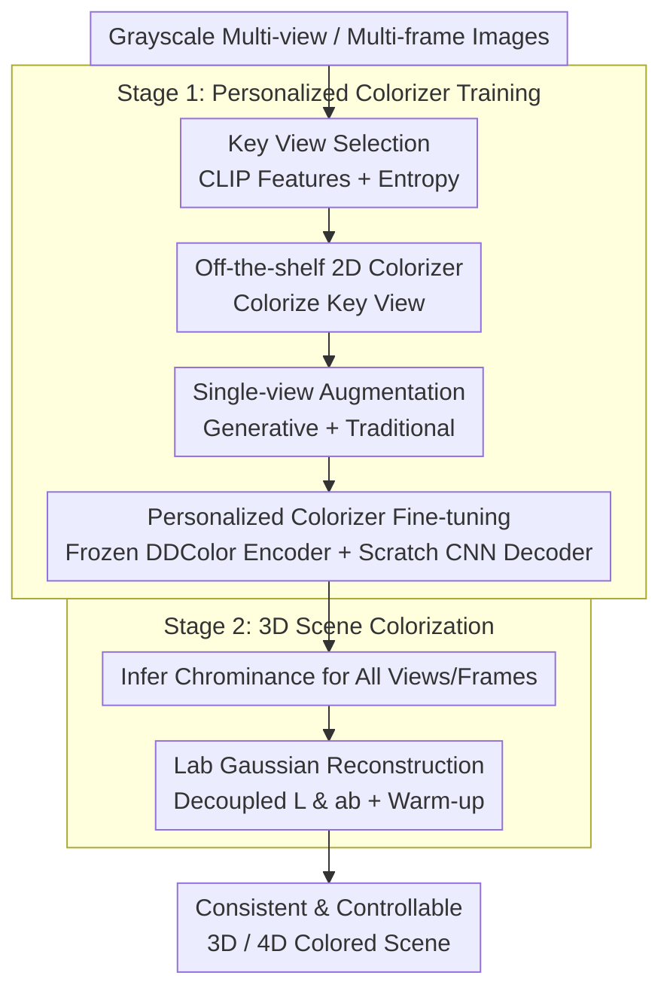

# Color3D: Controllable and Consistent 3D Colorization with Personalized Colorizer

**Conference**: ICLR 2026  
**arXiv**: [2510.10152](https://arxiv.org/abs/2510.10152)  
**Code**: [https://yecongwan.github.io/Color3D/](https://yecongwan.github.io/Color3D/) (Project Page)  
**Area**: 3D Vision / Image Generation  
**Keywords**: 3D Colorization, Gaussian Splatting, Personalized Fine-tuning, Lab Color Space, Visual Consistency

## TL;DR
Color3D proposes a paradigm of "colorize one key view → fine-tune personalized colorizer → propagate color to all views and timesteps." By converting the complex 3D colorization problem into a single-image colorization and color propagation task, it achieves a unification of rich colorization, cross-view consistency, and user controllability across both static and dynamic 3D scenes.

## Background & Motivation

**Background**: 3DGS/NeRF have achieved high-quality novel view synthesis, but reconstructing colored 3D scenes from grayscale inputs remains a challenge. While 2D image colorization is mature (supporting language guidance, reference images, and automatic modes), direct multi-view colorization leads to severe cross-view inconsistencies.

**Limitations of Prior Work**:
   - Existing 3D colorization methods (e.g., ChromaDistill, ColorNeRF) enforce consistency by averaging color variations across multiple views, which dilutes palette richness and results in desaturated, flat tones.
   - Smoothing color variations makes results unpredictable, sacrificing user controllability.
   - Current methods primarily handle static scenes; controllable colorization for dynamic scenes remains unexplored.

**Key Challenge**: The trade-off between multi-view consistency, color richness, and controllability—averaging strategies ensure consistency at the expense of the latter two.

**Goal**
   - Unifying controllable colorization for both static and dynamic 3D scenes.
   - Maintaining color richness while ensuring consistency across views and time.
   - Supporting plug-and-play integration of arbitrary 2D colorization models.

**Key Insight**: One only needs to colorize a single key view and then fine-tune a scene-specific colorizer to learn a deterministic color mapping for that view. Through the inherent inductive bias of the colorizer, the same content across different views will be mapped to the same color.

**Core Idea**: Simplify 3D colorization into "single-image colorization + personalized colorizer propagation," naturally ensuring cross-view and cross-temporal consistency by learning a scene-specific one-to-one color mapping.

## Method

### Overall Architecture
Color3D addresses the problem of reconstructing a vibrant, consistent, and controllable 3D scene from grayscale multi-view (or multi-frame) images. The approach decomposes the 3D problem into two stages. In the first stage (Personalized Colorizer Training), a single high-entropy key view is selected and colorized using an off-the-shelf 2D model. Single-view data augmentation is then applied to fine-tune a "scene-exclusive" personalized colorizer, learning a deterministic mapping. In the second stage (3D Scene Colorization), this colorizer infers colors for all other views and frames, which are then used to reconstruct the final 3D scene using a Lab Gaussian representation. Consistency is inherently maintained because identical content processed by the same deterministic colorizer yields identical colors.

### Key Designs

**1. Key View Selection: Maximizing Scene Coverage**

Since only one image is manually colorized, its selection is critical for generalization. Color3D uses CLIP to extract features for each view, calculates a cosine similarity matrix, and computes an information entropy $H(I_i) = -\sum_j P_{ij} \log P_{ij}$ for each view. The view with the maximum entropy $I^* = \arg\max H(I_i)$ is selected, as high entropy indicates the image has uniform correlation with other views, containing the most diverse visual information to serve as the "seed."

**2. Single-view Data Augmentation: Expanding the Sample Space**

Fine-tuning on a single image leads to overfitting. Color3D combines generative and traditional augmentations: generative methods include Outpainting (expanding segments via SD), Image-to-Video (generating frames via SVD to simulate motion), and Novel View synthesis (using Stable Virtual Camera); traditional methods include rotations, flips, and elastic transforms. The key assumption is that augmented content doesn't need to be geometrically perfect, only color-consistent, as the colorizer learns "what color to use" rather than pixel-perfect reconstruction.

**3. Personalized Colorizer Architecture: Removing Inconsistent Priors**

Color3D freezes the DDColor encoder to retain high-level semantic feature extraction and adds a trainable adapter. Crucially, the light CNN decoder is initialized from scratch. Pre-trained decoders carry general color priors that cause the same content to be colored differently across views; a "clean slate" decoder learns only the mapping specific to the current scene. The objective is a simple L1 loss between predicted and ground truth chrominance: $\mathcal{L} = \|P^{ab} - G^{ab}\|_1$.

**4. Lab Gaussian Representation: Decoupling Lightness and Chrominance**

Instead of RGB, the 3DGS Spherical Harmonic (SH) coefficients are transformed into the CIE Lab space as $\{SH_L, SH_a, SH_b\}$. Since lightness ($L$) is known from the grayscale input, it provides a stable structural constraint. The L channel is optimized with an additional edge loss $\mathcal{L}_{edge}$ to preserve detail, while the ab channels use L1+D-SSIM. A two-stage training strategy is used: the first 50% of iterations optimize only the L channel (warm-up) to stabilize geometry, followed by ab optimization.

### Loss & Training
- **Colorizer**: $\mathcal{L}_{colorizer} = \|P^{ab} - G^{ab}\|_1$
- **L Channel**: $\mathcal{L}_l = (1-\beta)\mathcal{L}_1 + \beta\mathcal{L}_{D-SSIM} + \mathcal{L}_{edge}$
- **ab Channels**: $\mathcal{L}_{ab} = (1-\beta)\mathcal{L}_1 + \beta\mathcal{L}_{D-SSIM}$, where $\beta=0.2$
- **Warm-up**: First 50% of iterations optimize L for structure; final 50% include ab for color.

## Key Experimental Results

### Main Results (DL3DV-140 Static Scenes, Auto-colorization)

| Method | FID↓ | Colorful↑ | ME↓ | TC↓ |
|------|------|----------|-----|-----|
| 3DGS+ImageColorizer | 63.56 | 28.15 | 0.146 | 0.038 |
| 3DGS+VideoColorizer | 77.89 | 22.38 | 0.128 | 0.031 |
| **Color3D (Ours)** | **37.48** | **32.65** | **0.084** | **0.017** |

### Ablation Study

| Configuration | FID↓ | Colorful↑ | ME↓ | TC↓ |
|------|------|----------|-----|-----|
| Full Color3D | 37.48 | 32.65 | 0.084 | 0.017 |
| w/o Personalized FT | ~63 | ~28 | ~0.15 | ~0.04 |
| w/o Augmentation | ~45 | ~30 | ~0.10 | ~0.02 |
| w/o Lab Gaussian | ~42 | ~31 | ~0.09 | ~0.02 |

### Key Findings
- **Significant FID Drop**: Color3D achieves an FID of 37.48 on DL3DV-140, over 40% lower than the per-frame image colorizer (63.56).
- **Higher Color Richness**: A Colorful score of 32.65 vs 28.15/22.38 proves the personalized colorizer does not dilute colors.
- **Improved Consistency**: Multi-view error (ME) and temporal consistency (TC) significantly outperform all baselines.
- **Versatile Control**: Works effectively with language guidance, automatic inference, and reference images.

## Highlights & Insights
- **Paradigm Shift**: Simplifying 3D colorization into a single-image problem elegantly bypasses the complexity of maintaining 3D color consistency. If one image is correct, the colorizer propagates that correctness.
- **"Frozen Encoder + Scratch Decoder" Philosophy**: Retaining semantic understanding while removing biased priors is a strategy applicable to many transfer learning tasks.
- **Lab Space Decoupling**: Learning structure before color prevents chrominance noise from interfering with geometric optimization.

## Limitations & Future Work
- Requires fine-tuning a colorizer per scene (~30 mins), preventing zero-shot generalization.
- Key view selection relies on a CLIP-based heuristic which may not be optimal for all scenes.
- Generative augmentations (Outpainting, SVD) might introduce colors slightly inconsistent with the ground truth scene.
- A single key view may have insufficient coverage for extreme 360° panoramic scenes.
- Motion blur in fast-moving dynamic scenes can degrade colorization quality.

## Related Work & Insights
- **vs ColorNeRF**: ColorNeRF injects color into NeRF but uses averaging for consistency, leading to desaturation; Color3D maintains vibrancy via deterministic mapping.
- **vs ChromaDistill**: Distillation also suffers from diluted color diversity; Color3D relies solely on the primary view's color information.
- **vs 3DGS+ImageColorizer**: Naive per-frame colorization results in severe flickering; Color3D's personalized propagation reduces FID by over 40%.

## Rating
- Novelty: ⭐⭐⭐⭐⭐ Elegant paradigm shift from 3D consistency to single-view propagation.
- Experimental Thoroughness: ⭐⭐⭐⭐⭐ Large-scale benchmarks (140 scenes), dynamic scene support, and extensive ablations.
- Writing Quality: ⭐⭐⭐⭐⭐ Clear motivation, well-designed figures, and strong logical flow.
- Value: ⭐⭐⭐⭐ Highly practical for applications like cultural heritage restoration.

<!-- RELATED:START -->

## Related Papers

- [\[CVPR 2025\] Ctrl-D: Controllable Dynamic 3D Scene Editing with Personalized 2D Diffusion](../../CVPR2025/3d_vision/ctrl-d_controllable_dynamic_3d_scene_editing_with_personalized_2d_diffusion.md)
- [\[ICLR 2026\] Anime-Ready: Controllable 3D Anime Character Generation with Body-Aligned Component-Wise Garment Modeling](anime-ready_controllable_3d_anime_character_generation_with_body-aligned_compone.md)
- [\[ICLR 2026\] FantasyWorld: Geometry-Consistent World Modeling via Unified Video and 3D Prediction](fantasyworld_geometry-consistent_world_modeling_via_unified_video_and_3d_predict.md)
- [\[ICLR 2026\] One2Scene: Geometric Consistent Explorable 3D Scene Generation from a Single Image](one2scene_geometric_consistent_explorable_3d_scene_generation_from_a_single_imag.md)
- [\[ICLR 2026\] RadioGS: Radiometrically Consistent Gaussian Surfels for Inverse Rendering](radiogs_radiometric_gaussian_surfels.md)

<!-- RELATED:END -->
