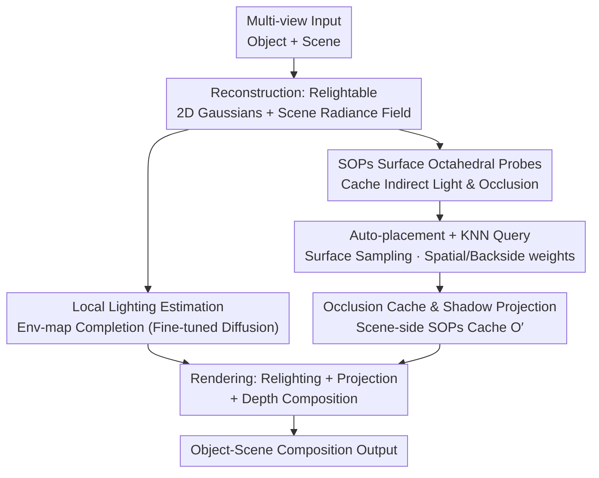

# ComGS: Efficient 3D Object-Scene Composition via Surface Octahedral Probes

**Conference**: ICLR2026  
**OpenReview**: [https://openreview.net/forum?id=yXiSPBMrTT](https://openreview.net/forum?id=yXiSPBMrTT)  
**Code**: https://nju-3dv.github.io/projects/ComGS/ (Including dataset)  
**Area**: 3D Vision  
**Keywords**: Gaussian Splatting, Object-Scene Composition, Inverse Rendering, Lighting Estimation, Real-time Shadows

## TL;DR
ComGS utilizes "Surface Octahedral Probes (SOPs)" to cache indirect illumination and occlusion as octahedral textures on object/scene surfaces. By using KNN interpolation instead of per-iteration ray tracing and simplifying complex scene photometry into "local environment map completion at the placement point," it achieves harmonious 3D object-scene composition with realistic shadows at ~26 FPS and 36 seconds of editing time, outperforming existing methods by +1.4 dB PSNR.

## Background & Motivation
**Background**: Gaussian Splatting (GS) has become a mainstream representation for multi-view reconstruction and real-time rendering. Seamlessly "inserting" a new object into a reconstructed Gaussian scene requires two things: reconstructing the object in a **relightable** form (decoupling material from lighting) and estimating **scene lighting** to relight the object and generate shadows.

**Limitations of Prior Work**: GS radiation fields inherently "bake" appearance and shadows into colors, leading to lighting and shadow inconsistencies when objects and scenes are directly merged. Relightable Gaussian inverse rendering methods (e.g., IRGS, R3DG) typically perform **ray tracing** on the Gaussian point cloud to calculate occlusion and indirect light. Performing this during every optimization iteration is extremely slow and remains the primary bottleneck for real-time composition. Lighting estimation is equally challenging: Gaussian inverse rendering struggle to model fine light transport in complex scenes, while learning-based methods (e.g., DiffusionLight) that predict lighting from single images are **view-sensitive** and inconsistent across multiple views.

**Key Challenge**: The trade-off between accuracy/realism and efficiency—precision requires ray tracing, while speed necessitates sacrificing occlusion and indirect light; furthermore, accurately decoupling global scene lighting is an extremely difficult problem.

**Goal**: (1) Free relightable object reconstruction from per-iteration ray tracing, achieving at least a 2× speedup; (2) Obtain reliable, multi-view consistent lighting in complex scenes for object relighting and shadows.

**Key Insight**: The authors make two key observations: first, ray tracing is expensive because every shading point must query occlusion/indirect light on the fly, but this information is **spatially continuous** and can be pre-cached and interpolated. Second, object-scene composition primarily concerns the **object's appearance and nearby shadows**, eliminating the need for precise global scene decoupling.

**Core Idea**: Use "Surface Octahedral Probes + KNN interpolation" to replace ray tracing for caching/querying occlusion and indirect light. Simultaneously, reformulate the difficult "scene lighting estimation" as "local environment map completion at the insertion point," solved using a fine-tuned diffusion model.

## Method

### Overall Architecture
ComGS is a three-stage object-scene composition framework: **Reconstruction → Editing → Rendering**. During the reconstruction stage, objects are reconstructed as relightable 2D Gaussians with material parameters while scenes are reconstructed as Gaussian radiance fields. Surface Octahedral Probes (SOPs) are introduced in the object's inverse rendering to cache indirect light and self-occlusion. The editing stage involves two offline precomputations: estimating scene environment lighting at the placement point and using scene-side SOPs to cache new occlusions introduced by the object. The rendering stage uses the estimated environment map for object relighting and cached occlusions for shadow projection, followed by depth composition. By moving expensive ray tracing to "reconstruction initialization" and "editing precomputation," rendering relies only on lookups and integration, achieving ~26 FPS with an editing time of 36 seconds.

### Key Designs

**1. SOPs Surface Octahedral Probes: Replacing Per-iteration Ray Tracing with Caching + Interpolation**

The core innovation addresses the slow speed of relightable reconstruction caused by per-iteration ray tracing. For every shading point $\mathbf{x}$, inverse rendering solves the rendering equation $L_o(\omega_o,\mathbf{x})=\int_\Omega f(\omega_o,\omega_i,\mathbf{x})L_i(\omega_i)(\omega_i\cdot\mathbf{n})\,d\omega_i$, where incident light is decomposed into direct light, indirect light, and occlusion: $L_i(\omega_i)=(1-O(\omega_i))L_{dir}(\omega_i)+L_{in}(\omega_i)$. While $L_{dir}$ is modeled as a learnable environment map, indirect light $L_{in}$ and occlusion $O$ are traditionally calculated via expensive ray tracing on Gaussian point clouds at each iteration. ComGS instead places a set of probes near the object surface, storing $\{L_{in},O\}$ at each probe as an **octahedral texture** (which has lower memory and distortion than cube or spherical maps). These are **filled via ray tracing only once during initialization**, then optimized under the guidance of rendering loss. This amortizes the cost into a one-time overhead, accelerating reconstruction by at least 2× with minimal accuracy loss.

**2. Automatic Placement and Efficient Querying of SOPs: Surface Sampling + KNN Spatial/Backside Weighted Interpolation**

Probe placement and querying are critical to preventing light leaking and ensuring interpolation accuracy. For **placement**, random distribution can lead to probes being inside Gaussian points, causing light leaking. The authors first render geometry buffers from all views to fuse a dense surface point cloud with normals via multi-view depth fusion, then use Farthest Point Sampling (FPS) for uniform downsampling. Finally, these points are **offset slightly** (1% of object size) along the normal direction to stay outside the surface. For **querying**, Fixed Radius Near Neighbors (FRNN) finds adjacent probes for any shading point $\mathbf{x}$, followed by KNN interpolation: $L_{in}(\mathbf{x})=\frac{\sum_k w_s(k)w_b(k)L_{in}(k)}{\sum_k w_s(k)w_b(k)}$. Two weights are used: spatial weight $w_s=\frac{1}{\Vert\mathbf{d}_k\Vert}$ prioritizes closer probes ($\mathbf{d}_k=\mathbf{p}_k-\mathbf{x}$), and backside weight $w_b=0.5\cdot(1+\frac{\mathbf{d}_k}{\Vert\mathbf{d}_k\Vert}\cdot\mathbf{n}_p)+0.01$ gives more weight to probes with consistent normals $\mathbf{n}_p$, suppressing erroneous light contributions from "backside" probes.

**3. Local Lighting Estimation: Reformulating "Scene Photometry" as "Env-map Completion"**

To address the failure of global scene lighting estimation and the view-inconsistency of single-image learning, the authors assume that inserted objects are small relative to the scene and only affect the local area. They downgrade "global scene lighting estimation" to "env-map completion at the placement point." Specifically, they perform a **360° scan** of the reconstructed Gaussian scene at the placement point to obtain an **incomplete** RGB panorama, a partial normal map, and an alpha mask of reconstructed areas. These are fed to a **fine-tuned Stable Diffusion 2.1** for completion. Since inputs come from the real reconstructed radiance field rather than single photos, the results are naturally multi-view consistent. To obtain HDR, exposure value (EV) conditional prompting is used: the base model is trained at $EV=0$, then fine-tuned with interpolated embeddings for different exposures. At inference, three images at $EV=\{-5,-2.5,0\}$ are generated and fused into an HDR env-map, then converted to octahedral textures for relighting and shadows.

**4. Occlusion Caching and Shadow Projection: Caching New Occlusions via Scene-side SOPs**

Shadows cast by the object onto the ground are essentially **new occlusions** $O'$ introduced by the object. Since calculating $O'$ via ray tracing every frame is too expensive, the authors reuse SOPs to cache it. Unlike the object's self-occlusion $O$ (Design 1), $O'$ is the occlusion cast by the object onto the scene. Under a Lambertian scene assumption, the scene rendering without the object is $L_o\approx f_d\int L_i(\omega_i)(\omega_i\cdot\mathbf{n})\,d_{\omega_i}$, and with the object, it becomes $L_o'=f_d\int L_i(\omega_i)(1-O'(\omega_i))(\omega_i\cdot\mathbf{n})\,d_{\omega_i}$. The projected shadow is directly given by the ratio: $\mathcal{S}=\frac{L_o'}{L_o}$. In implementation, a "potential shadow zone" is defined around the placement point (6× object size), and ~10,000 SOPs are placed within this zone. Their occlusion textures are precomputed via ray tracing, allowing for real-time shadow calculation during rendering via interpolation.

### Loss & Training
Reconstruction involves two steps. **Step 1 (Radiance and Geometry)** uses rendering loss $\mathcal{L}_{rgb}=L_1(\mathcal{C},\hat{\mathcal{C}}_{gt})+0.2(1-\text{SSIM})$, depth-normal consistency regularization $\mathcal{L}_{d2n}=1-(\mathcal{N}\cdot\mathcal{N}_d)$, and mask constraints $\mathcal{L}_{mask}$ for the object. Total loss $\mathcal{L}=\mathcal{L}_{rgb}+\lambda_{d2n}\mathcal{L}_{d2n}+\lambda_{mask}\mathcal{L}_{mask}$ ($\lambda_{d2n}=\lambda_{mask}=0.05$, 30k steps). **Step 2 (Material and Light Decoupling)** uses $\mathcal{L}_{pbr}$ on PBR maps, Lambertian material regularization $\mathcal{L}_{lam}=L_1(\mathcal{R},1)+L_1(\mathcal{M},0)$ (favoring high roughness, low metalness), and supervises probe textures with ray-traced $L_{tr},O_{tr}$ using $\mathcal{L}_{sops}=L_1(L_{in},L_{tr})+L_1(O,O_{tr})$. Total loss includes $\lambda_{lam}=0.001, \lambda_{sops}=1$, for 2k steps. SOP count is 5k, texture resolution is $16\times16$, with 128 sampling rays.

## Key Experimental Results

### Main Results: Composition Quality and Efficiency on SynCom Dataset
The authors rendered a SynCom dataset (4 objects × 4 scenes) using Blender Cycles. Comparisons include image-level methods (DiffHarmony, ZeroComp, MV-CoLight), Gaussian inverse rendering methods (GS-IR, GI-GS, IRGS), and their own variants (Ours-Trace using pure ray tracing, Ours-SOPs). Metrics include PSNR/SSIM and human ratings (40 participants) for 3D Consistency (Con.) and Harmony (Harm.) on a 1–5 scale.

| Method | PSNR↑ | SSIM↑ | Con.↑ | Harm.↑ | FPS↑ | Editing(s)↓ |
|------|------|------|------|------|------|------|
| DiffHarmony | 22.44 | 0.825 | 3.13 | 2.93 | 0.01 | - |
| GS-IR | 22.42 | 0.824 | 3.28 | 2.13 | 2.11 | - |
| IRGS | 22.42 | 0.799 | 3.50 | 2.88 | 0.03 | - |
| DiffusionLight | 21.84 | 0.841 | 1.91 | 2.17 | 0.02 | - |
| **Ours (Trace)** | **24.57** | **0.870** | **4.75** | **4.60** | 4.02 | 14.59 |
| **Ours (SOPs)** | 24.28 | 0.868 | 4.56 | 4.59 | **26.14** | 36.12 |

Both variants outperform others in PSNR and subjective scores (+1.4 dB PSNR, ~21% higher consistency, ~56% higher harmony). The Trace version has slightly higher quality at 4 FPS, while the SOPs version maintains nearly equal quality at 26 FPS, validating the value of SOPs.

### Reconstruction: Competitive Accuracy on TensoIR with Fastest Speed

| Method | NVS PSNR↑ | Albedo PSNR↑ | Relight PSNR↑ | Training Time↓ |
|------|------|------|------|------|
| TensoIR | 35.09 | 29.28 | 28.58 | 5 h |
| GS-IR | 35.33 | 30.29 | 24.37 | 16.40 min |
| IRGS | 35.75 | 31.66 | 30.25 | 21.45 min |
| **Ours** | 35.82 | 31.68 | **30.47** | **7.93 min** |

Relighting accuracy reaches or slightly exceeds SOTA, while training takes only 7.93 minutes (~1/3 of IRGS), confirming the speedup from "KNN interpolation replacing ray tracing + whole-image training instead of random pixel sampling."

### Key Findings
- **SOPs Drive Efficiency**: Moving from Trace to SOPs barely affects quality (PSNR 24.57→24.28) but boosts FPS from 4.02 to 26.14, showing that probe caching is essentially a "free lunch."
- **Radiance Field-based Photometry is More Stable**: While GS-IR/IRGS struggle with complex scenes and DiffusionLight flickers, ComGS provides more accurate and consistent env-maps by inpainting panoramas sampled from the reconstructed scene.
- **Probe Density/Resolution and Shadows**: Higher SOP counts and texture resolutions improve shadow quality; the 1% normal offset effectively prevents light leaking in all experiments.

## Highlights & Insights
- **"Cache vs. Ray Tracing" is a Versatile Heuristic**: Mapping the light probe concept from graphics to Gaussian inverse rendering by caching spatially continuous indirect light/occlusion is a brilliant move that can be applied to any pipeline prone to ray tracing bottlenecks.
- **"Downgrading" Complex Problems**: Realizing that composition only requires local effects enables reformulating "global scene decoupling" into "local env-map completion," sidestepping an almost unsolvable problem.
- **Separate Modeling of $O$ and $O'$**: Modelling self-occlusion and newly introduced occlusion separately, with shadows calculated via the simple ratio $\mathcal{S}=L_o'/L_o$, is physically intuitive and lightweight.

## Limitations & Future Work
- **Reliance on Two Heavy Assumptions**: Objects must be small relative to the scene (local influence) and scenes must be approximately Lambertian. Failure cases occur with distant shadows (violating local influence) or specular scenes where reconstruction and reflection both fail.
- **SOPs Recomputation on Movement**: Probe caches are tied to scene space and can be reused if only the camera moves, but moving the inserted object changes visibility/incident light, necessitating a recomputation of occlusion probes. Incremental updates remain an open problem.
- **Multi-view Requirement**: Dependency on multi-view 3D reconstruction means the method does not yet support single-image inputs.

## Related Work & Insights
- **vs. IRGS / R3DG (Gaussian Inverse Rendering)**: These rely on point-wise ray tracing for occlusion and indirect light, which is slow and fails at photometric estimation in complex scenes. ComGS replaces ray tracing with SOP caching and KNN interpolation for real-time performance at the cost of Lambertian/local assumptions.
- **vs. DiffusionLight (Single-image Photometry)**: DiffusionLight use diffusion models for "chrome ball" estimation from single images, which generalizes well but lacks multi-view consistency. ComGS also uses fine-tuned diffusion but takes incomplete panoramas from the radiance field as input, ensuring multi-view consistency.
- **vs. DiffHarmony / ZeroComp (Image-level Composition)**: These operate on 2D images and cannot handle object-scene occlusion or realistic 3D shadows. ComGS solves this at the 3D physical relighting level, providing much higher shadow credibility.

## Rating
- Novelty: ⭐⭐⭐⭐⭐ Bringing light probes to GS inverse rendering and redefining photometry as local inpainting are clever ideas.
- Experimental Thoroughness: ⭐⭐⭐⭐ Extensive testing across synthetic/public/mobile datasets with subjective metrics, though block-level ablation studies could be more detailed.
- Writing Quality: ⭐⭐⭐⭐⭐ The three-stage pipeline and major innovations are clearly described with effective supporting figures.
- Value: ⭐⭐⭐⭐⭐ Achieving realistic 3D composition at ~26 FPS with 36-second editing time has direct value for AR and immersive applications.

<!-- RELATED:START -->

## Related Papers

- [\[ICLR 2026\] A²TG: Adaptive Anisotropic Textured Gaussians for Efficient 3D Scene Representation](a2tg_adaptive_anisotropic_textured_gaussians_for_efficient_3d_scene_representati.md)
- [\[CVPR 2025\] ProbeSDF: Light Field Probes for Neural Surface Reconstruction](../../CVPR2025/3d_vision/probesdf_light_field_probes_for_neural_surface_reconstruction.md)
- [\[ICLR 2026\] LiTo: Surface Light Field Tokenization](lito_surface_light_field_tokenization.md)
- [\[AAAI 2026\] SparseSurf: Sparse-View 3D Gaussian Splatting for Surface Reconstruction](../../AAAI2026/3d_vision/sparsesurf_sparse-view_3d_gaussian_splatting_for_surface_reconstruction.md)
- [\[ICLR 2026\] Unified 3D Scene Understanding Through Physical World Modeling](unified_3d_scene_understanding_through_physical_world_modeling.md)

<!-- RELATED:END -->
