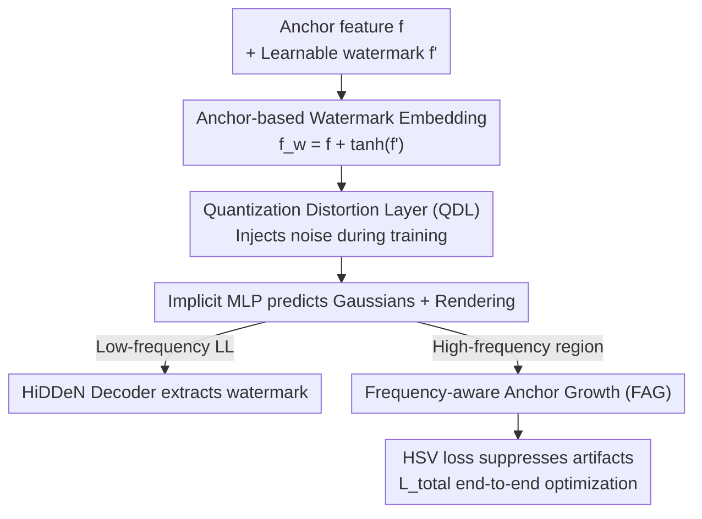

# CompMarkGS: Robust Watermarking for Compressed 3D Gaussian Splatting

**Conference**: ICLR 2026  
**OpenReview**: [https://openreview.net/forum?id=NXQvejGBFx](https://openreview.net/forum?id=NXQvejGBFx)  
**Area**: 3D Vision  
**Keywords**: 3DGS watermarking, copyright protection, anti-compression robustness, anchor-based 3DGS, Quantization Distortion Layer  

## TL;DR
Aiming at the problem of existing 3DGS watermarks being destroyed after quantization compression, this paper embeds the watermark into the anchor features of anchor-based 3DGS. By using a "Quantization Distortion Layer" to simulate compression noise during training, the watermark maintains ~94% bit accuracy before and after HAC/ContextGS compression, while preserving rendering quality via Frequency-aware Anchor Growth and HSV loss.

## Background & Motivation

**Background**: 3D Gaussian Splatting (3DGS) has been widely adopted in academia and industry (Digital Twins, AR/VR) due to its real-time, high-fidelity rendering. This leads to two requirements: first, models must be **compressed** for storage and transmission due to their massive size (millions of Gaussians); second, trained 3DGS assets are valuable and require **watermarking** for copyright protection. Existing 3DGS watermarking methods (GaussianMarker, 3D-GSW, GuardSplat, etc.) typically modify Gaussian attributes directly—position, SH coefficients, or adding/deleting Gaussians—to hide information.

**Limitations of Prior Work**: These methods only consider traditional distortions in the image domain (cropping, JPEG, noise) and **completely ignore model compression**. In real-world deployment, compression is almost inevitable, especially quantization-based methods (HAC, ContextGS). Quantization shifts the distribution of model parameters globally, washing out watermark signals hidden in Gaussian attributes. Experiments show that while WateRF/GaussianMarker/3D-GSW can achieve >90% bit accuracy before compression, they drop to 53–58% after compression (HAC)—essentially random guessing, making copyright verification impossible.

**Key Challenge**: The watermark is embedded in explicit attributes that are directly overwritten by quantization, leading to a direct conflict between quantization error and the watermark signal. Furthermore, anchor-based compression (HAC) involves an anchor-to-Gaussian interpolation step, which accumulates and amplifies errors. Another conflict exists on the rendering side: watermark decoding reads information from low-frequency bands of the image, but reconstruction loss treats these signals as errors and attempts to erase them, leading to a trade-off between "watermark preservation" and "image quality."

**Goal**: To develop a 3DGS watermark that can be reliably detected after compression without sacrificing rendering quality. This requires solving both "quantization resistance" and the "watermark vs. quality trade-off."

**Key Insight**: The authors observe that anchor-based 3DGS (Scaffold-GS) has a natural advantage: Gaussian attributes are **dynamically predicted** by an implicit MLP from anchor features rather than stored explicitly. By hiding the watermark in anchor features, it is difficult for attackers to discover it directly from point clouds or Gaussian attributes, and the watermark only indirectly affects rendering through the MLP without disturbing geometry. This serves as an ideal hiding place.

**Core Idea**: Embed the watermark into anchor features (instead of explicit geometric attributes) and use a "Quantization Distortion Layer" to actively inject quantization noise as data augmentation during training, forcing the watermark to learn resilience against compression.

## Method

### Overall Architecture
CompMarkGS is built upon anchor-based 3DGS frameworks like Scaffold-GS. Each anchor carries attributes such as anchor feature $f$, scaling $l$, and offsets $O$. Visible anchors dynamically generate $K$ Gaussians via multiple implicit MLPs. This work introduces four modifications: (1) Adding a learnable watermark embedding feature $f'$ to the anchor feature $f$ to obtain $f^w$; (2) Passing $f^w$ through a **Quantization Distortion Layer (QDL)** to inject quantization noise before the MLP predicts Gaussian attributes; (3) Extracting the watermark message from the low-frequency band of the rendered image using a pre-trained HiDDeN decoder; (4) Using **Frequency-aware Anchor Growth (FAG)** to densify anchors only in high-frequency regions and an **HSV loss** to suppress color artifacts. The system is trained end-to-end using $\mathcal{L}_\text{total}$.

### Key Designs

**1. Anchor feature watermark embedding: Hiding information in implicit features**

To address the vulnerability of explicit attributes to quantization and detection, this method avoids modifying position, scaling, or offsets. Instead, it adds the watermark to the anchor feature, which only **indirectly** affects rendering through an MLP, avoiding obvious geometric distortion. A learnable watermark embedding feature $f'\in\mathbb{R}^d$ is introduced:

$$f^w = f + \tanh(f'),\quad f, f'\in\mathbb{R}^d$$

Using $\tanh(\cdot)$ to constrain $f'$ to $[-1,1]$ is a crucial detail: well-trained anchor attributes approximately follow a normal distribution. Adding an unbounded feature would increase variance, leading to unstable gradients and degraded quality. Compared to sigmoid (which introduces a positive bias), the symmetric $[-1,1]$ range stabilizes gradients and allows consistent watermark injection.

**2. Quantization Distortion Layer (QDL): Simulating compression during training**

This is the core module for anti-quantization. While traditional watermarking uses differentiable distortion layers to simulate JPEG or cropping, this is the **first application to model compression**. QDL utilizes the quantization mechanism of HAC as data augmentation: random quantization noise is injected into $f^w$ during training. The quantized feature for the $i$-th anchor is:

$$\tilde f^w_i = f^w_i + \mathcal{U}\!\left(-\tfrac12, \tfrac12\right)\cdot q_i,\quad q_i = Q_0\cdot\big(1+\tanh(r_i)\big),\ r_i = \text{MLP}_q(f^w_i)$$

Where uniform noise $\mathcal{U}(-\frac12, \frac12)$ simulates rounding errors. The quantization scale $q_i\in[0, 2Q_0]$ is adaptively tuned by an $\text{MLP}_q$ based on $f^w_i$.

**3. Frequency-aware Anchor Growth (FAG): Resolving the frequency conflict**

Watermark decoding relies on the low-frequency LL sub-band $M'=D(I_\text{LL})$ obtained via DWT, ensuring robustness. However, the reconstruction loss $\mathcal{L}_\text{scaffold}$ treats this signal as error. FAG ensures quality enhancement **avoids** the watermark's low-frequency domain by densifying anchors only in high-frequency areas. It identifies these regions using an SSIM-based error map of high-frequency components $I'_\text{hf}, I_\text{hf}$ (via DFT):

$$P_\text{error}(p) = 1 - \text{SSIM}\big(N(I_\text{hf},p),\, N(I'_\text{hf},p)\big)$$

Anchors are grown only if their projected 2D coordinates fall within pixels where the error exceeds a threshold.

**4. HSV loss: Suppressing color artifacts in perceptual space**

Watermarking often introduces local color artifacts. Instead of calculating error purely in RGB space, this method uses HSV space to better align with the Human Visual System (HVS). Binary masks $M_c(p)$ are constructed for Red/Green/Blue hue ranges to focus the loss on visible artifacts:

$$\mathcal{L}_\text{hsv} = \frac{1}{|C||\Omega|}\sum_{c\in C}\sum_{p\in\Omega}\big\|M_c(p)\cdot(I(p)-I_\text{gt}(p))\big\|^2$$

### Loss & Training
The watermark message loss uses binary cross-entropy $\mathcal{L}_\text{msg}$. The total loss is:

$$\mathcal{L}_\text{total} = \lambda_\text{img}\big(\mathcal{L}_\text{scaffold} + \lambda_\text{hsv}\mathcal{L}_\text{hsv} + \lambda_\text{freq}\mathcal{L}_\text{freq}\big) + \lambda_\text{msg}\mathcal{L}_\text{msg}$$

Where $\mathcal{L}_\text{freq}$ is the mean of the SSIM error map. Hyperparameters include $\lambda_\text{img}=10, \lambda_\text{hsv}=0.6, \lambda_\text{freq}=0.1, \lambda_\text{msg}=0.45$. Training is performed end-to-end on an A6000 GPU.

## Key Experimental Results

### Main Results

Evaluated on Blender, LLFF, and Mip-NeRF 360 (25 scenes total). Results for 48-bit messages, before / after compression:

| Method | Bit Accuracy (%) ↑ | PSNR ↑ | Size (MB) ↓ |
|------|------|------|------|
| HAC + WateRF | 91.02 / **54.40** | 27.36 / 13.63 | 207.72 / 13.66 |
| HAC + GaussianMarker | 92.00 / **58.34** | 27.05 / 13.54 | 341.30 / 24.33 |
| HAC + 3D-GSW | 90.96 / **53.48** | 19.57 / 13.13 | 173.64 / 12.93 |
| **HAC + Ours** | **95.95 / 95.92** | **27.68 / 27.65** | 208.96 / **12.23** |
| ContextGS + WateRF | 92.01 / 90.36 | 26.64 / 26.47 | 219.48 / 9.88 |
| **ContextGS + Ours** | **94.36 / 94.03** | **27.60 / 27.55** | 73.39 / **5.72** |

Under HAC compression, all baselines collapse to 52–58% accuracy (random), while **Ours** maintains 95.92%.

### Ablation Study

Impact of components (48-bit, after HAC):

| FAG | QDL | $\mathcal{L}_\text{hsv}$ | Bit Accuracy (%) | PSNR | LPIPS |
|------|------|------|------|------|------|
| ✓ | – | ✓ | 90.75 | 26.75 | 0.182 |
| – | ✓ | ✓ | 93.95 | 27.54 | 0.178 |
| ✓ | ✓ | – | 92.57 | 27.49 | 0.179 |
| ✓ | ✓ | ✓ | **95.92** | **27.65** | **0.177** |

Ablation of embedding target: embedding in Position or Scaling results in PSNR dropping to 12-19 and accuracy to ~67%, confirming anchor features as the superior choice.

### Key Findings
- **QDL is essential for compression resistance**: Removing QDL causes the largest drop in bit accuracy, proving that simulating quantization noise during training is fundamental.
- **Embedding location is critical**: Explicit attributes (position/scaling) are highly sensitive to quantization; implicit anchor features provide a stable "hiding spot."
- **HAC is more challenging than ContextGS**: HAC's interpolation step amplifies quantization errors, making **Ours** even more significant for high-compression scenarios.
- **FAG resolves frequency conflicts**: By limiting growth to high-frequency zones, quality improvement and watermark robustness are decoupled.

## Highlights & Insights
- **Reversing compression as augmentation**: QDL treats the compression mechanism itself as a source of noise during training, a clean and effective "train against your attacker" strategy.
- **Implicit representations as secure storage**: Anchor features are difficult to interpret directly, providing inherent security and avoiding geometric artifacts.
- **Frequency decoupling via spatial masks**: Separating low-frequency watermarking and high-frequency refinement allows for optimization of both without interference.

## Limitations & Future Work
- The method is strictly tied to anchor-based 3DGS (Scaffold-GS) and might not generalize to explicit 3DGS or non-quantization compression (e.g., pruning).
- Bit accuracy is high but not 100% (especially at 64-bit), suggesting a need for error-correcting codes.
- The alignment between QDL's learned scale and actual compression scales requires further theoretical analysis.

## Related Work & Insights
- **vs GaussianMarker / 3D-GSW**: These focus on image-domain distortions. CompMarkGS is the first to explicitly target model quantization compression, increasing accuracy from ~55% to ~94%.
- **vs WateRF**: While both use DWT for decoding, CompMarkGS addresses the specific challenges of 3DGS quantization via QDL.

## Rating
- Novelty: ⭐⭐⭐⭐⭐ 
- Experimental Thoroughness: ⭐⭐⭐⭐⭐ 
- Writing Quality: ⭐⭐⭐⭐ 
- Value: ⭐⭐⭐⭐⭐ 

<!-- RELATED:START -->

- **Scaffold-GS**: Large-Scale Scene Rendering with Learned 3D Gaussians.
- **HAC**: Hash-grid Assisted Contextual 3D Gaussian Splatting Compression.
- **GaussianMarker**: Robust Watermarking of 3D Gaussian Splatting.

<!-- RELATED:END -->

## Related Papers

- [\[ICLR 2026\] NGS-Marker: Robust Native Watermarking for 3D Gaussian Splatting](ngs-marker_robust_native_watermarking_for_3d_gaussian_splatting.md)
- [\[CVPR 2026\] Robust3DGSW: Toward Robust Watermarking for Quantization-Aware 3D Gaussian Splatting](../../CVPR2026/3d_vision/robust3dgsw_toward_robust_watermarking_for_quantization-aware_3d_gaussian_splatt.md)
- [\[CVPR 2025\] 3D-GSW: 3D Gaussian Splatting for Robust Watermarking](../../CVPR2025/3d_vision/3d-gsw_3d_gaussian_splatting_for_robust_watermarking.md)
- [\[CVPR 2025\] GuardSplat: Efficient and Robust Watermarking for 3D Gaussian Splatting](../../CVPR2025/3d_vision/guardsplat_efficient_and_robust_watermarking_for_3d_gaussian_splatting.md)
- [\[AAAI 2026\] Splats in Splats: Robust and Effective 3D Steganography towards Gaussian Splatting](../../AAAI2026/3d_vision/splats_in_splats_robust_and_effective_3d_steganography_towards_gaussian_splattin.md)

<!-- RELATED:END -->
