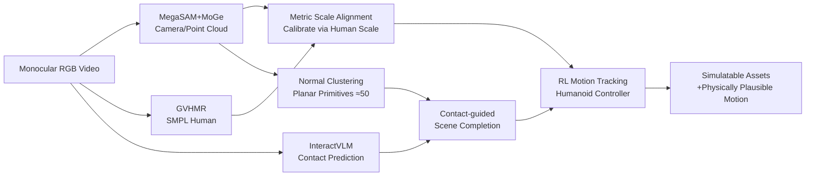

# Contact-guided Real2Sim from Monocular Video with Planar Scene Primitives

**Conference**: ICLR 2026  
**OpenReview**: [https://openreview.net/forum?id=xlr3NqxUqY](https://openreview.net/forum?id=xlr3NqxUqY)  
**Code**: [crisp-real2sim.github.io/CRISP-Real2Sim](https://crisp-real2sim.github.io/CRISP-Real2Sim)  
**Area**: 3D Vision / Real2Sim / Human-Scene Interaction  
**Keywords**: Monocular video, planar primitives, human motion reconstruction, contact modeling, physics simulation, reinforcement learning  

## TL;DR
CRISP reconstructs "simulatable" human motions and scene geometry from monocular videos. The core idea involves clustering point clouds into approximately 50 clean, convex planar primitives and completing occluded supporting surfaces using human-scene contact cues. Validated by RL-driven humanoid controllers, this approach reduces motion tracking failure rates from 55.2% to 6.9% (an 8x improvement).

## Background & Motivation
**Background**: Understanding humans from monocular video has progressed significantly in spatio-temporal reconstruction and action recognition. Converting videos into simulatable assets (vid2sim / real2sim) provides scalable training data for embodied AI, character animation, and AR/VR. Ideal reconstruction should allow a simulator to faithfully replicate humans, environments, and their interactions while obeying physical laws (no interpenetration, no foot sliding, and no floating geometry).

**Limitations of Prior Work**: Most joint human-scene reconstruction works rely on data-driven priors for joint optimization without physics in the loop. These produce noisy, non-watertight 2.5D geometry, often with repetitive structures or missing regions. Crucially, **physics simulation requires much higher geometric precision than visual reconstruction**: even minor noise on the ground can cause a simulated humanoid to "trip." Additionally, dense meshes (TSDF + Marching Cubes) often involve hundreds of thousands of triangles, making collision detection expensive, while over-smoothing or artifacts cause RL policies to fail repeatedly.

**Key Challenge**: Visual reconstruction seeks to "look correct," while physics simulation requires "convex, clean, watertight, and lightweight" geometry. This misalignment in geometric requirements makes it easy for simulators to crash when directly driven by reconstruction results.

**Goal**: Given a monocular interaction video (climbing stairs, sitting on a sofa, parkour, etc.), reconstruct human motion and scene geometry that can stably drive a humanoid in a simulator with faithful contacts.

**Core Idea**:
- **Planar Primitives Hypothesis**: Many human-scene interactions (sitting, lying, parkour, climbing stairs) are essentially interactions with planes. Point clouds are clustered into about 50 convex planar box primitives, which are lightweight, efficient, and robust to low-level noise.
- **Mechanism (Completion via Contact)**: Uses human pose and contact prediction to infer supporting surfaces occluded by the body (e.g., the seat of a chair being sat upon).
- **Mechanism (Physics-in-the-loop)**: Employs RL to drive a humanoid to track the reconstructed motion, using "simulatability" to filter or constrain reconstruction quality.

## Method

### Overall Architecture
CRISP is a pipeline that converts monocular RGB video into simulation assets: it first uses visual SLAM to recover camera intrinsics/poses and global point clouds, lifting HMR human models to the world frame and aligning them to metric scale. Point clouds are clustered and fitted into planar primitives to create a simulatable scene. Contact prediction then completes occluded supporting surfaces. Finally, an RL-trained humanoid controller tracks the reconstructed motion to verify physical plausibility.

### Key Designs

**1. Human-Scene-Camera Initialization & Metric Alignment**: All elements are placed into a single real-scale world frame. CRISP uses MegaSAM to recover camera intrinsics $K$, per-frame poses $T_i=[R_i|t_i]\in SE(3)$, and dense depth. The optimization-stage depth estimator is replaced with MoGe to improve geometric quality, resulting in a scale-invariant dense point cloud $P$. For the human aspect, $K$ is fed to GVHMR to obtain camera-frame SMPL meshes, which are then lifted to the world frame using $T_i$. Since MegaSAM only recovers an unknown scale, the authors leverage the known physical dimensions of humans: $P$ is scaled so the depth of humans in the point cloud matches the depth of the 3D SMPL mesh from GVHMR. This produces a metric point cloud $\tilde P$, ensuring humans, scenes, and cameras share a single ground-truth coordinate system—a prerequisite for contact reasoning and physics simulation.

**2. Normal-based Planar Primitive Fitting**: Noisy point clouds are compressed into approximately 50 convex boxes. Physics simulators (like Isaac Gym) require meshes for collision detection, but dense meshes from TSDF+Marching Cubes are often "dirty," causing humanoids to collide with artifacts and fail due to unstable contact forces. CRISP's insight is to decompose the scene into a few convex primitives to solve both expensive computation and noise issues. The three-step clustering includes: (1) K-means on the normal map to produce candidate planar segments (normals computed via finite differences on the point map); (2) DBSCAN for spatial partitioning within each segment; (3) Cross-frame temporal merging of segments with similar planar fits and sufficient optical flow correspondence. Each merged region is fitted using RANSAC and assigned a default 0.05m thickness to form a box. This process requires no per-scene optimization and is "ready-to-simulate."

**3. Contact as Completion Cue**: Critical interaction surfaces are often occluded by the human body (e.g., the ground under feet or the chair seat). CRISP estimates per-vertex contact $c_t(v)\in\{0,1\}$ for each SMPL mesh $M_t$ (predicting a SMPL vertex mask via InteractVLM) and uses contact points to back-project required supporting geometry. To handle over-prediction/false positives from InteractVLM during "near-contact" frames, a **temporal-kinematic filtering** is applied: non-maximum suppression is performed over time to keep only high-confidence predictions of $L$ consecutive frames. The frame $t^*$ is selected where the human velocity $v_t$ is minimal:
$$t^* = \arg\min_{t\in\{i,\,i+L\}} v_t$$
Identifying contact when the person is most static and firmly pressed against the surface allows for robust completion of occluded chair seats or stair platforms.

**4. Physics Motion Tracking**: An RL policy $\pi_{FC}$ is trained using the DeepMimic paradigm to imitate the captured whole-body motion. The policy takes the character state $s_t$ and $K$ future target poses $g_t=[\hat f_{t+1},\dots,\hat f_{t+K}]$ as input. The state is represented relative to the root:
$$s_t = \big(\theta_t\ominus\theta_t^{root},\ (p_t-p_t^{root})\ominus\theta_t^{root},\ v_t\ominus\theta_t^{root}\big)$$
Actions are parameterized as target joint angles for PD controllers. The reward encourages imitation of reference positions, rotations, and velocities, along with an energy penalty to suppress jitter:
$$r_t = w_p e^{-\alpha_p\|\hat p_t-p_t\|} + w_r e^{-\alpha_r\|\hat q_t\ominus q_t\|} + w_v e^{-\alpha_v\|\hat{\dot p}_t-\dot p_t\|} + \cdots + w_e\sum_j\|\tau_j\dot q_j\|$$
The implementation uses a transformer encoder policy (MaskedMimic) and is optimized via PPO+GAE in Isaac Gym. Each motion clip is used to train an individual policy to fairly compare simulation performance across different reconstructed assets.

## Key Experimental Results

### Main Results (Table 1: Overall Real-to-Sim)

| Method | RL | Success↑ | FPS↑ | PROX CD$_{bi}$↓ | CD$_{one}$↓ | Non-Pene↑ | EMDB Success↑ | W-MPJPE100↓ |
|------|----|---------:|-----:|---------:|------:|------:|------:|------:|
| VideoMimic | ✓ | 44.8% | 16K | 0.337 | 0.311 | 0.906 | 50.0% | 505.31 |
| Ours (TSDF) | ✓ | 75.9% | 15K | 0.178 | 0.222 | 0.925 | 77.8% | 197.77 |
| Ours (NKSR) | ✓ | 79.3% | 16K | 0.163 | 0.187 | 0.937 | 75.0% | 185.00 |
| **Ours (Planar)** | ✓ | **93.1%** | **23K** | 0.187 | **0.174** | **0.947** | **93.8%** | **175.93** |

Compared to the concurrent work VideoMimic, planar primitives improve RL success rate from 44.8% to 93.1% and throughput from 16K to 23K FPS (+43%), while nearly halving HMR error.

### Ablation Study (Geometry Representation + Contact Completion)

| Dimension | Setting | Key Findings |
|------|------|----------|
| Representation | VideoMimic Dense Mesh | Over-smoothing/artifacts cause catastrophic simulation failure |
| Representation | TSDF | Improved success but still over-smoothed; low contact accuracy |
| Representation | NKSR | Sharper surfaces; better non-penetration and Chamfer distance |
| Representation | **Planar (Ours)** | Lowest CD$_{one}$, highest Non-Pene, highest FPS; slightly worse CD$_{bi}$ (harmless for sim) |
| Completion | w/o contact | Missing occluded surfaces (e.g., stairs); humanoid falls or distorts |
| Completion | **w/ contact** | Recovers supporting geometry; stable simulation and faithful motion |

### Key Findings
- **Simulation is more sensitive to "precision" than "completeness"**: While the Planar CD$_{bi}$ is slightly worse than NKSR (missing small non-contact structures), its one-way CD$_{one}$ (Recon→GT) is the lowest, indicating that "where it exists, it is accurate." In simulation, missing non-contact details is harmless, but noisy extra geometry disrupts contact and crashes policies.
- **Physics reasoning improves reconstruction quality**: Including physics in the loop not only ensures stability but also enhances the final quality of HMR and geometry.
- On the EMDB benchmark, RL-refined HMR in the world frame significantly outperforms WHAM, TRAM, and GVHMR.
- The method generalizes to "in-the-wild" videos, including internet clips and Sora-generated content.

## Highlights & Insights
- **"Reconstruction for Simulation" vs "Reconstruction for Vision"**: The paper explicitly notes that physics simulation and visual reconstruction have different geometric requirements. Choosing convex, clean, and lightweight planar primitives is a valuable paradigm shift.
- **Contact as a Completion Cue**: Treating human pose as "X-ray vision" to infer occluded supporting surfaces is a simple yet effective mechanism.
- **"Simulatability" as a Quality Signal**: Physics-in-the-loop serves to both validate and refine, using downstream RL success rates as an indirect measure of geometric quality.
- Simple concepts (clustering + fitting) lead to significant engineering gains: 8x reduction in failure rate and 43% speedup.

## Limitations & Future Work
- **Planar World Hypothesis**: Curved or irregular objects (balls, complex furniture) are difficult to approximate with planar boxes, as reflected in the higher CD$_{bi}$.
- **Dependence on External Priors**: Relies on MegaSAM, MoGe, GVHMR, and InteractVLM; failure in any component propagates downstream. False positives from InteractVLM require heuristic filtering.
- **Per-clip Policy Training**: Policies are trained individually, which hinders scalability compared to a unified, generalizable controller.
- **Static Scene Assumption**: Only handles interactions with static scenes; dynamic objects and multi-person interactions are not addressed.
- Future work could extend to non-planar primitives (convex decomposition, superquadrics), unified controllers, and real2sim2real closed loops.

## Related Work & Insights
- **VideoMimic (Allshire et al., 2025)** is the most direct concurrent work. While both do real2sim2real, VideoMimic's dense meshes cause simulation instability. CRISP outperforms it in stability, efficiency, and RL success.
- **Task-Aligned Representation**: When reconstruction serves downstream physical tasks, "measuring what the task cares about" (e.g., contact surface precision) is more important than blind pursuit of visual completeness.

## Rating
- **Novelty**: ⭐⭐⭐⭐ — The combination of planar primitives, contact completion, and physics-in-the-loop is a clear perspective shift in the vid2sim context.
- **Experimental Thoroughness**: ⭐⭐⭐⭐ — Covers standard benchmarks (EMDB, PROX), geometric ablations, contact ablations, and in-the-wild tests across HMR, geometry, and RL metrics.
- **Writing Quality**: ⭐⭐⭐⭐ — Clear motivation ("geometric noise trips the simulation"), good illustrations, and easy-to-understand methodology.
- **Value**: ⭐⭐⭐⭐ — Provides a scalable path for generating real2sim assets for robotics and animation.

## Related Papers

- [\[CVPR 2026\] Illumination-Consistent Human-Scene Reconstruction from Monocular Video](../../CVPR2026/3d_vision/illumination-consistent_human-scene_reconstruction_from_monocular_video.md)
- [\[ICLR 2026\] WorldTree: Towards 4D Dynamic Worlds from Monocular Video Using Tree-Chains](worldtree_towards_4d_dynamic_worlds_from_monocular_video_using_tree-chains.md)
- [\[CVPR 2026\] 4D Primitive-Mâché: Glueing Primitives for Persistent 4D Scene Reconstruction](../../CVPR2026/3d_vision/4d_primitive-mache_glueing_primitives_for_persistent_4d_scene_reconstruction.md)
- [\[CVPR 2026\] Real-Time Dynamic Scene Rendering with Controlled Compressibility and Contact Awareness](../../CVPR2026/3d_vision/real-time_dynamic_scene_rendering_with_controlled_compressibility_and_contact_aw.md)
- [\[ICLR 2026\] Splat the Net: Radiance Fields with Splattable Neural Primitives](splat_the_net_radiance_fields_with_splattable_neural_primitives.md)

<!-- RELATED:END -->

<!-- RELATED:START -->

## Related Papers

- [\[ICLR 2026\] SceneTransporter: Optimal Transport-Guided Compositional Latent Diffusion for Single-Image Structured 3D Scene Generation](scenetransporter_optimal_transport-guided_compositional_latent_diffusion_for_sin.md)
- [\[ICLR 2026\] WorldTree: Towards 4D Dynamic Worlds from Monocular Video Using Tree-Chains](worldtree_towards_4d_dynamic_worlds_from_monocular_video_using_tree-chains.md)
- [\[ICLR 2026\] MOSIV: Multi-Object System Identification from Video](multi-object_system_identification_from_videos.md)
- [\[ICLR 2026\] EasyCreator: Empowering 4D Creation through Video Inpainting](easycreator_empowering_4d_creation_through_video_inpainting.md)
- [\[ICLR 2026\] StreamSplat: Towards Online Dynamic 3D Reconstruction from Uncalibrated Video Streams](streamsplat_towards_online_dynamic_3d_reconstruction_from_uncalibrated_video_str.md)

<!-- RELATED:END -->
