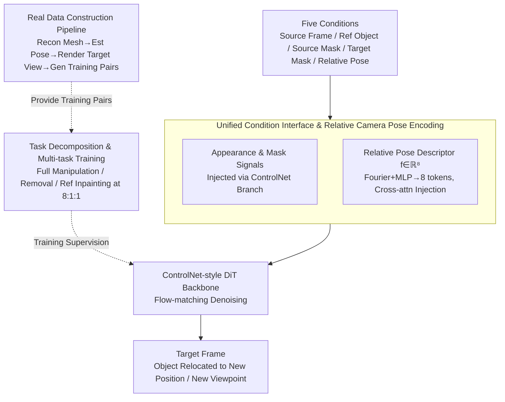

# Ctrl&Shift: High-Quality Geometry-Aware Object Manipulation in Visual Generation

**Conference**: ICLR 2026  
**arXiv**: [2602.11440](https://arxiv.org/abs/2602.11440)  
**Code**: To be confirmed  
**Area**: 3D Vision / Visual Generation  
**Keywords**: Object Manipulation, Diffusion Models, Geometric Consistency, Camera Pose Control, Image Editing

## TL;DR
Ctrl&Shift is an end-to-end diffusion framework that achieves geometrically consistent, fine-grained object manipulation without explicit 3D reconstruction by decomposing the task into object removal and reference-guided inpainting, while injecting relative camera pose control.

## Background & Motivation

**Background**: Object-level manipulation (relocating and rotating objects while maintaining scene realism) is a fundamental operation in film post-production, AR, and creative editing. Prevailing methods are divided into geometric approaches (reconstruction via NeRF/3DGS followed by manipulation) and diffusion approaches (editing conditioned on text or trajectories).

**Limitations of Prior Work**:
   - Geometric methods (NeRF/3DGS) provide precise control but require explicit 3D reconstruction, incurring high per-scene optimization costs and poor generalization.
   - Diffusion methods (DragAnything, VACE, etc.) generalize well but lack fine-grained geometric control, making it impossible to precisely specify object pose transformations.
   - No existing method simultaneously achieves background preservation, geometrically consistent view transformation, and user-controllable transformation.

**Key Challenge**: There exists a fundamental trade-off between geometric precision and generalization capability.

**Goal**: Achieve geometrically consistent, fine-grained controllable object manipulation without explicit 3D reconstruction.

**Key Insight**: Instead of lifting content to 3D for editing, precise viewpoint control can be directly injected into the 2D diffusion process.

**Core Idea**: Object manipulation is decomposed into three sub-tasks: "removal + reference inpainting + camera pose control," which are learned within a unified diffusion framework through multi-task and multi-stage training.

## Method

### Overall Architecture

Ctrl&Shift addresses the challenge of moving an object to a new position and changing its viewpoint without artifacts in the background or the object itself, all while avoiding the cost of per-scene 3D reconstruction. The mechanism relies on a conceptual shift: rather than lifting content to 3D for editing, precise viewpoint control is injected **directly into the 2D diffusion process**. By decomposing object manipulation into "cleanly erasing the object from its original location and redrawing the reference object at the target location according to a specified camera pose," the entire process is completed end-to-end within a unified diffusion framework without explicit 3D reconstruction.

The implementation consists of three layers: the model simultaneously processes **five conditional inputs** (source image/video frame, reference object image, source mask, target mask, and relative camera pose descriptor). Appearance and positional signals are injected via a ControlNet control branch, while the camera pose is separately encoded and injected through cross-attention, allowing geometric and appearance signals to flow through separate channels (**Unified Condition Interface and Relative Camera Pose Encoding**). During training, the goal of "complete manipulation" is decomposed into a primary task and two auxiliary tasks for joint optimization, forcing the model to disentangle the five inputs (**Task Decomposition and Multi-task Training**). These are supported by a **Real Data Construction Pipeline**, which automatically generates pairs with pose annotations from real images and videos.

### Key Designs

**1. Unified Condition Interface and Relative Camera Pose Encoding: Injecting View Transformation into 2D Diffusion**

The difficulty in achieving geometrically consistent manipulation without 3D reconstruction lies in integrating signals for "background, object identity, spatial position, and viewpoint transformation" into a single diffusion network without mutual interference. This work designs a unified interface for five conditions: source frames and reference images are encoded via VAE, while masks are reordered using space-to-depth (pixel unshuffle) to align with the VAE stride. Directly passing masks through the VAE would treat them as appearance textures, distorting the binary semantics of "1=edit, 0=preserve"; reordering allows them to enter the latent space while preserving semantics. These signals are concatenated channel-wise in the control branch and injected into the DiT via zero-initialized convolutions. Camera pose follows a separate channel: using a look-at camera model, each viewpoint is parameterized by $(yaw, pitch, d, r_x, r_y)$, and only the **relative** relationship between two viewpoints is encoded—specifically the axis-angle representation of relative rotation, relative translation $\mathbf{t}_{rel}$, and NDC plane offsets $(\Delta r_x, \Delta r_y)$. These form an 8-dimensional descriptor $\mathbf{f}\in\mathbb{R}^8$, mapped to 8 tokens (dimension $d=4096$) via Fourier positional encoding and an MLP, then injected via cross-attention.

Using relative rather than absolute poses is a critical design choice: absolute poses require a scene-independent standard coordinate system, which is nearly impossible to unify for in-the-wild images. Relative poses naturally use the input frame as a reference, making user operations intuitive (e.g., "drag and rotate"). During inference, if a target mask is unavailable, it is approximated using the source mask's bounding box with scaling and translation.

**2. Task Decomposition and Multi-task Training: Disentangling Encoded Conditions**

The five conditions are highly entangled in the "complete manipulation" objective, making it difficult for the model to distinguish individual contributions. The training objective is explicitly decomposed into a primary task and two auxiliary tasks for joint optimization. Each auxiliary task uses the same unified interface but "switches off" certain conditions: the **Main Task** performs full manipulation (erasing the source object and redrawing it at the target pose); **Auxiliary Task 1 (Object Removal)** sets the reference image to white, the target mask to zero, and pushes the NDC offset to $[-1, 1]$ to force the object out of frame, compelling the model to learn clean background completion; **Auxiliary Task 2 (Reference Inpainting + Camera Control)** sets the source mask to zero and uses a pure background frame as input, forcing the model to learn synthesis under a given pose.

The three tasks are sampled with a weight ratio of $8:1:1$. Ablations confirm this strategy: removing Auxiliary Task 2 causes Obj IoU to drop from 0.83 to 0.65 and Pose MAPE to rise to 28.60%, showing its significant impact on object-level precision.

**3. Real Data Construction Pipeline: Automated Generation of Pose-Annotated Pairs**

Training relies on paired data consisting of "two viewpoints of the same object + clean background + precise pose annotations," which is rarely available in real-world datasets. The pipeline uses Hunyuan3D-2 to reconstruct foreground objects into textured meshes, then estimates source camera poses via $\mathbf{s}^{src}=\arg\max_{\mathbf{s}}\mathrm{IoU}(\mathcal{R}(\mathcal{M},\mathbf{s}),\mathbf{M}^{src})$. Only samples with $\mathrm{IoU} \geq 0.90$ between the rendered silhouette and ground truth mask are kept. A target pose is then sampled to render a target viewpoint; the original object is removed from the background using MiniMax-Remover, and the rendered object is harmoniously reintegrated using an object-pasting (reference-guided inpainting) model.

### Loss & Training

Training utilizes flow-matching, adding noise along a linear path $\mathbf{z}_t = (1-t)\mathbf{z}_0 + t\boldsymbol{\varepsilon}$ and optimizing the velocity matching loss:
$$\|\mathbf{v}_\theta(\mathbf{z}_t, \mathbf{c}, t) - \mathbf{v}^*(\mathbf{z}_t, t)\|_2^2$$
where $\mathbf{c}$ represents the five conditions. The backbone is based on Wan-1.3B, with 8 control blocks in the control branch and a DiT hidden dimension of 1536.

Training is conducted in two stages to decouple "geometric priors" and "realism":
- **Stage I**: Pre-training on ~2M synthetic image pairs (white background + random camera poses) for 50k steps. **Both the backbone and control branch are updated** to establish solid object priors and relative pose representations.
- **Stage II**: Fine-tuning on 100k high-quality real image/video pairs for 5k steps. **The backbone is frozen and only the control branch is updated** to improve background preservation and realism while preventing noise in real data from damaging the learned geometric capabilities.

## Key Experimental Results

### Main Results

Zero-shot evaluation on ObjectMover-A:

| Method | PSNR↑ | DINO↑ | CLIP↑ | DreamSim↓ |
|------|-------|-------|-------|-----------|
| ObjectMover | 25.27 | 85.07 | 93.16 | 0.142 |
| **Ours** | **28.69** | **88.07** | **93.58** | **0.075** |

GeoEditBench (Self-constructed benchmark for geometry-aware editing):

| Method | PSNR↑ | DINO↑ | Pose MAPE↓ | Obj IoU↑ |
|------|-------|-------|-----------|----------|
| VACE | 24.32 | 75.38 | 30.56% | 0.72 |
| Nano-Banana | 26.38 | 78.05 | 24.36% | 0.78 |
| **Ours** | **28.71** | **85.23** | **17.70%** | **0.83** |

### Ablation Study
- **Without Stage I**: Pose MAPE rose from 17.70% to 32.50%, indicating severe loss of geometric understanding.
- **Without Stage II**: PSNR dropped from 28.71 to 24.83, leading to degraded background preservation and visual quality.
- **Without Auxiliary Task 1**: CLIP-Score decreased to 86.32, harming semantic consistency.
- **Without Auxiliary Task 2**: Obj IoU dropped to 0.65 and Pose MAPE rose to 28.60%, significantly impacting object-level precision.

## Highlights & Insights
- A key conceptual breakthrough: achieving geometrically consistent object manipulation without 3D reconstruction.
- The multi-task decomposition elegantly allows the model to learn disentangled signals from different tasks.
- The scalable data construction pipeline supports both real-world images and videos.
- GeoEditBench provides a systematic evaluation for geometry-aware editing.

## Limitations & Future Work
- Approximating the target mask via bbox scaling and translation may be inaccurate under extreme transformations.
- Based on the Wan-1.3B backbone; the relatively small model size may limit performance in complex scenes.
- Currently supports only single-object manipulation; multi-object collaborative editing remains unexplored.
- Data construction depends on Hunyuan3D-2 and object-pasting models, potentially introducing errors from these components.

## Related Work & Insights
- **vs. DragAnything**: A trajectory-based diffusion method; Ctrl&Shift offers better generalization and precise pose control.
- **vs. VACE**: Good background preservation but essentially shifts the entire frame rather than manipulating the object.
- **vs. Nano-Banana / Qwen-Image-Edit**: High generation quality but lacks precise camera pose control via text instructions.
- **vs. ObjectMover**: A video-prior method; ours improves PSNR by +3.42 and halves the DreamSim score.

## Rating
- Novelty: ⭐⭐⭐⭐ (Innovation in task decomposition and pose injection)
- Experimental Thoroughness: ⭐⭐⭐⭐ (Multiple benchmarks, ablations, and a custom benchmark)
- Writing Quality: ⭐⭐⭐⭐
- Value: ⭐⭐⭐⭐⭐ (First to unify geometric precision and diffusion generalization)

<!-- RELATED:START -->

## Related Papers

- [\[ICLR 2026\] ShapeGen4D: Towards High Quality 4D Shape Generation from Videos](shapegen4d_towards_high_quality_4d_shape_generation_from_videos.md)
- [\[ICLR 2026\] SpatialHand: Generative Object Manipulation from 3D Perspective](spatialhand_generative_object_manipulation_from_3d_prespective.md)
- [\[ICLR 2026\] Quantized Visual Geometry Grounded Transformer](quantized_visual_geometry_grounded_transformer.md)
- [\[ICLR 2026\] FastVGGT: Fast Visual Geometry Transformer](fastvggt_fast_visual_geometry_transformer.md)
- [\[ICLR 2026\] $\pi^3$: Permutation-Equivariant Visual Geometry Learning](pi3_permutation-equivariant_visual_geometry_learning.md)

<!-- RELATED:END -->
