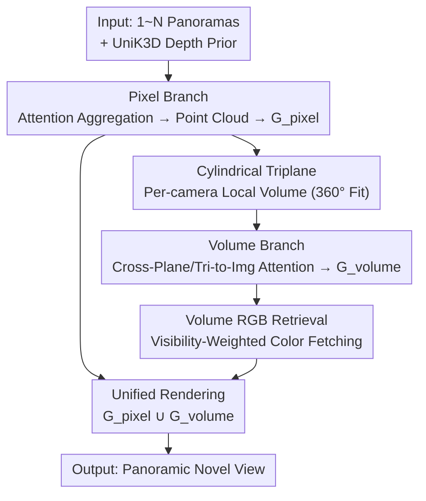

# CylinderSplat: 3D Gaussian Splatting with Cylindrical Triplanes for Panoramic Novel View Synthesis

**Conference**: ICLR2026  
**OpenReview**: [https://openreview.net/forum?id=lEzkct87Uy](https://openreview.net/forum?id=lEzkct87Uy)  
**Code**: https://github.com/wangqww/CylinderSplat  
**Area**: 3D Vision  
**Keywords**: Panoramic Novel View Synthesis, Feed-forward 3DGS, Cylindrical Triplane, Dual-branch Architecture, Occlusion Completion

## TL;DR
CylinderSplat utilizes a dual-branch feed-forward 3D Gaussian Splatting framework (pixel branch + volume branch) for panoramic (360°) novel view synthesis. The core innovation involves replacing traditional Cartesian triplanes with **cylindrical triplanes** that align with panoramic geometry and the Manhattan world assumption. The volume branch completes occluded/sparse regions that the pixel branch cannot recover, achieving SOTA results in both single-view and multi-view panoramic NVS.

## Background & Motivation
**Background**: 3D Gaussian Splatting (3DGS) has become the mainstream for real-time high-fidelity novel view synthesis. Among its variants, feed-forward methods utilize pre-trained networks to predict all Gaussian parameters in a single forward pass, enabling cross-scene generalization and near-real-time reconstruction compared to per-scene optimization. However, these techniques are predominantly designed for pinhole cameras. With the proliferation of 360° cameras and VR, adapting feed-forward 3DGS to panoramic images has become a critical requirement.

**Limitations of Prior Work**: Existing feed-forward panoramic methods (e.g., PanSplat, Splatter360) suffer from two major drawbacks. First, they follow the pinhole domain paradigm—obtaining a depth prior from a foundation model and then performing geometric refinement using **multi-view cost volumes**. Cost volumes are computationally expensive and limited to a **fixed number of views** (usually two); changing the input view count requires retraining. Moreover, cost volumes fail to resolve occlusions under large baselines or sparse views, leading to holes and distortions. Second, regions that are occluded or under-observed lack point cloud coverage, making them inherently impossible to recover via pixel-level methods.

**Key Challenge**: Standard volumetric representations (such as Cartesian triplanes) are **inherently mismatched** with 360° scene geometry. Panoramic images are sampled in camera-centric spherical/cylindrical spaces; using axis-aligned Cartesian planes leads to distortion and aliasing. Conversely, pinhole-domain Cartesian triplanes like those in OmniScene do not support multi-frame inputs and produce over-smoothed rendering.

**Goal**: (1) Identify a volumetric representation truly aligned with panoramic geometry; (2) Design a framework flexible enough to handle 1 to $N$ panoramic inputs; (3) Robustly complete geometry in occluded/sparse regions.

**Key Insight**: The authors leverage the intuition from physics that "choosing the right coordinate system simplifies symmetric problems." Since Gaussians are optimized in a 360° space centered on the camera, the cylindrical coordinate system is a natural choice. Furthermore, as the world often follows the **Manhattan world assumption** (where orthogonal planes dominate indoor/outdoor environments), the $ZR$ planes of a cylindrical triplane align with vertical walls, while the $R\Theta$ planes align with horizontal floors/ceilings, better capturing these structures than spherical triplanes.

**Core Idea**: A **dual-branch feed-forward framework** is proposed. The pixel branch uses attention (rather than cost volumes) to reconstruct well-observed regions while supporting an arbitrary number of views. The volume branch constructs local volumes for each camera using **cylindrical triplanes** to specifically fill occluded regions. Gaussians from both branches are combined for final rendering.

## Method

### Overall Architecture
CylinderSplat takes 1 to $N$ panoramas as input and outputs a set of 3D Gaussians to render arbitrary novel views. The architecture is **dual-branch**, integrated via a **three-stage curriculum training**: the pixel branch first establishes a high-quality baseline for well-observed regions; the volume branch uses cylindrical triplanes to fill occlusions; finally, both branches are jointly fine-tuned to merge the details of the pixel branch with the completeness of the volume branch.

Specifically: The pixel branch uses UniK3D to obtain a depth prior, followed by ResNet and 6 layers of attention to aggregate multi-view context, predicting a refined depth map $D_{pano}$ and feature map $F_{pano}$. Each pixel is back-projected into a featured point cloud $P_{feat}$ to decode pixel Gaussians $G_{pixel}$. The volume branch initializes an independent local cylindrical triplane for **each camera position**. Point cloud features from the pixel branch falling within the volume are used to populate the triplane. After refinement via "cross-plane attention + triplane-to-image attention," volume Gaussians $G_{volume}$ are decoded, with high-frequency colors recovered via RGB retrieval. Finally, $G_{pixel} \cup G_{volume}$ are rendered together.

### Key Designs

**1. Pixel Branch: Replacing Cost Volumes with Attention for Arbitrary View Counts**

To address the limitations of expensive, fixed-view cost volumes, the pixel branch discards them entirely. It starts with an initial depth prior from UniK3D, then uses a ResNet with $L=6$ attention layers (intra-frame self-attention for single-frame context and inter-frame cross-attention for multi-view information) for geometric refinement. This outputs a refined depth map $D_{pano}$ and feature map $F_{pano}$. Pixels are back-projected to 3D to form featured point clouds $P_{feat}$ and decoded into $G_{pixel}$. This process is **camera-agnostic**: the attention mechanism places no structural constraints on the number of views, allowing the same network to handle single or multiple panoramas without retraining. The trade-off is that it only excels in well-observed areas; regions occluded under large baselines lack point cloud coverage, resulting in holes that the volume branch must address.

**2. Cylindrical Triplane: Volume Representation Aligned with 360° Geometry and Manhattan Worlds**

The triplane technique compresses dense 3D feature grids into three orthogonal 2D planes, reducing storage complexity from $O(\Theta \cdot Z \cdot R)$ to $O(\Theta \cdot Z + Z \cdot R + R \cdot \Theta)$, or $O(N^3)$ to $O(N^2)$. The innovation lies in the **coordinate system**: instead of axis-aligned Cartesian planes, triplanes are built within a cylindrical volume defined by $(R_0, \Theta_0, Z_0)$ centered on the camera. Optimization in 360° space inherently possesses rotational symmetry, which cylindrical/spherical coordinates naturally simplify. Furthermore, because real-world scenes often follow the Manhattan world assumption, the cylindrical triplane's $F_{zr}$ ($ZR$ plane) aligns with vertical walls and $F_{r\theta}$ ($R\Theta$ plane) aligns with horizontal floors/ceilings. This effectively captures orthogonal planes in man-made environments, whereas spherical triplanes struggle to model such simple flat structures. An **independent local cylindrical triplane** is initialized for each input camera (multi-triplane strategy), with orthogonal feature planes initialized via learnable grid embeddings and populated by pixel branch point cloud features.

**3. Volume Branch: Triplane Attention Refinement and Cylindrical-to-Cartesian Decoding**

The volume branch handles completion by refining the initialized triplanes into useful geometry and decoding Gaussians. Refinement involves two attention steps. First is **Cross-Plane Attention**: allowing the three planes within a cylinder to exchange information. For instance, to update feature $f_{\theta z}(i,j)$ on $F_{\theta z}$, $N_r$ points are sampled along the orthogonal radial axis to fetch keys/values from the other two planes:

$$f'_{\theta z}(i, j) = f_{\theta z}(i, j) + \sum_{k=0}^{N_r-1}\left(w^{(ijk)}_{zr}\, f_{zr}(j, k) + w^{(ijk)}_{r\theta}\, f_{r\theta}(k, i)\right)$$

The second step is **Triplane-to-Image Attention**: using the fused triplane features as queries to probe the pixel branch's panoramic features $F_{pano}$, projecting 3D points $(\theta_i, z_j, r'_k)$ back to the panorama to fetch corresponding pixel features $f^{(ijk)}_{pano}$ as keys, injecting visual evidence to align the 3D representation with 2D inputs. For decoding, a dense $N_r \times N_\theta \times N_z$ grid is sampled; at each point, features from the three planes are summed and passed through an MLP to predict local normalized parameters $\{\delta_{local}, S_{local}, R, \alpha\}$. A critical engineering detail: since 3DGS projection occurs in Cartesian space, positions must undergo cylindrical-to-Cartesian transformation $(x', y', z') = (-(r+\delta_r)\sin(\theta+\delta_\theta),\ z+\delta_z,\ -(r+\delta_r)\cos(\theta+\delta_\theta))$; meanwhile, the anisotropic scale $S_{local}$ must be corrected using the **Jacobian matrix** $J$ of the transformation to represent Gaussian shapes correctly in Cartesian space: $S' = |J| \cdot S_{local}$.

**4. Volume RGB Retrieval: Visibility-Weighted Color Fetching**

Triplane features are high-level semantic data and lack the high-frequency details required for photorealism; direct color decoding often results in blurriness. This paper designs an **RGB retrieval** mechanism for each volume Gaussian to fetch colors directly from source images. The Gaussian center $x'$ is projected onto all $N_v$ source views to fetch pixel colors $\{C_v\}$. To handle occlusions, a visibility score $s_v = d_g - d_o$ is calculated for each view ($d_g$ is the distance to the camera, $d_o$ is the UniK3D reference depth). Final colors are predicted via an MLP using visibility-weighted aggregation:

$$C = \text{MLP}\!\left(\sum_{v=1}^{N_v} w_v \cdot C_v\right),\quad w_v = \text{softmax}(-s_v)$$

This ensures the model learns colors from the most reliable, non-occluded views, while the visibility weight implicitly encourages Gaussian geometry to align with the depth prior. The full parameters for each triplane Gaussian are thus $\{x', S', R, C, \alpha\}_{volume}$.

### Loss & Training
A composite rendering loss $L_{render}$ (photometric + perceptual + geometric) is used throughout:

$$L_{render} = \|\hat{I} - I_{gt}\|_1 + 0.05 \cdot \text{LPIPS}(\hat{I}, I_{gt}) + 0.1 \cdot \|\hat{D} - D_{ref}\|_1$$

where $D_{ref}$ is the reference depth from UniK3D. Training follows a **three-stage curriculum**: ① Render using only pixel Gaussians $G_{pixel}$ to establish a baseline for observed areas; ② Freeze the pixel branch and train only $G_{volume}$ to perform geometric completion via the cylindrical triplanes; ③ Unfreeze both branches for joint fine-tuning of $G_{pixel} \cup G_{volume}$ to merge details and completeness. Ablations show this curriculum is vital—direct full end-to-end training performs worse.

## Key Experimental Results

### Main Results
Datasets: Synthetic (Matterport3D / Replica / Residential) + Real (360Loc), resolution $512 \times 1024$. Metrics: WS-PSNR (robust to panoramic distortion), SSIM, LPIPS, and PCC (geometric accuracy relative to DepthAnywhere).

Two-view reconstruction (Matterport3D 2.0m large baseline, the most difficult configuration):

| Method | PCC↑ | WS-PSNR↑ | SSIM↑ | LPIPS↓ |
|------|------|----------|-------|--------|
| PanoGRF (NeRF) | — | 20.96 | 0.701 | 0.352 |
| OmniScene* (Cartesian Triplane) | 0.732 | 22.75 | 0.707 | 0.241 |
| Splatter360* | 0.684 | 21.31 | 0.741 | 0.285 |
| PanSplat | 0.716 | 20.56 | 0.777 | 0.265 |
| **Ours** | **0.851** | **23.76** | **0.835** | **0.175** |

The gap is even wider in single-view reconstruction—cost volume methods (PanSplat/Splatter360) suffer from architectural limitations, while CylinderSplat maintains PCC 0.821 / WS-PSNR 23.75 on Matterport3D 2.0m, significantly outperforming competitors. On the real-world 360Loc dataset (2-view), it also leads across all metrics.

### Ablation Study
(Matterport3D 2.0m, Two-view input)

| Configuration | PCC | WS-PSNR | SSIM | LPIPS | Description |
|------|-----|---------|------|-------|------|
| Only Pixel Branch | 0.813 | 23.21 | 0.817 | 0.179 | No occlusion completion |
| Only Cylindrical Volume | 0.782 | 22.17 | 0.782 | 0.210 | Cylindrical volume only |
| Only Spherical Volume | 0.581 | 19.22 | 0.633 | 0.398 | Spherical triplane drop |
| Only Cartesian Volume | 0.564 | 16.77 | 0.495 | 0.545 | Cartesian triplane collapse |
| Cylindrical (w/o RGB) | 0.703 | 20.16 | 0.661 | 0.409 | No RGB retrieval |
| Full (w/o Multi Triplane) | 0.826 | 23.47 | 0.805 | 0.194 | Single vs. multiple triplanes |
| Full (end to end) | 0.809 | 23.25 | 0.791 | 0.185 | No curriculum training |
| **Full** | **0.851** | **23.76** | **0.835** | **0.175** | Full model |

### Key Findings
- **Cylindrical ≫ Spherical ≫ Cartesian**: Replacing the cylindrical triplane with a spherical one drops WS-PSNR from 22.17 to 19.22; switching to Cartesian leads to a collapse at 16.77. This proves that coordinate choice alone provides significant gains, validating the fit of the Manhattan world assumption.
- **RGB Retrieval Contribution**: Removal drops WS-PSNR by 2 points and nearly doubles LPIPS, proving color retrieval is essential for realism.
- **Curriculum Training & Multi-Triplane**: Both contribute positively; omitting them degrades performance, showing that the "per-camera local triplane" and "phased training" strategies are necessary.
- **Efficiency**: CylinderSplat has only 13.6M parameters and a forward pass of 0.29s, making it lighter and faster than PanSplat (20.5M/0.32s), Splatter360 (38.7M/0.54s), and OmniScene (76.9M/0.48s). Multi-view scalability is smooth (2→3→4 views, PCC 0.884→0.896).

## Highlights & Insights
- **"Changing Coordinates" is simple yet powerful**: Significant improvements were achieved by simply switching the triplane from Cartesian to cylindrical based on geometric priors. This "replacement of complex refinement modules with correct representations" is an elegant approach transferable to other tasks with strong symmetry/structural priors.
- **Jacobian Correction**: The detail of correcting anisotropic Gaussian scaling via $S' = |J| \cdot S_{local}$ for the cylindrical-to-Cartesian transform is a robust engineering trick that prevents shape distortion.
- **Branch Division of Labor**: The pixel branch handles "visible" areas while the volume branch handles "unseen" areas. Replacing cost volumes with attention simultaneously solves the fixed-view-count problem.
- **Visibility-Weighted RGB Retrieval**: This dual-purpose mechanism recovers high-frequency colors while acting as an implicit supervisor to align geometry with depth priors.

## Limitations & Future Work
- **Dependency on Depth Foundation Models**: Initial priors and PCC references rely on UniK3D / DepthAnywhere. Geometric completion may be limited in areas where priors fail (e.g., reflections, textureless regions).
- **Manhattan World Assumption Limits**: The advantage of cylindrical triplanes relies on orthogonal plane dominance; for scenes with many curved surfaces or natural environments (forests, caves), the alignment benefit may diminish.
- **Memory Scaling**: Multi-triplane overhead grows with the number of views (4 views already require 20GB), potentially limiting scalability to very high view counts.
- **Future Directions**: Exploring adaptive coordinate selection based on scene content or using anisotropic triplane resolutions (e.g., denser $R\Theta$ grids for floors).

## Related Work & Insights
- **vs. PanSplat / Splatter360**: Direct feed-forward panoramic 3DGS competitors using depth priors + cost volumes. CylinderSplat is more flexible regarding view counts and better at filling occlusions through explicit cylindrical volumes.
- **vs. OmniScene**: Uses triplanes for feed-forward reconstruction but relies on a **single central Cartesian triplane** in the pinhole domain. CylinderSplat's **per-camera cylindrical triplanes** + RGB retrieval offer better geometric fit and multi-view fusion.
- **vs. PanoGRF (NeRF)**: Represents the transition from slow NeRF to real-time 3DGS for panoramas; CylinderSplat is the improved feed-forward solution in this lineage.

## Rating
- Novelty: ⭐⭐⭐⭐ Simple but effective geometric prior innovation.
- Experimental Thoroughness: ⭐⭐⭐⭐⭐ Comprehensive evaluation across four datasets and detailed coordinate ablations.
- Writing Quality: ⭐⭐⭐⭐ Clear motivation and good visualization.
- Value: ⭐⭐⭐⭐ Efficient, plug-and-play feed-forward 3DGS for VR and panoramic reconstruction.

<!-- RELATED:START -->

## Related Papers

- [\[CVPR 2026\] Physically Inspired Gaussian Splatting for HDR Novel View Synthesis](../../CVPR2026/3d_vision/physically_inspired_gaussian_splatting_for_hdr_novel_view_synthesis.md)
- [\[ICLR 2026\] Dynamic Novel View Synthesis in High Dynamic Range](dynamic_novel_view_synthesis_in_high_dynamic_range.md)
- [\[ICLR 2026\] EA3D: Event-Augmented 3D Diffusion for Generalizable Novel View Synthesis](ea3d_event-augmented_3d_diffusion_for_generalizable_novel_view_synthesis.md)
- [\[CVPR 2026\] Splatent: Splatting Diffusion Latents for Novel View Synthesis](../../CVPR2026/3d_vision/splatent_splatting_diffusion_latents_for_novel_view_synthesis.md)
- [\[ICLR 2026\] True Self-Supervised Novel View Synthesis is Transferable](true_self-supervised_novel_view_synthesis_is_transferable.md)

<!-- RELATED:END -->
